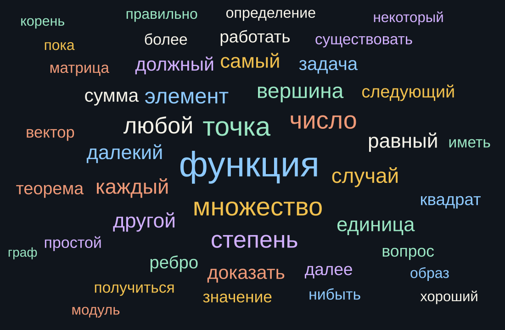

# Каталог расшифровок ФПМИ

Список уже сохранённых в репозитории текстов лекций.
Источник новых записей: [vkvideo.ru/@lectorium_fpmi](https://vkvideo.ru/@lectorium_fpmi).

- Расшифровок: **2666**
- Курсов: **230**
- Обновлено: 2026-10-04

[Граф терминов по курсам](assets/term-graph.html)

Формат записи: **номер. тема** — ссылка на сплошной текст и, если есть, на текст с таймкодами.

## Содержание

- [#1 Что такое Git и зачем он нужен — Git и GitHub для начинающих](#1-что-такое-git-и-зачем-он-нужен--git-и-github-для-начинающих) (1)
- [#2 Установка Git — Git и GitHub для начинающих](#2-установка-git--git-и-github-для-начинающих) (1)
- [#3 Инициализация репозитория Git — Git и GitHub для начинающих](#3-инициализация-репозитория-git--git-и-github-для-начинающих) (1)
- [#4 Что делать, если ничего не работает — Git и GitHub для начинающих](#4-что-делать-если-ничего-не-работает--git-и-github-для-начинающих) (1)
- [#5 Регистрация на GitHub — Git и GitHub для начинающих](#5-регистрация-на-github--git-и-github-для-начинающих) (1)
- [#6 Загрузка кода на GitHub — Git и GitHub для начинающих](#6-загрузка-кода-на-github--git-и-github-для-начинающих) (1)
- [#7 Работа с графическим интерфейсом — Git и GitHub для начинающих](#7-работа-с-графическим-интерфейсом--git-и-github-для-начинающих) (1)
- [#8 Комбинированный способ загрузки кода — Git и GitHub для начинающих](#8-комбинированный-способ-загрузки-кода--git-и-github-для-начинающих) (1)
- [#9 Как удалить репозиторий на GitHub — Git и GitHub для начинающих](#9-как-удалить-репозиторий-на-github--git-и-github-для-начинающих) (1)
- [121021 — встречи с руководителями НИР](#121021--встречи-с-руководителями-нир) (1)
- [131021 — встречи с руководителями НИР](#131021--встречи-с-руководителями-нир) (1)
- [141021 — встречи с руководителями НИР](#141021--встречи-с-руководителями-нир) (1)
- [[АЛКТГ] Алгебра, логика, комбинаторика и теория графов. Консультация ко второй к р](#алктг-алгебра-логика-комбинаторика-и-теория-графов-консультация-ко-второй-к-р) (1)
- [[Допсем] Математическая статистика Подготовка к первой контрольной](#допсем-математическая-статистика-подготовка-к-первой-контрольной) (1)
- [[Допсем] Матлог](#допсем-матлог) (2)
- [[Допсем] Матлогика](#допсем-матлогика) (15)
- [[Допсем] ОКТЧ](#допсем-октч) (4)
- [[Допсем] Теорвер](#допсем-теорвер) (1)
- [[Допсем] Теория групп. Подготовка ко второй контрольной работе](#допсем-теория-групп-подготовка-ко-второй-контрольной-работе) (1)
- [[Консультация] Алгебра и геометрия](#консультация-алгебра-и-геометрия) (1)
- [[Консультация] Математический анализ, интеграл и ряды](#консультация-математический-анализ-интеграл-и-ряды) (2)
- [[ЛИПС] О независимых множествах булевого куба](#липс-о-независимых-множествах-булевого-куба) (1)
- [[ОВиТМ] Основы вероятноси и теория меры](#овитм-основы-вероятноси-и-теория-меры) (1)
- [[Семинар] Языки программирования и теория компиляции](#семинар-языки-программирования-и-теория-компиляции) (2)
- [[ФЯиТ] Формальные языки и трансляции](#фяит-формальные-языки-и-трансляции) (8)
- [[ФЯиТ] Формальные языки и трансляции 8.5. Нормальная форма Грейбах](#фяит-формальные-языки-и-трансляции-85-нормальная-форма-грейбах) (1)
- [C++](#c) (40)
- [C++ и алгоритмы (Базовый поток)](#c-и-алгоритмы-базовый-поток) (15)
- [Concurrecy семинар](#concurrecy-семинар) (6)
- [Concurrency семинар](#concurrency-семинар) (2)
- [Core Java](#core-java) (14)
- [Highload](#highload) (8)
- [International Conference Data Analysis Optimization and their Applications day](#international-conference-data-analysis-optimization-and-their-applications-day) (1)
- [TFTDS (Лекция)](#tftds-лекция) (14)
- [TFTDS (Семинар)](#tftds-семинар) (5)
- [АКОС](#акос) (14)
- [Алгебра и Геометрия](#алгебра-и-геометрия) (14)
- [Алгебра и геометрия](#алгебра-и-геометрия) (86)
- [Алгебра логики, комбинаторика и теория графов](#алгебра-логики-комбинаторика-и-теория-графов) (1)
- [Алгоритмы (базовый поток)](#алгоритмы-базовый-поток) (9)
- [Алгоритмы и модели вычислений](#алгоритмы-и-модели-вычислений) (14)
- [Алгоритмы и структуры данных](#алгоритмы-и-структуры-данных) (107)
- [Алгоритмы и структуры данных (базовый поток)](#алгоритмы-и-структуры-данных-базовый-поток) (27)
- [Алгоритмы и структуры данных (основной поток)](#алгоритмы-и-структуры-данных-основной-поток) (21)
- [Алгоритмы и структуры данных (продвинутый поток)](#алгоритмы-и-структуры-данных-продвинутый-поток) (104)
- [Архитектура компьютеров и операционных систем ПМФ и ИВТ](#архитектура-компьютеров-и-операционных-систем-пмф-и-ивт) (1)
- [Базы данных](#базы-данных) (12)
- [Введение в LaTeX](#введение-в-latex) (11)
- [Введение в глубокое обучение](#введение-в-глубокое-обучение) (29)
- [Введение в математический анализ](#введение-в-математический-анализ) (51)
- [Введение в математическую логику](#введение-в-математическую-логику) (15)
- [Введение в машинное обучение](#введение-в-машинное-обучение) (10)
- [Введение в машинное обучение (семинары SVM PCA)](#введение-в-машинное-обучение-семинары-svm-pca) (1)
- [Введение в программирование](#введение-в-программирование) (9)
- [Введение в программирование и алгоритмы (базовый поток)](#введение-в-программирование-и-алгоритмы-базовый-поток) (6)
- [Введение в программирование продвинутый поток](#введение-в-программирование-продвинутый-поток) (8)
- [Введение в топологию](#введение-в-топологию) (8)
- [Вычислительная линейная алгебра](#вычислительная-линейная-алгебра) (18)
- [Вычислительная математика](#вычислительная-математика) (22)
- [Вычислительные методы алгебры](#вычислительные-методы-алгебры) (16)
- [Гармонический анализ](#гармонический-анализ) (52)
- [Гармонический анализ Консультация к письменному экзамену Часть](#гармонический-анализ-консультация-к-письменному-экзамену-часть) (3)
- [Гармонический анализ Консультация к устному экзамену](#гармонический-анализ-консультация-к-устному-экзамену) (1)
- [Гармонический анализ Консультация перед устным экзаменом](#гармонический-анализ-консультация-перед-устным-экзаменом) (1)
- [Гомотопическая топология](#гомотопическая-топология) (5)
- [Гуманитарные лекции](#гуманитарные-лекции) (3)
- [Гуманитарные лекции 2Античная риторика искусство убеждать](#гуманитарные-лекции-2античная-риторика-искусство-убеждать) (1)
- [Дискретная математика](#дискретная-математика) (15)
- [Дискретная оптимизация](#дискретная-оптимизация) (7)
- [Дискретные структуры](#дискретные-структуры) (19)
- [Дискретный анализ](#дискретный-анализ) (150)
- [Дискретный анализ (основной поток)](#дискретный-анализ-основной-поток) (3)
- [Дискретный анализ (продвинутый поток)](#дискретный-анализ-продвинутый-поток) (13)
- [Дискретный анализ 13.Кнезеровский граф](#дискретный-анализ-13кнезеровский-граф) (1)
- [Дискретный анализ 7,](#дискретный-анализ-7) (1)
- [Дифференциальные уравнение](#дифференциальные-уравнение) (1)
- [Дифференциальные уравнения](#дифференциальные-уравнения) (61)
- [Дополнительная лекция по дискретной математике](#дополнительная-лекция-по-дискретной-математике) (1)
- [Дополнительные главы теории вероятности и теории меры](#дополнительные-главы-теории-вероятности-и-теории-меры) (10)
- [Допсем по матлогике](#допсем-по-матлогике) (2)
- [Интеграл Лебега и теория поля](#интеграл-лебега-и-теория-поля) (20)
- [Кандидат наук Мусатов о курсе ЛОГИКИ](#кандидат-наук-мусатов-о-курсе-логики) (1)
- [Коммутативная алгебра](#коммутативная-алгебра) (6)
- [Коммутативная алгебра. Алгебраическая геометрия, спектр кольца](#коммутативная-алгебра-алгебраическая-геометрия-спектр-кольца) (1)
- [Конструирование ядра операционной системы](#конструирование-ядра-операционной-системы) (12)
- [Консультация перед письменным экзаменом по диффурам](#консультация-перед-письменным-экзаменом-по-диффурам) (1)
- [Конфиденциальные вычисления](#конфиденциальные-вычисления) (2)
- [Концепции теории игр](#концепции-теории-игр) (12)
- [Кратные интегралы и теория поля](#кратные-интегралы-и-теория-поля) (8)
- [Кратные интегралы и теория поля Консультация от Гусева НА](#кратные-интегралы-и-теория-поля-консультация-от-гусева-на) (1)
- [Математика больших данных](#математика-больших-данных) (5)
- [Математическая логика](#математическая-логика) (15)
- [Математическая логика и теория алгоритмов](#математическая-логика-и-теория-алгоритмов) (93)
- [Математическая логика и теория множеств](#математическая-логика-и-теория-множеств) (1)
- [Математическая статистика](#математическая-статистика) (10)
- [Математическая статистика,](#математическая-статистика) (10)
- [Математическая статистика, организационная информация по курсу, БМ ХФ,](#математическая-статистика-организационная-информация-по-курсу-бм-хф) (1)
- [Математический анализ](#математический-анализ) (2)
- [Математический анализ Доп лекция Непрерывные функции теорема о промежуточном значении](#математический-анализ-доп-лекция-непрерывные-функции-теорема-о-промежуточном-значении) (1)
- [Матлогика](#матлогика) (14)
- [Машинное обучение](#машинное-обучение) (22)
- [Метапрограммирование](#метапрограммирование) (19)
- [Метапрограммирование (семинар)](#метапрограммирование-семинар) (4)
- [Методы и алгоритмы машинного обучения](#методы-и-алгоритмы-машинного-обучения) (7)
- [Методы оптимизации](#методы-оптимизации) (56)
- [Методы Оптимизации](#методы-оптимизации) (1)
- [Методы оптимизации — доп. главы](#методы-оптимизации--доп-главы) (3)
- [Микроэкономика](#микроэкономика) (8)
- [Многомерный анализ интегралы и ряды](#многомерный-анализ-интегралы-и-ряды) (81)
- [Многомерный анализ интегралы и ряды Консультация от Гусева НА](#многомерный-анализ-интегралы-и-ряды-консультация-от-гусева-на) (1)
- [Многомерный анализ интегралы ряды](#многомерный-анализ-интегралы-ряды) (12)
- [Многомерный анализ, интегралы и ряды](#многомерный-анализ-интегралы-и-ряды) (29)
- [Модели транспортных потоков](#модели-транспортных-потоков) (1)
- [Название лекции ТПМС (Лекция)](#название-лекции-тпмс-лекция) (1)
- [Нейробиология обучения](#нейробиология-обучения) (11)
- [Необычная делимость на двойку в песочной группе](#необычная-делимость-на-двойку-в-песочной-группе) (1)
- [ОВАиТК](#оваитк) (14)
- [ОВАиТк](#оваитк) (1)
- [ОКТЧ](#октч) (89)
- [ОКТЧ (допсемы)](#октч-допсемы) (2)
- [ОКТЧ (основной поток)](#октч-основной-поток) (15)
- [ОКТЧ (продвинутый поток)](#октч-продвинутый-поток) (11)
- [Основные алгоритмы Консультация к полусеместровой контрольной](#основные-алгоритмы-консультация-к-полусеместровой-контрольной) (1)
- [Основы вероятностей и теория меры](#основы-вероятностей-и-теория-меры) (15)
- [Основы вероятности и теории меры](#основы-вероятности-и-теории-меры) (11)
- [Основы вероятности и теория меры](#основы-вероятности-и-теория-меры) (4)
- [Основы квантовых вычислений](#основы-квантовых-вычислений) (4)
- [Основы комбинаторики и теории чисел](#основы-комбинаторики-и-теории-чисел) (39)
- [Основы криптографии](#основы-криптографии) (6)
- [Параллельные алгоритмы](#параллельные-алгоритмы) (1)
- [Параллельные и Распределенные Вычисления](#параллельные-и-распределенные-вычисления) (8)
- [Параллельные и распределенные вычисления](#параллельные-и-распределенные-вычисления) (7)
- [Практикум Python](#практикум-python) (6)
- [Презентация инновационного практикума](#презентация-инновационного-практикума) (1)
- [Презентация кафедры 1С ФПМИ](#презентация-кафедры-1с-фпми) (1)
- [Презентация кафедры вычислительных технологий и моделирования в геофизике и биоматематике — ИВМ РАН](#презентация-кафедры-вычислительных-технологий-и-моделирования-в-геофизике-и-биоматематике--ивм-ран) (1)
- [Презентация кафедры дискретной математики ФПМИ](#презентация-кафедры-дискретной-математики-фпми) (1)
- [Презентация кафедры математического моделирования сложных систем и оптимизации ФПМИ](#презентация-кафедры-математического-моделирования-сложных-систем-и-оптимизации-фпми) (1)
- [Презентация кафедры Тинькофф — финансовых технологий backend на Scala — ФПМИ](#презентация-кафедры-тинькофф--финансовых-технологий-backend-на-scala--фпми) (1)
- [Презентация магистратуры кафедры АТП](#презентация-магистратуры-кафедры-атп) (1)
- [Прикладная математика искусство и ремесло вычислений](#прикладная-математика-искусство-и-ремесло-вычислений) (5)
- [Прикладная математика искусство и ремесло вычислений 2Комплексные числа преобразование Фурье](#прикладная-математика-искусство-и-ремесло-вычислений-2комплексные-числа-преобразование-фурье) (1)
- [Прикладная математика искусство и ремесло вычислений 3Устойчивость стационарных точек лемма Морса](#прикладная-математика-искусство-и-ремесло-вычислений-3устойчивость-стационарных-точек-лемма-морса) (1)
- [Прикладная математика искусство и ремесло вычислений 4Первые интегралы преобразование Фурье](#прикладная-математика-искусство-и-ремесло-вычислений-4первые-интегралы-преобразование-фурье) (1)
- [Прикладная математика искусство и ремесло вычислений 5Уравнение неразрывности диффузии](#прикладная-математика-искусство-и-ремесло-вычислений-5уравнение-неразрывности-диффузии) (1)
- [Прикладная математика искусство и ремесло вычислений 6Случайные блуждания — дифференциальные ур ия](#прикладная-математика-искусство-и-ремесло-вычислений-6случайные-блуждания--дифференциальные-ур-ия) (1)
- [Прикладная математика искусство и ремесло вычислений 7Линейная динамика струны пружинный маятник](#прикладная-математика-искусство-и-ремесло-вычислений-7линейная-динамика-струны-пружинный-маятник) (1)
- [Прикладная математика искусство и ремесло вычислений 8Сингулярные возмущения квадратурные формулы](#прикладная-математика-искусство-и-ремесло-вычислений-8сингулярные-возмущения-квадратурные-формулы) (1)
- [Прикладная статистика](#прикладная-статистика) (4)
- [Приложения алгебраических структур](#приложения-алгебраических-структур) (1)
- [Программирование на C++ (базовый поток)](#программирование-на-c-базовый-поток) (7)
- [Программирование на Go — 2026s](#программирование-на-go--2026s) (1)
- [Программирование на Rust](#программирование-на-rust) (8)
- [Программирование на языке C++](#программирование-на-языке-c) (3)
- [Программирование на языке C++ (базовый поток)](#программирование-на-языке-c-базовый-поток) (1)
- [Программирование на языке C++ (основной поток)](#программирование-на-языке-c-основной-поток) (30)
- [Программирование на языке C++ — основной поток — 10.Mutable, static поля, explicit, наследование](#программирование-на-языке-c--основной-поток--10mutable-static-поля-explicit-наследование) (1)
- [Программирование на языке C++ — основной поток — 6.Swap, ссылки, const](#программирование-на-языке-c--основной-поток--6swap-ссылки-const) (1)
- [Программирование на языке C++ — основной поток — 7.Касты, ООП, вложенные структуры](#программирование-на-языке-c--основной-поток--7касты-ооп-вложенные-структуры) (1)
- [Программирование на языке C++ — основной поток — 8.Классы, string](#программирование-на-языке-c--основной-поток--8классы-string) (1)
- [Программирование на языке C++ — основной поток — 9.Реализация операторов, правило трёх](#программирование-на-языке-c--основной-поток--9реализация-операторов-правило-трёх) (1)
- [Программирование на языке С++ (базовый поток)](#программирование-на-языке-с-базовый-поток) (14)
- [Программирование основных алгоритмов](#программирование-основных-алгоритмов) (28)
- [Программирование основных алгоритмов X Основы основ Численные методы в алгоритмах](#программирование-основных-алгоритмов-x-основы-основ-численные-методы-в-алгоритмах) (1)
- [Проекты инновационного практикума МФТИ](#проекты-инновационного-практикума-мфти) (1)
- [Разработка компьютерных игр на Unity](#разработка-компьютерных-игр-на-unity) (5)
- [Распределённые и параллельные вычисления](#распределённые-и-параллельные-вычисления) (10)
- [Семина по АКОС КТИВТ](#семина-по-акос-ктивт) (1)
- [Сложность вычислений](#сложность-вычислений) (43)
- [Сложность вычислений — доп главы](#сложность-вычислений--доп-главы) (1)
- [Сложность вычислений — дополнительные главы](#сложность-вычислений--дополнительные-главы) (12)
- [Случайные процессы](#случайные-процессы) (44)
- [Статфиз лекция](#статфиз-лекция) (12)
- [Статфиз семинар](#статфиз-семинар) (12)
- [Стохастический анализ](#стохастический-анализ) (11)
- [Теория вероятностей](#теория-вероятностей) (41)
- [Теория Вероятностей](#теория-вероятностей) (1)
- [Теория вероятностей Доп семинар](#теория-вероятностей-доп-семинар) (1)
- [Теория вероятностей Доп семинар №2 — часть 1](#теория-вероятностей-доп-семинар-2--часть-1) (1)
- [Теория вероятностей Доп семинар №2 — часть 2](#теория-вероятностей-доп-семинар-2--часть-2) (1)
- [Теория вероятностей,](#теория-вероятностей) (11)
- [Теория вероятностей, лекция 1, Райгородский А.М., 01.09.2022,](#теория-вероятностей-лекция-1-райгородский-ам-01092022) (1)
- [Теория вероятностей, Райгородский А.М.,](#теория-вероятностей-райгородский-ам) (1)
- [Теория вероятностей, Райгородский А.М., 12.11.20](#теория-вероятностей-райгородский-ам-121120) (1)
- [Теория вероятностей, Райгородский А.М., 19.11.20](#теория-вероятностей-райгородский-ам-191120) (1)
- [Теория вероятностей, Райгородский А.М., 26.11.20](#теория-вероятностей-райгородский-ам-261120) (1)
- [Теория вероятностей, Райгородский А.М., Лекция 01, 03.09.20](#теория-вероятностей-райгородский-ам-лекция-01-030920) (1)
- [Теория вероятностей, Райгородский А.М., Лекция 06, 08.10.2020](#теория-вероятностей-райгородский-ам-лекция-06-08102020) (1)
- [Теория вероятностей, Райгородский А.М., Лекция 08, 22.10.20](#теория-вероятностей-райгородский-ам-лекция-08-221020) (1)
- [Теория вероятностей, Райгородский А.М., Лекция 09, 29.10.20](#теория-вероятностей-райгородский-ам-лекция-09-291020) (1)
- [Теория вероятностей, Райгородский А.М., Лекция 10, 05.11.20](#теория-вероятностей-райгородский-ам-лекция-10-051120) (1)
- [Теория вероятностей, Райгородский А.М., Лекция 14, 03.12.20](#теория-вероятностей-райгородский-ам-лекция-14-031220) (1)
- [Теория вероятностей, Райгородский А.М., — Лекция 07, 15.10.20](#теория-вероятностей-райгородский-ам--лекция-07-151020) (1)
- [Теория вероятности, А.М. Райгородский, 17.09](#теория-вероятности-ам-райгородский-1709) (1)
- [Теория вероятности, Райгородский А.М., 01.10.20](#теория-вероятности-райгородский-ам-011020) (1)
- [Теория вероятности, Райгородский А.М., 10.09.20](#теория-вероятности-райгородский-ам-100920) (1)
- [Теория вероятности, Райгородский А.М., 24.09.20](#теория-вероятности-райгородский-ам-240920) (1)
- [Теория групп](#теория-групп) (21)
- [Теория групп колец и полей](#теория-групп-колец-и-полей) (9)
- [Теория игр](#теория-игр) (22)
- [Теория колец и полей](#теория-колец-и-полей) (27)
- [Теория колец и полей — основа](#теория-колец-и-полей--основа) (11)
- [Теория поля](#теория-поля) (8)
- [Теория функций комплексного переменного](#теория-функций-комплексного-переменного) (16)
- [Технологии программирования](#технологии-программирования) (14)
- [Технологии программирования (продвинутый поток)](#технологии-программирования-продвинутый-поток) (25)
- [Технологии программирования продвинутый поток](#технологии-программирования-продвинутый-поток) (1)
- [ТКиП (продвинутый поток)](#ткип-продвинутый-поток) (12)
- [ТКиП — продвинутый поток — 12.5. p адические числа. Абсолютная группа Галуа](#ткип--продвинутый-поток--125-p-адические-числа-абсолютная-группа-галуа) (1)
- [ТПиАК](#тпиак) (7)
- [ТПМС (Лекция)](#тпмс-лекция) (15)
- [Трехмерная топология и гиперболическая геометрия](#трехмерная-топология-и-гиперболическая-геометрия) (3)
- [ТФКП](#тфкп) (11)
- [ТФСиА](#тфсиа) (5)
- [УМФ](#умф) (15)
- [Уравнения мат физики](#уравнения-мат-физики) (8)
- [Уравнения математической физики](#уравнения-математической-физики) (2)
- [Уравнения математической физики 13+14 Принцип максимума Спектральная задача](#уравнения-математической-физики-1314-принцип-максимума-спектральная-задача) (1)
- [Уравнения математической физики 15+16 Задача Дирихле для уравнения Лапласа — Пуассона в круге](#уравнения-математической-физики-1516-задача-дирихле-для-уравнения-лапласа--пуассона-в-круге) (1)
- [Уравнения математической физики Консультация](#уравнения-математической-физики-консультация) (1)
- [УТИ](#ути) (2)
- [Формальные языки](#формальные-языки) (11)
- [Формальные языки 9¾ Алгоритм Эрли доказательство](#формальные-языки-9¾-алгоритм-эрли-доказательство) (1)
- [Формальные языки и трансляции](#формальные-языки-и-трансляции) (27)
- [Формальные языки — дополнительный семинар — LR k — разбор](#формальные-языки--дополнительный-семинар--lr-k--разбор) (1)
- [Функциональные языки программирования](#функциональные-языки-программирования) (15)
- [Функциональный анализ](#функциональный-анализ) (156)
- [Эконометрика](#эконометрика) (9)
- [Языки программирования и теориия компиляции](#языки-программирования-и-теориия-компиляции) (3)
- [Языки программирования и теория компиляции](#языки-программирования-и-теория-компиляции) (30)

## #1 Что такое Git и зачем он нужен — Git и GitHub для начинающих

- [#1 Что такое Git и зачем он нужен — Git и GitHub для начинающих](result/#1-Что-такое-Git-и-зачем-он-нужен---Git-и-GitHub-для-начинающих.txt) · [таймкоды](download/#1-Что-такое-Git-и-зачем-он-нужен---Git-и-GitHub-для-начинающих.mp4.txt)

## #2 Установка Git — Git и GitHub для начинающих

- [#2 Установка Git — Git и GitHub для начинающих](result/#2-Установка-Git---Git-и-GitHub-для-начинающих.txt) · [таймкоды](download/#2-Установка-Git---Git-и-GitHub-для-начинающих.mp4.txt)

## #3 Инициализация репозитория Git — Git и GitHub для начинающих

- [#3 Инициализация репозитория Git — Git и GitHub для начинающих](result/#3-Инициализация-репозитория-Git---Git-и-GitHub-для-начинающих.txt) · [таймкоды](download/#3-Инициализация-репозитория-Git---Git-и-GitHub-для-начинающих.mp4.txt)

## #4 Что делать, если ничего не работает — Git и GitHub для начинающих

- [#4 Что делать, если ничего не работает — Git и GitHub для начинающих](result/#4-Что-делать,-если-ничего-не-работает---Git-и-GitHub-для-начинающих.txt) · [таймкоды](download/#4-Что-делать,-если-ничего-не-работает---Git-и-GitHub-для-начинающих.mp4.txt)

## #5 Регистрация на GitHub — Git и GitHub для начинающих

- [#5 Регистрация на GitHub — Git и GitHub для начинающих](result/#5-Регистрация-на-GitHub---Git-и-GitHub-для-начинающих.txt) · [таймкоды](download/#5-Регистрация-на-GitHub---Git-и-GitHub-для-начинающих.mp4.txt)

## #6 Загрузка кода на GitHub — Git и GitHub для начинающих

- [#6 Загрузка кода на GitHub — Git и GitHub для начинающих](result/#6-Загрузка-кода-на-GitHub---Git-и-GitHub-для-начинающих.txt) · [таймкоды](download/#6-Загрузка-кода-на-GitHub---Git-и-GitHub-для-начинающих.mp4.txt)

## #7 Работа с графическим интерфейсом — Git и GitHub для начинающих

- [#7 Работа с графическим интерфейсом — Git и GitHub для начинающих](result/#7-Работа-с-графическим-интерфейсом---Git-и-GitHub-для-начинающих.txt) · [таймкоды](download/#7-Работа-с-графическим-интерфейсом---Git-и-GitHub-для-начинающих.mp4.txt)

## #8 Комбинированный способ загрузки кода — Git и GitHub для начинающих

- [#8 Комбинированный способ загрузки кода — Git и GitHub для начинающих](result/#8-Комбинированный-способ-загрузки-кода---Git-и-GitHub-для-начинающих.txt) · [таймкоды](download/#8-Комбинированный-способ-загрузки-кода---Git-и-GitHub-для-начинающих.mp4.txt)

## #9 Как удалить репозиторий на GitHub — Git и GitHub для начинающих

- [#9 Как удалить репозиторий на GitHub — Git и GitHub для начинающих](result/#9-Как-удалить-репозиторий-на-GitHub---Git-и-GitHub-для-начинающих.txt) · [таймкоды](download/#9-Как-удалить-репозиторий-на-GitHub---Git-и-GitHub-для-начинающих.mp4.txt)

## 121021 — встречи с руководителями НИР

- [121021 — встречи с руководителями НИР](result/121021---встречи-с-руководителями-НИР.txt) · [таймкоды](download/121021---встречи-с-руководителями-НИР.mp4.txt)

## 131021 — встречи с руководителями НИР

- [131021 — встречи с руководителями НИР](result/131021---встречи-с-руководителями-НИР.txt) · [таймкоды](download/131021---встречи-с-руководителями-НИР.mp4.txt)

## 141021 — встречи с руководителями НИР

- [141021 — встречи с руководителями НИР](result/141021---встречи-с-руководителями-НИР.txt) · [таймкоды](download/141021---встречи-с-руководителями-НИР.mp4.txt)

## [АЛКТГ] Алгебра, логика, комбинаторика и теория графов. Консультация ко второй к р

- [Алгебра, логика, комбинаторика и теория графов. Консультация ко второй к р](result/[АЛКТГ]-Алгебра,-логика,-комбинаторика-и-теория-графов.-Консультация-ко-второй-к-р.txt) · [таймкоды](download/[АЛКТГ]-Алгебра,-логика,-комбинаторика-и-теория-графов.-Консультация-ко-второй-к-р.mp4.txt)

## [Допсем] Математическая статистика Подготовка к первой контрольной

- [Математическая статистика Подготовка к первой контрольной](result/[Допсем]-Математическая-статистика-Подготовка-к-первой-контрольной.txt) · [таймкоды](download/[Допсем]-Математическая-статистика-Подготовка-к-первой-контрольной.mp4.txt)

## [Допсем] Матлог

- [3. Вычислимость](result/[Допсем]-Матлог-3.-Вычислимость.txt) · [таймкоды](download/[Допсем]-Матлог-3.-Вычислимость.mp4.txt)
- [4. Универсальные вычислимые функции](result/[Допсем]-Матлог-4.-Универсальные-вычислимые-функции.txt) · [таймкоды](download/[Допсем]-Матлог-4.-Универсальные-вычислимые-функции.mp4.txt)

## [Допсем] Матлогика

- [1. Основы формальных языков](result/[Допсем]-Матлогика-1-Основы-формальных-языков.txt) · [таймкоды](download/[Допсем]-Матлогика-1-Основы-формальных-языков.mp4.txt)
- [2. Пропозициональные формулы](result/[Допсем]-Матлогика-2-Пропозициональные-формулы.txt) · [таймкоды](download/[Допсем]-Матлогика-2-Пропозициональные-формулы.mp4.txt)
- [3. Булевы функции](result/[Допсем]-Матлогика-3-Булевы-функции.txt) · [таймкоды](download/[Допсем]-Матлогика-3-Булевы-функции.mp4.txt)
- [4. Исчисление высказываний](result/[Допсем]-Матлогика-4-Исчисление-высказываний.txt) · [таймкоды](download/[Допсем]-Матлогика-4-Исчисление-высказываний.mp4.txt)
- [5. Метод резолюций](result/[Допсем]-Матлогика-5-Метод-резолюций.txt) · [таймкоды](download/[Допсем]-Матлогика-5-Метод-резолюций.mp4.txt)
- [6. Языки первого порядка](result/[Допсем]-Матлогика-6-Языки-первого-порядка.txt) · [таймкоды](download/[Допсем]-Матлогика-6-Языки-первого-порядка.mp4.txt)
- [7. Выразимость предикатов](result/[Допсем]-Матлогика-7-Выразимость-предикатов.txt) · [таймкоды](download/[Допсем]-Матлогика-7-Выразимость-предикатов.mp4.txt)
- [8. Исчисление предикатов](result/[Допсем]-Матлогика-8-Исчисление-предикатов.txt) · [таймкоды](download/[Допсем]-Матлогика-8-Исчисление-предикатов.mp4.txt)
- [9. Порядки](result/[Допсем]-Матлогика-9-Порядки.txt) · [таймкоды](download/[Допсем]-Матлогика-9-Порядки.mp4.txt)
- [10. Ординалы](result/[Допсем]-Матлогика-10-Ординалы.txt) · [таймкоды](download/[Допсем]-Матлогика-10-Ординалы.mp4.txt)
- [11. Мощность Лемма Цорна](result/[Допсем]-Матлогика-11-Мощность-Лемма-Цорна.txt) · [таймкоды](download/[Допсем]-Матлогика-11-Мощность-Лемма-Цорна.mp4.txt)
- [12. Машины Тьюринга](result/[Допсем]-Матлогика-12-Машины-Тьюринга.txt) · [таймкоды](download/[Допсем]-Матлогика-12-Машины-Тьюринга.mp4.txt)
- [13. Разрешимость и перечеслимость множеств](result/[Допсем]-Матлогика-13-Разрешимость-и-перечеслимость-множеств.txt) · [таймкоды](download/[Допсем]-Матлогика-13-Разрешимость-и-перечеслимость-множеств.mp4.txt)
- [14. Вычислимые функции Арифметическая иерархия](result/[Допсем]-Матлогика-14-Вычислимые-функции-Арифметическая-иерархия.txt) · [таймкоды](download/[Допсем]-Матлогика-14-Вычислимые-функции-Арифметическая-иерархия.mp4.txt)
- [15. Финал](result/[Допсем]-Матлогика-15-Финал.txt) · [таймкоды](download/[Допсем]-Матлогика-15-Финал.mp4.txt)

## [Допсем] ОКТЧ

- [2. Бинарные отношения Мощности множеств](result/[Допсем]-ОКТЧ-2-Бинарные-отношения-Мощности-множеств.txt) · [таймкоды](download/[Допсем]-ОКТЧ-2-Бинарные-отношения-Мощности-множеств.mp4.txt)
- [3. Порядки. Сочетания](result/[Допсем]-ОКТЧ-3.-Порядки.-Сочетания.txt) · [таймкоды](download/[Допсем]-ОКТЧ-3.-Порядки.-Сочетания.mp4.txt)
- [4. Простейшая комбинаторика](result/[Допсем]-ОКТЧ-4-Простейшая-комбинаторика.txt) · [таймкоды](download/[Допсем]-ОКТЧ-4-Простейшая-комбинаторика.mp4.txt)
- [5. Функция Мёбиуса](result/[Допсем]-ОКТЧ-5.-Функция-Мёбиуса.txt) · [таймкоды](download/[Допсем]-ОКТЧ-5.-Функция-Мёбиуса.mp4.txt)

## [Допсем] Теорвер

- [1. Подготовка к потоковой контрольной по теории вероятностей ивтф](result/[Допсем]-Теорвер-1.-Подготовка-к-потоковой-контрольной-по-теории-вероятностей-ивтф.txt) · [таймкоды](download/[Допсем]-Теорвер-1.-Подготовка-к-потоковой-контрольной-по-теории-вероятностей-ивтф.mp4.txt)

## [Допсем] Теория групп. Подготовка ко второй контрольной работе

- [Теория групп. Подготовка ко второй контрольной работе](result/[Допсем]-Теория-групп.-Подготовка-ко-второй-контрольной-работе.txt) · [таймкоды](download/[Допсем]-Теория-групп.-Подготовка-ко-второй-контрольной-работе.mp4.txt)

## [Консультация] Алгебра и геометрия

- [1. Консультация к устному экзамену](result/[Консультация]-Алгебра-и-геометрия-1.-Консультация-к-устному-экзамену.txt) · [таймкоды](download/[Консультация]-Алгебра-и-геометрия-1.-Консультация-к-устному-экзамену.mp4.txt)

## [Консультация] Математический анализ, интеграл и ряды

- [1. Подготовка к письменному экзамену](result/[Консультация]-Математический-анализ,-интеграл-и-ряды-1.-Подготовка-к-письменному-экзамену.txt) · [таймкоды](download/[Консультация]-Математический-анализ,-интеграл-и-ряды-1.-Подготовка-к-письменному-экзамену.mp4.txt)
- [1. Подготовка к устному экзамену](result/[Консультация]-Математический-анализ,-интеграл-и-ряды-1.-Подготовка-к-устному-экзамену.txt) · [таймкоды](download/[Консультация]-Математический-анализ,-интеграл-и-ряды-1.-Подготовка-к-устному-экзамену.mp4.txt)

## [ЛИПС] О независимых множествах булевого куба

- [О независимых множествах булевого куба](result/[ЛИПС]-О-независимых-множествах-булевого-куба.txt) · [таймкоды](download/[ЛИПС]-О-независимых-множествах-булевого-куба.mp4.txt)

## [ОВиТМ] Основы вероятноси и теория меры

- [3. Алгебры теорема Лебега](result/[ОВиТМ]-Основы-вероятноси-и-теория-меры-3-Алгебры-теорема-Лебега.txt) · [таймкоды](download/[ОВиТМ]-Основы-вероятноси-и-теория-меры-3-Алгебры-теорема-Лебега.mp4.txt)

## [Семинар] Языки программирования и теория компиляции

- [1. Введение. Сканер](result/[Семинар]-Языки-программирования-и-теория-компиляции-1.-Введение.-Сканер.txt) · [таймкоды](download/[Семинар]-Языки-программирования-и-теория-компиляции-1.-Введение.-Сканер.mp4.txt)
- [2. Парсинг. Рекурсивный спуск](result/[Семинар]-Языки-программирования-и-теория-компиляции-2.-Парсинг.-Рекурсивный-спуск.txt) · [таймкоды](download/[Семинар]-Языки-программирования-и-теория-компиляции-2.-Парсинг.-Рекурсивный-спуск.mp4.txt)

## [ФЯиТ] Формальные языки и трансляции

- [1. Конечные автоматы](result/[ФЯиТ]-Формальные-языки-и-трансляции-1.-Конечные-автоматы.txt) · [таймкоды](download/[ФЯиТ]-Формальные-языки-и-трансляции-1.-Конечные-автоматы.mp4.txt)
- [9. Алгоритм Эрли](result/[ФЯиТ]-Формальные-языки-и-трансляции-9.-Алгоритм-Эрли.txt) · [таймкоды](download/[ФЯиТ]-Формальные-языки-и-трансляции-9.-Алгоритм-Эрли.mp4.txt)
- [10. Реализация алгоритма Эрли](result/[ФЯиТ]-Формальные-языки-и-трансляции-10.-Реализация-алгоритма-Эрли.txt) · [таймкоды](download/[ФЯиТ]-Формальные-языки-и-трансляции-10.-Реализация-алгоритма-Эрли.mp4.txt)
- [11. Алгоритм LR. Начало](result/[ФЯиТ]-Формальные-языки-и-трансляции-11.-Алгоритм-LR.-Начало.txt) · [таймкоды](download/[ФЯиТ]-Формальные-языки-и-трансляции-11.-Алгоритм-LR.-Начало.mp4.txt)
- [12. Алгоритм LR. Продолжение](result/[ФЯиТ]-Формальные-языки-и-трансляции-12.-Алгоритм-LR.-Продолжение.txt) · [таймкоды](download/[ФЯиТ]-Формальные-языки-и-трансляции-12.-Алгоритм-LR.-Продолжение.mp4.txt)
- [13. Алгоритм LR. Завершение](result/[ФЯиТ]-Формальные-языки-и-трансляции-13.-Алгоритм-LR.-Завершение.txt) · [таймкоды](download/[ФЯиТ]-Формальные-языки-и-трансляции-13.-Алгоритм-LR.-Завершение.mp4.txt)
- [14. Конечные преобразователи](result/[ФЯиТ]-Формальные-языки-и-трансляции-14.-Конечные-преобразователи.txt) · [таймкоды](download/[ФЯиТ]-Формальные-языки-и-трансляции-14.-Конечные-преобразователи.mp4.txt)
- [15. Конечные преобразователи 2](result/[ФЯиТ]-Формальные-языки-и-трансляции-15.-Конечные-преобразователи-2.txt) · [таймкоды](download/[ФЯиТ]-Формальные-языки-и-трансляции-15.-Конечные-преобразователи-2.mp4.txt)

## [ФЯиТ] Формальные языки и трансляции 8.5. Нормальная форма Грейбах

- [Формальные языки и трансляции 8.5. Нормальная форма Грейбах](result/[ФЯиТ]-Формальные-языки-и-трансляции-8.5.-Нормальная-форма-Грейбах.txt) · [таймкоды](download/[ФЯиТ]-Формальные-языки-и-трансляции-8.5.-Нормальная-форма-Грейбах.mp4.txt)

## C++

- [1. stdmap stdlist](result/C++-1-stdmap-stdlist.txt) · [таймкоды](download/C++-1-stdmap-stdlist.mp4.txt)
- [1. Внутреннее устройство stdlist stdmap](result/C++-1-Внутреннее-устройство-stdlist-stdmap.txt) · [таймкоды](download/C++-1-Внутреннее-устройство-stdlist-stdmap.mp4.txt)
- [1. Указатели и Виды памяти](result/C++-1-Указатели-и-Виды-памяти.txt) · [таймкоды](download/C++-1-Указатели-и-Виды-памяти.mp4.txt)
- [2. unordered_map allocator_traits и allocator aware containers](result/C++-2-unordered_map-allocator_traits-и-allocator-aware-containers.txt) · [таймкоды](download/C++-2-unordered_map-allocator_traits-и-allocator-aware-containers.mp4.txt)
- [2. Ссылки и константы Классы и структуры Инкапсуляция и доступ](result/C++-2-Ссылки-и-константы-Классы-и-структуры-Инкапсуляция-и-доступ.txt) · [таймкоды](download/C++-2-Ссылки-и-константы-Классы-и-структуры-Инкапсуляция-и-доступ.mp4.txt)
- [2. Хеш таблицы stdunordered_map](result/C++-2-Хеш-таблицы-stdunordered_map.txt) · [таймкоды](download/C++-2-Хеш-таблицы-stdunordered_map.mp4.txt)
- [3. Аллокаторы](result/C++-3-Аллокаторы.txt) · [таймкоды](download/C++-3-Аллокаторы.mp4.txt)
- [3. Конструкторы и деструкторы Правило Трех Перегрузка операторов](result/C++-3-Конструкторы-и-деструкторы-Правило-Трех-Перегрузка-операторов.txt) · [таймкоды](download/C++-3-Конструкторы-и-деструкторы-Правило-Трех-Перегрузка-операторов.mp4.txt)
- [3. Перегрузка newdelete Alignments and bit fields Scoped allocators stdmove](result/C++-3--Перегрузка-newdelete-Alignments-and-bit-fields-Scoped-allocators-stdmove.txt) · [таймкоды](download/C++-3--Перегрузка-newdelete-Alignments-and-bit-fields-Scoped-allocators-stdmove.mp4.txt)
- [4. Выравнивание Переопределение new и delete](result/C++-4-Выравнивание-Переопределение-new-и-delete.txt) · [таймкоды](download/C++-4-Выравнивание-Переопределение-new-и-delete.mp4.txt)
- [4. Реализация stdmove — rvalue and lvalue + Семинар](result/C++-4-Реализация-stdmove--rvalue-and-lvalue-+-Семинар.txt) · [таймкоды](download/C++-4-Реализация-stdmove--rvalue-and-lvalue-+-Семинар.mp4.txt)
- [4. Статические поля и методы Функторы User defined type conversions](result/C++-4-Статические-поля-и-методы-Функторы-User-defined-type-conversions.txt) · [таймкоды](download/C++-4-Статические-поля-и-методы-Функторы-User-defined-type-conversions.mp4.txt)
- [5. Perfect forwarding and Universal references](result/С++-5-Perfect-forwarding-and-Universal-references.txt) · [таймкоды](download/С++-5-Perfect-forwarding-and-Universal-references.mp4.txt)
- [5. Наследования](result/C++-5-Наследования.txt) · [таймкоды](download/C++-5-Наследования.mp4.txt)
- [6. Rvalue references Universal references](result/C++-6-Rvalue-references-Universal-references.txt) · [таймкоды](download/C++-6-Rvalue-references-Universal-references.mp4.txt)
- [6. xvalues RVO copy elision move_if_noexcept](result/C++-6-xvalues-RVO-copy-elision-move_if_noexcept.txt) · [таймкоды](download/C++-6-xvalues-RVO-copy-elision-move_if_noexcept.mp4.txt)
- [7. Xvalues RVO copy elision Вывод типов auto decltype](result/C++-7-Xvalues-RVO-copy-elision-Вывод-типов-auto-decltype.txt) · [таймкоды](download/C++-7-Xvalues-RVO-copy-elision-Вывод-типов-auto-decltype.mp4.txt)
- [7. Лямбда функция](result/C++-7-Лямбда-функция.txt) · [таймкоды](download/C++-7-Лямбда-функция.mp4.txt)
- [8. stdfunction — stdbind — stdany](result/C++-8-stdfunction--stdbind--stdany.txt) · [таймкоды](download/C++-8-stdfunction--stdbind--stdany.mp4.txt)
- [8. Вывод типов decltype CTAD Умные указатели unique_ptr shared_ptr](result/C++-8-Вывод-типов-decltype-CTAD-Умные-указатели-unique_ptr-shared_ptr.txt) · [таймкоды](download/C++-8-Вывод-типов-decltype-CTAD-Умные-указатели-unique_ptr-shared_ptr.mp4.txt)
- [8. Продолжение шаблонов специализация шаблонов](result/C++-8-Продолжение-шаблонов-специализация-шаблонов.txt) · [таймкоды](download/C++-8-Продолжение-шаблонов-специализация-шаблонов.mp4.txt)
- [9. unions — small strings optimization](result/C++-9-unions--small-strings-optimization.txt) · [таймкоды](download/C++-9-unions--small-strings-optimization.mp4.txt)
- [9. Исключения](result/C++-9-Исключения.txt) · [таймкоды](download/C++-9-Исключения.mp4.txt)
- [9. Умные указатели shared_ptr weak_ptr](result/C++-9-Умные-указатели-shared_ptr-weak_ptr.txt) · [таймкоды](download/C++-9-Умные-указатели-shared_ptr-weak_ptr.mp4.txt)
- [10. stdvariant — stdvisit](result/C++-10-stdvariant--stdvisit.txt) · [таймкоды](download/C++-10-stdvariant--stdvisit.mp4.txt)
- [10. Спецификация исключений Контейнеры и Итераторы](result/C++-10-Спецификация-исключений-Контейнеры-и-Итераторы.txt) · [таймкоды](download/C++-10-Спецификация-исключений-Контейнеры-и-Итераторы.mp4.txt)
- [10. Умные указатели Лямбда функции](result/С++-10-Умные-указатели-Лямбда-функции.txt) · [таймкоды](download/С++-10-Умные-указатели-Лямбда-функции.mp4.txt)
- [11. stdlaunder stdvisit impl Инстанцирование шаблонов SFINAE enable_if](result/C++-11-stdlaunder-stdvisit-impl-Инстанцирование-шаблонов-SFINAE-enable_if.txt) · [таймкоды](download/C++-11-stdlaunder-stdvisit-impl-Инстанцирование-шаблонов-SFINAE-enable_if.mp4.txt)
- [12. Type erasure](result/C++-12-Type-erasure.txt) · [таймкоды](download/C++-12-Type-erasure.mp4.txt)
- [12. Концепты — constexpr function](result/С++-12-Концепты--constexpr-function.txt) · [таймкоды](download/С++-12-Концепты--constexpr-function.mp4.txt)
- [13. Objects as non type template parameters — consteval — stdis_constant_evaluated](result/C++-13-Objects-as-non-type-template-parameters--consteval--stdis_constant_evaluated.txt) · [таймкоды](download/C++-13-Objects-as-non-type-template-parameters--consteval--stdis_constant_evaluated.mp4.txt)
- [13. Unions stdfunction](result/C++-13-Unions-stdfunction.txt) · [таймкоды](download/C++-13-Unions-stdfunction.mp4.txt)
- [14. Реализация stdfunction](result/C++-14-Реализация-stdfunction.txt) · [таймкоды](download/C++-14-Реализация-stdfunction.mp4.txt)
- [15. stdvariant и его реализация](result/C++-15-stdvariant-и-его-реализация.txt) · [таймкоды](download/C++-15-stdvariant-и-его-реализация.mp4.txt)
- [16. Реализация stdvariant — продолжение — Функция stdlaunder](result/C++-16-Реализация-stdvariant--продолжение--Функция-stdlaunder.txt) · [таймкоды](download/C++-16-Реализация-stdvariant--продолжение--Функция-stdlaunder.mp4.txt)
- [17. Шаблонное метапрограммирование SFINAE](result/C++-17-Шаблонное-метапрограммирование-SFINAE.txt) · [таймкоды](download/C++-17-Шаблонное-метапрограммирование-SFINAE.mp4.txt)
- [18. SFINAE stdmove_if_noexcept stdis_base_of stdcommon_type](result/C++-18-SFINAE-stdmove_if_noexcept-stdis_base_of-stdcommon_type.txt) · [таймкоды](download/C++-18-SFINAE-stdmove_if_noexcept-stdis_base_of-stdcommon_type.mp4.txt)
- [19. Constrains and concepts](result/C++-19-Constrains-and-concepts.txt) · [таймкоды](download/C++-19-Constrains-and-concepts.mp4.txt)
- [20. Compile time вычисления](result/C++-20-Compile-time-вычисления.txt) · [таймкоды](download/C++-20-Compile-time-вычисления.mp4.txt)
- [21. Typelist](result/C++-21-Typelist.txt) · [таймкоды](download/C++-21-Typelist.mp4.txt)

## C++ и алгоритмы (Базовый поток)

- [1. Массивы и строки Шаблоны функций](result/C++-и-алгоритмы--Базовый-поток--1-Массивы-и-строки-Шаблоны-функций.txt) · [таймкоды](download/C++-и-алгоритмы--Базовый-поток--1-Массивы-и-строки-Шаблоны-функций.mp4.txt)
- [2. Введение в ООП](result/C++-и-алгоритмы--Базовый-поток--2-Введение-в-ООП.txt) · [таймкоды](download/C++-и-алгоритмы--Базовый-поток--2-Введение-в-ООП.mp4.txt)
- [3. Конструкторы Деструкторы Перегрузка операций](result/C++-и-алгоритмы--Базовый-поток--3-Конструкторы-Деструкторы-Перегрузка-операций.txt) · [таймкоды](download/C++-и-алгоритмы--Базовый-поток--3-Конструкторы-Деструкторы-Перегрузка-операций.mp4.txt)
- [4. Наследование Вычислительная геометрия — 2D](result/C++-и-алгоритмы--Базовый-поток--4-Наследование-Вычислительная-геометрия--2D-.txt) · [таймкоды](download/C++-и-алгоритмы--Базовый-поток--4-Наследование-Вычислительная-геометрия--2D-.mp4.txt)
- [5. Наследование II Выпуклые многоугольники](result/C++-и-алгоритмы--Базовый-поток--5-Наследование-II-Выпуклые-многоугольники.txt) · [таймкоды](download/C++-и-алгоритмы--Базовый-поток--5-Наследование-II-Выпуклые-многоугольники.mp4.txt)
- [6. Семантика перемещения I Умные указатели](result/C++-и-алгоритмы--Базовый-поток--6-Семантика-перемещения-I-Умные-указатели.txt) · [таймкоды](download/C++-и-алгоритмы--Базовый-поток--6-Семантика-перемещения-I-Умные-указатели.mp4.txt)
- [7. Variadic template Семантика перемещения II](result/C++-и-алгоритмы--Базовый-поток--7-Variadic-template-Семантика-перемещения-II.txt) · [таймкоды](download/C++-и-алгоритмы--Базовый-поток--7-Variadic-template-Семантика-перемещения-II.mp4.txt)
- [8. Copy Elision Исключения Хеш таблицы](result/C++-и-алгоритмы--Базовый-поток--8-Copy-Elision-Исключения-Хеш-таблицы.txt) · [таймкоды](download/C++-и-алгоритмы--Базовый-поток--8-Copy-Elision-Исключения-Хеш-таблицы.mp4.txt)
- [9. Исключения II Универсальное хеширование](result/C++-и-алгоритмы--Базовый-поток--9-Исключения-II-Универсальное-хеширование.txt) · [таймкоды](download/C++-и-алгоритмы--Базовый-поток--9-Исключения-II-Универсальное-хеширование.mp4.txt)
- [10. Последовательные контейнеры](result/C++-и-алгоритмы--Базовый-поток--10-Последовательные-контейнеры.txt) · [таймкоды](download/C++-и-алгоритмы--Базовый-поток--10-Последовательные-контейнеры.mp4.txt)
- [11. Итераторы Функторы Ассоциативные контейнеры](result/C++-и-алгоритмы--Базовый-поток--11-Итераторы-Функторы-Ассоциативные-контейнеры.txt) · [таймкоды](download/C++-и-алгоритмы--Базовый-поток--11-Итераторы-Функторы-Ассоциативные-контейнеры.mp4.txt)
- [12. RMQ — RSQ Sparse Table Дерево Фенвика](result/C++-и-алгоритмы--Базовый-поток--12-RMQ--RSQ-Sparse-Table-Дерево-Фенвика.txt) · [таймкоды](download/C++-и-алгоритмы--Базовый-поток--12-RMQ--RSQ-Sparse-Table-Дерево-Фенвика.mp4.txt)
- [13. Дерево отрезков](result/C++-и-алгоритмы--Базовый-поток--13-Дерево-отрезков.txt) · [таймкоды](download/C++-и-алгоритмы--Базовый-поток--13-Дерево-отрезков.mp4.txt)
- [14. Декартово дерево](result/C++-и-алгоритмы--Базовый-поток--14-Декартово-дерево.txt) · [таймкоды](download/C++-и-алгоритмы--Базовый-поток--14-Декартово-дерево.mp4.txt)
- [15. LCA Связь с RMQ](result/C++-и-алгоритмы--Базовый-поток--15-LCA-Связь-с-RMQ.txt) · [таймкоды](download/C++-и-алгоритмы--Базовый-поток--15-LCA-Связь-с-RMQ.mp4.txt)

## Concurrecy семинар

- [3. Futex Memory orders](result/Concurrecy-семинар--3-Futex-Memory-orders.txt) · [таймкоды](download/Concurrecy-семинар--3-Futex-Memory-orders.mp4.txt)
- [4. Защита памяти Address sanitizer](result/Concurrecy-семинар--4-Защита-памяти-Address-sanitizer.txt) · [таймкоды](download/Concurrecy-семинар--4-Защита-памяти-Address-sanitizer.mp4.txt)
- [5. Трамплины Fault injection Mutex на 3 х состояниях](result/Concurrecy-семинар--5-Трамплины-Fault-injection-Mutex-на-3-х-состояниях.txt) · [таймкоды](download/Concurrecy-семинар--5-Трамплины-Fault-injection-Mutex-на-3-х-состояниях.mp4.txt)
- [6. Event loop Аллокации стеков Реордеринги](result/Concurrecy-семинар--6-Event-loop-Аллокации-стеков-Реордеринги.txt) · [таймкоды](download/Concurrecy-семинар--6-Event-loop-Аллокации-стеков-Реордеринги.mp4.txt)
- [7. Модели памяти](result/Concurrecy-семинар--7-Модели-памяти.txt) · [таймкоды](download/Concurrecy-семинар--7-Модели-памяти.mp4.txt)
- [8. Модели памяти Продолжение](result/Concurrecy-семинар--8-Модели-памяти-Продолжение.txt) · [таймкоды](download/Concurrecy-семинар--8-Модели-памяти-Продолжение.mp4.txt)

## Concurrency семинар

- [1. Напоминание о работе стека вызовов](result/Concurrency-семинар--1-Напоминание-о-работе-стека-вызовов.txt) · [таймкоды](download/Concurrency-семинар--1-Напоминание-о-работе-стека-вызовов.mp4.txt)
- [2. Процессы решения и сдачи задач](result/Concurrency-семинар--2-Процессы-решения-и-сдачи-задач.txt) · [таймкоды](download/Concurrency-семинар--2-Процессы-решения-и-сдачи-задач.mp4.txt)

## Core Java

- [1. введение в Java](result/Core-Java-1.-введение-в-Java.txt) · [таймкоды](download/Core-Java-1.-введение-в-Java.mp4.txt)
- [2. Примитивы. Операторы. Массивы](result/Core-Java-2.-Примитивы.-Операторы.-Массивы.txt) · [таймкоды](download/Core-Java-2.-Примитивы.-Операторы.-Массивы.mp4.txt)
- [3. Классы. Интерфейсы. Класс Object](result/Core-Java-3.-Классы.-Интерфейсы.-Класс-Object.txt) · [таймкоды](download/Core-Java-3.-Классы.-Интерфейсы.-Класс-Object.mp4.txt)
- [4. instanceof и Pattern Matching](result/Core-Java-4.-instanceof-и-Pattern-Matching.txt) · [таймкоды](download/Core-Java-4.-instanceof-и-Pattern-Matching.mp4.txt)
- [5. Регулярные выражения. Wrapper classes](result/Core-Java-5.-Регулярные-выражения.-Wrapper-classes.txt) · [таймкоды](download/Core-Java-5.-Регулярные-выражения.-Wrapper-classes.mp4.txt)
- [6. Generics](result/Core-Java-6.-Generics.txt) · [таймкоды](download/Core-Java-6.-Generics.mp4.txt)
- [7. Generics 2. Collections](result/Core-Java-7.-Generics-2.-Collections.txt) · [таймкоды](download/Core-Java-7.-Generics-2.-Collections.mp4.txt)
- [8. Collections. Lambdas. Method references](result/Core-Java-8.-Collections.-Lambdas.-Method-references.txt) · [таймкоды](download/Core-Java-8.-Collections.-Lambdas.-Method-references.mp4.txt)
- [9. Streams API. Optionals](result/Core-Java-9.-Streams-API.-Optionals.txt) · [таймкоды](download/Core-Java-9.-Streams-API.-Optionals.mp4.txt)
- [10. Java Concurrency](result/Core-Java-10.-Java-Concurrency.txt) · [таймкоды](download/Core-Java-10.-Java-Concurrency.mp4.txt)
- [11. Java Concurrency 2](result/Core-Java-11.-Java-Concurrency-2.txt) · [таймкоды](download/Core-Java-11.-Java-Concurrency-2.mp4.txt)
- [12. Annotations. Reflection API](result/Core-Java-12.-Annotations.-Reflection-API.txt) · [таймкоды](download/Core-Java-12.-Annotations.-Reflection-API.mp4.txt)
- [13. Dependency Injection. Spring Framework](result/Core-Java-13.-Dependency-Injection.-Spring-Framework.txt) · [таймкоды](download/Core-Java-13.-Dependency-Injection.-Spring-Framework.mp4.txt)
- [14. Spring AOP. Spring Boot](result/Core-Java-14.-Spring-AOP.-Spring-Boot.txt) · [таймкоды](download/Core-Java-14.-Spring-AOP.-Spring-Boot.mp4.txt)

## Highload

- [0. Введение](result/Highload-0-Введение.txt) · [таймкоды](download/Highload-0-Введение.mp4.txt)
- [1. Сбор требований Фронтенд бэкенд](result/Highload-1-Сбор-требований-Фронтенд-бэкенд.txt) · [таймкоды](download/Highload-1-Сбор-требований-Фронтенд-бэкенд.mp4.txt)
- [2. Кэширование](result/Highload-2-Кэширование.txt) · [таймкоды](download/Highload-2-Кэширование.mp4.txt)
- [3. Инвалидация кешей](result/Highload-3-Инвалидация-кешей.txt) · [таймкоды](download/Highload-3-Инвалидация-кешей.mp4.txt)
- [6. Очередь конвейер Репликация](result/Highload-6-Очередь-конвейер-Репликация.txt) · [таймкоды](download/Highload-6-Очередь-конвейер-Репликация.mp4.txt)
- [7. Шардинг Партиционирование денормализация](result/Highload-7-Шардинг-Партиционирование-денормализация.txt) · [таймкоды](download/Highload-7-Шардинг-Партиционирование-денормализация.mp4.txt)
- [8. Проектирование спортивных трансляций](result/Highload-8-Проектирование-спортивных-трансляций.txt) · [таймкоды](download/Highload-8-Проектирование-спортивных-трансляций.mp4.txt)
- [9. Практика проектирования](result/Highload-9-Практика-проектирования.txt) · [таймкоды](download/Highload-9-Практика-проектирования.mp4.txt)

## International Conference Data Analysis Optimization and their Applications day

- [2. International Conference Data Analysis Optimization and their Applications day](result/International-Conference-Data-Analysis-Optimization-and-their-Applications-day-2.txt) · [таймкоды](download/International-Conference-Data-Analysis-Optimization-and-their-Applications-day-2.mp4.txt)

## TFTDS (Лекция)

- [5. Single Decree Paxos](result/TFTDS--Лекция-5--Single-Decree-Paxos.txt) · [таймкоды](download/TFTDS--Лекция-5--Single-Decree-Paxos.mp4.txt)
- [6. Multi Paxos](result/TFTDS--Лекция-6--Multi-Paxos.txt) · [таймкоды](download/TFTDS--Лекция-6--Multi-Paxos.mp4.txt)
- [7. RAFT](result/TFTDS--Лекция-7--RAFT.txt) · [таймкоды](download/TFTDS--Лекция-7--RAFT.mp4.txt)
- [8. Paxos Made Live](result/TFTDS--Лекция-8--Paxos-Made-Live.txt) · [таймкоды](download/TFTDS--Лекция-8--Paxos-Made-Live.mp4.txt)
- [9. Exabyte scale KV — DFS](result/TFTDS--Лекция-9--Exabyte-scale-KV---DFS.txt) · [таймкоды](download/TFTDS--Лекция-9--Exabyte-scale-KV---DFS.mp4.txt)
- [10. Спецификация распределённой системы TLA+](result/TFTDS--Лекция-10--Спецификация-распределённой-системы-TLA+.txt) · [таймкоды](download/TFTDS--Лекция-10--Спецификация-распределённой-системы-TLA+.mp4.txt)
- [11. Транзакции изоляция транзакций 2PL и SI](result/TFTDS--Лекция-11--Транзакции-изоляция-транзакций-2PL-и-SI.txt) · [таймкоды](download/TFTDS--Лекция-11--Транзакции-изоляция-транзакций-2PL-и-SI.mp4.txt)
- [12. Распределенные транзакции в Google Spanner](result/TFTDS--Лекция-12--Распределенные-транзакции-в-Google-Spanner.txt) · [таймкоды](download/TFTDS--Лекция-12--Распределенные-транзакции-в-Google-Spanner.mp4.txt)
- [13. Детерминированные распределенные транзакции — Calvin](result/TFTDS--Лекция-13--Детерминированные-распределенные-транзакции--Calvin-.txt) · [таймкоды](download/TFTDS--Лекция-13--Детерминированные-распределенные-транзакции--Calvin-.mp4.txt)
- [14. Византийские отказы](result/TFTDS--Лекция-14--Византийские-отказы.txt) · [таймкоды](download/TFTDS--Лекция-14--Византийские-отказы.mp4.txt)
- [15. PBFT](result/TFTDS--Лекция-15--PBFT.txt) · [таймкоды](download/TFTDS--Лекция-15--PBFT.mp4.txt)
- [16. Bitcoin](result/TFTDS--Лекция-16--Bitcoin.txt) · [таймкоды](download/TFTDS--Лекция-16--Bitcoin.mp4.txt)
- [17. HotStuff](result/TFTDS--Лекция-17--HotStuff.txt) · [таймкоды](download/TFTDS--Лекция-17--HotStuff.mp4.txt)
- [18. Итоги](result/TFTDS--Лекция-18--Итоги.txt) · [таймкоды](download/TFTDS--Лекция-18--Итоги.mp4.txt)

## TFTDS (Семинар)

- [5. RPC фреймворк](result/TFTDS--Семинар-5--RPC-фреймворк.txt) · [таймкоды](download/TFTDS--Семинар-5--RPC-фреймворк.mp4.txt)
- [6. TrueTime Снимки в LSM](result/TFTDS--Семинар-6--TrueTime-Снимки-в-LSM.txt) · [таймкоды](download/TFTDS--Семинар-6--TrueTime-Снимки-в-LSM.mp4.txt)
- [7. CASPaxos](result/TFTDS--Семинар-7--CASPaxos.txt) · [таймкоды](download/TFTDS--Семинар-7--CASPaxos.mp4.txt)
- [8. Crash consistency](result/TFTDS--Семинар-8--Crash-consistency.txt) · [таймкоды](download/TFTDS--Семинар-8--Crash-consistency.mp4.txt)
- [9. RAFT](result/TFTDS--Семинар-9--RAFT.txt) · [таймкоды](download/TFTDS--Семинар-9--RAFT.mp4.txt)

## АКОС

- [6. лекция SIMD и Кеш](result/АКОС-6-лекция-SIMD-и-Кеш.txt) · [таймкоды](download/АКОС-6-лекция-SIMD-и-Кеш.mp4.txt)
- [7. лекция Периферийные устройства](result/АКОС-7-лекция-Периферийные-устройства.txt) · [таймкоды](download/АКОС-7-лекция-Периферийные-устройства.mp4.txt)
- [13. Каналы Межпроцессные взаимодействия](result/АКОС-13-Каналы-Межпроцессные-взаимодействия.txt) · [таймкоды](download/АКОС-13-Каналы-Межпроцессные-взаимодействия.mp4.txt)
- [14. Сигналы](result/АКОС-14-Сигналы.txt) · [таймкоды](download/АКОС-14-Сигналы.mp4.txt)
- [15. Сокеты](result/АКОС-15-Сокеты.txt) · [таймкоды](download/АКОС-15-Сокеты.mp4.txt)
- [16. Мультиплексирование ввода вывода](result/АКОС-16-Мультиплексирование-ввода-вывода.txt) · [таймкоды](download/АКОС-16-Мультиплексирование-ввода-вывода.mp4.txt)
- [17. Многопоточность](result/АКОС-17-Многопоточность.txt) · [таймкоды](download/АКОС-17-Многопоточность.mp4.txt)
- [18. Разделяемая память Синхронизация](result/АКОС-18-Разделяемая-память-Синхронизация.txt) · [таймкоды](download/АКОС-18-Разделяемая-память-Синхронизация.mp4.txt)
- [19. Низкоуровневое сетевое программирование](result/АКОС-19-Низкоуровневое-сетевое-программирование.txt) · [таймкоды](download/АКОС-19-Низкоуровневое-сетевое-программирование.mp4.txt)
- [20. eBPF](result/АКОС-20-eBPF.txt) · [таймкоды](download/АКОС-20-eBPF.mp4.txt)
- [21. Разделяемые библиотеки](result/АКОС-21-Разделяемые-библиотеки.txt) · [таймкоды](download/АКОС-21-Разделяемые-библиотеки.mp4.txt)
- [22. TLS — SSL](result/АКОС-22-TLS--SSL-.txt) · [таймкоды](download/АКОС-22-TLS--SSL-.mp4.txt)
- [23. Удалённый вызов процедур](result/АКОС-23-Удалённый-вызов-процедур.txt) · [таймкоды](download/АКОС-23-Удалённый-вызов-процедур.mp4.txt)
- [24. Файловые системы](result/АКОС-24-Файловые-системы.txt) · [таймкоды](download/АКОС-24-Файловые-системы.mp4.txt)

## Алгебра и Геометрия

- [1. Корни многочлена. Кратность корня. Инвариантные подпространства](result/Алгебра-и-Геометрия-1.-Корни-многочлена.-Кратность-корня.-Инвариантные-подпространства.txt) · [таймкоды](download/Алгебра-и-Геометрия-1.-Корни-многочлена.-Кратность-корня.-Инвариантные-подпространства.mp4.txt)
- [2. Собственные значения. Характеристический многочлен](result/Алгебра-и-Геометрия-2.-Собственные-значения.-Характеристический-многочлен.txt) · [таймкоды](download/Алгебра-и-Геометрия-2.-Собственные-значения.-Характеристический-многочлен.mp4.txt)
- [3. Общая теория линейных операторов. Теорема Гамильтона Кэли](result/Алгебра-и-Геометрия-3.-Общая-теория-линейных-операторов.-Теорема-Гамильтона-Кэли.txt) · [таймкоды](download/Алгебра-и-Геометрия-3.-Общая-теория-линейных-операторов.-Теорема-Гамильтона-Кэли.mp4.txt)
- [5. Существование и единственность ЖНФ](result/Алгебра-и-Геометрия-5.-Существование-и-единственность-ЖНФ.txt) · [таймкоды](download/Алгебра-и-Геометрия-5.-Существование-и-единственность-ЖНФ.mp4.txt)
- [6. Приложения ЖНФ. Линейные рекурренты](result/Алгебра-и-Геометрия-6.-Приложения-ЖНФ.-Линейные-рекурренты.txt) · [таймкоды](download/Алгебра-и-Геометрия-6.-Приложения-ЖНФ.-Линейные-рекурренты.mp4.txt)
- [7. Расширение полей. Билинейные и квадратичные формы](result/Алгебра-и-Геометрия-7.-Расширение-полей.-Билинейные-и-квадратичные-формы.txt) · [таймкоды](download/Алгебра-и-Геометрия-7.-Расширение-полей.-Билинейные-и-квадратичные-формы.mp4.txt)
- [8. Теорема Лагранжа. Закон инерции](result/Алгебра-и-Геометрия-8.-Теорема-Лагранжа.-Закон-инерции.txt) · [таймкоды](download/Алгебра-и-Геометрия-8.-Теорема-Лагранжа.-Закон-инерции.mp4.txt)
- [9. Метод Якоби. Критерий Сильвестра. Эрмитова полуторалинейная форма](result/Алгебра-и-Геометрия-9.-Метод-Якоби.-Критерий-Сильвестра.-Эрмитова-полуторалинейная-форма.txt) · [таймкоды](download/Алгебра-и-Геометрия-9.-Метод-Якоби.-Критерий-Сильвестра.-Эрмитова-полуторалинейная-форма.mp4.txt)
- [10. Евклидово и эрмитово пространства](result/Алгебра-и-Геометрия-10.-Евклидово-и-эрмитово-пространства.txt) · [таймкоды](download/Алгебра-и-Геометрия-10.-Евклидово-и-эрмитово-пространства.mp4.txt)
- [11. Метод Грама Шмидта. Объём](result/Алгебра-и-Геометрия-11.-Метод-Грама-Шмидта.-Объём.txt) · [таймкоды](download/Алгебра-и-Геометрия-11.-Метод-Грама-Шмидта.-Объём.mp4.txt)
- [12. Сопряженный оператор. Теорема Фредгольма](result/Алгебра-и-Геометрия-12.-Сопряженный-оператор.-Теорема-Фредгольма.txt) · [таймкоды](download/Алгебра-и-Геометрия-12.-Сопряженный-оператор.-Теорема-Фредгольма.mp4.txt)
- [13. Полярное разложение. Приведение к главным осям](result/Алгебра-и-Геометрия-13.-Полярное-разложение.-Приведение-к-главным-осям.txt) · [таймкоды](download/Алгебра-и-Геометрия-13.-Полярное-разложение.-Приведение-к-главным-осям.mp4.txt)
- [14. Тензоры. Тензорное произведение](result/Алгебра-и-Геометрия-14.-Тензоры.-Тензорное-произведение.txt) · [таймкоды](download/Алгебра-и-Геометрия-14.-Тензоры.-Тензорное-произведение.mp4.txt)
- [15. Свертка тензора. Тензорное произведение пространств](result/Алгебра-и-Геометрия-15.-Свертка-тензора.-Тензорное-произведение-пространств.txt) · [таймкоды](download/Алгебра-и-Геометрия-15.-Свертка-тензора.-Тензорное-произведение-пространств.mp4.txt)

## Алгебра и геометрия

- [1. Матрицы](result/Алгебра-и-геометрия-1-Матрицы.txt) · [таймкоды](download/Алгебра-и-геометрия-1-Матрицы.mp4.txt)
- [1. Многочлены Поле частных](result/Алгебра-и-геометрия-1-Многочлены-Поле-частных.txt) · [таймкоды](download/Алгебра-и-геометрия-1-Многочлены-Поле-частных.mp4.txt)
- [2. Векторы](result/Алгебра-и-геометрия-2-Векторы.txt) · [таймкоды](download/Алгебра-и-геометрия-2-Векторы.mp4.txt)
- [2. Собственные значения Критерий диагонализуемости](result/Алгебра-и-геометрия-2-Собственные-значения-Критерий-диагонализуемости.txt) · [таймкоды](download/Алгебра-и-геометрия-2-Собственные-значения-Критерий-диагонализуемости.mp4.txt)
- [3. Базис замена базиса декартова система координат](result/Алгебра-и-геометрия-3-Базис-замена-базиса-декартова-система-координат.txt) · [таймкоды](download/Алгебра-и-геометрия-3-Базис-замена-базиса-декартова-система-координат.mp4.txt)
- [3. Теорема Гамильтона Кэли Аннулирующие многочлены](result/Алгебра-и-геометрия-3-Теорема-Гамильтона-Кэли-Аннулирующие-многочлены.txt) · [таймкоды](download/Алгебра-и-геометрия-3-Теорема-Гамильтона-Кэли-Аннулирующие-многочлены.mp4.txt)
- [4. Жорданова нормальная форма](result/Алгебра-и-геометрия-4-Жорданова-нормальная-форма.txt) · [таймкоды](download/Алгебра-и-геометрия-4-Жорданова-нормальная-форма.mp4.txt)
- [4. Проекция и скалярное произведение векторов матрица Грама ориентация](result/Алгебра-и-геометрия-4-Проекция-и-скалярное-произведение-векторов-матрица-Грама-ориентация.txt) · [таймкоды](download/Алгебра-и-геометрия-4-Проекция-и-скалярное-произведение-векторов-матрица-Грама-ориентация.mp4.txt)
- [5. Единственность ЖНФ Приложения ЖНФ](result/Алгебра-и-геометрия-5-Единственность-ЖНФ-Приложения-ЖНФ.txt) · [таймкоды](download/Алгебра-и-геометрия-5-Единственность-ЖНФ-Приложения-ЖНФ.mp4.txt)
- [6. Расширения полей Конечное поле](result/Алгебра-и-геометрия-6-Расширения-полей-Конечное-поле.txt) · [таймкоды](download/Алгебра-и-геометрия-6-Расширения-полей-Конечное-поле.mp4.txt)
- [7. Билинейные формы](result/Алгебра-и-геометрия-7-Билинейные-формы.txt) · [таймкоды](download/Алгебра-и-геометрия-7-Билинейные-формы.mp4.txt)
- [7. Прямая в плоскости плоскость в пространстве](result/Алгебра-и-геометрия-7-Прямая-в-плоскости-плоскость-в-пространстве.txt) · [таймкоды](download/Алгебра-и-геометрия-7-Прямая-в-плоскости-плоскость-в-пространстве.mp4.txt)
- [8. Метод Якоби Критерий Сильвестра Закон инерции](result/Алгебра-и-геометрия-8-Метод-Якоби-Критерий-Сильвестра-Закон-инерции.txt) · [таймкоды](download/Алгебра-и-геометрия-8-Метод-Якоби-Критерий-Сильвестра-Закон-инерции.mp4.txt)
- [8. Плоскости прямая в пространстве](result/Алгебра-и-геометрия-8-Плоскости-прямая-в-пространстве.txt) · [таймкоды](download/Алгебра-и-геометрия-8-Плоскости-прямая-в-пространстве.mp4.txt)
- [9. Многочлены алгебраическая кривая кривые второго порядка](result/Алгебра-и-геометрия-9-Многочлены-алгебраическая-кривая-кривые-второго-порядка.txt) · [таймкоды](download/Алгебра-и-геометрия-9-Многочлены-алгебраическая-кривая-кривые-второго-порядка.mp4.txt)
- [9. Полуторалинейные формы Эрмитовы и евклидовы пространства](result/Алгебра-и-геометрия-9-Полуторалинейные-формы-Эрмитовы-и-евклидовы-пространства.txt) · [таймкоды](download/Алгебра-и-геометрия-9-Полуторалинейные-формы-Эрмитовы-и-евклидовы-пространства.mp4.txt)
- [10. Ортогональные пространства Метод Грама Шмидта](result/Алгебра-и-геометрия-10-Ортогональные-пространства-Метод-Грама-Шмидта.txt) · [таймкоды](download/Алгебра-и-геометрия-10-Ортогональные-пространства-Метод-Грама-Шмидта.mp4.txt)
- [10. Эллипс парабола гипербола](result/Алгебра-и-геометрия-10-Эллипс-парабола-гипербола.txt) · [таймкоды](download/Алгебра-и-геометрия-10-Эллипс-парабола-гипербола.mp4.txt)
- [11. Диаметры кривых](result/Алгебра-и-геометрия-11-Диаметры-кривых.txt) · [таймкоды](download/Алгебра-и-геометрия-11-Диаметры-кривых.mp4.txt)
- [11. Объем в евклидовых пространствах Сопряженные операторы Теорема Фредгольма](result/Алгебра-и-геометрия-11-Объем-в-евклидовых-пространствах-Сопряженные-операторы-Теорема-Фредгольма.txt) · [таймкоды](download/Алгебра-и-геометрия-11-Объем-в-евклидовых-пространствах-Сопряженные-операторы-Теорема-Фредгольма.mp4.txt)
- [11. Поле Подгруппа Подполе Изоморфизм групп](result/Алгебра-и-геометрия-11-Поле-Подгруппа-Подполе-Изоморфизм-групп.txt) · [таймкоды](download/Алгебра-и-геометрия-11-Поле-Подгруппа-Подполе-Изоморфизм-групп.mp4.txt)
- [12. Группы кольца поля](result/Алгебра-и-геометрия-12-Группы-кольца-поля.txt) · [таймкоды](download/Алгебра-и-геометрия-12-Группы-кольца-поля.mp4.txt)
- [12. Ортогональные операторы Приведение к главным осям](result/Алгебра-и-геометрия-12-Ортогональные-операторы-Приведение-к-главным-осям.txt) · [таймкоды](download/Алгебра-и-геометрия-12-Ортогональные-операторы-Приведение-к-главным-осям.mp4.txt)
- [12. Простое подполе Линейные пространства Базис](result/Алгебра-и-геометрия-12-Простое-подполе-Линейные-пространства-Базис.txt) · [таймкоды](download/Алгебра-и-геометрия-12-Простое-подполе-Линейные-пространства-Базис.mp4.txt)
- [13. Подгруппы подкольца подполя Линейные пространства](result/Алгебра-и-геометрия-13-Подгруппы-подкольца-подполя-Линейные-пространства.txt) · [таймкоды](download/Алгебра-и-геометрия-13-Подгруппы-подкольца-подполя-Линейные-пространства.mp4.txt)
- [13. Системы линейных уравнений Метод Гаусса](result/Алгебра-и-геометрия-13-Системы-линейных-уравнений-Метод-Гаусса.txt) · [таймкоды](download/Алгебра-и-геометрия-13-Системы-линейных-уравнений-Метод-Гаусса.mp4.txt)
- [13. Тензоры Тензорное произведение](result/Алгебра-и-геометрия-13--Тензоры-Тензорное-произведение.txt) · [таймкоды](download/Алгебра-и-геометрия-13--Тензоры-Тензорное-произведение.mp4.txt)
- [13. Тензоры Тензорное произведение](result/Алгебра-и-геометрия-13-Тензоры-Тензорное-произведение.txt) · [таймкоды](download/Алгебра-и-геометрия-13-Тензоры-Тензорное-произведение.mp4.txt)
- [14. Базисы Системы линейных уравнений](result/Алгебра-и-геометрия-14-Базисы-Системы-линейных-уравнений.txt) · [таймкоды](download/Алгебра-и-геометрия-14-Базисы-Системы-линейных-уравнений.mp4.txt)
- [14. Размерность и базис Теорема о ранге матрицы](result/Алгебра-и-геометрия-14-Размерность-и-базис-Теорема-о-ранге-матрицы.txt) · [таймкоды](download/Алгебра-и-геометрия-14-Размерность-и-базис-Теорема-о-ранге-матрицы.mp4.txt)
- [14. Тензорные произведения пространств Свертка тензора](result/Алгебра-и-геометрия-14-Тензорные-произведения-пространств-Свертка-тензора.txt) · [таймкоды](download/Алгебра-и-геометрия-14-Тензорные-произведения-пространств-Свертка-тензора.mp4.txt)
- [15. Метод Гаусса](result/Алгебра-и-геометрия-15-Метод-Гаусса.txt) · [таймкоды](download/Алгебра-и-геометрия-15-Метод-Гаусса.mp4.txt)
- [15. Нахождение ранга матрицы Группа обратимых матриц](result/Алгебра-и-геометрия-15-Нахождение-ранга-матрицы-Группа-обратимых-матриц.txt) · [таймкоды](download/Алгебра-и-геометрия-15-Нахождение-ранга-матрицы-Группа-обратимых-матриц.mp4.txt)
- [16. Прямая сумма и сопряженное пространство](result/Алгебра-и-геометрия-16-Прямая-сумма-и-сопряженное-пространство.txt) · [таймкоды](download/Алгебра-и-геометрия-16-Прямая-сумма-и-сопряженное-пространство.mp4.txt)
- [16. Размерность и базис ранги матриц](result/Алгебра-и-геометрия-16-Размерность-и-базис-ранги-матриц.txt) · [таймкоды](download/Алгебра-и-геометрия-16-Размерность-и-базис-ранги-матриц.mp4.txt)
- [17. Двойное сопряжение Аннуляторы](result/Алгебра-и-геометрия-17-Двойное-сопряжение-Аннуляторы.txt) · [таймкоды](download/Алгебра-и-геометрия-17-Двойное-сопряжение-Аннуляторы.mp4.txt)
- [17. Нахождение ранга матрицы применение к системе линейных уравнений](result/Алгебра-и-геометрия-17-Нахождение-ранга-матрицы-применение-к-системе-линейных-уравнений.txt) · [таймкоды](download/Алгебра-и-геометрия-17-Нахождение-ранга-матрицы-применение-к-системе-линейных-уравнений.mp4.txt)
- [17. Размерность и базис линейного пространства. Ранг матрицы](result/Алгебра-и-геометрия-17.-Размерность-и-базис-линейного-пространства.-Ранг-матрицы.txt) · [таймкоды](download/Алгебра-и-геометрия-17.-Размерность-и-базис-линейного-пространства.-Ранг-матрицы.mp4.txt)
- [18. Линейное отображение](result/Алгебра-и-геометрия-18-Линейное-отображение.txt) · [таймкоды](download/Алгебра-и-геометрия-18-Линейное-отображение.mp4.txt)
- [18. Обратимые матрицы прямая сумма](result/Алгебра-и-геометрия-18-Обратимые-матрицы-прямая-сумма.txt) · [таймкоды](download/Алгебра-и-геометрия-18-Обратимые-матрицы-прямая-сумма.mp4.txt)
- [18. Ранг матрицы. Теорема о базисном миноре. Обратная матрица](result/Алгебра-и-геометрия-18.-Ранг-матрицы.-Теорема-о-базисном-миноре.-Обратная-матрица.txt) · [таймкоды](download/Алгебра-и-геометрия-18.-Ранг-матрицы.-Теорема-о-базисном-миноре.-Обратная-матрица.mp4.txt)
- [19. Линейные отображения Перестановки](result/Алгебра-и-геометрия-19-Линейные-отображения-Перестановки.txt) · [таймкоды](download/Алгебра-и-геометрия-19-Линейные-отображения-Перестановки.mp4.txt)
- [19. Прямая сумма сопряженное пространство](result/Алгебра-и-геометрия-19-Прямая-сумма-сопряженное-пространство.txt) · [таймкоды](download/Алгебра-и-геометрия-19-Прямая-сумма-сопряженное-пространство.mp4.txt)
- [19. Сумма подпространств. Прямая сумма. Прямое дополнение. Формула Грассмана](result/Алгебра-и-геометрия-19.-Сумма-подпространств.-Прямая-сумма.-Прямое-дополнение.-Формула-Грассмана.txt) · [таймкоды](download/Алгебра-и-геометрия-19.-Сумма-подпространств.-Прямая-сумма.-Прямое-дополнение.-Формула-Грассмана.mp4.txt)
- [20. Двойное сопряжение аннуляторы](result/Алгебра-и-геометрия-20-Двойное-сопряжение-аннуляторы.txt) · [таймкоды](download/Алгебра-и-геометрия-20-Двойное-сопряжение-аннуляторы.mp4.txt)
- [20. Определитель](result/Алгебра-и-геометрия-20-Определитель.txt) · [таймкоды](download/Алгебра-и-геометрия-20-Определитель.mp4.txt)
- [20. Сопряженное пространство. Линейный функционал](result/Алгебра-и-геометрия-20.-Сопряженное-пространство.-Линейный-функционал.txt) · [таймкоды](download/Алгебра-и-геометрия-20.-Сопряженное-пространство.-Линейный-функционал.mp4.txt)
- [21. Пространство линейных функционалов. Аннуляторы](result/Алгебра-и-геометрия-21.-Пространство-линейных-функционалов.-Аннуляторы.txt) · [таймкоды](download/Алгебра-и-геометрия-21.-Пространство-линейных-функционалов.-Аннуляторы.mp4.txt)
- [21. Свойства аннуляторов линейные отображения](result/Алгебра-и-геометрия-21-Свойства-аннуляторов-линейные-отображения.txt) · [таймкоды](download/Алгебра-и-геометрия-21-Свойства-аннуляторов-линейные-отображения.mp4.txt)
- [21. Свойства определителя](result/Алгебра-и-геометрия-21-Свойства-определителя.txt) · [таймкоды](download/Алгебра-и-геометрия-21-Свойства-определителя.mp4.txt)
- [22. Группы Теорема Кэли Порядок](result/Алгебра-и-геометрия-22-Группы-Теорема-Кэли-Порядок.txt) · [таймкоды](download/Алгебра-и-геометрия-22-Группы-Теорема-Кэли-Порядок.mp4.txt)
- [22. Линейное отображение](result/Алгебра-и-геометрия-22-Линейное-отображение.txt) · [таймкоды](download/Алгебра-и-геометрия-22-Линейное-отображение.mp4.txt)
- [22. Линейные отображения. Линейные операторы. Ядро, образ отображения](result/Алгебра-и-геометрия-22.-Линейные-отображения.-Линейные-операторы.-Ядро,-образ-отображения.txt) · [таймкоды](download/Алгебра-и-геометрия-22.-Линейные-отображения.-Линейные-операторы.-Ядро,-образ-отображения.mp4.txt)
- [23. Матрица линейного отображения](result/Алгебра-и-геометрия-23.-Матрица-линейного-отображения.txt) · [таймкоды](download/Алгебра-и-геометрия-23.-Матрица-линейного-отображения.mp4.txt)
- [23. Перестановки определители](result/Алгебра-и-геометрия-23-Перестановки-определители.txt) · [таймкоды](download/Алгебра-и-геометрия-23-Перестановки-определители.mp4.txt)
- [23. Смежные классы Теорема Лагранжа](result/Алгебра-и-геометрия-23-Смежные-классы-Теорема-Лагранжа.txt) · [таймкоды](download/Алгебра-и-геометрия-23-Смежные-классы-Теорема-Лагранжа.mp4.txt)
- [24. Нормальная подгруппа Многочлены](result/Алгебра-и-геометрия-24-Нормальная-подгруппа-Многочлены.txt) · [таймкоды](download/Алгебра-и-геометрия-24-Нормальная-подгруппа-Многочлены.mp4.txt)
- [24. Перестановки. Определители](result/Алгебра-и-геометрия-24.-Перестановки.-Определители.txt) · [таймкоды](download/Алгебра-и-геометрия-24.-Перестановки.-Определители.mp4.txt)
- [24. Свойства определителя](result/Алгебра-и-геометрия-24-Свойства-определителя.txt) · [таймкоды](download/Алгебра-и-геометрия-24-Свойства-определителя.mp4.txt)
- [25. Алгебра над полем Теория делимости многочленов](result/Алгебра-и-геометрия-25-Алгебра-над-полем-Теория-делимости-многочленов.txt) · [таймкоды](download/Алгебра-и-геометрия-25-Алгебра-над-полем-Теория-делимости-многочленов.mp4.txt)
- [25. Свойства определителя теорема Кэли](result/Алгебра-и-геометрия-25-Свойства-определителя-теорема-Кэли.txt) · [таймкоды](download/Алгебра-и-геометрия-25-Свойства-определителя-теорема-Кэли.mp4.txt)
- [26. Определители. Группы. Теорема Кэли](result/Алгебра-и-геометрия-26.-Определители.-Группы.-Теорема-Кэли.txt) · [таймкоды](download/Алгебра-и-геометрия-26.-Определители.-Группы.-Теорема-Кэли.mp4.txt)
- [26. Основная теорема арифметики многочлена Корни Производная](result/Алгебра-и-геометрия-26-Основная-теорема-арифметики-многочлена-Корни-Производная.txt) · [таймкоды](download/Алгебра-и-геометрия-26-Основная-теорема-арифметики-многочлена-Корни-Производная.mp4.txt)
- [26. Теорема Кэли порядок](result/Алгебра-и-геометрия-26-Теорема-Кэли-порядок.txt) · [таймкоды](download/Алгебра-и-геометрия-26-Теорема-Кэли-порядок.mp4.txt)
- [27. Группы. Смежные классы. Теорема Лагранжа](result/Алгебра-и-геометрия-27.-Группы.-Смежные-классы.-Теорема-Лагранжа.txt) · [таймкоды](download/Алгебра-и-геометрия-27.-Группы.-Смежные-классы.-Теорема-Лагранжа.mp4.txt)
- [27. Многочлены от нескольких переменных Факториальные кольца](result/Алгебра-и-геометрия-27-Многочлены-от-нескольких-переменных-Факториальные-кольца.txt) · [таймкоды](download/Алгебра-и-геометрия-27-Многочлены-от-нескольких-переменных-Факториальные-кольца.mp4.txt)
- [27. Смежные классы теорема Лагранжа](result/Алгебра-и-геометрия-27-Смежные-классы-теорема-Лагранжа.txt) · [таймкоды](download/Алгебра-и-геометрия-27-Смежные-классы-теорема-Лагранжа.mp4.txt)
- [28. Алгебра над полем многочлены](result/Алгебра-и-геометрия-28-Алгебра-над-полем-многочлены.txt) · [таймкоды](download/Алгебра-и-геометрия-28-Алгебра-над-полем-многочлены.mp4.txt)
- [28. Смежные классы. Многочлены над полем](result/Алгебра-и-геометрия-28.-Смежные-классы.-Многочлены-над-полем.txt) · [таймкоды](download/Алгебра-и-геометрия-28.-Смежные-классы.-Многочлены-над-полем.mp4.txt)
- [28. Факториальность кольца многочленов](result/Алгебра-и-геометрия-28-Факториальность-кольца-многочленов.txt) · [таймкоды](download/Алгебра-и-геометрия-28-Факториальность-кольца-многочленов.mp4.txt)
- [29. Инвариантные подпространства собственные векторы диагонализуемость](result/Алгебра-и-геометрия-29-Инвариантные-подпространства-собственные-векторы-диагонализуемость.txt) · [таймкоды](download/Алгебра-и-геометрия-29-Инвариантные-подпространства-собственные-векторы-диагонализуемость.mp4.txt)
- [29. Многочлены над полем. Делимость многочленов](result/Алгебра-и-геометрия-29.-Многочлены-над-полем.-Делимость-многочленов.txt) · [таймкоды](download/Алгебра-и-геометрия-29.-Многочлены-над-полем.-Делимость-многочленов.mp4.txt)
- [29. Основная теорема арифметики многочлена](result/Алгебра-и-геометрия-29-Основная-теорема-арифметики-многочлена.txt) · [таймкоды](download/Алгебра-и-геометрия-29-Основная-теорема-арифметики-многочлена.mp4.txt)
- [30. Критерий диагонализуемости теорема Гамильтона Кэли аннулирующие многочлены](result/Алгебра-и-геометрия-30-Критерий-диагонализуемости-теорема-Гамильтона-Кэли-аннулирующие-многочлены.txt) · [таймкоды](download/Алгебра-и-геометрия-30-Критерий-диагонализуемости-теорема-Гамильтона-Кэли-аннулирующие-многочлены.mp4.txt)
- [30. Основная теорема арифметики для многочленов](result/Алгебра-и-геометрия-30.-Основная-теорема-арифметики-для-многочленов.txt) · [таймкоды](download/Алгебра-и-геометрия-30.-Основная-теорема-арифметики-для-многочленов.mp4.txt)
- [31. Теорема о жордановой нормальной форме — существование](result/Алгебра-и-геометрия-31-Теорема-о-жордановой-нормальной-форме--существование-.txt) · [таймкоды](download/Алгебра-и-геометрия-31-Теорема-о-жордановой-нормальной-форме--существование-.mp4.txt)
- [32. Нахождение жорданова базиса единственность ЖНФ приложения ЖНФ](result/Алгебра-и-геометрия-32-Нахождение-жорданова-базиса-единственность-ЖНФ-приложения-ЖНФ.txt) · [таймкоды](download/Алгебра-и-геометрия-32-Нахождение-жорданова-базиса-единственность-ЖНФ-приложения-ЖНФ.mp4.txt)
- [33. Линейные рекурренты Расширение полей Конечные поля](result/Алгебра-и-геометрия-33-Линейные-рекурренты-Расширение-полей-Конечные-поля.txt) · [таймкоды](download/Алгебра-и-геометрия-33-Линейные-рекурренты-Расширение-полей-Конечные-поля.mp4.txt)
- [34. Билинейные и квадратичные формы](result/Алгебра-и-геометрия-34-Билинейные-и-квадратичные-формы.txt) · [таймкоды](download/Алгебра-и-геометрия-34-Билинейные-и-квадратичные-формы.mp4.txt)
- [35. Квадратичные полуторалинейные эрмитовы формы](result/Алгебра-и-геометрия-35-Квадратичные-полуторалинейные-эрмитовы-формы.txt) · [таймкоды](download/Алгебра-и-геометрия-35-Квадратичные-полуторалинейные-эрмитовы-формы.mp4.txt)
- [36. Эрмитовы квадратичные формы Евклидовы и эрмитовы пространства](result/Алгебра-и-геометрия-36-Эрмитовы-квадратичные-формы-Евклидовы-и-эрмитовы-пространства.txt) · [таймкоды](download/Алгебра-и-геометрия-36-Эрмитовы-квадратичные-формы-Евклидовы-и-эрмитовы-пространства.mp4.txt)
- [37. Объем в евклидовых пространствах Сопряженные преобразования](result/Алгебра-и-геометрия-37-Объем-в-евклидовых-пространствах-Сопряженные-преобразования.txt) · [таймкоды](download/Алгебра-и-геометрия-37-Объем-в-евклидовых-пространствах-Сопряженные-преобразования.mp4.txt)
- [38. Самосопряженные и ортогональные операторы Полярные и сингулярные разложения](result/Алгебра-и-геометрия-38-Самосопряженные-и-ортогональные-операторы-Полярные-и-сингулярные-разложения.txt) · [таймкоды](download/Алгебра-и-геометрия-38-Самосопряженные-и-ортогональные-операторы-Полярные-и-сингулярные-разложения.mp4.txt)
- [39. Приведение квадратичных форм к главным осям Тензоры](result/Алгебра-и-геометрия-39-Приведение-квадратичных-форм-к-главным-осям-Тензоры.txt) · [таймкоды](download/Алгебра-и-геометрия-39-Приведение-квадратичных-форм-к-главным-осям-Тензоры.mp4.txt)
- [40. Тензорное произведение](result/Алгебра-и-геометрия-40-Тензорное-произведение.txt) · [таймкоды](download/Алгебра-и-геометрия-40-Тензорное-произведение.mp4.txt)
- [41. Свертка тензоров Тензорная алгебра пространства Симметричная алгебра](result/Алгебра-и-геометрия-41-Свертка-тензоров-Тензорная-алгебра-пространства-Симметричная-алгебра.txt) · [таймкоды](download/Алгебра-и-геометрия-41-Свертка-тензоров-Тензорная-алгебра-пространства-Симметричная-алгебра.mp4.txt)

## Алгебра логики, комбинаторика и теория графов

- [1. Введение в алгебру логики](result/Алгебра-логики,-комбинаторика-и-теория-графов-1.-Введение-в-алгебру-логики.txt) · [таймкоды](download/Алгебра-логики,-комбинаторика-и-теория-графов-1.-Введение-в-алгебру-логики.mp4.txt)

## Алгоритмы (базовый поток)

- [1. Вычислительная геометрия](result/Алгоритмы--базовый-поток--1-Вычислительная-геометрия.txt) · [таймкоды](download/Алгоритмы--базовый-поток--1-Вычислительная-геометрия.mp4.txt)
- [2. Выпуклые многоугольники алгоритм Джарвиса алгоритм Грэхема](result/Алгоритмы--базовый-поток--2-Выпуклые-многоугольники-алгоритм-Джарвиса-алгоритм-Грэхема.txt) · [таймкоды](download/Алгоритмы--базовый-поток--2-Выпуклые-многоугольники-алгоритм-Джарвиса-алгоритм-Грэхема.mp4.txt)
- [4. Хеш функции хеш таблицы](result/Алгоритмы--базовый-поток--4-Хеш-функции-хеш-таблицы.txt) · [таймкоды](download/Алгоритмы--базовый-поток--4-Хеш-функции-хеш-таблицы.mp4.txt)
- [5. Простейшие графы 0 k 0 1 BFS](result/Алгоритмы--базовый-поток--5-Простейшие-графы-0-k-0-1-BFS.txt) · [таймкоды](download/Алгоритмы--базовый-поток--5-Простейшие-графы-0-k-0-1-BFS.mp4.txt)
- [9. DSU MST Алгоритм Прима Алгоритм Краскала](result/Алгоритмы--базовый-поток--9-DSU-MST-Алгоритм-Прима-Алгоритм-Краскала.txt) · [таймкоды](download/Алгоритмы--базовый-поток--9-DSU-MST-Алгоритм-Прима-Алгоритм-Краскала.mp4.txt)
- [10. Алгоритм Дейкстры Форда Беллмана](result/Алгоритмы--базовый-поток--10-Алгоритм-Дейкстры-Форда-Беллмана.txt) · [таймкоды](download/Алгоритмы--базовый-поток--10-Алгоритм-Дейкстры-Форда-Беллмана.mp4.txt)
- [11. Алгоритм Джонсона Флойда Уоршелла](result/Алгоритмы--базовый-поток--11-Алгоритм-Джонсона-Флойда-Уоршелла.txt) · [таймкоды](download/Алгоритмы--базовый-поток--11-Алгоритм-Джонсона-Флойда-Уоршелла.mp4.txt)
- [12. Потоки 1](result/Алгоритмы--базовый-поток--12-Потоки-1.txt) · [таймкоды](download/Алгоритмы--базовый-поток--12-Потоки-1.mp4.txt)
- [13. Потоки 2](result/Алгоритмы--базовый-поток--13-Потоки-2.txt) · [таймкоды](download/Алгоритмы--базовый-поток--13-Потоки-2.mp4.txt)

## Алгоритмы и модели вычислений

- [1. Вводная лекция](result/Алгоритмы-и-модели-вычислений-1-Вводная-лекция.txt) · [таймкоды](download/Алгоритмы-и-модели-вычислений-1-Вводная-лекция.mp4.txt)
- [2. Классы P и NP](result/Алгоритмы-и-модели-вычислений-2-Классы-P-и-NP.txt) · [таймкоды](download/Алгоритмы-и-модели-вычислений-2-Классы-P-и-NP.mp4.txt)
- [3. NP полнота и полиноминальная сводимость](result/Алгоритмы-и-модели-вычислений-3-NP-полнота-и-полиноминальная-сводимость.txt) · [таймкоды](download/Алгоритмы-и-модели-вычислений-3-NP-полнота-и-полиноминальная-сводимость.mp4.txt)
- [4. Теорема Кука Левина](result/Алгоритмы-и-модели-вычислений-4-Теорема-Кука-Левина.txt) · [таймкоды](download/Алгоритмы-и-модели-вычислений-4-Теорема-Кука-Левина.mp4.txt)
- [5. NP полные задачи](result/Алгоритмы-и-модели-вычислений-5-NP-полные-задачи.txt) · [таймкоды](download/Алгоритмы-и-модели-вычислений-5-NP-полные-задачи.mp4.txt)
- [6. Классы L и NL](result/Алгоритмы-и-модели-вычислений-6-Классы-L-и-NL.txt) · [таймкоды](download/Алгоритмы-и-модели-вычислений-6-Классы-L-и-NL.mp4.txt)
- [7. L сводимость класс NLC](result/Алгоритмы-и-модели-вычислений-7-L-сводимость-класс-NLC.txt) · [таймкоды](download/Алгоритмы-и-модели-вычислений-7-L-сводимость-класс-NLC.mp4.txt)
- [8. Схемная сложность](result/Алгоритмы-и-модели-вычислений-8-Схемная-сложность.txt) · [таймкоды](download/Алгоритмы-и-модели-вычислений-8-Схемная-сложность.mp4.txt)
- [9. Классы AC NC Быстрое суммирование и произведение](result/Алгоритмы-и-модели-вычислений-9-Классы-AC-NC-Быстрое-суммирование-и-произведение.txt) · [таймкоды](download/Алгоритмы-и-модели-вычислений-9-Классы-AC-NC-Быстрое-суммирование-и-произведение.mp4.txt)
- [10. Рандомизированные алгоритмы и вероятностные классы](result/Алгоритмы-и-модели-вычислений-10-Рандомизированные-алгоритмы-и-вероятностные-классы.txt) · [таймкоды](download/Алгоритмы-и-модели-вычислений-10-Рандомизированные-алгоритмы-и-вероятностные-классы.mp4.txt)
- [11. Вероятностные классы](result/Алгоритмы-и-модели-вычислений-11-Вероятностные-классы.txt) · [таймкоды](download/Алгоритмы-и-модели-вычислений-11-Вероятностные-классы.mp4.txt)
- [12. Задачи криптографии](result/Алгоритмы-и-модели-вычислений-12-Задачи-криптографии.txt) · [таймкоды](download/Алгоритмы-и-модели-вычислений-12-Задачи-криптографии.mp4.txt)
- [13. Паросочетания](result/Алгоритмы-и-модели-вычислений-13-Паросочетания.txt) · [таймкоды](download/Алгоритмы-и-модели-вычислений-13-Паросочетания.mp4.txt)
- [14. Приближенные алгоритмы](result/Алгоритмы-и-модели-вычислений-14-Приближенные-алгоритмы.txt) · [таймкоды](download/Алгоритмы-и-модели-вычислений-14-Приближенные-алгоритмы.mp4.txt)

## Алгоритмы и структуры данных

- [1. Динамическое программирование](result/Алгоритмы-и-структуры-данных-1-Динамическое-программирование.txt) · [таймкоды](download/Алгоритмы-и-структуры-данных-1-Динамическое-программирование.mp4.txt)
- [1. Строки хеширование префикс — z функции](result/Алгоритмы-и-структуры-данных-1-Строки-хеширование-префикс--z-функции.txt) · [таймкоды](download/Алгоритмы-и-структуры-данных-1-Строки-хеширование-префикс--z-функции.mp4.txt)
- [1. Транспортная сеть Алгоритм Куна Лемма Холла](result/Алгоритмы-и-структуры-данных-1-Транспортная-сеть-Алгоритм-Куна-Лемма-Холла.txt) · [таймкоды](download/Алгоритмы-и-структуры-данных-1-Транспортная-сеть-Алгоритм-Куна-Лемма-Холла.mp4.txt)
- [1. Хеши Префикс функция Z функция](result/Алгоритмы-и-структуры-данных-1-Хеши-Префикс-функция-Z-функция.txt) · [таймкоды](download/Алгоритмы-и-структуры-данных-1-Хеши-Префикс-функция-Z-функция.mp4.txt)
- [2. Алгоритм Эдмондса — Карпа Блокирующий поток](result/Алгоритмы-и-структуры-данных-2-Алгоритм-Эдмондса---Карпа-Блокирующий-поток.txt) · [таймкоды](download/Алгоритмы-и-структуры-данных-2-Алгоритм-Эдмондса---Карпа-Блокирующий-поток.mp4.txt)
- [2. Бор Ахо Корасик](result/Алгоритмы-и-структуры-данных-2-Бор-Ахо-Корасик.txt) · [таймкоды](download/Алгоритмы-и-структуры-данных-2-Бор-Ахо-Корасик.mp4.txt)
- [2. Динамическое программирование — продолжение](result/Алгоритмы-и-структуры-данных-2-Динамическое-программирование--продолжение-.txt) · [таймкоды](download/Алгоритмы-и-структуры-данных-2-Динамическое-программирование--продолжение-.mp4.txt)
- [2. ДП Рюкзак матрицы](result/Алгоритмы-и-структуры-данных-2-ДП-Рюкзак-матрицы.txt) · [таймкоды](download/Алгоритмы-и-структуры-данных-2-ДП-Рюкзак-матрицы.mp4.txt)
- [2. Матрицы в динамическом программировании](result/Алгоритмы-и-структуры-данных-2.-Матрицы-в-динамическом-программировании.txt) · [таймкоды](download/Алгоритмы-и-структуры-данных-2.-Матрицы-в-динамическом-программировании.mp4.txt)
- [2. Строки бор алгоритм Ахо — Корасик](result/Алгоритмы-и-структуры-данных-2-Строки-бор-алгоритм-Ахо-—-Корасик.txt) · [таймкоды](download/Алгоритмы-и-структуры-данных-2-Строки-бор-алгоритм-Ахо-—-Корасик.mp4.txt)
- [3. Динамическое программирование на маске NP трудные задачи](result/Алгоритмы-и-структуры-данных-3-Динамическое-программирование-на-маске-NP-трудные-задачи.txt) · [таймкоды](download/Алгоритмы-и-структуры-данных-3-Динамическое-программирование-на-маске-NP-трудные-задачи.mp4.txt)
- [3. Динамическое программирование по подмножествам — по маскам](result/Алгоритмы-и-структуры-данных-3.-Динамическое-программирование-по-подмножествам--по-маскам.txt) · [таймкоды](download/Алгоритмы-и-структуры-данных-3.-Динамическое-программирование-по-подмножествам--по-маскам.mp4.txt)
- [3. Динамическое программирование — продолжение](result/Алгоритмы-и-структуры-данных-3-Динамическое-программирование--продолжение-.txt) · [таймкоды](download/Алгоритмы-и-структуры-данных-3-Динамическое-программирование--продолжение-.mp4.txt)
- [3. Суффиксный массив](result/Алгоритмы-и-структуры-данных-3-Суффиксный-массив.txt) · [таймкоды](download/Алгоритмы-и-структуры-данных-3-Суффиксный-массив.mp4.txt)
- [3. Суффиксный массив LCP](result/Алгоритмы-и-структуры-данных-3-Суффиксный-массив-LCP.txt) · [таймкоды](download/Алгоритмы-и-структуры-данных-3-Суффиксный-массив-LCP.mp4.txt)
- [3. Экспоненциальное ДП по маске по профилю NP трудные задачи](result/Алгоритмы-и-структуры-данных-3-Экспоненциальное-ДП-по-маске-по-профилю-NP-трудные-задачи.txt) · [таймкоды](download/Алгоритмы-и-структуры-данных-3-Экспоненциальное-ДП-по-маске-по-профилю-NP-трудные-задачи.mp4.txt)
- [4. Графы, алгоритм DFS, компоненты сильной связности](result/Алгоритмы-и-структуры-данных-4.-Графы,-алгоритм-DFS,-компоненты-сильной-связности.txt) · [таймкоды](download/Алгоритмы-и-структуры-данных-4.-Графы,-алгоритм-DFS,-компоненты-сильной-связности.mp4.txt)
- [4. Ненасыщенный push Алгоритм Малхотры Кумара Махешвари](result/Алгоритмы-и-структуры-данных-4-Ненасыщенный-push-Алгоритм-Малхотры-Кумара-Махешвари.txt) · [таймкоды](download/Алгоритмы-и-структуры-данных-4-Ненасыщенный-push-Алгоритм-Малхотры-Кумара-Махешвари.mp4.txt)
- [4. Простейшие алгоритмы на графах](result/Алгоритмы-и-структуры-данных-4-Простейшие-алгоритмы-на-графах.txt) · [таймкоды](download/Алгоритмы-и-структуры-данных-4-Простейшие-алгоритмы-на-графах.mp4.txt)
- [4. Простые алгоритмы на графах — DFS](result/Алгоритмы-и-структуры-данных-4-Простые-алгоритмы-на-графах--DFS-.txt) · [таймкоды](download/Алгоритмы-и-структуры-данных-4-Простые-алгоритмы-на-графах--DFS-.mp4.txt)
- [4. Суффиксное дерево Алгоритм Укконена](result/Алгоритмы-и-структуры-данных-4-Суффиксное-дерево-Алгоритм-Укконена.txt) · [таймкоды](download/Алгоритмы-и-структуры-данных-4-Суффиксное-дерево-Алгоритм-Укконена.mp4.txt)
- [4. Суффиксный автомат](result/Алгоритмы-и-структуры-данных-4-Суффиксный-автомат.txt) · [таймкоды](download/Алгоритмы-и-структуры-данных-4-Суффиксный-автомат.mp4.txt)
- [4. Хеши и хеш таблицы — stdunordered_set изнутри](result/Алгоритмы-и-структуры-данных-4-Хеши-и-хеш-таблицы---stdunordered_set-изнутри.txt) · [таймкоды](download/Алгоритмы-и-структуры-данных-4-Хеши-и-хеш-таблицы---stdunordered_set-изнутри.mp4.txt)
- [5. 2SAT, Эйлеровость, DFS на неориентированном графе](result/Алгоритмы-и-структуры-данных-5.-2SAT,-Эйлеровость,-DFS-на-неориентированном-графе.txt) · [таймкоды](download/Алгоритмы-и-структуры-данных-5.-2SAT,-Эйлеровость,-DFS-на-неориентированном-графе.mp4.txt)
- [5. Алгоритм Штор Вагнера Дерево Гомори Ху Метод Клейна](result/Алгоритмы-и-структуры-данных-5-Алгоритм-Штор-Вагнера-Дерево-Гомори-Ху-Метод-Клейна.txt) · [таймкоды](download/Алгоритмы-и-структуры-данных-5-Алгоритм-Штор-Вагнера-Дерево-Гомори-Ху-Метод-Клейна.mp4.txt)
- [5. Графы DFS Topological Sort](result/Алгоритмы-и-структуры-данных-5-Графы-DFS-Topological-Sort.txt) · [таймкоды](download/Алгоритмы-и-структуры-данных-5-Графы-DFS-Topological-Sort.mp4.txt)
- [5. Суффиксный автомат](result/Алгоритмы-и-структуры-данных-5-Суффиксный-автомат.txt) · [таймкоды](download/Алгоритмы-и-структуры-данных-5-Суффиксный-автомат.mp4.txt)
- [5. Суффиксный автомат — продолжение](result/Алгоритмы-и-структуры-данных-5-Суффиксный-автомат--продолжение-.txt) · [таймкоды](download/Алгоритмы-и-структуры-данных-5-Суффиксный-автомат--продолжение-.mp4.txt)
- [5. Эйлеровость Мосты и точки сочленения](result/Алгоритмы-и-структуры-данных-5-Эйлеровость-Мосты-и-точки-сочленения.txt) · [таймкоды](download/Алгоритмы-и-структуры-данных-5-Эйлеровость-Мосты-и-точки-сочленения.mp4.txt)
- [5. Эйлеровы циклы мосты и точки сочленения](result/Алгоритмы-и-структуры-данных-5-Эйлеровы-циклы-мосты-и-точки-сочленения.txt) · [таймкоды](download/Алгоритмы-и-структуры-данных-5-Эйлеровы-циклы-мосты-и-точки-сочленения.mp4.txt)
- [6. BFS алгоритмы Дейкстры и Форда Беллмана](result/Алгоритмы-и-структуры-данных-6-BFS-алгоритмы-Дейкстры-и-Форда-Беллмана.txt) · [таймкоды](download/Алгоритмы-и-структуры-данных-6-BFS-алгоритмы-Дейкстры-и-Форда-Беллмана.mp4.txt)
- [6. FFT](result/Алгоритмы-и-структуры-данных-6-FFT.txt) · [таймкоды](download/Алгоритмы-и-структуры-данных-6-FFT.mp4.txt)
- [6. Алгоритм КМП Алгоритм Рабина Карпа Дерево палиндромов](result/Алгоритмы-и-структуры-данных-6-Алгоритм-КМП-Алгоритм-Рабина-Карпа-Дерево-палиндромов.txt) · [таймкоды](download/Алгоритмы-и-структуры-данных-6-Алгоритм-КМП-Алгоритм-Рабина-Карпа-Дерево-палиндромов.mp4.txt)
- [6. Алгоритм Косарайю DFS на неориентированных графах мосты](result/Алгоритмы-и-структуры-данных-6-Алгоритм-Косарайю-DFS-на-неориентированных-графах-мосты.txt) · [таймкоды](download/Алгоритмы-и-структуры-данных-6-Алгоритм-Косарайю-DFS-на-неориентированных-графах-мосты.mp4.txt)
- [6. Взвешенный граф BFS Алгоритм Дейкстры](result/Алгоритмы-и-структуры-данных-6-Взвешенный-граф-BFS-Алгоритм-Дейкстры.txt) · [таймкоды](download/Алгоритмы-и-структуры-данных-6-Взвешенный-граф-BFS-Алгоритм-Дейкстры.mp4.txt)
- [6. Поиск кратчайшего пути. BFS. Алгоритм Дейкстры](result/Алгоритмы-и-структуры-данных-6.-Поиск-кратчайшего-пути.-BFS.-Алгоритм-Дейкстры.txt) · [таймкоды](download/Алгоритмы-и-структуры-данных-6.-Поиск-кратчайшего-пути.-BFS.-Алгоритм-Дейкстры.mp4.txt)
- [6. Суффиксный автомат](result/Алгоритмы-и-структуры-данных-6-Суффиксный-автомат.txt) · [таймкоды](download/Алгоритмы-и-структуры-данных-6-Суффиксный-автомат.mp4.txt)
- [6. Суффиксный автомат Теория чисел](result/Алгоритмы-и-структуры-данных-6-Суффиксный-автомат-Теория-чисел.txt) · [таймкоды](download/Алгоритмы-и-структуры-данных-6-Суффиксный-автомат-Теория-чисел.mp4.txt)
- [7. FFT — продолжение](result/Алгоритмы-и-структуры-данных-7-FFT--продолжение-.txt) · [таймкоды](download/Алгоритмы-и-структуры-данных-7-FFT--продолжение-.mp4.txt)
- [7. Алгоритм А . Алгоритм Форда Беллмана](result/Алгоритмы-и-структуры-данных-7.-Алгоритм-А-.-Алгоритм-Форда-Беллмана.txt) · [таймкоды](download/Алгоритмы-и-структуры-данных-7.-Алгоритм-А-.-Алгоритм-Форда-Беллмана.mp4.txt)
- [7. Алгоритм Ахо Корасик Алгоритм Galil Seiferas](result/Алгоритмы-и-структуры-данных-7-Алгоритм-Ахо-Корасик-Алгоритм-Galil-Seiferas.txt) · [таймкоды](download/Алгоритмы-и-структуры-данных-7-Алгоритм-Ахо-Корасик-Алгоритм-Galil-Seiferas.mp4.txt)
- [7. Алгоритмы Флойда и А](result/Алгоритмы-и-структуры-данных-7-Алгоритмы-Флойда-и-А.txt) · [таймкоды](download/Алгоритмы-и-структуры-данных-7-Алгоритмы-Флойда-и-А.mp4.txt)
- [7. Рёберная и вершинная двусвязность](result/Алгоритмы-и-структуры-данных-7-Рёберная-и-вершинная-двусвязность.txt) · [таймкоды](download/Алгоритмы-и-структуры-данных-7-Рёберная-и-вершинная-двусвязность.mp4.txt)
- [7. Теория чисел](result/Алгоритмы-и-структуры-данных-7-Теория-чисел.txt) · [таймкоды](download/Алгоритмы-и-структуры-данных-7-Теория-чисел.mp4.txt)
- [7. Теория чисел FFT — БПФ](result/Алгоритмы-и-структуры-данных-7-Теория-чисел-FFT--БПФ-.txt) · [таймкоды](download/Алгоритмы-и-структуры-данных-7-Теория-чисел-FFT--БПФ-.mp4.txt)
- [7. Эвристика Отрицательные циклы](result/Алгоритмы-и-структуры-данных-7-Эвристика-Отрицательные-циклы.txt) · [таймкоды](download/Алгоритмы-и-структуры-данных-7-Эвристика-Отрицательные-циклы.mp4.txt)
- [8. FFT Многочлены Multipoint evaluation](result/Алгоритмы-и-структуры-данных-8-FFT-Многочлены-Multipoint-evaluation.txt) · [таймкоды](download/Алгоритмы-и-структуры-данных-8-FFT-Многочлены-Multipoint-evaluation.mp4.txt)
- [8. Алгоритм Флойда. Алгоритмы построения MST](result/Алгоритмы-и-структуры-данных-8.-Алгоритм-Флойда.-Алгоритмы-построения-MST.txt) · [таймкоды](download/Алгоритмы-и-структуры-данных-8.-Алгоритм-Флойда.-Алгоритмы-построения-MST.mp4.txt)
- [8. Алгоритмы Прима Крускала Борувки](result/Алгоритмы-и-структуры-данных-8-Алгоритмы-Прима-Крускала-Борувки.txt) · [таймкоды](download/Алгоритмы-и-структуры-данных-8-Алгоритмы-Прима-Крускала-Борувки.mp4.txt)
- [8. Быстрое преобразование Фурье](result/Алгоритмы-и-структуры-данных-8-Быстрое-преобразование-Фурье.txt) · [таймкоды](download/Алгоритмы-и-структуры-данных-8-Быстрое-преобразование-Фурье.mp4.txt)
- [8. Кратчайшие пути на графах BFS Дейкстра](result/Алгоритмы-и-структуры-данных-8-Кратчайшие-пути-на-графах-BFS-Дейкстра.txt) · [таймкоды](download/Алгоритмы-и-структуры-данных-8-Кратчайшие-пути-на-графах-BFS-Дейкстра.mp4.txt)
- [8. Суффиксный автомат Суффиксные ссылки](result/Алгоритмы-и-структуры-данных-8-Суффиксный-автомат-Суффиксные-ссылки.txt) · [таймкоды](download/Алгоритмы-и-структуры-данных-8-Суффиксный-автомат-Суффиксные-ссылки.mp4.txt)
- [8. Теория чисел](result/Алгоритмы-и-структуры-данных-8-Теория-чисел.txt) · [таймкоды](download/Алгоритмы-и-структуры-данных-8-Теория-чисел.mp4.txt)
- [9. Алгоритмы теории чисел](result/Алгоритмы-и-структуры-данных-9.-Алгоритмы-теории-чисел.txt) · [таймкоды](download/Алгоритмы-и-структуры-данных-9.-Алгоритмы-теории-чисел.mp4.txt)
- [9. Геометрия](result/Алгоритмы-и-структуры-данных-9-Геометрия.txt) · [таймкоды](download/Алгоритмы-и-структуры-данных-9-Геометрия.mp4.txt)
- [9. Паросочетания](result/Алгоритмы-и-структуры-данных-9-Паросочетания.txt) · [таймкоды](download/Алгоритмы-и-структуры-данных-9-Паросочетания.mp4.txt)
- [9. Продолжение кратчайших путей А Флойд Форд Беллман](result/Алгоритмы-и-структуры-данных-9-Продолжение-кратчайших-путей-А-Флойд-Форд-Беллман.txt) · [таймкоды](download/Алгоритмы-и-структуры-данных-9-Продолжение-кратчайших-путей-А-Флойд-Форд-Беллман.mp4.txt)
- [9. Суффиксное дерево Алгоритм Укконена](result/Алгоритмы-и-структуры-данных-9-Суффиксное-дерево-Алгоритм-Укконена.txt) · [таймкоды](download/Алгоритмы-и-структуры-данных-9-Суффиксное-дерево-Алгоритм-Укконена.mp4.txt)
- [9. Элементарная геометрия Триангуляции](result/Алгоритмы-и-структуры-данных-9-Элементарная-геометрия-Триангуляции.txt) · [таймкоды](download/Алгоритмы-и-структуры-данных-9-Элементарная-геометрия-Триангуляции.mp4.txt)
- [9. Элементарная геометрия Триангуляция](result/Алгоритмы-и-структуры-данных-9-Элементарная-геометрия-Триангуляция.txt) · [таймкоды](download/Алгоритмы-и-структуры-данных-9-Элементарная-геометрия-Триангуляция.mp4.txt)
- [10. Выпуклая оболочка](result/Алгоритмы-и-структуры-данных-10-Выпуклая-оболочка.txt) · [таймкоды](download/Алгоритмы-и-структуры-данных-10-Выпуклая-оболочка.mp4.txt)
- [10. Выпуклые оболочки](result/Алгоритмы-и-структуры-данных-10-Выпуклые-оболочки.txt) · [таймкоды](download/Алгоритмы-и-структуры-данных-10-Выпуклые-оболочки.mp4.txt)
- [10. Минимальное остовное дерево Прим Крускал и Борувка СНМ](result/Алгоритмы-и-структуры-данных-10-Минимальное-остовное-дерево-Прим-Крускал-и-Борувка-СНМ.txt) · [таймкоды](download/Алгоритмы-и-структуры-данных-10-Минимальное-остовное-дерево-Прим-Крускал-и-Борувка-СНМ.mp4.txt)
- [10. Поиск максимального паросочетания в произвольном графе](result/Алгоритмы-и-структуры-данных-10.-Поиск-максимального-паросочетания-в-произвольном-графе.txt) · [таймкоды](download/Алгоритмы-и-структуры-данных-10.-Поиск-максимального-паросочетания-в-произвольном-графе.mp4.txt)
- [10. Потоки Алгоритм Форда Фалкерсона](result/Алгоритмы-и-структуры-данных-10-Потоки-Алгоритм-Форда-Фалкерсона.txt) · [таймкоды](download/Алгоритмы-и-структуры-данных-10-Потоки-Алгоритм-Форда-Фалкерсона.mp4.txt)
- [10. Потоки начало](result/Алгоритмы-и-структуры-данных-10-Потоки-начало.txt) · [таймкоды](download/Алгоритмы-и-структуры-данных-10-Потоки-начало.mp4.txt)
- [10. Простейшая геометрия](result/Алгоритмы-и-структуры-данных-10.-Простейшая-геометрия.txt) · [таймкоды](download/Алгоритмы-и-структуры-данных-10.-Простейшая-геометрия.mp4.txt)
- [10. Теория чисел Решето Эратосфена Гауссовы числа](result/Алгоритмы-и-структуры-данных-10-Теория-чисел-Решето-Эратосфена-Гауссовы-числа.txt) · [таймкоды](download/Алгоритмы-и-структуры-данных-10-Теория-чисел-Решето-Эратосфена-Гауссовы-числа.mp4.txt)
- [11. Алгоритм Диница](result/Алгоритмы-и-структуры-данных-11-Алгоритм-Диница.txt) · [таймкоды](download/Алгоритмы-и-структуры-данных-11-Алгоритм-Диница.mp4.txt)
- [11. Выпуклые оболочки](result/Алгоритмы-и-структуры-данных-11.-Выпуклые-оболочки.txt) · [таймкоды](download/Алгоритмы-и-структуры-данных-11.-Выпуклые-оболочки.mp4.txt)
- [11. Диаметр многоугольника Cумма Минковского](result/Алгоритмы-и-структуры-данных-11-Диаметр-многоугольника-Cумма-Минковского.txt) · [таймкоды](download/Алгоритмы-и-структуры-данных-11-Диаметр-многоугольника-Cумма-Минковского.mp4.txt)
- [11. Динамическая оболочка Rotating calipers Сумма Минковского](result/Алгоритмы-и-структуры-данных-11-Динамическая-оболочка-Rotating-calipers-Сумма-Минковского.txt) · [таймкоды](download/Алгоритмы-и-структуры-данных-11-Динамическая-оболочка-Rotating-calipers-Сумма-Минковского.mp4.txt)
- [11. Паросочетания Покрытия и независимые мн ва](result/Алгоритмы-и-структуры-данных-11-Паросочетания-Покрытия-и-независимые-мн-ва.txt) · [таймкоды](download/Алгоритмы-и-структуры-данных-11-Паросочетания-Покрытия-и-независимые-мн-ва.mp4.txt)
- [11. Потоки продолжение](result/Алгоритмы-и-структуры-данных-11-Потоки-продолжение.txt) · [таймкоды](download/Алгоритмы-и-структуры-данных-11-Потоки-продолжение.mp4.txt)
- [11. Потоки. Алгоритм Эдмондса Карпа](result/Алгоритмы-и-структуры-данных-11.-Потоки.-Алгоритм-Эдмондса-Карпа.txt) · [таймкоды](download/Алгоритмы-и-структуры-данных-11.-Потоки.-Алгоритм-Эдмондса-Карпа.mp4.txt)
- [11. Сумма Минковского](result/Алгоритмы-и-структуры-данных-11-Сумма-Минковского.txt) · [таймкоды](download/Алгоритмы-и-структуры-данных-11-Сумма-Минковского.mp4.txt)
- [11. Суффиксный массив](result/Алгоритмы-и-структуры-данных-11-Суффиксный-массив.txt) · [таймкоды](download/Алгоритмы-и-структуры-данных-11-Суффиксный-массив.mp4.txt)
- [12. Алгоритм Диница](result/Алгоритмы-и-структуры-данных-12.-Алгоритм-Диница.txt) · [таймкоды](download/Алгоритмы-и-структуры-данных-12.-Алгоритм-Диница.mp4.txt)
- [12. Глобальный минимальный разрез](result/Алгоритмы-и-структуры-данных-12-Глобальный-минимальный-разрез.txt) · [таймкоды](download/Алгоритмы-и-структуры-данных-12-Глобальный-минимальный-разрез.mp4.txt)
- [12. Линейные алгоритмы в геометрии](result/Алгоритмы-и-структуры-данных-12.-Линейные-алгоритмы-в-геометрии.txt) · [таймкоды](download/Алгоритмы-и-структуры-данных-12.-Линейные-алгоритмы-в-геометрии.mp4.txt)
- [12. Пересечение полуплоскостей](result/Алгоритмы-и-структуры-данных-12-Пересечение-полуплоскостей.txt) · [таймкоды](download/Алгоритмы-и-структуры-данных-12-Пересечение-полуплоскостей.mp4.txt)
- [12. Потоки минимальной стоимости](result/Алгоритмы-и-структуры-данных-12-Потоки-минимальной-стоимости.txt) · [таймкоды](download/Алгоритмы-и-структуры-данных-12-Потоки-минимальной-стоимости.mp4.txt)
- [12. Потоки — 1 — Форд Фалкерсон и Эдмондс Карп](result/Алгоритмы-и-структуры-данных-12-Потоки--1--Форд-Фалкерсон-и-Эдмондс-Карп.txt) · [таймкоды](download/Алгоритмы-и-структуры-данных-12-Потоки--1--Форд-Фалкерсон-и-Эдмондс-Карп.mp4.txt)
- [12. Принадл точки многоугольнику Пересеч полуплоск тей Bounding box](result/Алгоритмы-и-структуры-данных-12-Принадл-точки-многоугольнику-Пересеч-полуплоск-тей-Bounding-box.txt) · [таймкоды](download/Алгоритмы-и-структуры-данных-12-Принадл-точки-многоугольнику-Пересеч-полуплоск-тей-Bounding-box.mp4.txt)
- [12. Скалярное произведение Векторное произведение Пересечение прямых](result/Алгоритмы-и-структуры-данных-12-Скалярное-произведение-Векторное-произведение-Пересечение-прямых.txt) · [таймкоды](download/Алгоритмы-и-структуры-данных-12-Скалярное-произведение-Векторное-произведение-Пересечение-прямых.mp4.txt)
- [13. Выпуклая оболочка 3D](result/Алгоритмы-и-структуры-данных-13-Выпуклая-оболочка-3D.txt) · [таймкоды](download/Алгоритмы-и-структуры-данных-13-Выпуклая-оболочка-3D.mp4.txt)
- [13. Выпуклый многоугольник Метод Грэхема Эндрю Алгоритм Грэхема](result/Алгоритмы-и-структуры-данных-13-Выпуклый-многоугольник-Метод-Грэхема-Эндрю-Алгоритм-Грэхема.txt) · [таймкоды](download/Алгоритмы-и-структуры-данных-13-Выпуклый-многоугольник-Метод-Грэхема-Эндрю-Алгоритм-Грэхема.mp4.txt)
- [13. Глобальный минимальный разрез. Взвешенные потоки](result/Алгоритмы-и-структуры-данных-13.-Глобальный-минимальный-разрез.-Взвешенные-потоки.txt) · [таймкоды](download/Алгоритмы-и-структуры-данных-13.-Глобальный-минимальный-разрез.-Взвешенные-потоки.mp4.txt)
- [13. Деревья](result/Алгоритмы-и-структуры-данных-13-Деревья.txt) · [таймкоды](download/Алгоритмы-и-структуры-данных-13-Деревья.mp4.txt)
- [13. Диаграмма Вороного](result/Алгоритмы-и-структуры-данных-13.-Диаграмма-Вороного.txt) · [таймкоды](download/Алгоритмы-и-структуры-данных-13.-Диаграмма-Вороного.mp4.txt)
- [13. Диаграмма Вороного Триангуляция Делоне](result/Алгоритмы-и-структуры-данных-13-Диаграмма-Вороного-Триангуляция-Делоне.txt) · [таймкоды](download/Алгоритмы-и-структуры-данных-13-Диаграмма-Вороного-Триангуляция-Делоне.mp4.txt)
- [13. Диаграммы Вороного Алгоритм Форчуна](result/Алгоритмы-и-структуры-данных-13-Диаграммы-Вороного-Алгоритм-Форчуна.txt) · [таймкоды](download/Алгоритмы-и-структуры-данных-13-Диаграммы-Вороного-Алгоритм-Форчуна.mp4.txt)
- [13. Потоки — 2 — Масштабирование Диница Хопкрофт Карп Карзанов](result/Алгоритмы-и-структуры-данных-13-Потоки--2--Масштабирование-Диница-Хопкрофт-Карп-Карзанов.txt) · [таймкоды](download/Алгоритмы-и-структуры-данных-13-Потоки--2--Масштабирование-Диница-Хопкрофт-Карп-Карзанов.mp4.txt)
- [13. Центры и центроиды](result/Алгоритмы-и-структуры-данных-13-Центры-и-центроиды.txt) · [таймкоды](download/Алгоритмы-и-структуры-данных-13-Центры-и-центроиды.mp4.txt)
- [14. Convex Hull Trick Дерево Ли Чао Вероятностные алгоритмы](result/Алгоритмы-и-структуры-данных-14-Convex-Hull-Trick-Дерево-Ли-Чао-Вероятностные-алгоритмы.txt) · [таймкоды](download/Алгоритмы-и-структуры-данных-14-Convex-Hull-Trick-Дерево-Ли-Чао-Вероятностные-алгоритмы.mp4.txt)
- [14. Декомпозиция](result/Алгоритмы-и-структуры-данных-14-Декомпозиция.txt) · [таймкоды](download/Алгоритмы-и-структуры-данных-14-Декомпозиция.mp4.txt)
- [14. Деревья. Наименьший общий предок](result/Алгоритмы-и-структуры-данных-14.-Деревья.-Наименьший-общий-предок.txt) · [таймкоды](download/Алгоритмы-и-структуры-данных-14.-Деревья.-Наименьший-общий-предок.mp4.txt)
- [14. Диаграмма Вороного](result/Алгоритмы-и-структуры-данных-14-Диаграмма-Вороного.txt) · [таймкоды](download/Алгоритмы-и-структуры-данных-14-Диаграмма-Вороного.mp4.txt)
- [14. Минимальный глобальный разрез Штор Вагнер Потенциалы Джонсона](result/Алгоритмы-и-структуры-данных-14-Минимальный-глобальный-разрез-Штор-Вагнер-Потенциалы-Джонсона.txt) · [таймкоды](download/Алгоритмы-и-структуры-данных-14-Минимальный-глобальный-разрез-Штор-Вагнер-Потенциалы-Джонсона.mp4.txt)
- [14. Сжатие соцветий](result/Алгоритмы-и-структуры-данных-14-Сжатие-соцветий.txt) · [таймкоды](download/Алгоритмы-и-структуры-данных-14-Сжатие-соцветий.mp4.txt)
- [14. Триангуляция Делоне](result/Алгоритмы-и-структуры-данных-14-Триангуляция-Делоне.txt) · [таймкоды](download/Алгоритмы-и-структуры-данных-14-Триангуляция-Делоне.mp4.txt)
- [14. Триангуляция Делоне вероятностный алгоритм](result/Алгоритмы-и-структуры-данных-14-Триангуляция-Делоне-вероятностный-алгоритм.txt) · [таймкоды](download/Алгоритмы-и-структуры-данных-14-Триангуляция-Делоне-вероятностный-алгоритм.mp4.txt)
- [15. Link cut tree](result/Алгоритмы-и-структуры-данных-15-Link-cut-tree.txt) · [таймкоды](download/Алгоритмы-и-структуры-данных-15-Link-cut-tree.mp4.txt)
- [15. Деревья быстрые решения сложных задач LCA](result/Алгоритмы-и-структуры-данных-15-Деревья-быстрые-решения-сложных-задач-LCA.txt) · [таймкоды](download/Алгоритмы-и-структуры-данных-15-Деревья-быстрые-решения-сложных-задач-LCA.mp4.txt)
- [15. Триангуляция Делоне](result/Алгоритмы-и-структуры-данных-15-Триангуляция-Делоне.txt) · [таймкоды](download/Алгоритмы-и-структуры-данных-15-Триангуляция-Делоне.mp4.txt)
- [15. Триангуляция Делоне kd дерево](result/Алгоритмы-и-структуры-данных-15-Триангуляция-Делоне-kd-дерево.txt) · [таймкоды](download/Алгоритмы-и-структуры-данных-15-Триангуляция-Делоне-kd-дерево.mp4.txt)
- [15. Центроиды. HLD](result/Алгоритмы-и-структуры-данных-15.-Центроиды.-HLD.txt) · [таймкоды](download/Алгоритмы-и-структуры-данных-15.-Центроиды.-HLD.mp4.txt)

## Алгоритмы и структуры данных (базовый поток)

- [1. Асимптотика](result/Алгоритмы-и-структуры-данных-базовый-поток-1-Асимптотика.txt) · [таймкоды](download/Алгоритмы-и-структуры-данных-базовый-поток-1-Асимптотика.mp4.txt)
- [2. Рекурренты Алгоритм Евклида Бинарный поиск](result/Алгоритмы-и-структуры-данных-базовый-поток-2-Рекурренты-Алгоритм-Евклида-Бинарный-поиск.txt) · [таймкоды](download/Алгоритмы-и-структуры-данных-базовый-поток-2-Рекурренты-Алгоритм-Евклида-Бинарный-поиск.mp4.txt)
- [3. Квадратичные сортировки](result/Алгоритмы-и-структуры-данных-базовый-поток-3-Квадратичные-сортировки.txt) · [таймкоды](download/Алгоритмы-и-структуры-данных-базовый-поток-3-Квадратичные-сортировки.mp4.txt)
- [4. Merge sort — Сортировка слиянием](result/Алгоритмы-и-структуры-данных-базовый-поток-4-Merge-sort--Сортировка-слиянием-.txt) · [таймкоды](download/Алгоритмы-и-структуры-данных-базовый-поток-4-Merge-sort--Сортировка-слиянием-.mp4.txt)
- [5. Быстрая сортировка — Quicksort](result/Алгоритмы-и-структуры-данных--базовый-поток--5-Быстрая-сортировка--Quicksort-.txt) · [таймкоды](download/Алгоритмы-и-структуры-данных--базовый-поток--5-Быстрая-сортировка--Quicksort-.mp4.txt)
- [5. Обход в глубину — DFS](result/Алгоритмы-и-структуры-данных-5--базовый-поток--Обход-в-глубину--DFS-.txt) · [таймкоды](download/Алгоритмы-и-структуры-данных-5--базовый-поток--Обход-в-глубину--DFS-.mp4.txt)
- [6. Пирамидная сортировка — HeapSort](result/Алгоритмы-и-структуры-данных--базовый-поток--6-Пирамидная-сортировка--HeapSort-.txt) · [таймкоды](download/Алгоритмы-и-структуры-данных--базовый-поток--6-Пирамидная-сортировка--HeapSort-.mp4.txt)
- [6. Топологическая сортировка SCC Эйлеровы графы](result/Алгоритмы-и-структуры-данных-6--базовый-поток--Топологическая-сортировка-SCC-Эйлеровы-графы.txt) · [таймкоды](download/Алгоритмы-и-структуры-данных-6--базовый-поток--Топологическая-сортировка-SCC-Эйлеровы-графы.mp4.txt)
- [7. Лист Стек Очередь](result/Алгоритмы-и-структуры-данных--базовый-поток--7-Лист-Стек-Очередь.txt) · [таймкоды](download/Алгоритмы-и-структуры-данных--базовый-поток--7-Лист-Стек-Очередь.mp4.txt)
- [7. Эйлеровы графы Точки сочленения](result/Алгоритмы-и-структуры-данных-7--базовый-поток--Эйлеровы-графы-Точки-сочленения.txt) · [таймкоды](download/Алгоритмы-и-структуры-данных-7--базовый-поток--Эйлеровы-графы-Точки-сочленения.mp4.txt)
- [8. Точки сочленения и мосты Потоки в графах](result/Алгоритмы-и-структуры-данных-8--базовый-поток--Точки-сочленения-и-мосты-Потоки-в-графах.txt) · [таймкоды](download/Алгоритмы-и-структуры-данных-8--базовый-поток--Точки-сочленения-и-мосты-Потоки-в-графах.mp4.txt)
- [9. AVL дерево](result/Алгоритмы-и-структуры-данных--базовый-поток--9-AVL-дерево.txt) · [таймкоды](download/Алгоритмы-и-структуры-данных--базовый-поток--9-AVL-дерево.mp4.txt)
- [10. Амортизационный анализ](result/Алгоритмы-и-структуры-данных--базовый-поток--10-Амортизационный-анализ.txt) · [таймкоды](download/Алгоритмы-и-структуры-данных--базовый-поток--10-Амортизационный-анализ.mp4.txt)
- [11. Splay дерево](result/Алгоритмы-и-структуры-данных--базовый-поток--11-Splay-дерево.txt) · [таймкоды](download/Алгоритмы-и-структуры-данных--базовый-поток--11-Splay-дерево.mp4.txt)
- [12. Динамическое программирование](result/Алгоритмы-и-структуры-данных--базовый-поток--12-Динамическое-программирование.txt) · [таймкоды](download/Алгоритмы-и-структуры-данных--базовый-поток--12-Динамическое-программирование.mp4.txt)
- [13. НОП и НВП](result/Алгоритмы-и-структуры-данных--базовый-поток--13-НОП-и-НВП.txt) · [таймкоды](download/Алгоритмы-и-структуры-данных--базовый-поток--13-НОП-и-НВП.mp4.txt)
- [15. Вычислительная геометрия на плоскости](result/Алгоритмы-и-структуры-данных--базовый-поток--15-Вычислительная-геометрия-на-плоскости.txt) · [таймкоды](download/Алгоритмы-и-структуры-данных--базовый-поток--15-Вычислительная-геометрия-на-плоскости.mp4.txt)
- [16. Выпуклая оболочка](result/Алгоритмы-и-структуры-данных-16--базовый-поток--Выпуклая-оболочка.txt) · [таймкоды](download/Алгоритмы-и-структуры-данных-16--базовый-поток--Выпуклая-оболочка.mp4.txt)
- [17. Хеш таблицы Универсальное семейство хеш функций](result/Алгоритмы-и-структуры-данных-17--базовый-поток--Хеш-таблицы-Универсальное-семейство-хеш-функций.txt) · [таймкоды](download/Алгоритмы-и-структуры-данных-17--базовый-поток--Хеш-таблицы-Универсальное-семейство-хеш-функций.mp4.txt)
- [18. Пирамиды](result/Алгоритмы-и-структуры-данных-18--базовый-поток--Пирамиды.txt) · [таймкоды](download/Алгоритмы-и-структуры-данных-18--базовый-поток--Пирамиды.mp4.txt)
- [19. Основы теории графов](result/Алгоритмы-и-структуры-данных-19--базовый-поток--Основы-теории-графов.txt) · [таймкоды](download/Алгоритмы-и-структуры-данных-19--базовый-поток--Основы-теории-графов.mp4.txt)
- [20. DFS](result/Алгоритмы-и-структуры-данных-20--базовый-поток--DFS.txt) · [таймкоды](download/Алгоритмы-и-структуры-данных-20--базовый-поток--DFS.mp4.txt)
- [21. Топологическая сортировка](result/Алгоритмы-и-структуры-данных-21--базовый-поток--Топологическая-сортировка.txt) · [таймкоды](download/Алгоритмы-и-структуры-данных-21--базовый-поток--Топологическая-сортировка.mp4.txt)
- [22. Точки сочленения Мосты Мин остовное дерево](result/Алгоритмы-и-структуры-данных-22--базовый-поток--Точки-сочленения-Мосты-Мин-остовное-дерево.txt) · [таймкоды](download/Алгоритмы-и-структуры-данных-22--базовый-поток--Точки-сочленения-Мосты-Мин-остовное-дерево.mp4.txt)
- [23. СНМ Алгоритм Краскала Борувки Алгоритм Дейкстры](result/Алгоритмы-и-структуры-данных-23--базовый-поток--СНМ-Алгоритм-Краскала-Борувки-Алгоритм-Дейкстры.txt) · [таймкоды](download/Алгоритмы-и-структуры-данных-23--базовый-поток--СНМ-Алгоритм-Краскала-Борувки-Алгоритм-Дейкстры.mp4.txt)
- [24. Алгоритм Флойда — Уоршелла Алгоритм Джонсона А](result/Алгоритмы-и-структуры-данных-24--базовый-поток---Алгоритм-Флойда---Уоршелла-Алгоритм-Джонсона-А.txt) · [таймкоды](download/Алгоритмы-и-структуры-данных-24--базовый-поток---Алгоритм-Флойда---Уоршелла-Алгоритм-Джонсона-А.mp4.txt)
- [25. Потоки](result/Алгоритмы-и-структуры-данных-25--базовый-поток--Потоки.txt) · [таймкоды](download/Алгоритмы-и-структуры-данных-25--базовый-поток--Потоки.mp4.txt)

## Алгоритмы и структуры данных (основной поток)

- [1. Асимптотика](result/Алгоритмы-и-структуры-данных--основной-поток--1-Асимптотика.txt) · [таймкоды](download/Алгоритмы-и-структуры-данных--основной-поток--1-Асимптотика.mp4.txt)
- [1. Асимптотика, бинарный поиск](result/Алгоритмы-и-структуры-данных--основной-поток--1.-Асимптотика,-бинарный-поиск.txt) · [таймкоды](download/Алгоритмы-и-структуры-данных--основной-поток--1.-Асимптотика,-бинарный-поиск.mp4.txt)
- [1. Хеши, префикс функция, Z функция, алгоритм Манакера](result/Алгоритмы-и-структуры-данных--основной-поток--1.-Хеши,-префикс-функция,-Z-функция,-алгоритм-Манакера.txt) · [таймкоды](download/Алгоритмы-и-структуры-данных--основной-поток--1.-Хеши,-префикс-функция,-Z-функция,-алгоритм-Манакера.mp4.txt)
- [2. Бор, алгоритм Ахо Корасик](result/Алгоритмы-и-структуры-данных--основной-поток--2.-Бор,-алгоритм-Ахо-Корасик.txt) · [таймкоды](download/Алгоритмы-и-структуры-данных--основной-поток--2.-Бор,-алгоритм-Ахо-Корасик.mp4.txt)
- [2. Сортировки MergeSort QuickSort](result/Алгоритмы-и-структуры-данных--основной-поток--2-Сортировки-MergeSort-QuickSort.txt) · [таймкоды](download/Алгоритмы-и-структуры-данных--основной-поток--2-Сортировки-MergeSort-QuickSort.mp4.txt)
- [2. Сортировки — асимптотика, MergeSort](result/Алгоритмы-и-структуры-данных--основной-поток--2.-Сортировки--асимптотика,-MergeSort.txt) · [таймкоды](download/Алгоритмы-и-структуры-данных--основной-поток--2.-Сортировки--асимптотика,-MergeSort.mp4.txt)
- [3. DeterministicQuickSelect Сортировки чисел](result/Алгоритмы-и-структуры-данных--основной-поток--3-DeterministicQuickSelect-Сортировки-чисел.txt) · [таймкоды](download/Алгоритмы-и-структуры-данных--основной-поток--3-DeterministicQuickSelect-Сортировки-чисел.mp4.txt)
- [3. LCP](result/Алгоритмы-и-структуры-данных--основной-поток--3.-LCP.txt) · [таймкоды](download/Алгоритмы-и-структуры-данных--основной-поток--3.-LCP.mp4.txt)
- [3. QuickSort, QuickSelect, DQS — дерандомизация](result/Алгоритмы-и-структуры-данных--основной-поток--3.-QuickSort,-QuickSelect,-DQS--дерандомизация.txt) · [таймкоды](download/Алгоритмы-и-структуры-данных--основной-поток--3.-QuickSort,-QuickSelect,-DQS--дерандомизация.mp4.txt)
- [4. Списки стек](result/Алгоритмы-и-структуры-данных--основной-поток--4-Списки-стек.txt) · [таймкоды](download/Алгоритмы-и-структуры-данных--основной-поток--4-Списки-стек.mp4.txt)
- [4. Стабильная сортировка, LSD сортировка. Кучи](result/Алгоритмы-и-структуры-данных--основной-поток--4.-Стабильная-сортировка,-LSD-сортировка.-Кучи.txt) · [таймкоды](download/Алгоритмы-и-структуры-данных--основной-поток--4.-Стабильная-сортировка,-LSD-сортировка.-Кучи.mp4.txt)
- [5. Очередь двоичная куча сортировка кучей](result/Алгоритмы-и-структуры-данных--основной-поток--5-Очередь-двоичная-куча-сортировка-кучей.txt) · [таймкоды](download/Алгоритмы-и-структуры-данных--основной-поток--5-Очередь-двоичная-куча-сортировка-кучей.mp4.txt)
- [6. Биномиальная куча Амортизационный анализ](result/Алгоритмы-и-структуры-данных--основной-поток--6-Биномиальная-куча-Амортизационный-анализ.txt) · [таймкоды](download/Алгоритмы-и-структуры-данных--основной-поток--6-Биномиальная-куча-Амортизационный-анализ.mp4.txt)
- [7. Куча Фибоначчи Sparse table](result/Алгоритмы-и-структуры-данных--основной-поток--7-Куча-Фибоначчи-Sparse-table.txt) · [таймкоды](download/Алгоритмы-и-структуры-данных--основной-поток--7-Куча-Фибоначчи-Sparse-table.mp4.txt)
- [8. Дерево отрезков](result/Алгоритмы-и-структуры-данных--основной-поток--8-Дерево-отрезков.txt) · [таймкоды](download/Алгоритмы-и-структуры-данных--основной-поток--8-Дерево-отрезков.mp4.txt)
- [9. Вариации дерева отрезков Персистентность](result/Алгоритмы-и-структуры-данных--основной-поток--9-Вариации-дерева-отрезков-Персистентность.txt) · [таймкоды](download/Алгоритмы-и-структуры-данных--основной-поток--9-Вариации-дерева-отрезков-Персистентность.mp4.txt)
- [10. Деревья поиска AVL дерево Splay дерево](result/Алгоритмы-и-структуры-данных--основной-поток--10-Деревья-поиска-AVL-дерево-Splay-дерево.txt) · [таймкоды](download/Алгоритмы-и-структуры-данных--основной-поток--10-Деревья-поиска-AVL-дерево-Splay-дерево.mp4.txt)
- [11. Splay дерево продолжение B дерево](result/Алгоритмы-и-структуры-данных--основной-поток--11-Splay-дерево-продолжение-B-дерево.txt) · [таймкоды](download/Алгоритмы-и-структуры-данных--основной-поток--11-Splay-дерево-продолжение-B-дерево.mp4.txt)
- [13. Красно чёрное дерево](result/Алгоритмы-и-структуры-данных--основной-поток--13-Красно-чёрное-дерево.txt) · [таймкоды](download/Алгоритмы-и-структуры-данных--основной-поток--13-Красно-чёрное-дерево.mp4.txt)
- [14. Хеш таблицы](result/Алгоритмы-и-структуры-данных--основной-поток--14-Хеш-таблицы.txt) · [таймкоды](download/Алгоритмы-и-структуры-данных--основной-поток--14-Хеш-таблицы.mp4.txt)
- [15. Хеш таблицы фильтры skip list](result/Алгоритмы-и-структуры-данных--основной-поток--15-Хеш-таблицы-фильтры-skip-list.txt) · [таймкоды](download/Алгоритмы-и-структуры-данных--основной-поток--15-Хеш-таблицы-фильтры-skip-list.mp4.txt)

## Алгоритмы и структуры данных (продвинутый поток)

- [1. DFS Мосты и точки сочленения](result/Алгоритмы-и-структуры-данных--продвинутый-поток--1-DFS-Мосты-и-точки-сочленения.txt) · [таймкоды](download/Алгоритмы-и-структуры-данных--продвинутый-поток--1-DFS-Мосты-и-точки-сочленения.mp4.txt)
- [1. Level ancestor queries](result/Алгоритмы-и-структуры-данных--продвинутый-поток--1-Level-ancestor-queries.txt) · [таймкоды](download/Алгоритмы-и-структуры-данных--продвинутый-поток--1-Level-ancestor-queries.mp4.txt)
- [1. Амортизационный анализ](result/Алгоритмы-и-структуры-данных--продвинутый-поток--1-Амортизационный-анализ.txt) · [таймкоды](download/Алгоритмы-и-структуры-данных--продвинутый-поток--1-Амортизационный-анализ.mp4.txt)
- [1. Волновой алгоритм, BFS, Дейкстра](result/Алгоритмы-и-структуры-данных--продвинутый-поток--1.-Волновой-алгоритм,-BFS,-Дейкстра.txt) · [таймкоды](download/Алгоритмы-и-структуры-данных--продвинутый-поток--1.-Волновой-алгоритм,-BFS,-Дейкстра.mp4.txt)
- [1. Геометрия](result/Алгоритмы-и-структуры-данных--продвинутый-поток--1-Геометрия.txt) · [таймкоды](download/Алгоритмы-и-структуры-данных--продвинутый-поток--1-Геометрия.mp4.txt)
- [1. Деревья поиска ДО Disjoint Sparse Table](result/Алгоритмы-и-структуры-данных--продвинутый-поток--1-Деревья-поиска-ДО-Disjoint-Sparse-Table.txt) · [таймкоды](download/Алгоритмы-и-структуры-данных--продвинутый-поток--1-Деревья-поиска-ДО-Disjoint-Sparse-Table.mp4.txt)
- [1. Сети и потоки, алгоритм Форда Фалкерсона](result/Алгоритмы-и-структуры-данных--продвинутый-поток--1.-Сети-и-потоки,-алгоритм-Форда-Фалкерсона.txt) · [таймкоды](download/Алгоритмы-и-структуры-данных--продвинутый-поток--1.-Сети-и-потоки,-алгоритм-Форда-Фалкерсона.mp4.txt)
- [2. Heavy light decomposition](result/Алгоритмы-и-структуры-данных--продвинутый-поток--2-Heavy-light-decomposition.txt) · [таймкоды](download/Алгоритмы-и-структуры-данных--продвинутый-поток--2-Heavy-light-decomposition.mp4.txt)
- [2. Splay Отложенные операцииАлгоритмы на деревьях](result/Алгоритмы-и-структуры-данных--продвинутый-поток--2-Splay-Отложенные-операцииАлгоритмы-на-деревьях.txt) · [таймкоды](download/Алгоритмы-и-структуры-данных--продвинутый-поток--2-Splay-Отложенные-операцииАлгоритмы-на-деревьях.mp4.txt)
- [2. Амортизационный анализ Персистентная очередь](result/Алгоритмы-и-структуры-данных--продвинутый-поток--2-Амортизационный-анализ-Персистентная-очередь.txt) · [таймкоды](download/Алгоритмы-и-структуры-данных--продвинутый-поток--2-Амортизационный-анализ-Персистентная-очередь.mp4.txt)
- [2. Амортизация и персистентность](result/Алгоритмы-и-структуры-данных--продвинутый-поток--2.-Амортизация-и-персистентность.txt) · [таймкоды](download/Алгоритмы-и-структуры-данных--продвинутый-поток--2.-Амортизация-и-персистентность.mp4.txt)
- [2. Базовые функции Выпуклость многоугольников](result/Алгоритмы-и-структуры-данных--продвинутый-поток--2-Базовые-функции-Выпуклость-многоугольников.txt) · [таймкоды](download/Алгоритмы-и-структуры-данных--продвинутый-поток--2-Базовые-функции-Выпуклость-многоугольников.mp4.txt)
- [2. Конденсация графа Дерево доминаторов](result/Алгоритмы-и-структуры-данных--продвинутый-поток--2-Конденсация-графа-Дерево-доминаторов.txt) · [таймкоды](download/Алгоритмы-и-структуры-данных--продвинутый-поток--2-Конденсация-графа-Дерево-доминаторов.mp4.txt)
- [2. Персистентные структуры данных и сортировки](result/Алгоритмы-и-структуры-данных--продвинутый-поток--2-Персистентные-структуры-данных-и-сортировки.txt) · [таймкоды](download/Алгоритмы-и-структуры-данных--продвинутый-поток--2-Персистентные-структуры-данных-и-сортировки.mp4.txt)
- [2. Теория игр](result/Алгоритмы-и-структуры-данных--продвинутый-поток--2.-Теория-игр.txt) · [таймкоды](download/Алгоритмы-и-структуры-данных--продвинутый-поток--2.-Теория-игр.mp4.txt)
- [3. DFS и его друзья](result/Алгоритмы-и-структуры-данных--продвинутый-поток--3.-DFS-и-его-друзья.txt) · [таймкоды](download/Алгоритмы-и-структуры-данных--продвинутый-поток--3.-DFS-и-его-друзья.mp4.txt)
- [3. k ичная куча и сортировки](result/Алгоритмы-и-структуры-данных--продвинутый-поток--3.-k-ичная-куча-и-сортировки.txt) · [таймкоды](download/Алгоритмы-и-структуры-данных--продвинутый-поток--3.-k-ичная-куча-и-сортировки.mp4.txt)
- [3. Link Cut Tree за O log n](result/Алгоритмы-и-структуры-данных--продвинутый-поток--3-Link-Cut-Tree-за-O-log-n-.txt) · [таймкоды](download/Алгоритмы-и-структуры-данных--продвинутый-поток--3-Link-Cut-Tree-за-O-log-n-.mp4.txt)
- [3. Динамическая связность без циклов](result/Алгоритмы-и-структуры-данных--продвинутый-поток--3-Динамическая-связность-без-циклов.txt) · [таймкоды](download/Алгоритмы-и-структуры-данных--продвинутый-поток--3-Динамическая-связность-без-циклов.mp4.txt)
- [3. Площадь Точка в многоугольнике Касательные](result/Алгоритмы-и-структуры-данных--продвинутый-поток--3-Площадь-Точка-в-многоугольнике-Касательные.txt) · [таймкоды](download/Алгоритмы-и-структуры-данных--продвинутый-поток--3-Площадь-Точка-в-многоугольнике-Касательные.mp4.txt)
- [3. Продвинутые сортировки](result/Алгоритмы-и-структуры-данных--продвинутый-поток--3-Продвинутые-сортировки.txt) · [таймкоды](download/Алгоритмы-и-структуры-данных--продвинутый-поток--3-Продвинутые-сортировки.mp4.txt)
- [3. СНМ Минимальный остов](result/Алгоритмы-и-структуры-данных--продвинутый-поток--3-СНМ-Минимальный-остов.txt) · [таймкоды](download/Алгоритмы-и-структуры-данных--продвинутый-поток--3-СНМ-Минимальный-остов.mp4.txt)
- [3. Сортировки](result/Алгоритмы-и-структуры-данных--продвинутый-поток--3-Сортировки.txt) · [таймкоды](download/Алгоритмы-и-структуры-данных--продвинутый-поток--3-Сортировки.mp4.txt)
- [4. Eval Link Update DCP offline](result/Алгоритмы-и-структуры-данных--продвинутый-поток--4-Eval-Link-Update-DCP-offline.txt) · [таймкоды](download/Алгоритмы-и-структуры-данных--продвинутый-поток--4-Eval-Link-Update-DCP-offline.mp4.txt)
- [4. KirkpatrickSort InplaceMerge Кучи](result/Алгоритмы-и-структуры-данных--продвинутый-поток--4-KirkpatrickSort-InplaceMerge-Кучи.txt) · [таймкоды](download/Алгоритмы-и-структуры-данных--продвинутый-поток--4-KirkpatrickSort-InplaceMerge-Кучи.mp4.txt)
- [4. Link cut tree X fast tree](result/Алгоритмы-и-структуры-данных--продвинутый-поток--4-Link-cut-tree-X-fast-tree.txt) · [таймкоды](download/Алгоритмы-и-структуры-данных--продвинутый-поток--4-Link-cut-tree-X-fast-tree.mp4.txt)
- [4. Вершинная двусвязность, КСС](result/Алгоритмы-и-структуры-данных--продвинутый-поток--4.-Вершинная-двусвязность,-КСС.txt) · [таймкоды](download/Алгоритмы-и-структуры-данных--продвинутый-поток--4.-Вершинная-двусвязность,-КСС.mp4.txt)
- [4. Выпуклая оболочка Пересечение полуплоскостей](result/Алгоритмы-и-структуры-данных--продвинутый-поток--4-Выпуклая-оболочка-Пересечение-полуплоскостей.txt) · [таймкоды](download/Алгоритмы-и-структуры-данных--продвинутый-поток--4-Выпуклая-оболочка-Пересечение-полуплоскостей.mp4.txt)
- [4. Куча Фибоначчи](result/Алгоритмы-и-структуры-данных--продвинутый-поток--4-Куча-Фибоначчи.txt) · [таймкоды](download/Алгоритмы-и-структуры-данных--продвинутый-поток--4-Куча-Фибоначчи.mp4.txt)
- [4. Кучи. Продолжение](result/Алгоритмы-и-структуры-данных--продвинутый-поток--4.-Кучи.-Продолжение.txt) · [таймкоды](download/Алгоритмы-и-структуры-данных--продвинутый-поток--4.-Кучи.-Продолжение.mp4.txt)
- [5. Y fast tree Fusion tree](result/Алгоритмы-и-структуры-данных--продвинутый-поток--5-Y-fast-tree-Fusion-tree.txt) · [таймкоды](download/Алгоритмы-и-структуры-данных--продвинутый-поток--5-Y-fast-tree-Fusion-tree.mp4.txt)
- [5. Алгоритм 2 китайцев и начало Soft Heap](result/Алгоритмы-и-структуры-данных--продвинутый-поток--5.-Алгоритм-2-китайцев-и-начало-Soft-Heap.txt) · [таймкоды](download/Алгоритмы-и-структуры-данных--продвинутый-поток--5.-Алгоритм-2-китайцев-и-начало-Soft-Heap.mp4.txt)
- [5. ДП НОП Алгоритм Хиршберга](result/Алгоритмы-и-структуры-данных--продвинутый-поток--5-ДП-НОП-Алгоритм-Хиршберга.txt) · [таймкоды](download/Алгоритмы-и-структуры-данных--продвинутый-поток--5-ДП-НОП-Алгоритм-Хиршберга.mp4.txt)
- [5. Левацкая куча Косая куча Фибоначчиева куча](result/Алгоритмы-и-структуры-данных--продвинутый-поток--5-Левацкая-куча-Косая-куча-Фибоначчиева-куча.txt) · [таймкоды](download/Алгоритмы-и-структуры-данных--продвинутый-поток--5-Левацкая-куча-Косая-куча-Фибоначчиева-куча.mp4.txt)
- [5. СНМ, Eval link update — ELU](result/Алгоритмы-и-структуры-данных--продвинутый-поток--5.-СНМ,-Eval-link-update--ELU.txt) · [таймкоды](download/Алгоритмы-и-структуры-данных--продвинутый-поток--5.-СНМ,-Eval-link-update--ELU.mp4.txt)
- [6. Fusion tree Задача о минимальном остове](result/Алгоритмы-и-структуры-данных--продвинутый-поток--6-Fusion-tree-Задача-о-минимальном-остове.txt) · [таймкоды](download/Алгоритмы-и-структуры-данных--продвинутый-поток--6-Fusion-tree-Задача-о-минимальном-остове.mp4.txt)
- [6. SoftHeap](result/Алгоритмы-и-структуры-данных--продвинутый-поток--6-SoftHeap.txt) · [таймкоды](download/Алгоритмы-и-структуры-данных--продвинутый-поток--6-SoftHeap.mp4.txt)
- [6. SoftHeap 2](result/Алгоритмы-и-структуры-данных--продвинутый-поток--6-SoftHeap-2.txt) · [таймкоды](download/Алгоритмы-и-структуры-данных--продвинутый-поток--6-SoftHeap-2.mp4.txt)
- [6. Дерево доминаторов](result/Алгоритмы-и-структуры-данных--продвинутый-поток--6.-Дерево-доминаторов.txt) · [таймкоды](download/Алгоритмы-и-структуры-данных--продвинутый-поток--6.-Дерево-доминаторов.mp4.txt)
- [6. Дерево Фенвика 2D дерево](result/Алгоритмы-и-структуры-данных--продвинутый-поток--6-Дерево-Фенвика-2D-дерево.txt) · [таймкоды](download/Алгоритмы-и-структуры-данных--продвинутый-поток--6-Дерево-Фенвика-2D-дерево.mp4.txt)
- [7. AVL дерево. Красно чёрное дерево](result/Алгоритмы-и-структуры-данных--продвинутый-поток--7.-AVL-дерево.-Красно-чёрное-дерево.txt) · [таймкоды](download/Алгоритмы-и-структуры-данных--продвинутый-поток--7.-AVL-дерево.-Красно-чёрное-дерево.mp4.txt)
- [7. BFS Алгоритм Дейкстры Форда Беллмана](result/Алгоритмы-и-структуры-данных--продвинутый-поток--7-BFS-Алгоритм-Дейкстры-Форда-Беллмана.txt) · [таймкоды](download/Алгоритмы-и-структуры-данных--продвинутый-поток--7-BFS-Алгоритм-Дейкстры-Форда-Беллмана.mp4.txt)
- [7. KD дерево](result/Алгоритмы-и-структуры-данных--продвинутый-поток--7-KD-дерево.txt) · [таймкоды](download/Алгоритмы-и-структуры-данных--продвинутый-поток--7-KD-дерево.mp4.txt)
- [7. SoftHeap 3 начало FFT](result/Алгоритмы-и-структуры-данных--продвинутый-поток--7-SoftHeap-3-начало-FFT.txt) · [таймкоды](download/Алгоритмы-и-структуры-данных--продвинутый-поток--7-SoftHeap-3-начало-FFT.mp4.txt)
- [7. SoftHeap — продолжение — Деревья поиска](result/Алгоритмы-и-структуры-данных--продвинутый-поток--7-SoftHeap--продолжение--Деревья-поиска.txt) · [таймкоды](download/Алгоритмы-и-структуры-данных--продвинутый-поток--7-SoftHeap--продолжение--Деревья-поиска.mp4.txt)
- [7. Многомерное FFT BFS Алгоритм Дейкстры](result/Алгоритмы-и-структуры-данных--продвинутый-поток--7-Многомерное-FFT-BFS-Алгоритм-Дейкстры.txt) · [таймкоды](download/Алгоритмы-и-структуры-данных--продвинутый-поток--7-Многомерное-FFT-BFS-Алгоритм-Дейкстры.mp4.txt)
- [7. НВП, НОП](result/Алгоритмы-и-структуры-данных--продвинутый-поток--7.-НВП,-НОП.txt) · [таймкоды](download/Алгоритмы-и-структуры-данных--продвинутый-поток--7.-НВП,-НОП.mp4.txt)
- [8. B дерево Splay дерево](result/Алгоритмы-и-структуры-данных--продвинутый-поток--8-B-дерево-Splay-дерево.txt) · [таймкоды](download/Алгоритмы-и-структуры-данных--продвинутый-поток--8-B-дерево-Splay-дерево.mp4.txt)
- [8. FFT продолжение](result/Алгоритмы-и-структуры-данных--продвинутый-поток--8-FFT-продолжение.txt) · [таймкоды](download/Алгоритмы-и-структуры-данных--продвинутый-поток--8-FFT-продолжение.mp4.txt)
- [8. Алгоритм Флойда Алгоритм Джонсона Теория игр](result/Алгоритмы-и-структуры-данных--продвинутый-поток--8-Алгоритм-Флойда-Алгоритм-Джонсона-Теория-игр.txt) · [таймкоды](download/Алгоритмы-и-структуры-данных--продвинутый-поток--8-Алгоритм-Флойда-Алгоритм-Джонсона-Теория-игр.mp4.txt)
- [8. Диаграмма Вороного](result/Алгоритмы-и-структуры-данных--продвинутый-поток--8-Диаграмма-Вороного.txt) · [таймкоды](download/Алгоритмы-и-структуры-данных--продвинутый-поток--8-Диаграмма-Вороного.mp4.txt)
- [8. Задача о рюкзаке](result/Алгоритмы-и-структуры-данных--продвинутый-поток--8.-Задача-о-рюкзаке.txt) · [таймкоды](download/Алгоритмы-и-структуры-данных--продвинутый-поток--8.-Задача-о-рюкзаке.mp4.txt)
- [9. FFT2 продолжение](result/Алгоритмы-и-структуры-данных--продвинутый-поток--9-FFT2-продолжение.txt) · [таймкоды](download/Алгоритмы-и-структуры-данных--продвинутый-поток--9-FFT2-продолжение.mp4.txt)
- [9. R #8857;Q, LAQ, метод 4 русских](result/Алгоритмы-и-структуры-данных--продвинутый-поток--9.-R-#8857;Q,-LAQ,-метод-4-русских.txt) · [таймкоды](download/Алгоритмы-и-структуры-данных--продвинутый-поток--9.-R-#8857;Q,-LAQ,-метод-4-русских.mp4.txt)
- [9. RMQ и RSQ Дерево Фенвика K d дерево](result/Алгоритмы-и-структуры-данных--продвинутый-поток--9-RMQ-и-RSQ-Дерево-Фенвика-K-d-дерево.txt) · [таймкоды](download/Алгоритмы-и-структуры-данных--продвинутый-поток--9-RMQ-и-RSQ-Дерево-Фенвика-K-d-дерево.mp4.txt)
- [9. Кратчайшие пути Потоки](result/Алгоритмы-и-структуры-данных--продвинутый-поток--9-Кратчайшие-пути-Потоки.txt) · [таймкоды](download/Алгоритмы-и-структуры-данных--продвинутый-поток--9-Кратчайшие-пути-Потоки.mp4.txt)
- [9. Рюкзак — продолжение . СНМ и остовные деревья](result/Алгоритмы-и-структуры-данных--продвинутый-поток--9.-Рюкзак--продолжение-.-СНМ-и-остовные-деревья.txt) · [таймкоды](download/Алгоритмы-и-структуры-данных--продвинутый-поток--9.-Рюкзак--продолжение-.-СНМ-и-остовные-деревья.mp4.txt)
- [9. Теория Смита DFS](result/Алгоритмы-и-структуры-данных--продвинутый-поток--9-Теория-Смита-DFS.txt) · [таймкоды](download/Алгоритмы-и-структуры-данных--продвинутый-поток--9-Теория-Смита-DFS.mp4.txt)
- [9. Триангуляция Делоне](result/Алгоритмы-и-структуры-данных--продвинутый-поток--9-Триангуляция-Делоне.txt) · [таймкоды](download/Алгоритмы-и-структуры-данных--продвинутый-поток--9-Триангуляция-Делоне.mp4.txt)
- [10. Dynamic connectivity problem offline. FFT](result/Алгоритмы-и-структуры-данных--продвинутый-поток--10.-Dynamic-connectivity-problem-offline.-FFT.txt) · [таймкоды](download/Алгоритмы-и-структуры-данных--продвинутый-поток--10.-Dynamic-connectivity-problem-offline.-FFT.mp4.txt)
- [10. Геометрия в 3D Поиск подстроки в строке](result/Алгоритмы-и-структуры-данных--продвинутый-поток--10-Геометрия-в-3D-Поиск-подстроки-в-строке.txt) · [таймкоды](download/Алгоритмы-и-структуры-данных--продвинутый-поток--10-Геометрия-в-3D-Поиск-подстроки-в-строке.mp4.txt)
- [10. Двумерный Фенвик Heavy light decomposition](result/Алгоритмы-и-структуры-данных--продвинутый-поток--10-Двумерный-Фенвик-Heavy-light-decomposition.txt) · [таймкоды](download/Алгоритмы-и-структуры-данных--продвинутый-поток--10-Двумерный-Фенвик-Heavy-light-decomposition.mp4.txt)
- [10. Дерево отрезков и дерево Фенвика](result/Алгоритмы-и-структуры-данных--продвинутый-поток--10.-Дерево-отрезков-и-дерево-Фенвика.txt) · [таймкоды](download/Алгоритмы-и-структуры-данных--продвинутый-поток--10.-Дерево-отрезков-и-дерево-Фенвика.mp4.txt)
- [10. Диаметр в графе центроиды метод Тарьяна](result/Алгоритмы-и-структуры-данных--продвинутый-поток--10-Диаметр-в-графе-центроиды-метод-Тарьяна.txt) · [таймкоды](download/Алгоритмы-и-структуры-данных--продвинутый-поток--10-Диаметр-в-графе-центроиды-метод-Тарьяна.mp4.txt)
- [10. Задачи на FFT](result/Алгоритмы-и-структуры-данных--продвинутый-поток--10-Задачи-на-FFT.txt) · [таймкоды](download/Алгоритмы-и-структуры-данных--продвинутый-поток--10-Задачи-на-FFT.mp4.txt)
- [10. Максимальный поток](result/Алгоритмы-и-структуры-данных--продвинутый-поток--10-Максимальный-поток.txt) · [таймкоды](download/Алгоритмы-и-структуры-данных--продвинутый-поток--10-Максимальный-поток.mp4.txt)
- [10. Ориентированные графы Дерево доминаторов](result/Алгоритмы-и-структуры-данных--продвинутый-поток--10-Ориентированные-графы-Дерево-доминаторов.txt) · [таймкоды](download/Алгоритмы-и-структуры-данных--продвинутый-поток--10-Ориентированные-графы-Дерево-доминаторов.mp4.txt)
- [11. HLD, link cut tree, внешняя сортировка](result/Алгоритмы-и-структуры-данных--продвинутый-поток--11.-HLD,-link-cut-tree,-внешняя-сортировка.txt) · [таймкоды](download/Алгоритмы-и-структуры-данных--продвинутый-поток--11.-HLD,-link-cut-tree,-внешняя-сортировка.mp4.txt)
- [11. Link Cut Tree Atomic Heap](result/Алгоритмы-и-структуры-данных--продвинутый-поток--11-Link-Cut-Tree-Atomic-Heap.txt) · [таймкоды](download/Алгоритмы-и-структуры-данных--продвинутый-поток--11-Link-Cut-Tree-Atomic-Heap.mp4.txt)
- [11. MST дерево доминаторов компоненты связности](result/Алгоритмы-и-структуры-данных--продвинутый-поток--11-MST-дерево-доминаторов-компоненты-связности.txt) · [таймкоды](download/Алгоритмы-и-структуры-данных--продвинутый-поток--11-MST-дерево-доминаторов-компоненты-связности.mp4.txt)
- [11. Z функция Онлайн z функция](result/Алгоритмы-и-структуры-данных--продвинутый-поток--11-Z-функция-Онлайн-z-функция.txt) · [таймкоды](download/Алгоритмы-и-структуры-данных--продвинутый-поток--11-Z-функция-Онлайн-z-функция.mp4.txt)
- [11. Дерево доминаторов](result/Алгоритмы-и-структуры-данных--продвинутый-поток--11-Дерево-доминаторов.txt) · [таймкоды](download/Алгоритмы-и-структуры-данных--продвинутый-поток--11-Дерево-доминаторов.mp4.txt)
- [11. Кратчайшие пути в графах. Продолжение FFT](result/Алгоритмы-и-структуры-данных--продвинутый-поток--11.-Кратчайшие-пути-в-графах.-Продолжение-FFT.txt) · [таймкоды](download/Алгоритмы-и-структуры-данных--продвинутый-поток--11.-Кратчайшие-пути-в-графах.-Продолжение-FFT.mp4.txt)
- [11. Проталкивание предпотока](result/Алгоритмы-и-структуры-данных--продвинутый-поток--11-Проталкивание-предпотока.txt) · [таймкоды](download/Алгоритмы-и-структуры-данных--продвинутый-поток--11-Проталкивание-предпотока.mp4.txt)
- [12. Link Eval Update](result/Алгоритмы-и-структуры-данных--продвинутый-поток--12-Link-Eval-Update.txt) · [таймкоды](download/Алгоритмы-и-структуры-данных--продвинутый-поток--12-Link-Eval-Update.mp4.txt)
- [12. Min Cost Flow Дерево Гомори Ху](result/Алгоритмы-и-структуры-данных--продвинутый-поток--12-Min-Cost-Flow-Дерево-Гомори-Ху.txt) · [таймкоды](download/Алгоритмы-и-структуры-данных--продвинутый-поток--12-Min-Cost-Flow-Дерево-Гомори-Ху.mp4.txt)
- [12. MST Atomic Heap](result/Алгоритмы-и-структуры-данных--продвинутый-поток--12-MST-Atomic-Heap.txt) · [таймкоды](download/Алгоритмы-и-структуры-данных--продвинутый-поток--12-MST-Atomic-Heap.mp4.txt)
- [12. Алгоритм Galil Seiferas](result/Алгоритмы-и-структуры-данных--продвинутый-поток--12-Алгоритм-Galil-Seiferas.txt) · [таймкоды](download/Алгоритмы-и-структуры-данных--продвинутый-поток--12-Алгоритм-Galil-Seiferas.mp4.txt)
- [12. Деление длинных чисел и извлечение корня из них](result/Алгоритмы-и-структуры-данных--продвинутый-поток--12.-Деление-длинных-чисел-и-извлечение-корня-из-них.txt) · [таймкоды](download/Алгоритмы-и-структуры-данных--продвинутый-поток--12.-Деление-длинных-чисел-и-извлечение-корня-из-них.mp4.txt)
- [12. Метод четырех русских](result/Алгоритмы-и-структуры-данных--продвинутый-поток--12-Метод-четырех-русских.txt) · [таймкоды](download/Алгоритмы-и-структуры-данных--продвинутый-поток--12-Метод-четырех-русских.mp4.txt)
- [12. Слияние массивов, казахский Фенвик, atomic heap](result/Алгоритмы-и-структуры-данных--продвинутый-поток--12.-Слияние-массивов,-казахский-Фенвик,-atomic-heap.txt) · [таймкоды](download/Алгоритмы-и-структуры-данных--продвинутый-поток--12.-Слияние-массивов,-казахский-Фенвик,-atomic-heap.mp4.txt)
- [13. Total LCS Теория игр](result/Алгоритмы-и-структуры-данных--продвинутый-поток--13-Total-LCS-Теория-игр.txt) · [таймкоды](download/Алгоритмы-и-структуры-данных--продвинутый-поток--13-Total-LCS-Теория-игр.mp4.txt)
- [13. Алгоритм Galil Seiferas — продолжение](result/Алгоритмы-и-структуры-данных--продвинутый-поток--13-Алгоритм-Galil-Seiferas--продолжение-.txt) · [таймкоды](download/Алгоритмы-и-структуры-данных--продвинутый-поток--13-Алгоритм-Galil-Seiferas--продолжение-.mp4.txt)
- [13. Двумерное FFT. OR и XOR свёртки](result/Алгоритмы-и-структуры-данных--продвинутый-поток--13.-Двумерное-FFT.-OR-и-XOR-свёртки.txt) · [таймкоды](download/Алгоритмы-и-структуры-данных--продвинутый-поток--13.-Двумерное-FFT.-OR-и-XOR-свёртки.mp4.txt)
- [13. Задачи на деревьях, 2D дерево, SegTree Beats](result/Алгоритмы-и-структуры-данных--продвинутый-поток--13.-Задачи-на-деревьях,-2D-дерево,-SegTree-Beats.txt) · [таймкоды](download/Алгоритмы-и-структуры-данных--продвинутый-поток--13.-Задачи-на-деревьях,-2D-дерево,-SegTree-Beats.mp4.txt)
- [13. Потоки](result/Алгоритмы-и-структуры-данных--продвинутый-поток--13-Потоки.txt) · [таймкоды](download/Алгоритмы-и-структуры-данных--продвинутый-поток--13-Потоки.mp4.txt)
- [14. Алгоритм Ахо Корасик](result/Алгоритмы-и-структуры-данных--продвинутый-поток--14-Алгоритм-Ахо-Корасик.txt) · [таймкоды](download/Алгоритмы-и-структуры-данных--продвинутый-поток--14-Алгоритм-Ахо-Корасик.mp4.txt)
- [14. Метод Ньютона. Принцип Теллегена. Теорема Лагранжа](result/Алгоритмы-и-структуры-данных--продвинутый-поток--14.-Метод-Ньютона.-Принцип-Теллегена.-Теорема-Лагранжа.txt) · [таймкоды](download/Алгоритмы-и-структуры-данных--продвинутый-поток--14.-Метод-Ньютона.-Принцип-Теллегена.-Теорема-Лагранжа.mp4.txt)
- [14. Потоки реализация Задачи на потоки](result/Алгоритмы-и-структуры-данных--продвинутый-поток--14-Потоки-реализация-Задачи-на-потоки.txt) · [таймкоды](download/Алгоритмы-и-структуры-данных--продвинутый-поток--14-Потоки-реализация-Задачи-на-потоки.mp4.txt)
- [14. Теория игр](result/Алгоритмы-и-структуры-данных--продвинутый-поток--14-Теория-игр.txt) · [таймкоды](download/Алгоритмы-и-структуры-данных--продвинутый-поток--14-Теория-игр.mp4.txt)
- [15. Блокирующие потоки Алгоритм Диница](result/Алгоритмы-и-структуры-данных--продвинутый-поток--15-Блокирующие-потоки-Алгоритм-Диница.txt) · [таймкоды](download/Алгоритмы-и-структуры-данных--продвинутый-поток--15-Блокирующие-потоки-Алгоритм-Диница.mp4.txt)
- [16. Суффиксное дерево Алгоритм Укконена](result/Алгоритмы-и-структуры-данных--продвинутый-поток--16-Суффиксное-дерево-Алгоритм-Укконена.txt) · [таймкоды](download/Алгоритмы-и-структуры-данных--продвинутый-поток--16-Суффиксное-дерево-Алгоритм-Укконена.mp4.txt)
- [16. Целочисленные сети Паросочетания](result/Алгоритмы-и-структуры-данных--продвинутый-поток--16-Целочисленные-сети-Паросочетания.txt) · [таймкоды](download/Алгоритмы-и-структуры-данных--продвинутый-поток--16-Целочисленные-сети-Паросочетания.mp4.txt)
- [17. Суффиксный массив Алгоритм Касаи](result/Алгоритмы-и-структуры-данных--продвинутый-поток--17-Суффиксный-массив-Алгоритм-Касаи.txt) · [таймкоды](download/Алгоритмы-и-структуры-данных--продвинутый-поток--17-Суффиксный-массив-Алгоритм-Касаи.mp4.txt)
- [17. Теорема Дилуорса Задачи на минимальный разрез](result/Алгоритмы-и-структуры-данных--продвинутый-поток--17-Теорема-Дилуорса-Задачи-на-минимальный-разрез.txt) · [таймкоды](download/Алгоритмы-и-структуры-данных--продвинутый-поток--17-Теорема-Дилуорса-Задачи-на-минимальный-разрез.mp4.txt)
- [18. Проталкивание предпотока Теоремы Карзанова](result/Алгоритмы-и-структуры-данных--продвинутый-поток--18-Проталкивание-предпотока-Теоремы-Карзанова.txt) · [таймкоды](download/Алгоритмы-и-структуры-данных--продвинутый-поток--18-Проталкивание-предпотока-Теоремы-Карзанова.mp4.txt)
- [18. Суффиксный автомат](result/Алгоритмы-и-структуры-данных--продвинутый-поток--18-Суффиксный-автомат.txt) · [таймкоды](download/Алгоритмы-и-структуры-данных--продвинутый-поток--18-Суффиксный-автомат.mp4.txt)
- [19. Алгоритм Штор Вагнера Дерево Гомори Ху](result/Алгоритмы-и-структуры-данных--продвинутый-поток--19-Алгоритм-Штор-Вагнера-Дерево-Гомори-Ху.txt) · [таймкоды](download/Алгоритмы-и-структуры-данных--продвинутый-поток--19-Алгоритм-Штор-Вагнера-Дерево-Гомори-Ху.mp4.txt)
- [19. Вероятностные алгоритмы](result/Алгоритмы-и-структуры-данных--продвинутый-поток--19-Вероятностные-алгоритмы.txt) · [таймкоды](download/Алгоритмы-и-структуры-данных--продвинутый-поток--19-Вероятностные-алгоритмы.mp4.txt)
- [20. Min cost flow Венгерский алгоритм](result/Алгоритмы-и-структуры-данных--продвинутый-поток--20-Min-cost-flow-Венгерский-алгоритм.txt) · [таймкоды](download/Алгоритмы-и-структуры-данных--продвинутый-поток--20-Min-cost-flow-Венгерский-алгоритм.mp4.txt)
- [20. Алгоритм Каргера Штайна Минимальный остов](result/Алгоритмы-и-структуры-данных--продвинутый-поток--20-Алгоритм-Каргера-Штайна-Минимальный-остов.txt) · [таймкоды](download/Алгоритмы-и-структуры-данных--продвинутый-поток--20-Алгоритм-Каргера-Штайна-Минимальный-остов.mp4.txt)
- [21. Асимптотика работы link eval update](result/Алгоритмы-и-структуры-данных--продвинутый-поток--21-Асимптотика-работы-link-eval-update.txt) · [таймкоды](download/Алгоритмы-и-структуры-данных--продвинутый-поток--21-Асимптотика-работы-link-eval-update.mp4.txt)
- [21. Поиск кратчайших путей](result/Алгоритмы-и-структуры-данных--продвинутый-поток--21-Поиск-кратчайших-путей.txt) · [таймкоды](download/Алгоритмы-и-структуры-данных--продвинутый-поток--21-Поиск-кратчайших-путей.mp4.txt)
- [22. Хеш таблицы](result/Алгоритмы-и-структуры-данных--продвинутый-поток--22-Хеш-таблицы.txt) · [таймкоды](download/Алгоритмы-и-структуры-данных--продвинутый-поток--22-Хеш-таблицы.mp4.txt)

## Архитектура компьютеров и операционных систем ПМФ и ИВТ

- [8. Параллельные процессы Продолжение](result/Архитектура-компьютеров-и-операционных-систем-ПМФ-и-ИВТ--8-Параллельные-процессы-Продолжение.txt) · [таймкоды](download/Архитектура-компьютеров-и-операционных-систем-ПМФ-и-ИВТ--8-Параллельные-процессы-Продолжение.mp4.txt)

## Базы данных

- [1. Введение](result/Базы-данных-1-Введение.txt) · [таймкоды](download/Базы-данных-1-Введение.mp4.txt)
- [2. Основы SQL DDL](result/Базы-данных-2-Основы-SQL-DDL.txt) · [таймкоды](download/Базы-данных-2-Основы-SQL-DDL.mp4.txt)
- [3. Основы SQL DML](result/Базы-данных-3-Основы-SQL-DML.txt) · [таймкоды](download/Базы-данных-3-Основы-SQL-DML.mp4.txt)
- [4. Агрегатные функции Подзапросы](result/Базы-данных-4-Агрегатные-функции-Подзапросы.txt) · [таймкоды](download/Базы-данных-4-Агрегатные-функции-Подзапросы.mp4.txt)
- [5. Проектирование](result/Базы-данных-5-Проектирование.txt) · [таймкоды](download/Базы-данных-5-Проектирование.mp4.txt)
- [6. Нормализация Версионирование](result/Базы-данных-6-Нормализация-Версионирование.txt) · [таймкоды](download/Базы-данных-6-Нормализация-Версионирование.mp4.txt)
- [7. Продвинутый SQL](result/Базы-данных-7-Продвинутый-SQL.txt) · [таймкоды](download/Базы-данных-7-Продвинутый-SQL.mp4.txt)
- [8. Функции Процедуры Триггеры](result/Базы-данных-8-Функции-Процедуры-Триггеры.txt) · [таймкоды](download/Базы-данных-8-Функции-Процедуры-Триггеры.mp4.txt)
- [9. Индексы Планировщик DWH](result/Базы-данных-9-Индексы-Планировщик-DWH.txt) · [таймкоды](download/Базы-данных-9-Индексы-Планировщик-DWH.mp4.txt)
- [10. DWH продолжение](result/Базы-данных-10-DWH-продолжение.txt) · [таймкоды](download/Базы-данных-10-DWH-продолжение.mp4.txt)
- [11. NoSQL](result/Базы-данных-11-NoSQL.txt) · [таймкоды](download/Базы-данных-11-NoSQL.mp4.txt)
- [12. Нереляционные БД](result/Базы-данных-12-Нереляционные-БД.txt) · [таймкоды](download/Базы-данных-12-Нереляционные-БД.mp4.txt)

## Введение в LaTeX

- [1. Основы](result/Введение-в-LaTeX-1-Основы.txt) · [таймкоды](download/Введение-в-LaTeX-1-Основы.mp4.txt)
- [1. Основы LaTeX](result/Введение-в-LaTeX-1-Основы-LaTeX.txt) · [таймкоды](download/Введение-в-LaTeX-1-Основы-LaTeX.mp4.txt)
- [2. Оформление документа Изображения Таблицы Команды Окружения](result/Введение-в-LaTeX-2-Оформление-документа-Изображения-Таблицы-Команды-Окружения.txt) · [таймкоды](download/Введение-в-LaTeX-2-Оформление-документа-Изображения-Таблицы-Команды-Окружения.mp4.txt)
- [2. Оформление документа Таблицы Теоремы](result/Введение-в-LaTeX-2-Оформление-документа-Таблицы-Теоремы.txt) · [таймкоды](download/Введение-в-LaTeX-2-Оформление-документа-Таблицы-Теоремы.mp4.txt)
- [3. Математические окружения Ссылки Счетчики](result/Введение-в-LaTeX-3-Математические-окружения-Ссылки-Счетчики.txt) · [таймкоды](download/Введение-в-LaTeX-3-Математические-окружения-Ссылки-Счетчики.mp4.txt)
- [3. Формулы Ссылки Теоремы Счетчики Окружения](result/Введение-в-LaTeX-3-Формулы-Ссылки-Теоремы-Счетчики-Окружения.txt) · [таймкоды](download/Введение-в-LaTeX-3-Формулы-Ссылки-Теоремы-Счетчики-Окружения.mp4.txt)
- [4. Различные уточнения Пакет tikz cd](result/Введение-в-LaTeX-4-Различные-уточнения-Пакет-tikz-cd.txt) · [таймкоды](download/Введение-в-LaTeX-4-Различные-уточнения-Пакет-tikz-cd.mp4.txt)
- [4. Счетчики в теоремах Подключение файлов Пакет tikz Что дальше](result/Введение-в-LaTeX-4-Счетчики-в-теоремах-Подключение-файлов-Пакет-tikz-Что-дальше.txt) · [таймкоды](download/Введение-в-LaTeX-4-Счетчики-в-теоремах-Подключение-файлов-Пакет-tikz-Что-дальше.mp4.txt)
- [5. Векторная графика с пакетом tikz](result/Введение-в-LaTeX-5-Векторная-графика-с-пакетом-tikz.txt) · [таймкоды](download/Введение-в-LaTeX-5-Векторная-графика-с-пакетом-tikz.mp4.txt)
- [5. Как делать презентации в LaTeX](result/Введение-в-LaTeX-5-Как-делать-презентации-в-LaTeX.txt) · [таймкоды](download/Введение-в-LaTeX-5-Как-делать-презентации-в-LaTeX.mp4.txt)
- [6. Презентации Эффективное использование LaTeX](result/Введение-в-LaTeX-6-Презентации-Эффективное-использование-LaTeX.txt) · [таймкоды](download/Введение-в-LaTeX-6-Презентации-Эффективное-использование-LaTeX.mp4.txt)

## Введение в глубокое обучение

- [1. Введение в глубокое обучение](result/Введение-в-глубокое-обучение-1.-Введение-в-глубокое-обучение.txt) · [таймкоды](download/Введение-в-глубокое-обучение-1.-Введение-в-глубокое-обучение.mp4.txt)
- [2. Инициализация и регуляризация нейросетей](result/Введение-в-глубокое-обучение-2.-Инициализация-и-регуляризация-нейросетей.txt) · [таймкоды](download/Введение-в-глубокое-обучение-2.-Инициализация-и-регуляризация-нейросетей.mp4.txt)
- [3. Оптимизаторы](result/Введение-в-глубокое-обучение-3.-Оптимизаторы.txt) · [таймкоды](download/Введение-в-глубокое-обучение-3.-Оптимизаторы.mp4.txt)
- [4. Автоматическое дифференцирование](result/Введение-в-глубокое-обучение-4.-Автоматическое-дифференцирование.txt) · [таймкоды](download/Введение-в-глубокое-обучение-4.-Автоматическое-дифференцирование.mp4.txt)
- [5. PyTorch](result/Введение-в-глубокое-обучение-5.-PyTorch.txt) · [таймкоды](download/Введение-в-глубокое-обучение-5.-PyTorch.mp4.txt)
- [6. Цикл обучения в PyTorch](result/Введение-в-глубокое-обучение-6.-Цикл-обучения-в-PyTorch.txt) · [таймкоды](download/Введение-в-глубокое-обучение-6.-Цикл-обучения-в-PyTorch.mp4.txt)
- [7. Операция свёртки](result/Введение-в-глубокое-обучение-7.-Операция-свёртки.txt) · [таймкоды](download/Введение-в-глубокое-обучение-7.-Операция-свёртки.mp4.txt)
- [8. Сверточные нейронные сети](result/Введение-в-глубокое-обучение-8.-Сверточные-нейронные-сети.txt) · [таймкоды](download/Введение-в-глубокое-обучение-8.-Сверточные-нейронные-сети.mp4.txt)
- [9. Задачи компьютерного зрения — детекция, сегментация](result/Введение-в-глубокое-обучение-9.-Задачи-компьютерного-зрения--детекция,-сегментация.txt) · [таймкоды](download/Введение-в-глубокое-обучение-9.-Задачи-компьютерного-зрения--детекция,-сегментация.mp4.txt)
- [10. Практика решения задач компьютерного зрения](result/Введение-в-глубокое-обучение-10.-Практика-решения-задач-компьютерного-зрения.txt) · [таймкоды](download/Введение-в-глубокое-обучение-10.-Практика-решения-задач-компьютерного-зрения.mp4.txt)
- [11. Работа с эмбеддингами](result/Введение-в-глубокое-обучение-11.-Работа-с-эмбеддингами.txt) · [таймкоды](download/Введение-в-глубокое-обучение-11.-Работа-с-эмбеддингами.mp4.txt)
- [12. Работа с эмбеддингами](result/Введение-в-глубокое-обучение-12.-Работа-с-эмбеддингами.txt) · [таймкоды](download/Введение-в-глубокое-обучение-12.-Работа-с-эмбеддингами.mp4.txt)
- [13. Рекуррентные сети — теория](result/Введение-в-глубокое-обучение-13.-Рекуррентные-сети--теория.txt) · [таймкоды](download/Введение-в-глубокое-обучение-13.-Рекуррентные-сети--теория.mp4.txt)
- [14. Рекуррентные сети — практика](result/Введение-в-глубокое-обучение-14.-Рекуррентные-сети--практика.txt) · [таймкоды](download/Введение-в-глубокое-обучение-14.-Рекуррентные-сети--практика.mp4.txt)
- [15. Трансформеры — теория](result/Введение-в-глубокое-обучение-15.-Трансформеры--теория.txt) · [таймкоды](download/Введение-в-глубокое-обучение-15.-Трансформеры--теория.mp4.txt)
- [16. Bert, GPT, seq2seq](result/Введение-в-глубокое-обучение-16.-Bert,-GPT,-seq2seq.txt) · [таймкоды](download/Введение-в-глубокое-обучение-16.-Bert,-GPT,-seq2seq.mp4.txt)
- [17. Transfer Learning, Transformers](result/Введение-в-глубокое-обучение-17.-Transfer-Learning,-Transformers.txt) · [таймкоды](download/Введение-в-глубокое-обучение-17.-Transfer-Learning,-Transformers.mp4.txt)
- [18. PEFT методы](result/Введение-в-глубокое-обучение-18.-PEFT-методы.txt) · [таймкоды](download/Введение-в-глубокое-обучение-18.-PEFT-методы.mp4.txt)
- [19. Обработка сигналов, представления звука, ASR](result/Введение-в-глубокое-обучение-19.-Обработка-сигналов,-представления-звука,-ASR.txt) · [таймкоды](download/Введение-в-глубокое-обучение-19.-Обработка-сигналов,-представления-звука,-ASR.mp4.txt)
- [20. ASR, аугментации](result/Введение-в-глубокое-обучение-20.-ASR,-аугментации.txt) · [таймкоды](download/Введение-в-глубокое-обучение-20.-ASR,-аугментации.mp4.txt)
- [21. Задачи генеративного моделирования, GAN, WGAN](result/Введение-в-глубокое-обучение-21.-Задачи-генеративного-моделирования,-GAN,-WGAN.txt) · [таймкоды](download/Введение-в-глубокое-обучение-21.-Задачи-генеративного-моделирования,-GAN,-WGAN.mp4.txt)
- [22. Обучение GAN, архитектуры](result/Введение-в-глубокое-обучение-22.-Обучение-GAN,-архитектуры.txt) · [таймкоды](download/Введение-в-глубокое-обучение-22.-Обучение-GAN,-архитектуры.mp4.txt)
- [23. Вариационные автоэнкодеры и диффузионные модели](result/Введение-в-глубокое-обучение-23.-Вариационные-автоэнкодеры-и-диффузионные-модели.txt) · [таймкоды](download/Введение-в-глубокое-обучение-23.-Вариационные-автоэнкодеры-и-диффузионные-модели.mp4.txt)
- [24. Генеративно состязательные сети](result/Введение-в-глубокое-обучение-24.-Генеративно-состязательные-сети.txt) · [таймкоды](download/Введение-в-глубокое-обучение-24.-Генеративно-состязательные-сети.mp4.txt)
- [26. CLIP](result/Введение-в-глубокое-обучение-26.-CLIP.txt) · [таймкоды](download/Введение-в-глубокое-обучение-26.-CLIP.mp4.txt)
- [27. Tabular ML](result/Введение-в-глубокое-обучение-27.-Tabular-ML.txt) · [таймкоды](download/Введение-в-глубокое-обучение-27.-Tabular-ML.mp4.txt)
- [28. Машинное обучение на графах](result/Введение-в-глубокое-обучение-28.-Машинное-обучение-на-графах.txt) · [таймкоды](download/Введение-в-глубокое-обучение-28.-Машинное-обучение-на-графах.mp4.txt)
- [29. Физически информированные нейросети](result/Введение-в-глубокое-обучение-29.-Физически-информированные-нейросети.txt) · [таймкоды](download/Введение-в-глубокое-обучение-29.-Физически-информированные-нейросети.mp4.txt)
- [30. Непрерывные диффузионные модели и методы ускорения](result/Введение-в-глубокое-обучение-30.-Непрерывные-диффузионные-модели-и-методы-ускорения.txt) · [таймкоды](download/Введение-в-глубокое-обучение-30.-Непрерывные-диффузионные-модели-и-методы-ускорения.mp4.txt)

## Введение в математический анализ

- [1. 1 курс осень 2022 — Определение производной](result/Введение-в-математический-анализ-1--1-курс-осень-2022--Определение-производной.txt) · [таймкоды](download/Введение-в-математический-анализ-1--1-курс-осень-2022--Определение-производной.mp4.txt)
- [1. Действительные числа](result/Введение-в-математический-анализ-1.-Действительные-числа.txt) · [таймкоды](download/Введение-в-математический-анализ-1.-Действительные-числа.mp4.txt)
- [2. 1 курс осень 2022 — Вещественные числа — вторая половина лекции](result/Введение-в-математический-анализ-2--1-курс-осень-2022--Вещественные-числа--вторая-половина-лекции-.txt) · [таймкоды](download/Введение-в-математический-анализ-2--1-курс-осень-2022--Вещественные-числа--вторая-половина-лекции-.mp4.txt)
- [2. Супремум и инфимум Лемма Кантора](result/Введение-в-математический-анализ-2-Супремум-и-инфимум-Лемма-Кантора.txt) · [таймкоды](download/Введение-в-математический-анализ-2-Супремум-и-инфимум-Лемма-Кантора.mp4.txt)
- [2. Супремум и инфимум. Теорема Кантора](result/Введение-в-математический-анализ-2.-Супремум-и-инфимум.-Теорема-Кантора.txt) · [таймкоды](download/Введение-в-математический-анализ-2.-Супремум-и-инфимум.-Теорема-Кантора.mp4.txt)
- [3. 1 курс осень 2022 — Предел последовательности](result/Введение-в-математический-анализ-3--1-курс-осень-2022--Предел-последовательности.txt) · [таймкоды](download/Введение-в-математический-анализ-3--1-курс-осень-2022--Предел-последовательности.mp4.txt)
- [3. Аксиома непрерывности. Счётные и несчётные множества](result/Введение-в-математический-анализ-3.-Аксиома-непрерывности.-Счётные-и-несчётные-множества.txt) · [таймкоды](download/Введение-в-математический-анализ-3.-Аксиома-непрерывности.-Счётные-и-несчётные-множества.mp4.txt)
- [3. Счётные и несчётные множества Предел последовательности](result/Введение-в-математический-анализ-3-Счётные-и-несчётные-множества-Предел-последовательности.txt) · [таймкоды](download/Введение-в-математический-анализ-3-Счётные-и-несчётные-множества-Предел-последовательности.mp4.txt)
- [4. Предел последовательности и его свойства](result/Введение-в-математический-анализ-4-Предел-последовательности-и-его-свойства.txt) · [таймкоды](download/Введение-в-математический-анализ-4-Предел-последовательности-и-его-свойства.mp4.txt)
- [5. Теоремы о последовательностях и подпоследовательностях](result/Введение-в-математический-анализ-5-Теоремы-о-последовательностях-и-подпоследовательностях.txt) · [таймкоды](download/Введение-в-математический-анализ-5-Теоремы-о-последовательностях-и-подпоследовательностях.mp4.txt)
- [5. Теоремы о пределе последовательности. Частичный предел](result/Введение-в-математический-анализ-5.-Теоремы-о-пределе-последовательности.-Частичный-предел.txt) · [таймкоды](download/Введение-в-математический-анализ-5.-Теоремы-о-пределе-последовательности.-Частичный-предел.mp4.txt)
- [6. Частичные пределы Критерий Коши](result/Введение-в-математический-анализ-6-Частичные-пределы-Критерий-Коши.txt) · [таймкоды](download/Введение-в-математический-анализ-6-Частичные-пределы-Критерий-Коши.mp4.txt)
- [7. 1 курс осень 2022 — Теорема Больцано — Вейерштрасса](result/Введение-в-математический-анализ-7--1-курс-осень-2022--Теорема-Больцано---Вейерштрасса.txt) · [таймкоды](download/Введение-в-математический-анализ-7--1-курс-осень-2022--Теорема-Больцано---Вейерштрасса.mp4.txt)
- [7. Топология числовой прямой Лемма Гейне — Бореля](result/Введение-в-математический-анализ-7-Топология-числовой-прямой-Лемма-Гейне---Бореля.txt) · [таймкоды](download/Введение-в-математический-анализ-7-Топология-числовой-прямой-Лемма-Гейне---Бореля.mp4.txt)
- [8. 1 курс осень 2022 — Критерий частичного предела](result/Введение-в-математический-анализ-8--1-курс-осень-2022--Критерий-частичного-предела.txt) · [таймкоды](download/Введение-в-математический-анализ-8--1-курс-осень-2022--Критерий-частичного-предела.mp4.txt)
- [8. Предел функции Функция Дирихле](result/Введение-в-математический-анализ-8-Предел-функции-Функция-Дирихле.txt) · [таймкоды](download/Введение-в-математический-анализ-8-Предел-функции-Функция-Дирихле.mp4.txt)
- [9. 1 курс осень 2022 — Предел функции](result/Введение-в-математический-анализ-9--1-курс-осень-2022--Предел-функции.txt) · [таймкоды](download/Введение-в-математический-анализ-9--1-курс-осень-2022--Предел-функции.mp4.txt)
- [9. Критерий Коши Теорема Вейерштрасса Супремум и инфимум функции](result/Введение-в-математический-анализ-9-Критерий-Коши-Теорема-Вейерштрасса-Супремум-и-инфимум-функции.txt) · [таймкоды](download/Введение-в-математический-анализ-9-Критерий-Коши-Теорема-Вейерштрасса-Супремум-и-инфимум-функции.mp4.txt)
- [9. Предел функции](result/Введение-в-математический-анализ-9.-Предел-функции.txt) · [таймкоды](download/Введение-в-математический-анализ-9.-Предел-функции.mp4.txt)
- [10. Верхний и нижний пределы функции Непрерывность](result/Введение-в-математический-анализ-10-Верхний-и-нижний-пределы-функции-Непрерывность.txt) · [таймкоды](download/Введение-в-математический-анализ-10-Верхний-и-нижний-пределы-функции-Непрерывность.mp4.txt)
- [11. Теорема Больцано Коши Колебание на множестве Функция Римана](result/Введение-в-математический-анализ-11-Теорема-Больцано-Коши-Колебание-на-множестве-Функция-Римана.txt) · [таймкоды](download/Введение-в-математический-анализ-11-Теорема-Больцано-Коши-Колебание-на-множестве-Функция-Римана.mp4.txt)
- [12. Обратная функция Первый замечательный предел](result/Введение-в-математический-анализ-12-Обратная-функция-Первый-замечательный-предел.txt) · [таймкоды](download/Введение-в-математический-анализ-12-Обратная-функция-Первый-замечательный-предел.mp4.txt)
- [12. Теорема Вейерштрасса. Полунепрерывность. Обратная функция](result/Введение-в-математический-анализ-12.-Теорема-Вейерштрасса.-Полунепрерывность.-Обратная-функция.txt) · [таймкоды](download/Введение-в-математический-анализ-12.-Теорема-Вейерштрасса.-Полунепрерывность.-Обратная-функция.mp4.txt)
- [13. Число e Показательная функция](result/Введение-в-математический-анализ-13-Число-e-Показательная-функция.txt) · [таймкоды](download/Введение-в-математический-анализ-13-Число-e-Показательная-функция.mp4.txt)
- [14. 15 Экспонента логарифм Производная в точке Дифференциал](result/Введение-в-математический-анализ-14-15-Экспонента-логарифм-Производная-в-точке-Дифференциал.txt) · [таймкоды](download/Введение-в-математический-анализ-14-15-Экспонента-логарифм-Производная-в-точке-Дифференциал.mp4.txt)
- [14. Число e. Замечательные пределы](result/Введение-в-математический-анализ-14.-Число-e.-Замечательные-пределы.txt) · [таймкоды](download/Введение-в-математический-анализ-14.-Число-e.-Замечательные-пределы.mp4.txt)
- [15. Показательная функция. Логарифм](result/Введение-в-математический-анализ-15.-Показательная-функция.-Логарифм.txt) · [таймкоды](download/Введение-в-математический-анализ-15.-Показательная-функция.-Логарифм.mp4.txt)
- [16. Второй замечательный предел. Сравнение функций](result/Введение-в-математический-анализ-16.-Второй-замечательный-предел.-Сравнение-функций.txt) · [таймкоды](download/Введение-в-математический-анализ-16.-Второй-замечательный-предел.-Сравнение-функций.mp4.txt)
- [16. Производные и дифференциалы высших порядков](result/Введение-в-математический-анализ-16-Производные-и-дифференциалы-высших-порядков.txt) · [таймкоды](download/Введение-в-математический-анализ-16-Производные-и-дифференциалы-высших-порядков.mp4.txt)
- [17. 18 Формула Лейбница Теоремы о средних Формула Тейлора](result/Введение-в-математический-анализ-17-18-Формула-Лейбница-Теоремы-о-средних-Формула-Тейлора.txt) · [таймкоды](download/Введение-в-математический-анализ-17-18-Формула-Лейбница-Теоремы-о-средних-Формула-Тейлора.mp4.txt)
- [17. Дифференцируемость](result/Введение-в-математический-анализ-17.-Дифференцируемость.txt) · [таймкоды](download/Введение-в-математический-анализ-17.-Дифференцируемость.mp4.txt)
- [18. Производная. Теоремы о среднем](result/Введение-в-математический-анализ-18.-Производная.-Теоремы-о-среднем.txt) · [таймкоды](download/Введение-в-математический-анализ-18.-Производная.-Теоремы-о-среднем.mp4.txt)
- [19. Теорема единственности Разложение функций по формуле Тейлора](result/Введение-в-математический-анализ-19-Теорема-единственности-Разложение-функций-по-формуле-Тейлора.txt) · [таймкоды](download/Введение-в-математический-анализ-19-Теорема-единственности-Разложение-функций-по-формуле-Тейлора.mp4.txt)
- [19. Теоремы о среднем. Дифференциалы высших порядков](result/Введение-в-математический-анализ-19.-Теоремы-о-среднем.-Дифференциалы-высших-порядков.txt) · [таймкоды](download/Введение-в-математический-анализ-19.-Теоремы-о-среднем.-Дифференциалы-высших-порядков.mp4.txt)
- [20. Правило Лопиталя Исследование функций](result/Введение-в-математический-анализ-20-Правило-Лопиталя-Исследование-функций.txt) · [таймкоды](download/Введение-в-математический-анализ-20-Правило-Лопиталя-Исследование-функций.mp4.txt)
- [20. Формула Тейлора](result/Введение-в-математический-анализ-20.-Формула-Тейлора.txt) · [таймкоды](download/Введение-в-математический-анализ-20.-Формула-Тейлора.mp4.txt)
- [21. Выпуклость функции Первообразная и неопределённый интеграл](result/Введение-в-математический-анализ-21-Выпуклость-функции-Первообразная-и-неопределённый-интеграл.txt) · [таймкоды](download/Введение-в-математический-анализ-21-Выпуклость-функции-Первообразная-и-неопределённый-интеграл.mp4.txt)
- [21. Правило Лопиталя](result/Введение-в-математический-анализ-21.-Правило-Лопиталя.txt) · [таймкоды](download/Введение-в-математический-анализ-21.-Правило-Лопиталя.mp4.txt)
- [22. Исследование функций](result/Введение-в-математический-анализ-22.-Исследование-функций.txt) · [таймкоды](download/Введение-в-математический-анализ-22.-Исследование-функций.mp4.txt)
- [22. Св ва неопределённого интеграла Комплексные числа и полиномы](result/Введение-в-математический-анализ-22-Св-ва-неопределённого-интеграла-Комплексные-числа-и-полиномы.txt) · [таймкоды](download/Введение-в-математический-анализ-22-Св-ва-неопределённого-интеграла-Комплексные-числа-и-полиномы.mp4.txt)
- [23. Построение графика](result/Введение-в-математический-анализ-23.-Построение-графика.txt) · [таймкоды](download/Введение-в-математический-анализ-23.-Построение-графика.mp4.txt)
- [23. Разложение полиномов Интегрирование дробей Пространство Rⁿ](result/Введение-в-математический-анализ-23-Разложение-полиномов-Интегрирование-дробей-Пространство-Rⁿ.txt) · [таймкоды](download/Введение-в-математический-анализ-23-Разложение-полиномов-Интегрирование-дробей-Пространство-Rⁿ.mp4.txt)
- [24. Евклидовы пространства](result/Введение-в-математический-анализ-24.-Евклидовы-пространства.txt) · [таймкоды](download/Введение-в-математический-анализ-24.-Евклидовы-пространства.mp4.txt)
- [24. Метрические пространства Равномерная непрерывность](result/Введение-в-математический-анализ-24-Метрические-пространства-Равномерная-непрерывность.txt) · [таймкоды](download/Введение-в-математический-анализ-24-Метрические-пространства-Равномерная-непрерывность.mp4.txt)
- [25. КБШ Евклидова норма Топология метрического пространства](result/Введение-в-математический-анализ-25-КБШ-Евклидова-норма-Топология-метрического-пространства.txt) · [таймкоды](download/Введение-в-математический-анализ-25-КБШ-Евклидова-норма-Топология-метрического-пространства.mp4.txt)
- [25. Метрические пространства](result/Введение-в-математический-анализ-25.-Метрические-пространства.txt) · [таймкоды](download/Введение-в-математический-анализ-25.-Метрические-пространства.mp4.txt)
- [26. 27 Множества в метрических пространствах Вектор — функция](result/Введение-в-математический-анализ-26-27-Множества-в-метрических-пространствах-Вектор---функция.txt) · [таймкоды](download/Введение-в-математический-анализ-26-27-Множества-в-метрических-пространствах-Вектор---функция.mp4.txt)
- [26. 27. Топология метрического пространства. Кривые начало](result/Введение-в-математический-анализ-26-27.-Топология-метрического-пространства.-Кривые-начало.txt) · [таймкоды](download/Введение-в-математический-анализ-26-27.-Топология-метрического-пространства.-Кривые-начало.mp4.txt)
- [28. Вектор функция. Кривые](result/Введение-в-математический-анализ-28.-Вектор-функция.-Кривые.txt) · [таймкоды](download/Введение-в-математический-анализ-28.-Вектор-функция.-Кривые.mp4.txt)
- [29. Кривизна кривой и соприкасающаяся окружность](result/Введение-в-математический-анализ-29-Кривизна-кривой-и-соприкасающаяся-окружность.txt) · [таймкоды](download/Введение-в-математический-анализ-29-Кривизна-кривой-и-соприкасающаяся-окружность.mp4.txt)
- [29. Кривые продолжение](result/Введение-в-математический-анализ-29.-Кривые-продолжение.txt) · [таймкоды](download/Введение-в-математический-анализ-29.-Кривые-продолжение.mp4.txt)

## Введение в математическую логику

- [1. Семантическое следствие и булевы формулы](result/Введение-в-математическую-логику-1-Семантическое-следствие-и-булевы-формулы.txt) · [таймкоды](download/Введение-в-математическую-логику-1-Семантическое-следствие-и-булевы-формулы.mp4.txt)
- [2. Производные математические утверждения](result/Введение-в-математическую-логику-2-Производные-математические-утверждения.txt) · [таймкоды](download/Введение-в-математическую-логику-2-Производные-математические-утверждения.mp4.txt)
- [3. Формулы логики первого порядка](result/Введение-в-математическую-логику-3-Формулы-логики-первого-порядка.txt) · [таймкоды](download/Введение-в-математическую-логику-3-Формулы-логики-первого-порядка.mp4.txt)
- [4. Общезначимые формулы](result/Введение-в-математическую-логику-4-Общезначимые-формулы.txt) · [таймкоды](download/Введение-в-математическую-логику-4-Общезначимые-формулы.mp4.txt)
- [5. Выразимость формулпредикатов в модели](result/Введение-в-математическую-логику-5-Выразимость-формулпредикатов-в-модели.txt) · [таймкоды](download/Введение-в-математическую-логику-5-Выразимость-формулпредикатов-в-модели.mp4.txt)
- [6. Элиминация кванторовэлементарная эквивалентность моделей](result/Введение-в-математическую-логику-6-Элиминация-кванторовэлементарная-эквивалентность-моделей.txt) · [таймкоды](download/Введение-в-математическую-логику-6-Элиминация-кванторовэлементарная-эквивалентность-моделей.mp4.txt)
- [7. Cтратегии моделей в играх Эренфойхта](result/Введение-в-математическую-логику-7-Cтратегии-моделей-в-играх-Эренфойхта.txt) · [таймкоды](download/Введение-в-математическую-логику-7-Cтратегии-моделей-в-играх-Эренфойхта.mp4.txt)
- [8. Формальные системы](result/Введение-в-математическую-логику-8-Формальные-системы.txt) · [таймкоды](download/Введение-в-математическую-логику-8-Формальные-системы.mp4.txt)
- [9. Теорема о полноте Исчисление предикатов](result/Введение-в-математическую-логику-9-Теорема-о-полноте-Исчисление-предикатов.txt) · [таймкоды](download/Введение-в-математическую-логику-9-Теорема-о-полноте-Исчисление-предикатов.mp4.txt)
- [10. Системы доказательств](result/Введение-в-математическую-логику-10-Системы-доказательств.txt) · [таймкоды](download/Введение-в-математическую-логику-10-Системы-доказательств.mp4.txt)
- [11. Применение ИР для проверки общезначимости](result/Введение-в-математическую-логику-11-Применение-ИР-для-проверки-общезначимости.txt) · [таймкоды](download/Введение-в-математическую-логику-11-Применение-ИР-для-проверки-общезначимости.mp4.txt)
- [12. Алгоритмы и логика](result/Введение-в-математическую-логику-12-Алгоритмы-и-логика.txt) · [таймкоды](download/Введение-в-математическую-логику-12-Алгоритмы-и-логика.mp4.txt)
- [13. Ассоциативные исчисления проблема достижимости](result/Введение-в-математическую-логику-13-Ассоциативные-исчисления-проблема-достижимости.txt) · [таймкоды](download/Введение-в-математическую-логику-13-Ассоциативные-исчисления-проблема-достижимости.mp4.txt)
- [14. Теорема Тарского Бетта функция Геделя](result/Введение-в-математическую-логику-14-Теорема-Тарского-Бетта-функция-Геделя.txt) · [таймкоды](download/Введение-в-математическую-логику-14-Теорема-Тарского-Бетта-функция-Геделя.mp4.txt)
- [15. Программа Гильберта](result/Введение-в-математическую-логику-15-Программа-Гильберта.txt) · [таймкоды](download/Введение-в-математическую-логику-15-Программа-Гильберта.mp4.txt)

## Введение в машинное обучение

- [1. Math refresher for DS](result/Введение-в-машинное-обучение-1-Math-refresher-for-DS.txt) · [таймкоды](download/Введение-в-машинное-обучение-1-Math-refresher-for-DS.mp4.txt)
- [2. Linear Models](result/Введение-в-машинное-обучение-2-Linear-Models.txt) · [таймкоды](download/Введение-в-машинное-обучение-2-Linear-Models.mp4.txt)
- [2. Linear Models Семинар](result/Введение-в-машинное-обучение-2-Linear-Models-Семинар.txt) · [таймкоды](download/Введение-в-машинное-обучение-2-Linear-Models-Семинар.mp4.txt)
- [2. Linear Models — cкрин каст](result/Введение-в-машинное-обучение-2-Linear-Models--cкрин-каст-.txt) · [таймкоды](download/Введение-в-машинное-обучение-2-Linear-Models--cкрин-каст-.mp4.txt)
- [3. Logistic Regression Семинар](result/Введение-в-машинное-обучение-3-Logistic-Regression-Семинар.txt) · [таймкоды](download/Введение-в-машинное-обучение-3-Logistic-Regression-Семинар.mp4.txt)
- [4. SVM PCA](result/Введение-в-машинное-обучение-4-SVM-PCA.txt) · [таймкоды](download/Введение-в-машинное-обучение-4-SVM-PCA.mp4.txt)
- [5. Trees and Ensembles](result/Введение-в-машинное-обучение-5-Trees-and-Ensembles.txt) · [таймкоды](download/Введение-в-машинное-обучение-5-Trees-and-Ensembles.mp4.txt)
- [6. Gradient boosting](result/Введение-в-машинное-обучение-6-Gradient-boosting.txt) · [таймкоды](download/Введение-в-машинное-обучение-6-Gradient-boosting.mp4.txt)
- [6. Gradient boosting Семинар](result/Введение-в-машинное-обучение-6-Gradient-boosting-Семинар.txt) · [таймкоды](download/Введение-в-машинное-обучение-6-Gradient-boosting-Семинар.mp4.txt)
- [7. Middle test review](result/Введение-в-машинное-обучение-7-Middle-test-review.txt) · [таймкоды](download/Введение-в-машинное-обучение-7-Middle-test-review.mp4.txt)

## Введение в машинное обучение (семинары SVM PCA)

- [4. курс осень 2022](result/Введение-в-машинное-обучение---семинары-SVM-PCA--4-курс-осень-2022-.txt) · [таймкоды](download/Введение-в-машинное-обучение---семинары-SVM-PCA--4-курс-осень-2022-.mp4.txt)

## Введение в программирование

- [6. Альтернативные реализации кучи Биномиальная куча](result/Введение-в-программирование-6-Альтернативные-реализации-кучи-Биномиальная-куча.txt) · [таймкоды](download/Введение-в-программирование-6-Альтернативные-реализации-кучи-Биномиальная-куча.mp4.txt)
- [7. Амортизационный анализ метод монет потенциалов Sparse table](result/Введение-в-программирование-7-Амортизационный-анализ-метод-монет-потенциалов-Sparse-table.txt) · [таймкоды](download/Введение-в-программирование-7-Амортизационный-анализ-метод-монет-потенциалов-Sparse-table.mp4.txt)
- [8. Дерево отрезков отложенные операции Fractional Cascading](result/Введение-в-программирование-8-Дерево-отрезков-отложенные-операции-Fractional-Cascading.txt) · [таймкоды](download/Введение-в-программирование-8-Дерево-отрезков-отложенные-операции-Fractional-Cascading.mp4.txt)
- [9. Персистентность модификации дерева отрезков онлайн vs оффлайн](result/Введение-в-программирование-9-Персистентность-модификации-дерева-отрезков-онлайн-vs-оффлайн.txt) · [таймкоды](download/Введение-в-программирование-9-Персистентность-модификации-дерева-отрезков-онлайн-vs-оффлайн.mp4.txt)
- [10. Дерево Фенвика двумерный Фенвик обратный Фенвик](result/Введение-в-программирование-10-Дерево-Фенвика-двумерный-Фенвик-обратный-Фенвик.txt) · [таймкоды](download/Введение-в-программирование-10-Дерево-Фенвика-двумерный-Фенвик-обратный-Фенвик.mp4.txt)
- [11. Дерево Фенвика деревьев Фенвиков наивное дерево поиска AVL дерево](result/Введение-в-программирование-11-Дерево-Фенвика-деревьев-Фенвиков-наивное-дерево-поиска-AVL-дерево.txt) · [таймкоды](download/Введение-в-программирование-11-Дерево-Фенвика-деревьев-Фенвиков-наивное-дерево-поиска-AVL-дерево.mp4.txt)
- [12. Splay дерево В дерево](result/Введение-в-программирование-12-Splay-дерево-В-дерево.txt) · [таймкоды](download/Введение-в-программирование-12-Splay-дерево-В-дерево.mp4.txt)
- [13. В дерево Декартово дерево Неявное дерево поиска](result/Введение-в-программирование-13-В-дерево-Декартово-дерево-Неявное-дерево-поиска.txt) · [таймкоды](download/Введение-в-программирование-13-В-дерево-Декартово-дерево-Неявное-дерево-поиска.mp4.txt)
- [14. Красно чёрное дерево](result/Введение-в-программирование-14-Красно-чёрное-дерево.txt) · [таймкоды](download/Введение-в-программирование-14-Красно-чёрное-дерево.mp4.txt)

## Введение в программирование и алгоритмы (базовый поток)

- [4. Быстрая сортировка](result/Введение-в-программирование-и-алгоритмы--базовый-поток--4-Быстрая-сортировка.txt) · [таймкоды](download/Введение-в-программирование-и-алгоритмы--базовый-поток--4-Быстрая-сортировка.mp4.txt)
- [5. 6 Сортировка слиянием](result/Введение-в-программирование-и-алгоритмы--базовый-поток--5-6-Сортировка-слиянием.txt) · [таймкоды](download/Введение-в-программирование-и-алгоритмы--базовый-поток--5-6-Сортировка-слиянием.mp4.txt)
- [7. 8 Бинарные деревья](result/Введение-в-программирование-и-алгоритмы--базовый-поток--7-8-Бинарные-деревья.txt) · [таймкоды](download/Введение-в-программирование-и-алгоритмы--базовый-поток--7-8-Бинарные-деревья.mp4.txt)
- [9. 10 Heap и AVL — дерево](result/Введение-в-программирование-и-алгоритмы--базовый-поток--9-10-Heap-и-AVL---дерево.txt) · [таймкоды](download/Введение-в-программирование-и-алгоритмы--базовый-поток--9-10-Heap-и-AVL---дерево.mp4.txt)
- [11. 12 Splay и динамическое программирование](result/Введение-в-программирование-и-алгоритмы--базовый-поток--11-12-Splay-и-динамическое-программирование.txt) · [таймкоды](download/Введение-в-программирование-и-алгоритмы--базовый-поток--11-12-Splay-и-динамическое-программирование.mp4.txt)
- [13. 14 НОП и НВП](result/Введение-в-программирование-и-алгоритмы--базовый-поток--13-14-НОП-и-НВП.txt) · [таймкоды](download/Введение-в-программирование-и-алгоритмы--базовый-поток--13-14-НОП-и-НВП.mp4.txt)

## Введение в программирование продвинутый поток

- [11. B дерево Split и merge на AVL дереве К Ч дерево](result/Введение-в-программирование-продвинутый-поток--11-B-дерево-Split-и-merge-на-AVL-дереве-К-Ч-дерево.txt) · [таймкоды](download/Введение-в-программирование-продвинутый-поток--11-B-дерево-Split-и-merge-на-AVL-дереве-К-Ч-дерево.mp4.txt)
- [12. Дерево Ван Эмде Боаса Дерево Фенвика](result/Введение-в-программирование-продвинутый-поток--12-Дерево-Ван-Эмде-Боаса-Дерево-Фенвика.txt) · [таймкоды](download/Введение-в-программирование-продвинутый-поток--12-Дерево-Ван-Эмде-Боаса-Дерево-Фенвика.mp4.txt)
- [13. Длинная арифметика Метод Карацубы](result/Введение-в-программирование-продвинутый-поток--13-Длинная-арифметика-Метод-Карацубы.txt) · [таймкоды](download/Введение-в-программирование-продвинутый-поток--13-Длинная-арифметика-Метод-Карацубы.mp4.txt)
- [14. Деление Нахождение квадратного корня](result/Введение-в-программирование-продвинутый-поток--14-Деление-Нахождение-квадратного-корня.txt) · [таймкоды](download/Введение-в-программирование-продвинутый-поток--14-Деление-Нахождение-квадратного-корня.mp4.txt)
- [15. Дополнительно о FFT](result/Введение-в-программирование-продвинутый-поток--15-Дополнительно-о-FFT.txt) · [таймкоды](download/Введение-в-программирование-продвинутый-поток--15-Дополнительно-о-FFT.mp4.txt)
- [16. Disjoint Sparse Table Метод 4 х русских](result/Введение-в-программирование-продвинутый-поток--16-Disjoint-Sparse-Table-Метод-4-х-русских.txt) · [таймкоды](download/Введение-в-программирование-продвинутый-поток--16-Disjoint-Sparse-Table-Метод-4-х-русских.mp4.txt)
- [21. НОП и НВП](result/Введение-в-программирование-продвинутый-поток--21-НОП-и-НВП.txt) · [таймкоды](download/Введение-в-программирование-продвинутый-поток--21-НОП-и-НВП.mp4.txt)
- [22. Игры на графе](result/Введение-в-программирование-продвинутый-поток--22-Игры-на-графе.txt) · [таймкоды](download/Введение-в-программирование-продвинутый-поток--22-Игры-на-графе.mp4.txt)

## Введение в топологию

- [2. Наглядные задачи о поверхностях Неравенство Эйлера Теорема Жордана](result/Введение-в-топологию-2-Наглядные-задачи-о-поверхностях-Неравенство-Эйлера-Теорема-Жордана.txt) · [таймкоды](download/Введение-в-топологию-2-Наглядные-задачи-о-поверхностях-Неравенство-Эйлера-Теорема-Жордана.mp4.txt)
- [3. Утолщения Краевые окружности Гомеоморфность поверхностей](result/Введение-в-топологию-3-Утолщения-Краевые-окружности-Гомеоморфность-поверхностей.txt) · [таймкоды](download/Введение-в-топологию-3-Утолщения-Краевые-окружности-Гомеоморфность-поверхностей.mp4.txt)
- [4. Гиперграфы Триангуляции поверхностей](result/Введение-в-топологию-4-Гиперграфы-Триангуляции-поверхностей.txt) · [таймкоды](download/Введение-в-топологию-4-Гиперграфы-Триангуляции-поверхностей.mp4.txt)
- [5. Эйлерова характеристика Алг распознавания гомеоморфности гиперграфа сфере](result/Введение-в-топологию-5-Эйлерова-характеристика-Алг-распознавания-гомеоморфности-гиперграфа-сфере.txt) · [таймкоды](download/Введение-в-топологию-5-Эйлерова-характеристика-Алг-распознавания-гомеоморфности-гиперграфа-сфере.mp4.txt)
- [6. Узлы и зацепления Алгоритм распознавания реализуемости дисков с ленточками](result/Введение-в-топологию-6-Узлы-и-зацепления-Алгоритм-распознавания-реализуемости-дисков-с-ленточками.txt) · [таймкоды](download/Введение-в-топологию-6-Узлы-и-зацепления-Алгоритм-распознавания-реализуемости-дисков-с-ленточками.mp4.txt)
- [8. Узлы и зацепления Инварианты узлов](result/Введение-в-топологию-8-Узлы-и-зацепления-Инварианты-узлов.txt) · [таймкоды](download/Введение-в-топологию-8-Узлы-и-зацепления-Инварианты-узлов.mp4.txt)
- [9. Гомотопность ломаных на плоскости Векторные поля на плоскости](result/Введение-в-топологию-9-Гомотопность-ломаных-на-плоскости-Векторные-поля-на-плоскости.txt) · [таймкоды](download/Введение-в-топологию-9-Гомотопность-ломаных-на-плоскости-Векторные-поля-на-плоскости.mp4.txt)
- [11. Кусочно линейное отображение Теорема Брауэра](result/Введение-в-топологию-11-Кусочно-линейное-отображение-Теорема-Брауэра.txt) · [таймкоды](download/Введение-в-топологию-11-Кусочно-линейное-отображение-Теорема-Брауэра.mp4.txt)

## Вычислительная линейная алгебра

- [1. Арифметическое пространство. Умножение матриц](result/Вычислительная-линейная-алгебра-1.-Арифметическое-пространство.-Умножение-матриц.txt) · [таймкоды](download/Вычислительная-линейная-алгебра-1.-Арифметическое-пространство.-Умножение-матриц.mp4.txt)
- [2. Блочное умножение. Ранг матрицы](result/Вычислительная-линейная-алгебра-2.-Блочное-умножение.-Ранг-матрицы.txt) · [таймкоды](download/Вычислительная-линейная-алгебра-2.-Блочное-умножение.-Ранг-матрицы.mp4.txt)
- [3. Низкоранговые матрицы. Векторные и матричные нормы](result/Вычислительная-линейная-алгебра-3.-Низкоранговые-матрицы.-Векторные-и-матричные-нормы.txt) · [таймкоды](download/Вычислительная-линейная-алгебра-3.-Низкоранговые-матрицы.-Векторные-и-матричные-нормы.mp4.txt)
- [4. Линейный оператор. Характеристический многочлен](result/Вычислительная-линейная-алгебра-4.-Линейный-оператор.-Характеристический-многочлен.txt) · [таймкоды](download/Вычислительная-линейная-алгебра-4.-Линейный-оператор.-Характеристический-многочлен.mp4.txt)
- [7. Лемма Шура. Нормальные матрицы](result/Вычислительная-линейная-алгебра-7.-Лемма-Шура.-Нормальные-матрицы.txt) · [таймкоды](download/Вычислительная-линейная-алгебра-7.-Лемма-Шура.-Нормальные-матрицы.mp4.txt)
- [8. SVD разложение. Приближение матриц](result/Вычислительная-линейная-алгебра-8.-SVD-разложение.-Приближение-матриц.txt) · [таймкоды](download/Вычислительная-линейная-алгебра-8.-SVD-разложение.-Приближение-матриц.mp4.txt)
- [9. Задача наилучшего приближения матриц](result/Вычислительная-линейная-алгебра-9.-Задача-наилучшего-приближения-матриц.txt) · [таймкоды](download/Вычислительная-линейная-алгебра-9.-Задача-наилучшего-приближения-матриц.mp4.txt)
- [10. Теория возмущений](result/Вычислительная-линейная-алгебра-10.-Теория-возмущений.txt) · [таймкоды](download/Вычислительная-линейная-алгебра-10.-Теория-возмущений.mp4.txt)
- [11. Линейные системы. LU разложение](result/Вычислительная-линейная-алгебра-11.-Линейные-системы.-LU-разложение.txt) · [таймкоды](download/Вычислительная-линейная-алгебра-11.-Линейные-системы.-LU-разложение.mp4.txt)
- [12. LU разложение продолжение. Теорема Гершгорина](result/Вычислительная-линейная-алгебра-12.-LU-разложение-продолжение.-Теорема-Гершгорина.txt) · [таймкоды](download/Вычислительная-линейная-алгебра-12.-LU-разложение-продолжение.-Теорема-Гершгорина.mp4.txt)
- [13. Спектральная задача. Теория возмущений](result/Вычислительная-линейная-алгебра-13.-Спектральная-задача.-Теория-возмущений.txt) · [таймкоды](download/Вычислительная-линейная-алгебра-13.-Спектральная-задача.-Теория-возмущений.mp4.txt)
- [14. Устойчивость спектра. Численные алгоритмы](result/Вычислительная-линейная-алгебра-14.-Устойчивость-спектра.-Численные-алгоритмы.txt) · [таймкоды](download/Вычислительная-линейная-алгебра-14.-Устойчивость-спектра.-Численные-алгоритмы.mp4.txt)
- [15. QR разложение. Разложение Холецкого](result/Вычислительная-линейная-алгебра-15.-QR-разложение.-Разложение-Холецкого.txt) · [таймкоды](download/Вычислительная-линейная-алгебра-15.-QR-разложение.-Разложение-Холецкого.mp4.txt)
- [16. Дискретное преобразование Фурье](result/Вычислительная-линейная-алгебра-16.-Дискретное-преобразование-Фурье.txt) · [таймкоды](download/Вычислительная-линейная-алгебра-16.-Дискретное-преобразование-Фурье.mp4.txt)
- [17. Методы нахождения QR разложения](result/Вычислительная-линейная-алгебра-17.-Методы-нахождения-QR-разложения.txt) · [таймкоды](download/Вычислительная-линейная-алгебра-17.-Методы-нахождения-QR-разложения.mp4.txt)
- [18. Оператор проектирования. Жорданова форма](result/Вычислительная-линейная-алгебра-18.-Оператор-проектирования.-Жорданова-форма.txt) · [таймкоды](download/Вычислительная-линейная-алгебра-18.-Оператор-проектирования.-Жорданова-форма.mp4.txt)
- [19. Проекторы. Расстояние между пространствами](result/Вычислительная-линейная-алгебра-19.-Проекторы.-Расстояние-между-пространствами.txt) · [таймкоды](download/Вычислительная-линейная-алгебра-19.-Проекторы.-Расстояние-между-пространствами.mp4.txt)
- [20. Расстояние между пространствами](result/Вычислительная-линейная-алгебра-20.-Расстояние-между-пространствами.txt) · [таймкоды](download/Вычислительная-линейная-алгебра-20.-Расстояние-между-пространствами.mp4.txt)

## Вычислительная математика

- [5. Метод Ньютона](result/Вычислительная-математика-5-Метод-Ньютона.txt) · [таймкоды](download/Вычислительная-математика-5-Метод-Ньютона.mp4.txt)
- [5. СНАУ, разностные отображения, бифуркации](result/Вычислительная-математика-5.-СНАУ,-разностные-отображения,-бифуркации.txt) · [таймкоды](download/Вычислительная-математика-5.-СНАУ,-разностные-отображения,-бифуркации.mp4.txt)
- [6. Линейная регрессия, метод наименьших квадратов, предобуславливание](result/Вычислительная-математика-6.-Линейная-регрессия,-метод-наименьших-квадратов,-предобуславливание.txt) · [таймкоды](download/Вычислительная-математика-6.-Линейная-регрессия,-метод-наименьших-квадратов,-предобуславливание.mp4.txt)
- [6. Метод наименьших квадратов](result/Вычислительная-математика-6-Метод-наименьших-квадратов.txt) · [таймкоды](download/Вычислительная-математика-6-Метод-наименьших-квадратов.mp4.txt)
- [7. Теорема об обобщенном решении](result/Вычислительная-математика-7-Теорема-об-обобщенном-решении.txt) · [таймкоды](download/Вычислительная-математика-7-Теорема-об-обобщенном-решении.mp4.txt)
- [8. Аппроксимация функций обобщенными полиномами](result/Вычислительная-математика-8-Аппроксимация-функций-обобщенными-полиномами.txt) · [таймкоды](download/Вычислительная-математика-8-Аппроксимация-функций-обобщенными-полиномами.mp4.txt)
- [9. Аппроксимация функций](result/Вычислительная-математика-9-Аппроксимация-функций.txt) · [таймкоды](download/Вычислительная-математика-9-Аппроксимация-функций.mp4.txt)
- [10. Интерполяция сплайнами](result/Вычислительная-математика-10-Интерполяция-сплайнами.txt) · [таймкоды](download/Вычислительная-математика-10-Интерполяция-сплайнами.mp4.txt)
- [11. Методы численного интегрирования](result/Вычислительная-математика-11-Методы-численного-интегрирования.txt) · [таймкоды](download/Вычислительная-математика-11-Методы-численного-интегрирования.mp4.txt)
- [12. Численные методы решения ОДУ для задачи Коши](result/Вычислительная-математика-12-Численные-методы-решения-ОДУ-для-задачи-Коши.txt) · [таймкоды](download/Вычислительная-математика-12-Численные-методы-решения-ОДУ-для-задачи-Коши.mp4.txt)
- [13. Решение ОДУ Жесткие задачи](result/Вычислительная-математика-13-Решение-ОДУ-Жесткие-задачи.txt) · [таймкоды](download/Вычислительная-математика-13-Решение-ОДУ-Жесткие-задачи.mp4.txt)
- [14. Краевые задачи](result/Вычислительная-математика-14-Краевые-задачи.txt) · [таймкоды](download/Вычислительная-математика-14-Краевые-задачи.mp4.txt)
- [15. Устойчивость прогонки](result/Вычислительная-математика-15-Устойчивость-прогонки.txt) · [таймкоды](download/Вычислительная-математика-15-Устойчивость-прогонки.mp4.txt)
- [16. Разностные уравнения](result/Вычислительная-математика-16-Разностные-уравнения.txt) · [таймкоды](download/Вычислительная-математика-16-Разностные-уравнения.mp4.txt)
- [18. Численные методы решения уравнений в частных производных](result/Вычислительная-математика-18-Численные-методы-решения-уравнений-в-частных-производных.txt) · [таймкоды](download/Вычислительная-математика-18-Численные-методы-решения-уравнений-в-частных-производных.mp4.txt)
- [19. Устойчивость разностных схем](result/Вычислительная-математика-19-Устойчивость-разностных-схем.txt) · [таймкоды](download/Вычислительная-математика-19-Устойчивость-разностных-схем.mp4.txt)
- [20. Уравнения параболического типа](result/Вычислительная-математика-20-Уравнения-параболического-типа.txt) · [таймкоды](download/Вычислительная-математика-20-Уравнения-параболического-типа.mp4.txt)
- [21. Уравнения параболического типа 2](result/Вычислительная-математика-21-Уравнения-параболического-типа-2.txt) · [таймкоды](download/Вычислительная-математика-21-Уравнения-параболического-типа-2.mp4.txt)
- [22. Уравнения гиперболического типа](result/Вычислительная-математика-22-Уравнения-гиперболического-типа.txt) · [таймкоды](download/Вычислительная-математика-22-Уравнения-гиперболического-типа.mp4.txt)
- [23. Квазилинейное уравнение переноса](result/Вычислительная-математика-23-Квазилинейное-уравнение-переноса.txt) · [таймкоды](download/Вычислительная-математика-23-Квазилинейное-уравнение-переноса.mp4.txt)
- [24. Квазилинейные уравнения гиперболического типа](result/Вычислительная-математика-24-Квазилинейные-уравнения-гиперболического-типа.txt) · [таймкоды](download/Вычислительная-математика-24-Квазилинейные-уравнения-гиперболического-типа.mp4.txt)
- [25. Уравнения эллиптического типа](result/Вычислительная-математика-25-Уравнения-эллиптического-типа.txt) · [таймкоды](download/Вычислительная-математика-25-Уравнения-эллиптического-типа.mp4.txt)

## Вычислительные методы алгебры

- [1. Матричные разложения, QR алгоритм](result/Вычислительные-методы-алгебры-1.-Матричные-разложения,-QR-алгоритм.txt) · [таймкоды](download/Вычислительные-методы-алгебры-1.-Матричные-разложения,-QR-алгоритм.mp4.txt)
- [1. Ранг разделение переменных и сингулярное разложение](result/Вычислительные-методы-алгебры-1-Ранг-разделение-переменных-и-сингулярное-разложение.txt) · [таймкоды](download/Вычислительные-методы-алгебры-1-Ранг-разделение-переменных-и-сингулярное-разложение.mp4.txt)
- [2. QR алгоритм — продолжение . Быстрое преобразование Фурье](result/Вычислительные-методы-алгебры-2.-QR-алгоритм--продолжение-.-Быстрое-преобразование-Фурье.txt) · [таймкоды](download/Вычислительные-методы-алгебры-2.-QR-алгоритм--продолжение-.-Быстрое-преобразование-Фурье.mp4.txt)
- [2. Теорема о малоранговом приближении матрицы](result/Вычислительные-методы-алгебры-2-Теорема-о-малоранговом-приближении-матрицы.txt) · [таймкоды](download/Вычислительные-методы-алгебры-2-Теорема-о-малоранговом-приближении-матрицы.mp4.txt)
- [3. Матричные нормы. Сингулярное разложение](result/Вычислительные-методы-алгебры-3.-Матричные-нормы.-Сингулярное-разложение.txt) · [таймкоды](download/Вычислительные-методы-алгебры-3.-Матричные-нормы.-Сингулярное-разложение.mp4.txt)
- [4. Возмущение матрицы](result/Вычислительные-методы-алгебры-4-Возмущение-матрицы.txt) · [таймкоды](download/Вычислительные-методы-алгебры-4-Возмущение-матрицы.mp4.txt)
- [4. Сингулярное разложение — продолжение . Метод наименьших квадратов](result/Вычислительные-методы-алгебры-4.-Сингулярное-разложение--продолжение-.-Метод-наименьших-квадратов.txt) · [таймкоды](download/Вычислительные-методы-алгебры-4.-Сингулярное-разложение--продолжение-.-Метод-наименьших-квадратов.mp4.txt)
- [5. Идея регуляризации](result/Вычислительные-методы-алгебры-5.-Идея-регуляризации.txt) · [таймкоды](download/Вычислительные-методы-алгебры-5.-Идея-регуляризации.mp4.txt)
- [6. Принцип максимального объёма. Крестовый метод](result/Вычислительные-методы-алгебры-6.-Принцип-максимального-объёма.-Крестовый-метод.txt) · [таймкоды](download/Вычислительные-методы-алгебры-6.-Принцип-максимального-объёма.-Крестовый-метод.mp4.txt)
- [7. Быстрое преобразование Фурье](result/Вычислительные-методы-алгебры-7-Быстрое-преобразование-Фурье.txt) · [таймкоды](download/Вычислительные-методы-алгебры-7-Быстрое-преобразование-Фурье.mp4.txt)
- [7. Тензорные разложения](result/Вычислительные-методы-алгебры-7.-Тензорные-разложения.txt) · [таймкоды](download/Вычислительные-методы-алгебры-7.-Тензорные-разложения.mp4.txt)
- [8. Теорема Крускала](result/Вычислительные-методы-алгебры-8.-Теорема-Крускала.txt) · [таймкоды](download/Вычислительные-методы-алгебры-8.-Теорема-Крускала.mp4.txt)
- [9. Многочлены Чебышева](result/Вычислительные-методы-алгебры-9-Многочлены-Чебышева.txt) · [таймкоды](download/Вычислительные-методы-алгебры-9-Многочлены-Чебышева.mp4.txt)
- [9. Разложение Таккера. Тензорный поезд](result/Вычислительные-методы-алгебры-9.-Разложение-Таккера.-Тензорный-поезд.txt) · [таймкоды](download/Вычислительные-методы-алгебры-9.-Разложение-Таккера.-Тензорный-поезд.mp4.txt)
- [10. Построение тензорного поезда](result/Вычислительные-методы-алгебры-10.-Построение-тензорного-поезда.txt) · [таймкоды](download/Вычислительные-методы-алгебры-10.-Построение-тензорного-поезда.mp4.txt)
- [10. Степенной метод](result/Вычислительные-методы-алгебры-10--Степенной-метод.txt) · [таймкоды](download/Вычислительные-методы-алгебры-10--Степенной-метод.mp4.txt)

## Гармонический анализ

- [1. Мера Лебега](result/Гармонический-анализ-1-Мера-Лебега.txt) · [таймкоды](download/Гармонический-анализ-1-Мера-Лебега.mp4.txt)
- [1. Пространства Lp](result/Гармонический-анализ-1-Пространства-Lp.txt) · [таймкоды](download/Гармонический-анализ-1-Пространства-Lp.mp4.txt)
- [1. Ряды Фурье](result/Гармонический-анализ-1-Ряды-Фурье.txt) · [таймкоды](download/Гармонический-анализ-1-Ряды-Фурье.mp4.txt)
- [2. Поточечная сходимость ряда Фурье](result/Гармонический-анализ-2-Поточечная-сходимость-ряда-Фурье.txt) · [таймкоды](download/Гармонический-анализ-2-Поточечная-сходимость-ряда-Фурье.mp4.txt)
- [2. Приближение функций](result/Гармонический-анализ-2-Приближение-функций.txt) · [таймкоды](download/Гармонический-анализ-2-Приближение-функций.mp4.txt)
- [2. Свойства меры Лебега](result/Гармонический-анализ-2-Свойства-меры-Лебега.txt) · [таймкоды](download/Гармонический-анализ-2-Свойства-меры-Лебега.mp4.txt)
- [3. Дифференцирование и интегрирование рядов Фурье](result/Гармонический-анализ-3-Дифференцирование-и-интегрирование-рядов-Фурье.txt) · [таймкоды](download/Гармонический-анализ-3-Дифференцирование-и-интегрирование-рядов-Фурье.mp4.txt)
- [3. Измеримые отображения и интеграл Лебега](result/Гармонический-анализ-3-Измеримые-отображения-и-интеграл-Лебега.txt) · [таймкоды](download/Гармонический-анализ-3-Измеримые-отображения-и-интеграл-Лебега.mp4.txt)
- [3. Связь интеграла Лебега и производной](result/Гармонический-анализ-3-Связь-интеграла-Лебега-и-производной.txt) · [таймкоды](download/Гармонический-анализ-3-Связь-интеграла-Лебега-и-производной.mp4.txt)
- [4. Связь интеграла Лебега и производной — продолжение](result/Гармонический-анализ-4-Связь-интеграла-Лебега-и-производной--продолжение-.txt) · [таймкоды](download/Гармонический-анализ-4-Связь-интеграла-Лебега-и-производной--продолжение-.mp4.txt)
- [4. Связь интеграла Лебега и производной — продолжение исправленная версия](result/Гармонический-анализ-4-Связь-интеграла-Лебега-и-производной--продолжение-исправленная-версия-.txt) · [таймкоды](download/Гармонический-анализ-4-Связь-интеграла-Лебега-и-производной--продолжение-исправленная-версия-.mp4.txt)
- [4. Суммирование рядов Фурье по Чезаро](result/Гармонический-анализ-4-Суммирование-рядов-Фурье-по-Чезаро.txt) · [таймкоды](download/Гармонический-анализ-4-Суммирование-рядов-Фурье-по-Чезаро.mp4.txt)
- [4. Теорема Лебега об ограниченной сходимости](result/Гармонический-анализ-4-Теорема-Лебега-об-ограниченной-сходимости.txt) · [таймкоды](download/Гармонический-анализ-4-Теорема-Лебега-об-ограниченной-сходимости.mp4.txt)
- [5. L1 теория рядов Фурье](result/Гармонический-анализ-5-L1-теория-рядов-Фурье.txt) · [таймкоды](download/Гармонический-анализ-5-L1-теория-рядов-Фурье.mp4.txt)
- [5. Замкнутость и полнота систем в евклидовых пространствах](result/Гармонический-анализ-5-Замкнутость-и-полнота-систем-в-евклидовых-пространствах.txt) · [таймкоды](download/Гармонический-анализ-5-Замкнутость-и-полнота-систем-в-евклидовых-пространствах.mp4.txt)
- [6. Полнота тригонометрической системы](result/Гармонический-анализ-6-Полнота-тригонометрической-системы.txt) · [таймкоды](download/Гармонический-анализ-6-Полнота-тригонометрической-системы.mp4.txt)
- [6. Почленное дифференцирование и интегрирование рядов Фурье](result/Гармонический-анализ-6-Почленное-дифференцирование-и-интегрирование-рядов-Фурье.txt) · [таймкоды](download/Гармонический-анализ-6-Почленное-дифференцирование-и-интегрирование-рядов-Фурье.mp4.txt)
- [6. Теорема Фубини и Тонелли](result/Гармонический-анализ-6-Теорема-Фубини-и-Тонелли.txt) · [таймкоды](download/Гармонический-анализ-6-Теорема-Фубини-и-Тонелли.mp4.txt)
- [7. Равномерная сходимость рядов Фурье](result/Гармонический-анализ-7-Равномерная-сходимость-рядов-Фурье.txt) · [таймкоды](download/Гармонический-анализ-7-Равномерная-сходимость-рядов-Фурье.mp4.txt)
- [7. Собственные и несобственные интегралы с параметром](result/Гармонический-анализ-7-Собственные-и-несобственные-интегралы-с-параметром.txt) · [таймкоды](download/Гармонический-анализ-7-Собственные-и-несобственные-интегралы-с-параметром.mp4.txt)
- [7. Теорема Фубини и Тонелли](result/Гармонический-анализ-7-Теорема-Фубини-и-Тонелли.txt) · [таймкоды](download/Гармонический-анализ-7-Теорема-Фубини-и-Тонелли.mp4.txt)
- [8. Дифференцирование интеграла Лебега знакопеременные меры](result/Гармонический-анализ-8-Дифференцирование-интеграла-Лебега-знакопеременные-меры.txt) · [таймкоды](download/Гармонический-анализ-8-Дифференцирование-интеграла-Лебега-знакопеременные-меры.mp4.txt)
- [8. Признак Дирихле равномерной сходимости несобственного интеграла](result/Гармонический-анализ-8-Признак-Дирихле-равномерной-сходимости-несобственного-интеграла.txt) · [таймкоды](download/Гармонический-анализ-8-Признак-Дирихле-равномерной-сходимости-несобственного-интеграла.mp4.txt)
- [8. Теорема Стоуна Вейерштрасса](result/Гармонический-анализ-8-Теорема-Стоуна-Вейерштрасса.txt) · [таймкоды](download/Гармонический-анализ-8-Теорема-Стоуна-Вейерштрасса.mp4.txt)
- [9. Преобразование Фурье](result/Гармонический-анализ-9-Преобразование-Фурье.txt) · [таймкоды](download/Гармонический-анализ-9-Преобразование-Фурье.mp4.txt)
- [9. Ряды Фурье в пространствах со скалярным произведением](result/Гармонический-анализ-9-Ряды-Фурье-в-пространствах-со-скалярным-произведением.txt) · [таймкоды](download/Гармонический-анализ-9-Ряды-Фурье-в-пространствах-со-скалярным-произведением.mp4.txt)
- [9. Теорема Лебега Римана Ряды Фурье](result/Гармонический-анализ-9-Теорема-Лебега-Римана-Ряды-Фурье.txt) · [таймкоды](download/Гармонический-анализ-9-Теорема-Лебега-Римана-Ряды-Фурье.mp4.txt)
- [10. L2 теория рядов Фурье](result/Гармонический-анализ-10-L2-теория-рядов-Фурье.txt) · [таймкоды](download/Гармонический-анализ-10-L2-теория-рядов-Фурье.mp4.txt)
- [10. Свойства преобразования Фурье](result/Гармонический-анализ-10-Свойства-преобразования-Фурье.txt) · [таймкоды](download/Гармонический-анализ-10-Свойства-преобразования-Фурье.mp4.txt)
- [10. Теорема Витали о тонком покрытии](result/Гармонический-анализ-10-Теорема-Витали-о-тонком-покрытии.txt) · [таймкоды](download/Гармонический-анализ-10-Теорема-Витали-о-тонком-покрытии.mp4.txt)
- [11. Пространство Шварца](result/Гармонический-анализ-11-Пространство-Шварца.txt) · [таймкоды](download/Гармонический-анализ-11-Пространство-Шварца.mp4.txt)
- [11. Равномерная сходимость функций зависящих от параметра](result/Гармонический-анализ-11-Равномерная-сходимость-функций-зависящих-от-параметра.txt) · [таймкоды](download/Гармонический-анализ-11-Равномерная-сходимость-функций-зависящих-от-параметра.mp4.txt)
- [11. Ряды Фурье — Продолжение](result/Гармонический-анализ-11-Ряды-Фурье--Продолжение-.txt) · [таймкоды](download/Гармонический-анализ-11-Ряды-Фурье--Продолжение-.mp4.txt)
- [12. Несобственные интегралы с параметром](result/Гармонический-анализ-12-Несобственные-интегралы-с-параметром.txt) · [таймкоды](download/Гармонический-анализ-12-Несобственные-интегралы-с-параметром.mp4.txt)
- [12. Обобщенные функции медленного роста](result/Гармонический-анализ-12-Обобщенные-функции-медленного-роста.txt) · [таймкоды](download/Гармонический-анализ-12-Обобщенные-функции-медленного-роста.mp4.txt)
- [12. Ряды Фурье в евклидовых пространствах](result/Гармонический-анализ-12-Ряды-Фурье-в-евклидовых-пространствах.txt) · [таймкоды](download/Гармонический-анализ-12-Ряды-Фурье-в-евклидовых-пространствах.mp4.txt)
- [13. Преобразование Фурье обобщенных функций медленного роста](result/Гармонический-анализ-13-Преобразование-Фурье-обобщенных-функций-медленного-роста.txt) · [таймкоды](download/Гармонический-анализ-13-Преобразование-Фурье-обобщенных-функций-медленного-роста.mp4.txt)
- [13. Признаки Дирихле и Абеля интегралы Эйлера](result/Гармонический-анализ-13-Признаки-Дирихле-и-Абеля-интегралы-Эйлера.txt) · [таймкоды](download/Гармонический-анализ-13-Признаки-Дирихле-и-Абеля-интегралы-Эйлера.mp4.txt)
- [13. Теорема Радона Никодима](result/Гармонический-анализ-13-Теорема-Радона-Никодима.txt) · [таймкоды](download/Гармонический-анализ-13-Теорема-Радона-Никодима.mp4.txt)
- [14. Полнота и замкнутость систем в ЕП и суммирование рядов Фурье по Чезаро](result/Гармонический-анализ-14-Полнота-и-замкнутость-систем-в-ЕП-и-суммирование-рядов-Фурье-по-Чезаро.txt) · [таймкоды](download/Гармонический-анализ-14-Полнота-и-замкнутость-систем-в-ЕП-и-суммирование-рядов-Фурье-по-Чезаро.mp4.txt)
- [14. Свойства гамма функции Преобразование Фурье](result/Гармонический-анализ-14-Свойства-гамма-функции-Преобразование-Фурье.txt) · [таймкоды](download/Гармонический-анализ-14-Свойства-гамма-функции-Преобразование-Фурье.mp4.txt)
- [14. Теорема Котельникова](result/Гармонический-анализ-14-Теорема-Котельникова.txt) · [таймкоды](download/Гармонический-анализ-14-Теорема-Котельникова.mp4.txt)
- [15. Ряды фурье в комплексной форме интеграл Фурье](result/Гармонический-анализ-15-Ряды-фурье-в-комплексной-форме-интеграл-Фурье.txt) · [таймкоды](download/Гармонический-анализ-15-Ряды-фурье-в-комплексной-форме-интеграл-Фурье.mp4.txt)
- [15. Свойства преобразования Фурье Интеграл Фурье](result/Гармонический-анализ-15-Свойства-преобразования-Фурье-Интеграл-Фурье.txt) · [таймкоды](download/Гармонический-анализ-15-Свойства-преобразования-Фурье-Интеграл-Фурье.mp4.txt)
- [16. Разложение Хана и функции ограниченной вариации](result/Гармонический-анализ-16-Разложение-Хана-и-функции-ограниченной-вариации.txt) · [таймкоды](download/Гармонический-анализ-16-Разложение-Хана-и-функции-ограниченной-вариации.mp4.txt)
- [16. Формула обращения](result/Гармонический-анализ-16-Формула-обращения.txt) · [таймкоды](download/Гармонический-анализ-16-Формула-обращения.mp4.txt)
- [17. Обобщённые функции](result/Гармонический-анализ-17-Обобщённые-функции.txt) · [таймкоды](download/Гармонический-анализ-17-Обобщённые-функции.mp4.txt)
- [17. Признак Дирихле](result/Гармонический-анализ-17-Признак-Дирихле.txt) · [таймкоды](download/Гармонический-анализ-17-Признак-Дирихле.mp4.txt)
- [18. Разложение функций ограниченной вариации в разность](result/Гармонический-анализ-18-Разложение-функций-ограниченной-вариации-в-разность.txt) · [таймкоды](download/Гармонический-анализ-18-Разложение-функций-ограниченной-вариации-в-разность.mp4.txt)
- [19. Обобщенные функции](result/Гармонический-анализ-19-Обобщенные-функции.txt) · [таймкоды](download/Гармонический-анализ-19-Обобщенные-функции.mp4.txt)
- [20. Формулы Эйлера](result/Гармонический-анализ-20-Формулы-Эйлера.txt) · [таймкоды](download/Гармонический-анализ-20-Формулы-Эйлера.mp4.txt)
- [21. Точки Лебега](result/Гармонический-анализ-21-Точки-Лебега.txt) · [таймкоды](download/Гармонический-анализ-21-Точки-Лебега.mp4.txt)

## Гармонический анализ Консультация к письменному экзамену Часть

- [1. Гармонический анализ Консультация к письменному экзамену Часть](result/Гармонический-анализ-Консультация-к-письменному-экзамену-Часть-1.txt) · [таймкоды](download/Гармонический-анализ-Консультация-к-письменному-экзамену-Часть-1.mp4.txt)
- [2. Гармонический анализ Консультация к письменному экзамену Часть](result/Гармонический-анализ-Консультация-к-письменному-экзамену-Часть-2.txt) · [таймкоды](download/Гармонический-анализ-Консультация-к-письменному-экзамену-Часть-2.mp4.txt)
- [3. Гармонический анализ Консультация к письменному экзамену Часть](result/Гармонический-анализ-Консультация-к-письменному-экзамену-Часть-3.txt) · [таймкоды](download/Гармонический-анализ-Консультация-к-письменному-экзамену-Часть-3.mp4.txt)

## Гармонический анализ Консультация к устному экзамену

- [Гармонический анализ Консультация к устному экзамену](result/Гармонический-анализ-Консультация-к-устному-экзамену.txt) · [таймкоды](download/Гармонический-анализ-Консультация-к-устному-экзамену.mp4.txt)

## Гармонический анализ Консультация перед устным экзаменом

- [Гармонический анализ Консультация перед устным экзаменом](result/Гармонический-анализ-Консультация-перед-устным-экзаменом.txt) · [таймкоды](download/Гармонический-анализ-Консультация-перед-устным-экзаменом.mp4.txt)

## Гомотопическая топология

- [4. HEP. Теорема о клеточной аппроксимации](result/Гомотопическая-топология-4.-HEP.-Теорема-о-клеточной-аппроксимации.txt) · [таймкоды](download/Гомотопическая-топология-4.-HEP.-Теорема-о-клеточной-аппроксимации.mp4.txt)
- [5. Фундаментальная группа](result/Гомотопическая-топология-5.-Фундаментальная-группа.txt) · [таймкоды](download/Гомотопическая-топология-5.-Фундаментальная-группа.mp4.txt)
- [6. Накрытия. Поднятие путей](result/Гомотопическая-топология-6.-Накрытия.-Поднятие-путей.txt) · [таймкоды](download/Гомотопическая-топология-6.-Накрытия.-Поднятие-путей.mp4.txt)
- [7. Накрытия](result/Гомотопическая-топология-7.-Накрытия.txt) · [таймкоды](download/Гомотопическая-топология-7.-Накрытия.mp4.txt)
- [8. Расслоения](result/Гомотопическая-топология-8.-Расслоения.txt) · [таймкоды](download/Гомотопическая-топология-8.-Расслоения.mp4.txt)

## Гуманитарные лекции

- [1. Успешная судебная реформа опыт Российской Империи и современность](result/Гуманитарные-лекции-1-Успешная-судебная-реформа-опыт-Российской-Империи-и-современность.txt) · [таймкоды](download/Гуманитарные-лекции-1-Успешная-судебная-реформа-опыт-Российской-Империи-и-современность.mp4.txt)
- [4. Откуда историки получают информацию об античном обществе](result/Гуманитарные-лекции-4-Откуда-историки-получают-информацию-об-античном-обществе.txt) · [таймкоды](download/Гуманитарные-лекции-4-Откуда-историки-получают-информацию-об-античном-обществе.mp4.txt)
- [5. Из истории античной картографии Загадка Певтингеровой карты](result/Гуманитарные-лекции-5-Из-истории-античной-картографии-Загадка-Певтингеровой-карты.txt) · [таймкоды](download/Гуманитарные-лекции-5-Из-истории-античной-картографии-Загадка-Певтингеровой-карты.mp4.txt)

## Гуманитарные лекции 2Античная риторика искусство убеждать

- [Гуманитарные лекции 2Античная риторика искусство убеждать](result/Гуманитарные-лекции-2Античная-риторика-искусство-убеждать.txt) · [таймкоды](download/Гуманитарные-лекции-2Античная-риторика-искусство-убеждать.mp4.txt)

## Дискретная математика

- [1. Булевы функции](result/Дискретная-математика-1-Булевы-функции.txt) · [таймкоды](download/Дискретная-математика-1-Булевы-функции.mp4.txt)
- [2. Замкнутость и полнота](result/Дискретная-математика-2-Замкнутость-и-полнота.txt) · [таймкоды](download/Дискретная-математика-2-Замкнутость-и-полнота.mp4.txt)
- [3. Критерий Поста](result/Дискретная-математика-3-Критерий-Поста.txt) · [таймкоды](download/Дискретная-математика-3-Критерий-Поста.mp4.txt)
- [4. Теория графов](result/Дискретная-математика-4-Теория-графов.txt) · [таймкоды](download/Дискретная-математика-4-Теория-графов.mp4.txt)
- [5. Деревья](result/Дискретная-математика-5-Деревья.txt) · [таймкоды](download/Дискретная-математика-5-Деревья.mp4.txt)
- [6. Кодирование Прюфера](result/Дискретная-математика-6-Кодирование-Прюфера.txt) · [таймкоды](download/Дискретная-математика-6-Кодирование-Прюфера.mp4.txt)
- [7. Планарность](result/Дискретная-математика-7-Планарность.txt) · [таймкоды](download/Дискретная-математика-7-Планарность.mp4.txt)
- [8. Эйлеровость](result/Дискретная-математика-8-Эйлеровость.txt) · [таймкоды](download/Дискретная-математика-8-Эйлеровость.mp4.txt)
- [9. Гамильтоновость](result/Дискретная-математика-9-Гамильтоновость.txt) · [таймкоды](download/Дискретная-математика-9-Гамильтоновость.mp4.txt)
- [10. Признак Эрдеша Хватала Машина Тьюринга](result/Дискретная-математика-10-Признак-Эрдеша-Хватала-Машина-Тьюринга.txt) · [таймкоды](download/Дискретная-математика-10-Признак-Эрдеша-Хватала-Машина-Тьюринга.mp4.txt)
- [11. Разрешимость и перечислимость](result/Дискретная-математика-11-Разрешимость-и-перечислимость.txt) · [таймкоды](download/Дискретная-математика-11-Разрешимость-и-перечислимость.mp4.txt)
- [12. Универсальная вычислимая функция](result/Дискретная-математика-12-Универсальная-вычислимая-функция.txt) · [таймкоды](download/Дискретная-математика-12-Универсальная-вычислимая-функция.mp4.txt)
- [13. Главная универсальная вычислимая функция Теорема о неподвижной точке](result/Дискретная-математика-13-Главная-универсальная-вычислимая-функция-Теорема-о-неподвижной-точке.txt) · [таймкоды](download/Дискретная-математика-13-Главная-универсальная-вычислимая-функция-Теорема-о-неподвижной-точке.mp4.txt)
- [14. Леммы о рекурсии Теорема Райса Успенского](result/Дискретная-математика-14-Леммы-о-рекурсии-Теорема-Райса-Успенского.txt) · [таймкоды](download/Дискретная-математика-14-Леммы-о-рекурсии-Теорема-Райса-Успенского.mp4.txt)
- [15. m сводимость](result/Дискретная-математика-15-m-сводимость.txt) · [таймкоды](download/Дискретная-математика-15-m-сводимость.mp4.txt)

## Дискретная оптимизация

- [1. Основные задачи и подходы](result/Дискретная-оптимизация-1-Основные-задачи-и-подходы.txt) · [таймкоды](download/Дискретная-оптимизация-1-Основные-задачи-и-подходы.mp4.txt)
- [2. Линейная релаксация](result/Дискретная-оптимизация-2-Линейная-релаксация.txt) · [таймкоды](download/Дискретная-оптимизация-2-Линейная-релаксация.mp4.txt)
- [3. Задача о покрытии](result/Дискретная-оптимизация-3-Задача-о-покрытии.txt) · [таймкоды](download/Дискретная-оптимизация-3-Задача-о-покрытии.mp4.txt)
- [4. Задача о покрытии — Продолжение](result/Дискретная-оптимизация-4-Задача-о-покрытии--Продолжение-.txt) · [таймкоды](download/Дискретная-оптимизация-4-Задача-о-покрытии--Продолжение-.mp4.txt)
- [5. GREEDY COVER и TSP](result/Дискретная-оптимизация-5-GREEDY-COVER-и-TSP.txt) · [таймкоды](download/Дискретная-оптимизация-5-GREEDY-COVER-и-TSP.mp4.txt)
- [6. Алгоритмы Nearest Neighbor и Nearest Insertion](result/Дискретная-оптимизация-6-Алгоритмы-Nearest-Neighbor-и-Nearest-Insertion.txt) · [таймкоды](download/Дискретная-оптимизация-6-Алгоритмы-Nearest-Neighbor-и-Nearest-Insertion.mp4.txt)
- [7. Задача коммивояжера](result/Дискретная-оптимизация-7-Задача-коммивояжера.txt) · [таймкоды](download/Дискретная-оптимизация-7-Задача-коммивояжера.mp4.txt)

## Дискретные структуры

- [1. Теория графов](result/Дискретные-структуры-1.-Теория-графов.txt) · [таймкоды](download/Дискретные-структуры-1.-Теория-графов.mp4.txt)
- [1. Формальные степенные ряды, композиция](result/Дискретные-структуры-1.-Формальные-степенные-ряды,-композиция.txt) · [таймкоды](download/Дискретные-структуры-1.-Формальные-степенные-ряды,-композиция.mp4.txt)
- [2. Линейные рекурренты, производящие функции, числа Каталана](result/Дискретные-структуры-2.-Линейные-рекурренты,-производящие-функции,-числа-Каталана.txt) · [таймкоды](download/Дискретные-структуры-2.-Линейные-рекурренты,-производящие-функции,-числа-Каталана.mp4.txt)
- [3. ЧУМы и ЛУМы, цепи, антицепи, диаграмма Хассе](result/Дискретные-структуры-3.-ЧУМы-и-ЛУМы,-цепи,-антицепи,-диаграмма-Хассе.txt) · [таймкоды](download/Дискретные-структуры-3.-ЧУМы-и-ЛУМы,-цепи,-антицепи,-диаграмма-Хассе.mp4.txt)
- [4. Разбиение натуральных чисел на слагаемые. Диаграмма Юнга](result/Дискретные-структуры-4.-Разбиение-натуральных-чисел-на-слагаемые.-Диаграмма-Юнга.txt) · [таймкоды](download/Дискретные-структуры-4.-Разбиение-натуральных-чисел-на-слагаемые.-Диаграмма-Юнга.mp4.txt)
- [4. Теоремы Мирского и Дилуорса](result/Дискретные-структуры-4.-Теоремы-Мирского-и-Дилуорса.txt) · [таймкоды](download/Дискретные-структуры-4.-Теоремы-Мирского-и-Дилуорса.mp4.txt)
- [5. Паросочетания, теорема Холла, функция Мёбиуса](result/Дискретные-структуры-5.-Паросочетания,-теорема-Холла,-функция-Мёбиуса.txt) · [таймкоды](download/Дискретные-структуры-5.-Паросочетания,-теорема-Холла,-функция-Мёбиуса.mp4.txt)
- [6. Функция обращения Мёбиуса, сравнения по модулю, функция Эйлера](result/Дискретные-структуры-6.-Функция-обращения-Мёбиуса,-сравнения-по-модулю,-функция-Эйлера.txt) · [таймкоды](download/Дискретные-структуры-6.-Функция-обращения-Мёбиуса,-сравнения-по-модулю,-функция-Эйлера.mp4.txt)
- [7. Кольца и поля вычетов, теорема Эйлера, МТФ и КТО](result/Дискретные-структуры-7.-Кольца-и-поля-вычетов,-теорема-Эйлера,-МТФ-и-КТО.txt) · [таймкоды](download/Дискретные-структуры-7.-Кольца-и-поля-вычетов,-теорема-Эйлера,-МТФ-и-КТО.mp4.txt)
- [8. Теорема Вильсона, свойства функции Эйлера, первообразные корни](result/Дискретные-структуры-8.-Теорема-Вильсона,-свойства-функции-Эйлера,-первообразные-корни.txt) · [таймкоды](download/Дискретные-структуры-8.-Теорема-Вильсона,-свойства-функции-Эйлера,-первообразные-корни.mp4.txt)
- [8. Теория групп, изоморфизм, перестановки, теорема о циклическом разложении](result/Дискретные-структуры-8.-Теория-групп,-изоморфизм,-перестановки,-теорема-о-циклическом-разложении.txt) · [таймкоды](download/Дискретные-структуры-8.-Теория-групп,-изоморфизм,-перестановки,-теорема-о-циклическом-разложении.mp4.txt)
- [9. Многочлены над полем, теорема Безу, алгоритм Евклида, примитивные элементы](result/Дискретные-структуры-9.-Многочлены-над-полем,-теорема-Безу,-алгоритм-Евклида,-примитивные-элементы.txt) · [таймкоды](download/Дискретные-структуры-9.-Многочлены-над-полем,-теорема-Безу,-алгоритм-Евклида,-примитивные-элементы.mp4.txt)
- [9. Транспозиции, чётность перестановки, беспорядки](result/Дискретные-структуры-9.-Транспозиции,-чётность-перестановки,-беспорядки.txt) · [таймкоды](download/Дискретные-структуры-9.-Транспозиции,-чётность-перестановки,-беспорядки.mp4.txt)
- [10. Первообразные корни, теоремы о существовании](result/Дискретные-структуры-10.-Первообразные-корни,-теоремы-о-существовании.txt) · [таймкоды](download/Дискретные-структуры-10.-Первообразные-корни,-теоремы-о-существовании.mp4.txt)
- [10. Порядки, теорема Кэли, смежные классы, теорема Лагранжа](result/Дискретные-структуры-10.-Порядки,-теорема-Кэли,-смежные-классы,-теорема-Лагранжа.txt) · [таймкоды](download/Дискретные-структуры-10.-Порядки,-теорема-Кэли,-смежные-классы,-теорема-Лагранжа.mp4.txt)
- [11. Действия групп, лемма Бёрнсайда, задача раскраски элементов](result/Дискретные-структуры-11.-Действия-групп,-лемма-Бёрнсайда,-задача-раскраски-элементов.txt) · [таймкоды](download/Дискретные-структуры-11.-Действия-групп,-лемма-Бёрнсайда,-задача-раскраски-элементов.mp4.txt)
- [11. Поля Галуа, характеристика поля, неприводимые многочлены](result/Дискретные-структуры-11.-Поля-Галуа,-характеристика-поля,-неприводимые-многочлены.txt) · [таймкоды](download/Дискретные-структуры-11.-Поля-Галуа,-характеристика-поля,-неприводимые-многочлены.mp4.txt)
- [12. Единственность поля, линейно алгебраический метод](result/Дискретные-структуры-12.-Единственность-поля,-линейно-алгебраический-метод.txt) · [таймкоды](download/Дискретные-структуры-12.-Единственность-поля,-линейно-алгебраический-метод.mp4.txt)
- [12. Раскраски элементов, теорема Редфилда Пойи, автоморфизмы](result/Дискретные-структуры-12.-Раскраски-элементов,-теорема-Редфилда-Пойи,-автоморфизмы.txt) · [таймкоды](download/Дискретные-структуры-12.-Раскраски-элементов,-теорема-Редфилда-Пойи,-автоморфизмы.mp4.txt)

## Дискретный анализ

- [1. Асимптотика унициклического графа](result/Дискретный-анализ-1-Асимптотика-унициклического-графа.txt) · [таймкоды](download/Дискретный-анализ-1-Асимптотика-унициклического-графа.mp4.txt)
- [1. Асимптотические оценки графов](result/Дискретный-анализ-1.-Асимптотические-оценки-графов.txt) · [таймкоды](download/Дискретный-анализ-1.-Асимптотические-оценки-графов.mp4.txt)
- [1. Кнезеровские графы](result/Дискретный-анализ-1-Кнезеровские-графы.txt) · [таймкоды](download/Дискретный-анализ-1-Кнезеровские-графы.mp4.txt)
- [1. Оценки комбинаторных величин](result/Дискретный-анализ-1.-Оценки-комбинаторных-величин.txt) · [таймкоды](download/Дискретный-анализ-1.-Оценки-комбинаторных-величин.mp4.txt)
- [1. Теорема Рамсея](result/Дискретный-анализ-1-Теорема-Рамсея.txt) · [таймкоды](download/Дискретный-анализ-1-Теорема-Рамсея.mp4.txt)
- [1. Числа Рамсея](result/Дискретный-анализ-1-Числа-Рамсея.txt) · [таймкоды](download/Дискретный-анализ-1-Числа-Рамсея.mp4.txt)
- [1. Элементы асимптотического анализа в комбинаторике](result/Дискретный-анализ-1.-Элементы-асимптотического-анализа-в-комбинаторике.txt) · [таймкоды](download/Дискретный-анализ-1.-Элементы-асимптотического-анализа-в-комбинаторике.mp4.txt)
- [2. n, r, s — граф. Клики](result/Дискретный-анализ-2.--n,-r,-s--граф.-Клики.txt) · [таймкоды](download/Дискретный-анализ-2.--n,-r,-s--граф.-Клики.mp4.txt)
- [2. Асимптотика биномиальных коэффициентов](result/Дискретный-анализ-2-Асимптотика-биномиальных-коэффициентов.txt) · [таймкоды](download/Дискретный-анализ-2-Асимптотика-биномиальных-коэффициентов.mp4.txt)
- [2. Асимптотические оценки графов для доказательства свойств графов](result/Дискретный-анализ-2.-Асимптотические-оценки-графов-для-доказательства-свойств-графов.txt) · [таймкоды](download/Дискретный-анализ-2.-Асимптотические-оценки-графов-для-доказательства-свойств-графов.mp4.txt)
- [2. Деревья. Унициклические графы](result/Дискретный-анализ-2.-Деревья.-Унициклические-графы.txt) · [таймкоды](download/Дискретный-анализ-2.-Деревья.-Унициклические-графы.mp4.txt)
- [2. Локальная лемма Ловаса](result/Дискретный-анализ-2-Локальная-лемма-Ловаса.txt) · [таймкоды](download/Дискретный-анализ-2-Локальная-лемма-Ловаса.mp4.txt)
- [2. Теорема Турана](result/Дискретный-анализ-2.-Теорема-Турана.txt) · [таймкоды](download/Дискретный-анализ-2.-Теорема-Турана.mp4.txt)
- [2. Унициклические графы](result/Дискретный-анализ-2.-Унициклические-графы.txt) · [таймкоды](download/Дискретный-анализ-2.-Унициклические-графы.mp4.txt)
- [2. Числа Рамсея](result/Дискретный-анализ-2-Числа-Рамсея.txt) · [таймкоды](download/Дискретный-анализ-2-Числа-Рамсея.mp4.txt)
- [3. Локальная лемма Ловаса Доказательство Следствия](result/Дискретный-анализ-3-Локальная-лемма-Ловаса-Доказательство-Следствия.txt) · [таймкоды](download/Дискретный-анализ-3-Локальная-лемма-Ловаса-Доказательство-Следствия.mp4.txt)
- [3. Общая лемма Ловаса](result/Дискретный-анализ-3-Общая-лемма-Ловаса.txt) · [таймкоды](download/Дискретный-анализ-3-Общая-лемма-Ловаса.mp4.txt)
- [3. Оценки на хроматическое число графа](result/Дискретный-анализ-3.-Оценки-на-хроматическое-число-графа.txt) · [таймкоды](download/Дискретный-анализ-3.-Оценки-на-хроматическое-число-графа.mp4.txt)
- [3. Оценки числа Рамсея](result/Дискретный-анализ-3-Оценки-числа-Рамсея.txt) · [таймкоды](download/Дискретный-анализ-3-Оценки-числа-Рамсея.mp4.txt)
- [3. Признак Эрдеша Хватала](result/Дискретный-анализ-3.-Признак-Эрдеша-Хватала.txt) · [таймкоды](download/Дискретный-анализ-3.-Признак-Эрдеша-Хватала.mp4.txt)
- [3. Случайные графы Введение](result/Дискретный-анализ-3-Случайные-графы-Введение.txt) · [таймкоды](download/Дискретный-анализ-3-Случайные-графы-Введение.mp4.txt)
- [3. Унициклические графы — продолжение . Гамильтоновы графы](result/Дискретный-анализ-3.-Унициклические-графы--продолжение-.-Гамильтоновы-графы.txt) · [таймкоды](download/Дискретный-анализ-3.-Унициклические-графы--продолжение-.-Гамильтоновы-графы.mp4.txt)
- [3. Хроматические числа. Двудольные графы](result/Дискретный-анализ-3.-Хроматические-числа.-Двудольные-графы.txt) · [таймкоды](download/Дискретный-анализ-3.-Хроматические-числа.-Двудольные-графы.mp4.txt)
- [3. Числа Рамсея](result/Дискретный-анализ-3.-Числа-Рамсея.txt) · [таймкоды](download/Дискретный-анализ-3.-Числа-Рамсея.mp4.txt)
- [3. Число независимости и размер максимальной клики теорема Турана](result/Дискретный-анализ-3-Число-независимости-и-размер-максимальной-клики-теорема-Турана.txt) · [таймкоды](download/Дискретный-анализ-3-Число-независимости-и-размер-максимальной-клики-теорема-Турана.mp4.txt)
- [4. Доказательство теоремы Эрдеша Хв #225;тала](result/Дискретный-анализ-4.-Доказательство-теоремы-Эрдеша-Хв-#225;тала.txt) · [таймкоды](download/Дискретный-анализ-4.-Доказательство-теоремы-Эрдеша-Хв-#225;тала.mp4.txt)
- [4. Локальная лемма Ловаса](result/Дискретный-анализ-4-Локальная-лемма-Ловаса.txt) · [таймкоды](download/Дискретный-анализ-4-Локальная-лемма-Ловаса.mp4.txt)
- [4. Оценки для гиперграфов Теорема Франкла Уилсона](result/Дискретный-анализ-4-Оценки-для-гиперграфов-Теорема-Франкла-Уилсона.txt) · [таймкоды](download/Дискретный-анализ-4-Оценки-для-гиперграфов-Теорема-Франкла-Уилсона.mp4.txt)
- [4. Применение леммы Ловаса — R 3 t](result/Дискретный-анализ-4-Применение-леммы-Ловаса--R-3-t-.txt) · [таймкоды](download/Дискретный-анализ-4-Применение-леммы-Ловаса--R-3-t-.mp4.txt)
- [4. Применения локальной леммы Ловаса](result/Дискретный-анализ-4.-Применения-локальной-леммы-Ловаса.txt) · [таймкоды](download/Дискретный-анализ-4.-Применения-локальной-леммы-Ловаса.mp4.txt)
- [4. Случайные графы](result/Дискретный-анализ-4.-Случайные-графы.txt) · [таймкоды](download/Дискретный-анализ-4.-Случайные-графы.mp4.txt)
- [4. Случайные графы Теорема Эрдеша Реньи](result/Дискретный-анализ-4-Случайные-графы-Теорема-Эрдеша-Реньи.txt) · [таймкоды](download/Дискретный-анализ-4-Случайные-графы-Теорема-Эрдеша-Реньи.mp4.txt)
- [4. Теорема Турана и дистанционные графы](result/Дискретный-анализ-4-Теорема-Турана-и-дистанционные-графы.txt) · [таймкоды](download/Дискретный-анализ-4-Теорема-Турана-и-дистанционные-графы.mp4.txt)
- [4. Теорема Эрдеша Хватала Хроматическое число графа](result/Дискретный-анализ-4-Теорема-Эрдеша-Хватала-Хроматическое-число-графа.txt) · [таймкоды](download/Дискретный-анализ-4-Теорема-Эрдеша-Хватала-Хроматическое-число-графа.mp4.txt)
- [4. Теорема Эрдеша — Хватала](result/Дискретный-анализ-4.-Теорема-Эрдеша---Хватала.txt) · [таймкоды](download/Дискретный-анализ-4.-Теорема-Эрдеша---Хватала.mp4.txt)
- [4. Фазовые переходы связности и количества вершин в компонентах случайного графа](result/Дискретный-анализ-4.-Фазовые-переходы-связности-и-количества-вершин-в-компонентах-случайного-графа.txt) · [таймкоды](download/Дискретный-анализ-4.-Фазовые-переходы-связности-и-количества-вершин-в-компонентах-случайного-графа.mp4.txt)
- [5. Двудольные числа Рамсея](result/Дискретный-анализ-5-Двудольные-числа-Рамсея.txt) · [таймкоды](download/Дискретный-анализ-5-Двудольные-числа-Рамсея.mp4.txt)
- [5. Двудольные числа Рамсея 1](result/Дискретный-анализ-5-Двудольные-числа-Рамсея-1.txt) · [таймкоды](download/Дискретный-анализ-5-Двудольные-числа-Рамсея-1.mp4.txt)
- [5. Жадные алгоритмы раскраски графов](result/Дискретный-анализ-5-Жадные-алгоритмы-раскраски-графов.txt) · [таймкоды](download/Дискретный-анализ-5-Жадные-алгоритмы-раскраски-графов.mp4.txt)
- [5. Локальная лемма Ловаса](result/Дискретный-анализ-5.-Локальная-лемма-Ловаса.txt) · [таймкоды](download/Дискретный-анализ-5.-Локальная-лемма-Ловаса.mp4.txt)
- [5. Обходы графа. Теорема Кучеры. Случайные графы](result/Дискретный-анализ-5.-Обходы-графа.-Теорема-Кучеры.-Случайные-графы.txt) · [таймкоды](download/Дискретный-анализ-5.-Обходы-графа.-Теорема-Кучеры.-Случайные-графы.mp4.txt)
- [5. Применения ЛЛЛ](result/Дискретный-анализ-5-Применения-ЛЛЛ.txt) · [таймкоды](download/Дискретный-анализ-5-Применения-ЛЛЛ.mp4.txt)
- [5. Случайные графы](result/Дискретный-анализ-5.-Случайные-графы.txt) · [таймкоды](download/Дискретный-анализ-5.-Случайные-графы.mp4.txt)
- [5. Случайные графы Продолжение](result/Дискретный-анализ-5-Случайные-графы-Продолжение.txt) · [таймкоды](download/Дискретный-анализ-5-Случайные-графы-Продолжение.mp4.txt)
- [5. Случайные графы Теорема Эрдеша](result/Дискретный-анализ-5-Случайные-графы-Теорема-Эрдеша.txt) · [таймкоды](download/Дискретный-анализ-5-Случайные-графы-Теорема-Эрдеша.mp4.txt)
- [6. Двудольные числа Рамсея — 2](result/Дискретный-анализ-6-Двудольные-числа-Рамсея--2-.txt) · [таймкоды](download/Дискретный-анализ-6-Двудольные-числа-Рамсея--2-.mp4.txt)
- [6. Модель Эрдеша Реньи](result/Дискретный-анализ-6-Модель-Эрдеша-Реньи.txt) · [таймкоды](download/Дискретный-анализ-6-Модель-Эрдеша-Реньи.mp4.txt)
- [6. Неравенства Маркова и Чебышева. Хроматическое число](result/Дискретный-анализ-6.-Неравенства-Маркова-и-Чебышева.-Хроматическое-число.txt) · [таймкоды](download/Дискретный-анализ-6.-Неравенства-Маркова-и-Чебышева.-Хроматическое-число.mp4.txt)
- [6. Системы общих представителей 1](result/Дискретный-анализ-6-Системы-общих-представителей-1.txt) · [таймкоды](download/Дискретный-анализ-6-Системы-общих-представителей-1.mp4.txt)
- [6. Теорема Франкла Уилсона](result/Дискретный-анализ-6-Теорема-Франкла-Уилсона.txt) · [таймкоды](download/Дискретный-анализ-6-Теорема-Франкла-Уилсона.mp4.txt)
- [6. Теорема Эрдеша Продолжение](result/Дискретный-анализ-6-Теорема-Эрдеша-Продолжение.txt) · [таймкоды](download/Дискретный-анализ-6-Теорема-Эрдеша-Продолжение.mp4.txt)
- [6. Теорема Эрдеша Реньи, связь неравенства Маркова и Чебышева](result/Дискретный-анализ-6.-Теорема-Эрдеша-Реньи,-связь-неравенства-Маркова-и-Чебышева.txt) · [таймкоды](download/Дискретный-анализ-6.-Теорема-Эрдеша-Реньи,-связь-неравенства-Маркова-и-Чебышева.mp4.txt)
- [6. Формула обращения](result/Дискретный-анализ-6-Формула-обращения.txt) · [таймкоды](download/Дискретный-анализ-6-Формула-обращения.mp4.txt)
- [6. Хроматическое число](result/Дискретный-анализ-6.-Хроматическое-число.txt) · [таймкоды](download/Дискретный-анализ-6.-Хроматическое-число.mp4.txt)
- [7. Двудольные числа Рамсея](result/Дискретный-анализ-7-Двудольные-числа-Рамсея.txt) · [таймкоды](download/Дискретный-анализ-7-Двудольные-числа-Рамсея.mp4.txt)
- [7. Диагональные числа Рамсея](result/Дискретный-анализ-7-Диагональные-числа-Рамсея.txt) · [таймкоды](download/Дискретный-анализ-7-Диагональные-числа-Рамсея.mp4.txt)
- [7. Неравенство Хёффдинга](result/Дискретный-анализ-7.-Неравенство-Хёффдинга.txt) · [таймкоды](download/Дискретный-анализ-7.-Неравенство-Хёффдинга.mp4.txt)
- [7. Системы общих представителей](result/Дискретный-анализ-7--Системы-общих-представителей.txt) · [таймкоды](download/Дискретный-анализ-7--Системы-общих-представителей.mp4.txt)
- [7. Системы общих представителей 2](result/Дискретный-анализ-7-Системы-общих-представителей-2.txt) · [таймкоды](download/Дискретный-анализ-7-Системы-общих-представителей-2.mp4.txt)
- [7. Теорема Кучеры Теорема Эрдеша Реньи](result/Дискретный-анализ-7-Теорема-Кучеры-Теорема-Эрдеша-Реньи.txt) · [таймкоды](download/Дискретный-анализ-7-Теорема-Кучеры-Теорема-Эрдеша-Реньи.mp4.txt)
- [7. Теорема об экспоненциальной оценке вероятности отклонения](result/Дискретный-анализ-7-Теорема-об-экспоненциальной-оценке-вероятности-отклонения.txt) · [таймкоды](download/Дискретный-анализ-7-Теорема-об-экспоненциальной-оценке-вероятности-отклонения.mp4.txt)
- [7. Хроматические числа случайных графов Теоремы Эрдеша и Боллобаша](result/Дискретный-анализ-7-Хроматические-числа-случайных-графов-Теоремы-Эрдеша-и-Боллобаша.txt) · [таймкоды](download/Дискретный-анализ-7-Хроматические-числа-случайных-графов-Теоремы-Эрдеша-и-Боллобаша.mp4.txt)
- [8. НБУ Неравенство Азумы Доказательство первой теоремы Боллобаша](result/Дискретный-анализ-8-НБУ-Неравенство-Азумы-Доказательство-первой-теоремы-Боллобаша.txt) · [таймкоды](download/Дискретный-анализ-8-НБУ-Неравенство-Азумы-Доказательство-первой-теоремы-Боллобаша.mp4.txt)
- [8. Размерность Вапника Червоненкиса и эпсилон сети 1](result/Дискретный-анализ-8-Размерность-Вапника-Червоненкиса-и-эпсилон-сети-1.txt) · [таймкоды](download/Дискретный-анализ-8-Размерность-Вапника-Червоненкиса-и-эпсилон-сети-1.mp4.txt)
- [8. Связность случайных графов Продолжение](result/Дискретный-анализ-8-Связность-случайных-графов-Продолжение.txt) · [таймкоды](download/Дискретный-анализ-8-Связность-случайных-графов-Продолжение.mp4.txt)
- [8. Системы общих представителей](result/Дискретный-анализ-8-Системы-общих-представителей.txt) · [таймкоды](download/Дискретный-анализ-8-Системы-общих-представителей.mp4.txt)
- [8. Системы общих представителей 2](result/Дискретный-анализ-8-Системы-общих-представителей-2.txt) · [таймкоды](download/Дискретный-анализ-8-Системы-общих-представителей-2.mp4.txt)
- [8. Теорема Боллобаша](result/Дискретный-анализ-8.-Теорема-Боллобаша.txt) · [таймкоды](download/Дискретный-анализ-8.-Теорема-Боллобаша.mp4.txt)
- [8. Усиленная оценка двудольных чисел Рамсея](result/Дискретный-анализ-8.-Усиленная-оценка-двудольных-чисел-Рамсея.txt) · [таймкоды](download/Дискретный-анализ-8.-Усиленная-оценка-двудольных-чисел-Рамсея.mp4.txt)
- [9. VC размерность](result/Дискретный-анализ-9-VC-размерность.txt) · [таймкоды](download/Дискретный-анализ-9-VC-размерность.mp4.txt)
- [9. Доказательство леммы для первой теоремы Боллобаша Теорема Боллобаша для p=12](result/Дискретный-анализ-9-Доказательство-леммы-для-первой-теоремы-Боллобаша-Теорема-Боллобаша-для-p=12.txt) · [таймкоды](download/Дискретный-анализ-9-Доказательство-леммы-для-первой-теоремы-Боллобаша-Теорема-Боллобаша-для-p=12.mp4.txt)
- [9. Жадный алгоритм подсчёта хроматического числа. Гиперграфы](result/Дискретный-анализ-9.-Жадный-алгоритм-подсчёта-хроматического-числа.-Гиперграфы.txt) · [таймкоды](download/Дискретный-анализ-9.-Жадный-алгоритм-подсчёта-хроматического-числа.-Гиперграфы.mp4.txt)
- [9. Липшицевы функции на графах](result/Дискретный-анализ-9.-Липшицевы-функции-на-графах.txt) · [таймкоды](download/Дискретный-анализ-9.-Липшицевы-функции-на-графах.mp4.txt)
- [9. Оценки размера СОП](result/Дискретный-анализ-9-Оценки-размера-СОП.txt) · [таймкоды](download/Дискретный-анализ-9-Оценки-размера-СОП.mp4.txt)
- [9. Размерность Вапника Червоненкиса и эпсилон сети 2](result/Дискретный-анализ-9-Размерность-Вапника-Червоненкиса-и-эпсилон-сети-2.txt) · [таймкоды](download/Дискретный-анализ-9-Размерность-Вапника-Червоненкиса-и-эпсилон-сети-2.mp4.txt)
- [9. Системы общих представителей](result/Дискретный-анализ-9.-Системы-общих-представителей.txt) · [таймкоды](download/Дискретный-анализ-9.-Системы-общих-представителей.mp4.txt)
- [9. Теорема об оценке для случайного графа](result/Дискретный-анализ-9-Теорема-об-оценке-для-случайного-графа.txt) · [таймкоды](download/Дискретный-анализ-9-Теорема-об-оценке-для-случайного-графа.mp4.txt)
- [9. Хроматическое число случайного графа](result/Дискретный-анализ-9-Хроматическое-число-случайного-графа.txt) · [таймкоды](download/Дискретный-анализ-9-Хроматическое-число-случайного-графа.mp4.txt)
- [10. VC размерность — 2](result/Дискретный-анализ-10--VC-размерность--2-.txt) · [таймкоды](download/Дискретный-анализ-10--VC-размерность--2-.mp4.txt)
- [10. Гиперграфы](result/Дискретный-анализ-10.-Гиперграфы.txt) · [таймкоды](download/Дискретный-анализ-10.-Гиперграфы.mp4.txt)
- [10. Задача о раскраске однородного гиперграфа](result/Дискретный-анализ-10--Задача-о-раскраске-однородного-гиперграфа.txt) · [таймкоды](download/Дискретный-анализ-10--Задача-о-раскраске-однородного-гиперграфа.mp4.txt)
- [10. Исследование величины f n, r, s](result/Дискретный-анализ-10.-Исследование-величины-f-n,-r,-s.txt) · [таймкоды](download/Дискретный-анализ-10.-Исследование-величины-f-n,-r,-s.mp4.txt)
- [10. Лемма для леммы в случае p=12 в теореме Боллобаша](result/Дискретный-анализ-10-Лемма-для-леммы-в-случае-p=12-в-теореме-Боллобаша.txt) · [таймкоды](download/Дискретный-анализ-10-Лемма-для-леммы-в-случае-p=12-в-теореме-Боллобаша.mp4.txt)
- [10. Независимые подмножества в графах](result/Дискретный-анализ-10.-Независимые-подмножества-в-графах.txt) · [таймкоды](download/Дискретный-анализ-10.-Независимые-подмножества-в-графах.mp4.txt)
- [10. Оценка системы общих представителей](result/Дискретный-анализ-10.-Оценка-системы-общих-представителей.txt) · [таймкоды](download/Дискретный-анализ-10.-Оценка-системы-общих-представителей.mp4.txt)
- [10. Размерность Вапника Червоненкиса](result/Дискретный-анализ-10-Размерность-Вапника-Червоненкиса.txt) · [таймкоды](download/Дискретный-анализ-10-Размерность-Вапника-Червоненкиса.mp4.txt)
- [10. Теорема Боллобаша Неравенство Азумы](result/Дискретный-анализ-10-Теорема-Боллобаша-Неравенство-Азумы.txt) · [таймкоды](download/Дискретный-анализ-10-Теорема-Боллобаша-Неравенство-Азумы.mp4.txt)
- [10. Хроматическое число случайного графа Теорема Боллобаша](result/Дискретный-анализ-10-Хроматическое-число-случайного-графа-Теорема-Боллобаша.txt) · [таймкоды](download/Дискретный-анализ-10-Хроматическое-число-случайного-графа-Теорема-Боллобаша.mp4.txt)
- [11. Eps сети](result/Дискретный-анализ-11-Eps-сети.txt) · [таймкоды](download/Дискретный-анализ-11-Eps-сети.mp4.txt)
- [11. Гиперграфы](result/Дискретный-анализ-11-Гиперграфы.txt) · [таймкоды](download/Дискретный-анализ-11-Гиперграфы.mp4.txt)
- [11. Доказательство теоремы Боллобаша](result/Дискретный-анализ-11-Доказательство-теоремы-Боллобаша.txt) · [таймкоды](download/Дискретный-анализ-11-Доказательство-теоремы-Боллобаша.mp4.txt)
- [11. Линейно алгебраический метод. Исследование величины m n, r, s](result/Дискретный-анализ-11.-Линейно-алгебраический-метод.-Исследование-величины-m-n,-r,-s.txt) · [таймкоды](download/Дискретный-анализ-11.-Линейно-алгебраический-метод.-Исследование-величины-m-n,-r,-s.mp4.txt)
- [11. Размерность Вапника Червоненкиса 1 часть](result/Дискретный-анализ-11.-Размерность-Вапника-Червоненкиса-1-часть.txt) · [таймкоды](download/Дискретный-анализ-11.-Размерность-Вапника-Червоненкиса-1-часть.mp4.txt)
- [11. Раскраска однородного гиперграфа Применение матриц Адамара к раскраскам](result/Дискретный-анализ-11--Раскраска-однородного-гиперграфа-Применение-матриц-Адамара-к-раскраскам.txt) · [таймкоды](download/Дискретный-анализ-11--Раскраска-однородного-гиперграфа-Применение-матриц-Адамара-к-раскраскам.mp4.txt)
- [11. Раскраски гиперграфов — m n](result/Дискретный-анализ-11-Раскраски-гиперграфов--m-n-.txt) · [таймкоды](download/Дискретный-анализ-11-Раскраски-гиперграфов--m-n-.mp4.txt)
- [11. Связность случайных графов](result/Дискретный-анализ-11-Связность-случайных-графов.txt) · [таймкоды](download/Дискретный-анализ-11-Связность-случайных-графов.mp4.txt)
- [11. Теорема Рёдля. Гиперграфы](result/Дискретный-анализ-11.-Теорема-Рёдля.-Гиперграфы.txt) · [таймкоды](download/Дискретный-анализ-11.-Теорема-Рёдля.-Гиперграфы.mp4.txt)
- [11. Теорема Эрдеша Ко Радо](result/Дискретный-анализ-11.-Теорема-Эрдеша-Ко-Радо.txt) · [таймкоды](download/Дискретный-анализ-11.-Теорема-Эрдеша-Ко-Радо.mp4.txt)
- [12. m n, r, s . Теорема Франкла Уилсона](result/Дискретный-анализ-12.-m-n,-r,-s-.-Теорема-Франкла-Уилсона.txt) · [таймкоды](download/Дискретный-анализ-12.-m-n,-r,-s-.-Теорема-Франкла-Уилсона.mp4.txt)
- [12. Асимптотика величины m n, r, s](result/Дискретный-анализ-12.-Асимптотика-величины-m-n,-r,-s.txt) · [таймкоды](download/Дискретный-анализ-12.-Асимптотика-величины-m-n,-r,-s.mp4.txt)
- [12. Вторая теорема Боллобаша](result/Дискретный-анализ-12-Вторая-теорема-Боллобаша.txt) · [таймкоды](download/Дискретный-анализ-12-Вторая-теорема-Боллобаша.mp4.txt)
- [12. Оценки m n](result/Дискретный-анализ-12-Оценки-m-n-.txt) · [таймкоды](download/Дискретный-анализ-12-Оценки-m-n-.mp4.txt)
- [12. Размерность Вапника Червоненкиса 2 часть](result/Дискретный-анализ-12.-Размерность-Вапника-Червоненкиса-2-часть.txt) · [таймкоды](download/Дискретный-анализ-12.-Размерность-Вапника-Червоненкиса-2-часть.mp4.txt)
- [12. Сбалансированная раскраска однородного гиперграфа в 2 цвета](result/Дискретный-анализ-12--Сбалансированная-раскраска-однородного-гиперграфа-в-2-цвета.txt) · [таймкоды](download/Дискретный-анализ-12--Сбалансированная-раскраска-однородного-гиперграфа-в-2-цвета.mp4.txt)
- [12. Связность и изоморфизм случайных графов](result/Дискретный-анализ-12-Связность-и-изоморфизм-случайных-графов.txt) · [таймкоды](download/Дискретный-анализ-12-Связность-и-изоморфизм-случайных-графов.mp4.txt)
- [12. Теорема Алсведе Хачатряна. m n, k ,t](result/Дискретный-анализ-12.-Теорема-Алсведе-Хачатряна.-m-n,-k-,t.txt) · [таймкоды](download/Дискретный-анализ-12.-Теорема-Алсведе-Хачатряна.-m-n,-k-,t.mp4.txt)
- [12. Теорема Рёдля Теорема Франкла Уилсона](result/Дискретный-анализ-12-Теорема-Рёдля-Теорема-Франкла-Уилсона.txt) · [таймкоды](download/Дискретный-анализ-12-Теорема-Рёдля-Теорема-Франкла-Уилсона.mp4.txt)
- [13. Алгоритм AKS часть 1](result/Дискретный-анализ-13-Алгоритм-AKS-часть-1.txt) · [таймкоды](download/Дискретный-анализ-13-Алгоритм-AKS-часть-1.mp4.txt)
- [13. Гиперграфы](result/Дискретный-анализ-13-Гиперграфы.txt) · [таймкоды](download/Дискретный-анализ-13-Гиперграфы.mp4.txt)
- [13. Изоморфизм случайных графов Теорема Боллобаша о степенях вершин Гиперграфы](result/Дискретный-анализ-13-Изоморфизм-случайных-графов-Теорема-Боллобаша-о-степенях-вершин-Гиперграфы.txt) · [таймкоды](download/Дискретный-анализ-13-Изоморфизм-случайных-графов-Теорема-Боллобаша-о-степенях-вершин-Гиперграфы.mp4.txt)
- [13. Матрицы Адамара](result/Дискретный-анализ-13.-Матрицы-Адамара.txt) · [таймкоды](download/Дискретный-анализ-13.-Матрицы-Адамара.mp4.txt)
- [13. Раскраски гиперграфов](result/Дискретный-анализ-13-Раскраски-гиперграфов.txt) · [таймкоды](download/Дискретный-анализ-13-Раскраски-гиперграфов.mp4.txt)
- [13. Теорема Франкла Уилсона](result/Дискретный-анализ-13.-Теорема-Франкла-Уилсона.txt) · [таймкоды](download/Дискретный-анализ-13.-Теорема-Франкла-Уилсона.mp4.txt)
- [13. Теорема Эрдеша Ко Радо](result/Дискретный-анализ-13-Теорема-Эрдеша-Ко-Радо.txt) · [таймкоды](download/Дискретный-анализ-13-Теорема-Эрдеша-Ко-Радо.mp4.txt)
- [14. Алгоритм AKS часть 2](result/Дискретный-анализ-14-Алгоритм-AKS-часть-2.txt) · [таймкоды](download/Дискретный-анализ-14-Алгоритм-AKS-часть-2.mp4.txt)
- [14. Кнезеровский граф. Хроматическое число G n, r](result/Дискретный-анализ-14.-Кнезеровский-граф.-Хроматическое-число-G-n,-r.txt) · [таймкоды](download/Дискретный-анализ-14.-Кнезеровский-граф.-Хроматическое-число-G-n,-r.mp4.txt)
- [14. Оценки на m n 5 2 — Теорема Франкла Уилсона](result/Дискретный-анализ-14-Оценки-на-m-n-5-2--Теорема-Франкла-Уилсона.txt) · [таймкоды](download/Дискретный-анализ-14-Оценки-на-m-n-5-2--Теорема-Франкла-Уилсона.mp4.txt)
- [14. Проблема Борсука](result/Дискретный-анализ-14.-Проблема-Борсука.txt) · [таймкоды](download/Дискретный-анализ-14.-Проблема-Борсука.mp4.txt)
- [14. Решение задачи об уклонении с помощью матриц Адамара](result/Дискретный-анализ-14.-Решение-задачи-об-уклонении-с-помощью-матриц-Адамара.txt) · [таймкоды](download/Дискретный-анализ-14.-Решение-задачи-об-уклонении-с-помощью-матриц-Адамара.mp4.txt)
- [14. Теорема о раскраске](result/Дискретный-анализ-14-Теорема-о-раскраске.txt) · [таймкоды](download/Дискретный-анализ-14-Теорема-о-раскраске.mp4.txt)
- [14. Теорема Эрдеша Ко Радо Продолжение](result/Дискретный-анализ-14-Теорема-Эрдеша-Ко-Радо-Продолжение.txt) · [таймкоды](download/Дискретный-анализ-14-Теорема-Эрдеша-Ко-Радо-Продолжение.mp4.txt)
- [14. Теоремы Франкла Уилсона и Эрдеша Ко Радо](result/Дискретный-анализ-14-Теоремы-Франкла-Уилсона-и-Эрдеша-Ко-Радо.txt) · [таймкоды](download/Дискретный-анализ-14-Теоремы-Франкла-Уилсона-и-Эрдеша-Ко-Радо.mp4.txt)
- [14. Хроматическое число Кнезеровского графа](result/Дискретный-анализ-14.-Хроматическое-число-Кнезеровского-графа.txt) · [таймкоды](download/Дискретный-анализ-14.-Хроматическое-число-Кнезеровского-графа.mp4.txt)
- [15. f n r s — Теоремы Франкла Уилсона про m n r s](result/Дискретный-анализ-15-f-n-r-s--Теоремы-Франкла-Уилсона-про-m-n-r-s-.txt) · [таймкоды](download/Дискретный-анализ-15-f-n-r-s--Теоремы-Франкла-Уилсона-про-m-n-r-s-.mp4.txt)
- [15. Алгоритм проверки на простоту](result/Дискретный-анализ-15-Алгоритм-проверки-на-простоту.txt) · [таймкоды](download/Дискретный-анализ-15-Алгоритм-проверки-на-простоту.mp4.txt)
- [15. Комбинаторная геометрия](result/Дискретный-анализ-15.-Комбинаторная-геометрия.txt) · [таймкоды](download/Дискретный-анализ-15.-Комбинаторная-геометрия.mp4.txt)
- [15. Проблема Борсука. Контрпримеры](result/Дискретный-анализ-15.-Проблема-Борсука.-Контрпримеры.txt) · [таймкоды](download/Дискретный-анализ-15.-Проблема-Борсука.-Контрпримеры.mp4.txt)
- [15. Теорема Борсука Улама Люстерника Шнирельмана](result/Дискретный-анализ-15-Теорема-Борсука-Улама-Люстерника-Шнирельмана.txt) · [таймкоды](download/Дискретный-анализ-15-Теорема-Борсука-Улама-Люстерника-Шнирельмана.mp4.txt)
- [15. Теорема Эрдеша Ко Радо f nrs — Теорема Алсведе Хачатряна Кнезеровский граф](result/Дискретный-анализ-15-Теорема-Эрдеша-Ко-Радо-f-nrs--Теорема-Алсведе-Хачатряна-Кнезеровский-граф.txt) · [таймкоды](download/Дискретный-анализ-15-Теорема-Эрдеша-Ко-Радо-f-nrs--Теорема-Алсведе-Хачатряна-Кнезеровский-граф.mp4.txt)
- [15. Хроматическое число пространства. Дистанционный граф](result/Дискретный-анализ-15.-Хроматическое-число-пространства.-Дистанционный-граф.txt) · [таймкоды](download/Дискретный-анализ-15.-Хроматическое-число-пространства.-Дистанционный-граф.mp4.txt)
- [16. Контрпримеры к гипотезе Борсука](result/Дискретный-анализ-16.-Контрпримеры-к-гипотезе-Борсука.txt) · [таймкоды](download/Дискретный-анализ-16.-Контрпримеры-к-гипотезе-Борсука.mp4.txt)
- [16. Числа Рамсея](result/Дискретный-анализ-16.-Числа-Рамсея.txt) · [таймкоды](download/Дискретный-анализ-16.-Числа-Рамсея.mp4.txt)
- [17. Числа Рамсея](result/Дискретный-анализ-17.-Числа-Рамсея.txt) · [таймкоды](download/Дискретный-анализ-17.-Числа-Рамсея.mp4.txt)
- [17. Числа Рамсея. Локальная лемма Ловаса](result/Дискретный-анализ-17.--Числа-Рамсея.-Локальная-лемма-Ловаса.txt) · [таймкоды](download/Дискретный-анализ-17.--Числа-Рамсея.-Локальная-лемма-Ловаса.mp4.txt)
- [18. Локальная лемма Ловаса](result/Дискретный-анализ-18.-Локальная-лемма-Ловаса.txt) · [таймкоды](download/Дискретный-анализ-18.-Локальная-лемма-Ловаса.mp4.txt)
- [18. Локальная лемма Ловаса — доказательство общего случая . Двудольное число Рамсея](result/Дискретный-анализ-18.-Локальная-лемма-Ловаса--доказательство-общего-случая-.-Двудольное-число-Рамсея.txt) · [таймкоды](download/Дискретный-анализ-18.-Локальная-лемма-Ловаса--доказательство-общего-случая-.-Двудольное-число-Рамсея.mp4.txt)
- [19. Двудольное число Рамсея](result/Дискретный-анализ-19.-Двудольное-число-Рамсея.txt) · [таймкоды](download/Дискретный-анализ-19.-Двудольное-число-Рамсея.mp4.txt)
- [19. Локальная лемма Ловаса продолжение](result/Дискретный-анализ-19.-Локальная-лемма-Ловаса-продолжение.txt) · [таймкоды](download/Дискретный-анализ-19.-Локальная-лемма-Ловаса-продолжение.mp4.txt)
- [20. Теорема Франкла Уилсона](result/Дискретный-анализ-20.-Теорема-Франкла-Уилсона.txt) · [таймкоды](download/Дискретный-анализ-20.-Теорема-Франкла-Уилсона.mp4.txt)
- [20. Явное построение примеров для чисел Рамсея](result/Дискретный-анализ-20.-Явное-построение-примеров-для-чисел-Рамсея.txt) · [таймкоды](download/Дискретный-анализ-20.-Явное-построение-примеров-для-чисел-Рамсея.mp4.txt)
- [21. Двудольные числа Рамсея](result/Дискретный-анализ-21.-Двудольные-числа-Рамсея.txt) · [таймкоды](download/Дискретный-анализ-21.-Двудольные-числа-Рамсея.mp4.txt)
- [22. Системы общих представителей](result/Дискретный-анализ-22.-Системы-общих-представителей.txt) · [таймкоды](download/Дискретный-анализ-22.-Системы-общих-представителей.mp4.txt)
- [23. Системы общих представителей — прод](result/Дискретный-анализ-23.-Системы-общих-представителей--прод.txt) · [таймкоды](download/Дискретный-анализ-23.-Системы-общих-представителей--прод.mp4.txt)
- [24. V.C. размерность](result/Дискретный-анализ-24.-V.C.-размерность.txt) · [таймкоды](download/Дискретный-анализ-24.-V.C.-размерность.mp4.txt)
- [25. V.C. размерность — прод](result/Дискретный-анализ-25.-V.C.-размерность--прод.txt) · [таймкоды](download/Дискретный-анализ-25.-V.C.-размерность--прод.mp4.txt)
- [26. Задача об уклонении](result/Дискретный-анализ-26.-Задача-об-уклонении.txt) · [таймкоды](download/Дискретный-анализ-26.-Задача-об-уклонении.mp4.txt)
- [27. Задача об уклонении — продолжение](result/Дискретный-анализ-27.-Задача-об-уклонении--продолжение.txt) · [таймкоды](download/Дискретный-анализ-27.-Задача-об-уклонении--продолжение.mp4.txt)
- [28. Изоморфизм графов](result/Дискретный-анализ-28.-Изоморфизм-графов.txt) · [таймкоды](download/Дискретный-анализ-28.-Изоморфизм-графов.mp4.txt)
- [29. AKS](result/Дискретный-анализ-29.-AKS.txt) · [таймкоды](download/Дискретный-анализ-29.-AKS.mp4.txt)
- [30. AKS — продолжение](result/Дискретный-анализ-30.-AKS--продолжение.txt) · [таймкоды](download/Дискретный-анализ-30.-AKS--продолжение.mp4.txt)

## Дискретный анализ (основной поток)

- [1. Число связных графов](result/Дискретный-анализ--основной-поток--1.-Число-связных-графов.txt) · [таймкоды](download/Дискретный-анализ--основной-поток--1.-Число-связных-графов.mp4.txt)
- [2. Асимптотика унициклического графа](result/Дискретный-анализ--основной-поток--2.-Асимптотика-унициклического-графа.txt) · [таймкоды](download/Дискретный-анализ--основной-поток--2.-Асимптотика-унициклического-графа.mp4.txt)
- [3. Обходы графов. Гамильтонов цикл](result/Дискретный-анализ--основной-поток--3.-Обходы-графов.-Гамильтонов-цикл.txt) · [таймкоды](download/Дискретный-анализ--основной-поток--3.-Обходы-графов.-Гамильтонов-цикл.mp4.txt)

## Дискретный анализ (продвинутый поток)

- [1. Теория Рамсея](result/Дискретный-анализ--продвинутый-поток--1.-Теория-Рамсея.txt) · [таймкоды](download/Дискретный-анализ--продвинутый-поток--1.-Теория-Рамсея.mp4.txt)
- [2. Локальная лемма Ловаса](result/Дискретный-анализ--продвинутый-поток--2.-Локальная-лемма-Ловаса.txt) · [таймкоды](download/Дискретный-анализ--продвинутый-поток--2.-Локальная-лемма-Ловаса.mp4.txt)
- [3. Продолжение теории Рамсея](result/Дискретный-анализ--продвинутый-поток--3.-Продолжение-теории-Рамсея.txt) · [таймкоды](download/Дискретный-анализ--продвинутый-поток--3.-Продолжение-теории-Рамсея.mp4.txt)
- [4. Теорема ван дер Вардена](result/Дискретный-анализ--продвинутый-поток--4.-Теорема-ван-дер-Вардена.txt) · [таймкоды](download/Дискретный-анализ--продвинутый-поток--4.-Теорема-ван-дер-Вардена.mp4.txt)
- [5. Системы общих представителей](result/Дискретный-анализ--продвинутый-поток--5.-Системы-общих-представителей.txt) · [таймкоды](download/Дискретный-анализ--продвинутый-поток--5.-Системы-общих-представителей.mp4.txt)
- [6. VC размерность](result/Дискретный-анализ--продвинутый-поток--6.-VC-размерность.txt) · [таймкоды](download/Дискретный-анализ--продвинутый-поток--6.-VC-размерность.mp4.txt)
- [7. Завершение VC размерности, СОП на решетках](result/Дискретный-анализ--продвинутый-поток--7.-Завершение-VC-размерности,-СОП-на-решетках.txt) · [таймкоды](download/Дискретный-анализ--продвинутый-поток--7.-Завершение-VC-размерности,-СОП-на-решетках.mp4.txt)
- [8. Двудольные гиперграфы, величина m n](result/Дискретный-анализ--продвинутый-поток--8.-Двудольные-гиперграфы,-величина-m-n.txt) · [таймкоды](download/Дискретный-анализ--продвинутый-поток--8.-Двудольные-гиперграфы,-величина-m-n.mp4.txt)
- [9. Сбалансированные покраски](result/Дискретный-анализ--продвинутый-поток--9.-Сбалансированные-покраски.txt) · [таймкоды](download/Дискретный-анализ--продвинутый-поток--9.-Сбалансированные-покраски.mp4.txt)
- [10. Энтропийные методы](result/Дискретный-анализ--продвинутый-поток--10.-Энтропийные-методы.txt) · [таймкоды](download/Дискретный-анализ--продвинутый-поток--10.-Энтропийные-методы.mp4.txt)
- [11. Теорема Алона о нулях](result/Дискретный-анализ--продвинутый-поток--11.-Теорема-Алона-о-нулях.txt) · [таймкоды](download/Дискретный-анализ--продвинутый-поток--11.-Теорема-Алона-о-нулях.mp4.txt)
- [12. Дизайны](result/Дискретный-анализ--продвинутый-поток--12.-Дизайны.txt) · [таймкоды](download/Дискретный-анализ--продвинутый-поток--12.-Дизайны.mp4.txt)
- [13. Матроиды](result/Дискретный-анализ--продвинутый-поток--13.-Матроиды.txt) · [таймкоды](download/Дискретный-анализ--продвинутый-поток--13.-Матроиды.mp4.txt)

## Дискретный анализ 13.Кнезеровский граф

- [Дискретный анализ 13.Кнезеровский граф](result/Дискретный-анализ-13.Кнезеровский-граф.txt) · [таймкоды](download/Дискретный-анализ-13.Кнезеровский-граф.mp4.txt)

## Дискретный анализ 7,

- [8. Хроматическое число — продолжение](result/Дискретный-анализ-7,-8.-Хроматическое-число--продолжение.txt) · [таймкоды](download/Дискретный-анализ-7,-8.-Хроматическое-число--продолжение.mp4.txt)

## Дифференциальные уравнение

- [3. Устойчивость по Ляпунову и Асимптотическая устойчивость](result/Дифференциальные-уравнение-3-Устойчивость-по-Ляпунову-и-Асимптотическая-устойчивость.txt) · [таймкоды](download/Дифференциальные-уравнение-3-Устойчивость-по-Ляпунову-и-Асимптотическая-устойчивость.mp4.txt)

## Дифференциальные уравнения

- [1. Автономные системы](result/Дифференциальные-уравнения-1-Автономные-системы.txt) · [таймкоды](download/Дифференциальные-уравнения-1-Автономные-системы.mp4.txt)
- [1. Введение](result/Дифференциальные-уравнения-1.-Введение.txt) · [таймкоды](download/Дифференциальные-уравнения-1.-Введение.mp4.txt)
- [1. Зависимость решений от параметров и начальных данных](result/Дифференциальные-уравнения-1-Зависимость-решений-от-параметров-и-начальных-данных.txt) · [таймкоды](download/Дифференциальные-уравнения-1-Зависимость-решений-от-параметров-и-начальных-данных.mp4.txt)
- [1. Обыкновенные дифференциальные уравнения Введение](result/Дифференциальные-уравнения-1-Обыкновенные-дифференциальные-уравнения-Введение.txt) · [таймкоды](download/Дифференциальные-уравнения-1-Обыкновенные-дифференциальные-уравнения-Введение.mp4.txt)
- [1. Основы ОДУ. Задача Коши](result/Дифференциальные-уравнения-1.-Основы-ОДУ.-Задача-Коши.txt) · [таймкоды](download/Дифференциальные-уравнения-1.-Основы-ОДУ.-Задача-Коши.mp4.txt)
- [1. Положения равновесия однородных систем на плоскости](result/Дифференциальные-уравнения-1.-Положения-равновесия-однородных-систем-на-плоскости.txt) · [таймкоды](download/Дифференциальные-уравнения-1.-Положения-равновесия-однородных-систем-на-плоскости.mp4.txt)
- [2. Автономные системы на плоскости](result/Дифференциальные-уравнения-2-Автономные-системы-на-плоскости.txt) · [таймкоды](download/Дифференциальные-уравнения-2-Автономные-системы-на-плоскости.mp4.txt)
- [2. Лемма Адамара Теорема о выпрямлении](result/Дифференциальные-уравнения-2-Лемма-Адамара-Теорема-о-выпрямлении.txt) · [таймкоды](download/Дифференциальные-уравнения-2-Лемма-Адамара-Теорема-о-выпрямлении.mp4.txt)
- [2. Методы нахождения решений ОДУ](result/Дифференциальные-уравнения-2-Методы-нахождения-решений-ОДУ.txt) · [таймкоды](download/Дифференциальные-уравнения-2-Методы-нахождения-решений-ОДУ.mp4.txt)
- [2. Методы отыскания решений ОДУ](result/Дифференциальные-уравнения-2.-Методы-отыскания-решений-ОДУ.txt) · [таймкоды](download/Дифференциальные-уравнения-2.-Методы-отыскания-решений-ОДУ.mp4.txt)
- [2. ОДУ первого порядка](result/Дифференциальные-уравнения-2.-ОДУ-первого-порядка.txt) · [таймкоды](download/Дифференциальные-уравнения-2.-ОДУ-первого-порядка.mp4.txt)
- [2. Устойчивость по Ляпунову](result/Дифференциальные-уравнения-2.-Устойчивость-по-Ляпунову.txt) · [таймкоды](download/Дифференциальные-уравнения-2.-Устойчивость-по-Ляпунову.mp4.txt)
- [3. Автономные системы](result/Дифференциальные-уравнения-3-Автономные-системы.txt) · [таймкоды](download/Дифференциальные-уравнения-3-Автономные-системы.mp4.txt)
- [3. Принцип сжимающих отображений](result/Дифференциальные-уравнения-3.-Принцип-сжимающих-отображений.txt) · [таймкоды](download/Дифференциальные-уравнения-3.-Принцип-сжимающих-отображений.mp4.txt)
- [3. Принцип сжимающих отображений Теорема Банаха](result/Дифференциальные-уравнения-3-Принцип-сжимающих-отображений-Теорема-Банаха.txt) · [таймкоды](download/Дифференциальные-уравнения-3-Принцип-сжимающих-отображений-Теорема-Банаха.mp4.txt)
- [3. Продолжимость решений](result/Дифференциальные-уравнения-3.-Продолжимость-решений.txt) · [таймкоды](download/Дифференциальные-уравнения-3.-Продолжимость-решений.mp4.txt)
- [3. Теоремы Ляпунова об устойчивости](result/Дифференциальные-уравнения-3.-Теоремы-Ляпунова-об-устойчивости.txt) · [таймкоды](download/Дифференциальные-уравнения-3.-Теоремы-Ляпунова-об-устойчивости.mp4.txt)
- [4. Достаточные условия устойчивости. Теорема о выпрямлении траекторий](result/Дифференциальные-уравнения-4.-Достаточные-условия-устойчивости.-Теорема-о-выпрямлении-траекторий.txt) · [таймкоды](download/Дифференциальные-уравнения-4.-Достаточные-условия-устойчивости.-Теорема-о-выпрямлении-траекторий.mp4.txt)
- [4. Задача Коши для уравнения порядка n](result/Дифференциальные-уравнения-4.-Задача-Коши-для-уравнения-порядка-n.txt) · [таймкоды](download/Дифференциальные-уравнения-4.-Задача-Коши-для-уравнения-порядка-n.mp4.txt)
- [4. Производная Ли Первый интеграл](result/Дифференциальные-уравнения-4-Производная-Ли-Первый-интеграл.txt) · [таймкоды](download/Дифференциальные-уравнения-4-Производная-Ли-Первый-интеграл.mp4.txt)
- [4. Теоремы о продолжении решений](result/Дифференциальные-уравнения-4-Теоремы-о-продолжении-решений.txt) · [таймкоды](download/Дифференциальные-уравнения-4-Теоремы-о-продолжении-решений.mp4.txt)
- [4. Уравнения в дифференциалах](result/Дифференциальные-уравнения-4.-Уравнения-в-дифференциалах.txt) · [таймкоды](download/Дифференциальные-уравнения-4.-Уравнения-в-дифференциалах.mp4.txt)
- [4. Условия устойчивости](result/Дифференциальные-уравнения-4-Условия-устойчивости.txt) · [таймкоды](download/Дифференциальные-уравнения-4-Условия-устойчивости.mp4.txt)
- [5. Интегральные поверхности Гамильтоновы системы](result/Дифференциальные-уравнения-5-Интегральные-поверхности-Гамильтоновы-системы.txt) · [таймкоды](download/Дифференциальные-уравнения-5-Интегральные-поверхности-Гамильтоновы-системы.mp4.txt)
- [5. Первые интегралы](result/Дифференциальные-уравнения-5-Первые-интегралы.txt) · [таймкоды](download/Дифференциальные-уравнения-5-Первые-интегралы.mp4.txt)
- [5. Существование и единственность решения задачи Коши](result/Дифференциальные-уравнения-5.-Существование-и-единственность-решения-задачи-Коши.txt) · [таймкоды](download/Дифференциальные-уравнения-5.-Существование-и-единственность-решения-задачи-Коши.mp4.txt)
- [6. Линейные однородные уравнения в частных производных](result/Дифференциальные-уравнения-6.-Линейные-однородные-уравнения-в-частных-производных.txt) · [таймкоды](download/Дифференциальные-уравнения-6.-Линейные-однородные-уравнения-в-частных-производных.mp4.txt)
- [6. Множество всех первых интегралов ОДУ](result/Дифференциальные-уравнения-6-Множество-всех-первых-интегралов-ОДУ.txt) · [таймкоды](download/Дифференциальные-уравнения-6-Множество-всех-первых-интегралов-ОДУ.mp4.txt)
- [6. Следствия теоремы о существовании решений](result/Дифференциальные-уравнения-6-Следствия-теоремы-о-существовании-решений.txt) · [таймкоды](download/Дифференциальные-уравнения-6-Следствия-теоремы-о-существовании-решений.mp4.txt)
- [6. Теоремы о продолжении решений](result/Дифференциальные-уравнения-6.-Теоремы-о-продолжении-решений.txt) · [таймкоды](download/Дифференциальные-уравнения-6.-Теоремы-о-продолжении-решений.mp4.txt)
- [6. Фазовые траектории Особые точки автономных систем](result/Дифференциальные-уравнения-6-Фазовые-траектории-Особые-точки-автономных-систем.txt) · [таймкоды](download/Дифференциальные-уравнения-6-Фазовые-траектории-Особые-точки-автономных-систем.mp4.txt)
- [7. Простейшая задача вариационного исчисления](result/Дифференциальные-уравнения-7.-Простейшая-задача-вариационного-исчисления.txt) · [таймкоды](download/Дифференциальные-уравнения-7.-Простейшая-задача-вариационного-исчисления.mp4.txt)
- [7. Системы линейных ОДУ](result/Дифференциальные-уравнения-7.-Системы-линейных-ОДУ.txt) · [таймкоды](download/Дифференциальные-уравнения-7.-Системы-линейных-ОДУ.mp4.txt)
- [7. Устойчивость по Ляпунову Асимптотическая устойчивость](result/Дифференциальные-уравнения-7-Устойчивость-по-Ляпунову-Асимптотическая-устойчивость.txt) · [таймкоды](download/Дифференциальные-уравнения-7-Устойчивость-по-Ляпунову-Асимптотическая-устойчивость.mp4.txt)
- [8. История и приложения дифференциальных уравнений](result/Дифференциальные-уравнения-8.-История-и-приложения-дифференциальных-уравнений.txt) · [таймкоды](download/Дифференциальные-уравнения-8.-История-и-приложения-дифференциальных-уравнений.mp4.txt)
- [8. Линейные неоднородные системы ОДУ](result/Дифференциальные-уравнения-8-Линейные-неоднородные-системы-ОДУ.txt) · [таймкоды](download/Дифференциальные-уравнения-8-Линейные-неоднородные-системы-ОДУ.mp4.txt)
- [8. Линейные уравнения старших порядков](result/Дифференциальные-уравнения-8.-Линейные-уравнения-старших-порядков.txt) · [таймкоды](download/Дифференциальные-уравнения-8.-Линейные-уравнения-старших-порядков.mp4.txt)
- [8. Применение диффуров линейные рекурренты и числа Стирлинга](result/Дифференциальные-уравнения-8-Применение-диффуров-линейные-рекурренты-и-числа-Стирлинга.txt) · [таймкоды](download/Дифференциальные-уравнения-8-Применение-диффуров-линейные-рекурренты-и-числа-Стирлинга.mp4.txt)
- [8. Теоремы Ляпунова и Четаева](result/Дифференциальные-уравнения-8-Теоремы-Ляпунова-и-Четаева.txt) · [таймкоды](download/Дифференциальные-уравнения-8-Теоремы-Ляпунова-и-Четаева.mp4.txt)
- [9. Линейные неоднородные уравнения старших порядков](result/Дифференциальные-уравнения-9.-Линейные-неоднородные-уравнения-старших-порядков.txt) · [таймкоды](download/Дифференциальные-уравнения-9.-Линейные-неоднородные-уравнения-старших-порядков.mp4.txt)
- [9. Линейные однородные уравнения в частных производных](result/Дифференциальные-уравнения-9-Линейные-однородные-уравнения-в-частных-производных.txt) · [таймкоды](download/Дифференциальные-уравнения-9-Линейные-однородные-уравнения-в-частных-производных.mp4.txt)
- [9. Линейные ОДУ с постоянными коэффициентами](result/Дифференциальные-уравнения-9-Линейные-ОДУ-с-постоянными-коэффициентами.txt) · [таймкоды](download/Дифференциальные-уравнения-9-Линейные-ОДУ-с-постоянными-коэффициентами.mp4.txt)
- [9. Обобщения ПЗВИ](result/Дифференциальные-уравнения-9.-Обобщения-ПЗВИ.txt) · [таймкоды](download/Дифференциальные-уравнения-9.-Обобщения-ПЗВИ.mp4.txt)
- [9. Предельные множества Предельные циклы](result/Дифференциальные-уравнения-9-Предельные-множества-Предельные-циклы.txt) · [таймкоды](download/Дифференциальные-уравнения-9-Предельные-множества-Предельные-циклы.mp4.txt)
- [10. Отображение Пуанкаре Линейные уравнения с частными производными](result/Дифференциальные-уравнения-10-Отображение-Пуанкаре-Линейные-уравнения-с-частными-производными.txt) · [таймкоды](download/Дифференциальные-уравнения-10-Отображение-Пуанкаре-Линейные-уравнения-с-частными-производными.mp4.txt)
- [10. Система линейных ОДУ с постоянными коэффициентами](result/Дифференциальные-уравнения-10.-Система-линейных-ОДУ-с-постоянными-коэффициентами.txt) · [таймкоды](download/Дифференциальные-уравнения-10.-Система-линейных-ОДУ-с-постоянными-коэффициентами.mp4.txt)
- [10. Системы линейных ОДУ с постоянными коэффициентами](result/Дифференциальные-уравнения-10-Системы-линейных-ОДУ-с-постоянными-коэффициентами.txt) · [таймкоды](download/Дифференциальные-уравнения-10-Системы-линейных-ОДУ-с-постоянными-коэффициентами.mp4.txt)
- [10. Теорема о необходимом условии локального экстремума](result/Дифференциальные-уравнения-10-Теорема-о-необходимом-условии-локального-экстремума.txt) · [таймкоды](download/Дифференциальные-уравнения-10-Теорема-о-необходимом-условии-локального-экстремума.mp4.txt)
- [11. Матричная экспонента](result/Дифференциальные-уравнения-11-Матричная-экспонента.txt) · [таймкоды](download/Дифференциальные-уравнения-11-Матричная-экспонента.mp4.txt)
- [11. Матричная экспонента. Теорема Штурма](result/Дифференциальные-уравнения-11.-Матричная-экспонента.-Теорема-Штурма.txt) · [таймкоды](download/Дифференциальные-уравнения-11.-Матричная-экспонента.-Теорема-Штурма.mp4.txt)
- [11. Модификации простейшей задачи вариационного исчисления](result/Дифференциальные-уравнения-11-Модификации-простейшей-задачи-вариационного-исчисления.txt) · [таймкоды](download/Дифференциальные-уравнения-11-Модификации-простейшей-задачи-вариационного-исчисления.mp4.txt)
- [11. ПЗВИ с выпуклым Лагранжианом](result/Дифференциальные-уравнения-11.-ПЗВИ-с-выпуклым-Лагранжианом.txt) · [таймкоды](download/Дифференциальные-уравнения-11.-ПЗВИ-с-выпуклым-Лагранжианом.mp4.txt)
- [11. Сильные и слабые экстремумы функционалов](result/Дифференциальные-уравнения-11-Сильные-и-слабые-экстремумы-функционалов.txt) · [таймкоды](download/Дифференциальные-уравнения-11-Сильные-и-слабые-экстремумы-функционалов.mp4.txt)
- [12. Изопериметрическая задача](result/Дифференциальные-уравнения-12.-Изопериметрическая-задача.txt) · [таймкоды](download/Дифференциальные-уравнения-12.-Изопериметрическая-задача.mp4.txt)
- [12. Изопериметрическая задача Приложения ОДУ](result/Дифференциальные-уравнения-12-Изопериметрическая-задача-Приложения-ОДУ.txt) · [таймкоды](download/Дифференциальные-уравнения-12-Изопериметрическая-задача-Приложения-ОДУ.mp4.txt)
- [12. Необходимые условия экстремума функционала для разных задач](result/Дифференциальные-уравнения-12-Необходимые-условия-экстремума-функционала-для-разных-задач.txt) · [таймкоды](download/Дифференциальные-уравнения-12-Необходимые-условия-экстремума-функционала-для-разных-задач.mp4.txt)
- [12. Операционный метод](result/Дифференциальные-уравнения-12.-Операционный-метод.txt) · [таймкоды](download/Дифференциальные-уравнения-12.-Операционный-метод.mp4.txt)
- [13. Задача Лагранжа](result/Дифференциальные-уравнения-13.-Задача-Лагранжа.txt) · [таймкоды](download/Дифференциальные-уравнения-13.-Задача-Лагранжа.mp4.txt)
- [13. Изопериметрические задачи](result/Дифференциальные-уравнения-13-Изопериметрические-задачи.txt) · [таймкоды](download/Дифференциальные-уравнения-13-Изопериметрические-задачи.mp4.txt)
- [14. Автономные системы](result/Дифференциальные-уравнения-14.-Автономные-системы.txt) · [таймкоды](download/Дифференциальные-уравнения-14.-Автономные-системы.mp4.txt)
- [14. Геодезические задачи](result/Дифференциальные-уравнения-14-Геодезические-задачи.txt) · [таймкоды](download/Дифференциальные-уравнения-14-Геодезические-задачи.mp4.txt)

## Дополнительная лекция по дискретной математике

- [6. Дополнительная лекция по дискретной математике](result/Дополнительная-лекция-по-дискретной-математике-6.txt) · [таймкоды](download/Дополнительная-лекция-по-дискретной-математике-6.mp4.txt)

## Дополнительные главы теории вероятности и теории меры

- [2. Монотонные классы Операция Суслина](result/Дополнительные-главы-теории-вероятности-и-теории-меры-2-Монотонные-классы-Операция-Суслина.txt) · [таймкоды](download/Дополнительные-главы-теории-вероятности-и-теории-меры-2-Монотонные-классы-Операция-Суслина.mp4.txt)
- [3. Измеримость суслинских множеств](result/Дополнительные-главы-теории-вероятности-и-теории-меры-3-Измеримость-суслинских-множеств.txt) · [таймкоды](download/Дополнительные-главы-теории-вероятности-и-теории-меры-3-Измеримость-суслинских-множеств.mp4.txt)
- [4. Суслинские и борелевские множества](result/Дополнительные-главы-теории-вероятности-и-теории-меры-4-Суслинские-и-борелевские-множества.txt) · [таймкоды](download/Дополнительные-главы-теории-вероятности-и-теории-меры-4-Суслинские-и-борелевские-множества.mp4.txt)
- [5. Отображения суслинских пространств](result/Дополнительные-главы-теории-вероятности-и-теории-меры-5-Отображения-суслинских-пространств.txt) · [таймкоды](download/Дополнительные-главы-теории-вероятности-и-теории-меры-5-Отображения-суслинских-пространств.mp4.txt)
- [6. Теорема об измеримом выборе](result/Дополнительные-главы-теории-вероятности-и-теории-меры-6-Теорема-об-измеримом-выборе.txt) · [таймкоды](download/Дополнительные-главы-теории-вероятности-и-теории-меры-6-Теорема-об-измеримом-выборе.mp4.txt)
- [7. Многозначные борелевские отображения](result/Дополнительные-главы-теории-вероятности-и-теории-меры-7-Многозначные-борелевские-отображения.txt) · [таймкоды](download/Дополнительные-главы-теории-вероятности-и-теории-меры-7-Многозначные-борелевские-отображения.mp4.txt)
- [9. Условные матожидания](result/Дополнительные-главы-теории-вероятности-и-теории-меры-9-Условные-матожидания.txt) · [таймкоды](download/Дополнительные-главы-теории-вероятности-и-теории-меры-9-Условные-матожидания.mp4.txt)
- [10. Условные матожидания и мартингалы](result/Дополнительные-главы-теории-вероятности-и-теории-меры-10-Условные-матожидания-и-мартингалы.txt) · [таймкоды](download/Дополнительные-главы-теории-вероятности-и-теории-меры-10-Условные-матожидания-и-мартингалы.mp4.txt)
- [11. Слабая сходимость мер](result/Дополнительные-главы-теории-вероятности-и-теории-меры-11-Слабая-сходимость-мер.txt) · [таймкоды](download/Дополнительные-главы-теории-вероятности-и-теории-меры-11-Слабая-сходимость-мер.mp4.txt)
- [12. Слабая компактность мер Теорема Прохорова](result/Дополнительные-главы-теории-вероятности-и-теории-меры-12-Слабая-компактность-мер-Теорема-Прохорова.txt) · [таймкоды](download/Дополнительные-главы-теории-вероятности-и-теории-меры-12-Слабая-компактность-мер-Теорема-Прохорова.mp4.txt)

## Допсем по матлогике

- [5. Метод резолюций](result/Допсем-по-матлогике-5.-Метод-резолюций.txt) · [таймкоды](download/Допсем-по-матлогике-5.-Метод-резолюций.mp4.txt)
- [6. Метод автоморфизмов. Игра Эренфойхта](result/Допсем-по-матлогике-6.-Метод-автоморфизмов.-Игра-Эренфойхта.txt) · [таймкоды](download/Допсем-по-матлогике-6.-Метод-автоморфизмов.-Игра-Эренфойхта.mp4.txt)

## Интеграл Лебега и теория поля

- [1. Мера Лебега](result/Интеграл-Лебега-и-теория-поля-1-Мера-Лебега.txt) · [таймкоды](download/Интеграл-Лебега-и-теория-поля-1-Мера-Лебега.mp4.txt)
- [1. Системы множеств](result/Интеграл-Лебега-и-теория-поля-1.-Системы-множеств.txt) · [таймкоды](download/Интеграл-Лебега-и-теория-поля-1.-Системы-множеств.mp4.txt)
- [2. Измеримые множества и аддитивность меры Лебега](result/Интеграл-Лебега-и-теория-поля-2-Измеримые-множества-и-аддитивность-меры-Лебега.txt) · [таймкоды](download/Интеграл-Лебега-и-теория-поля-2-Измеримые-множества-и-аддитивность-меры-Лебега.mp4.txt)
- [2. Меры на полукольцах](result/Интеграл-Лебега-и-теория-поля-2.-Меры-на-полукольцах.txt) · [таймкоды](download/Интеграл-Лебега-и-теория-поля-2.-Меры-на-полукольцах.mp4.txt)
- [3. Измеримые функции Интеграл Лебега](result/Интеграл-Лебега-и-теория-поля-3-Измеримые-функции-Интеграл-Лебега.txt) · [таймкоды](download/Интеграл-Лебега-и-теория-поля-3-Измеримые-функции-Интеграл-Лебега.mp4.txt)
- [3. Продолжение меры с полукольца](result/Интеграл-Лебега-и-теория-поля-3.-Продолжение-меры-с-полукольца.txt) · [таймкоды](download/Интеграл-Лебега-и-теория-поля-3.-Продолжение-меры-с-полукольца.mp4.txt)
- [4. Мера Лебега в IRn](result/Интеграл-Лебега-и-теория-поля-4.-Мера-Лебега-в-IRn.txt) · [таймкоды](download/Интеграл-Лебега-и-теория-поля-4.-Мера-Лебега-в-IRn.mp4.txt)
- [4. Предельный переход в интеграле Лебега](result/Интеграл-Лебега-и-теория-поля-4-Предельный-переход-в-интеграле-Лебега.txt) · [таймкоды](download/Интеграл-Лебега-и-теория-поля-4-Предельный-переход-в-интеграле-Лебега.mp4.txt)
- [5. Дифференцирование интеграла Лебега](result/Интеграл-Лебега-и-теория-поля-5-Дифференцирование-интеграла-Лебега.txt) · [таймкоды](download/Интеграл-Лебега-и-теория-поля-5-Дифференцирование-интеграла-Лебега.mp4.txt)
- [5. Точки плотности. Измеримые функции](result/Интеграл-Лебега-и-теория-поля-5.-Точки-плотности.-Измеримые-функции.txt) · [таймкоды](download/Интеграл-Лебега-и-теория-поля-5.-Точки-плотности.-Измеримые-функции.mp4.txt)
- [6. Сведение кратных интегралов к повторным](result/Интеграл-Лебега-и-теория-поля-6-Сведение-кратных-интегралов-к-повторным.txt) · [таймкоды](download/Интеграл-Лебега-и-теория-поля-6-Сведение-кратных-интегралов-к-повторным.mp4.txt)
- [7. Сведение кратных интегралов к повторным — продолжение](result/Интеграл-Лебега-и-теория-поля-7-Сведение-кратных-интегралов-к-повторным--продолжение-.txt) · [таймкоды](download/Интеграл-Лебега-и-теория-поля-7-Сведение-кратных-интегралов-к-повторным--продолжение-.mp4.txt)
- [8. Теорема о замене переменной в кратном интеграле](result/Интеграл-Лебега-и-теория-поля-8-Теорема-о-замене-переменной-в-кратном-интеграле.txt) · [таймкоды](download/Интеграл-Лебега-и-теория-поля-8-Теорема-о-замене-переменной-в-кратном-интеграле.mp4.txt)
- [9. Криволинейные интегралы](result/Интеграл-Лебега-и-теория-поля-9-Криволинейные-интегралы.txt) · [таймкоды](download/Интеграл-Лебега-и-теория-поля-9-Криволинейные-интегралы.mp4.txt)
- [10. Формула Грина](result/Интеграл-Лебега-и-теория-поля-10-Формула-Грина.txt) · [таймкоды](download/Интеграл-Лебега-и-теория-поля-10-Формула-Грина.mp4.txt)
- [11. Поверхностные интегралы](result/Интеграл-Лебега-и-теория-поля-11-Поверхностные-интегралы.txt) · [таймкоды](download/Интеграл-Лебега-и-теория-поля-11-Поверхностные-интегралы.mp4.txt)
- [12. Формула Стокса](result/Интеграл-Лебега-и-теория-поля-12-Формула-Стокса.txt) · [таймкоды](download/Интеграл-Лебега-и-теория-поля-12-Формула-Стокса.mp4.txt)
- [13. Разные виды сходимости](result/Интеграл-Лебега-и-теория-поля-13-Разные-виды-сходимости.txt) · [таймкоды](download/Интеграл-Лебега-и-теория-поля-13-Разные-виды-сходимости.mp4.txt)
- [14. Пространство Lp и приближение функций](result/Интеграл-Лебега-и-теория-поля-14-Пространство-Lp-и-приближение-функций.txt) · [таймкоды](download/Интеграл-Лебега-и-теория-поля-14-Пространство-Lp-и-приближение-функций.mp4.txt)
- [15. Формула Остроградского Гаусса](result/Интеграл-Лебега-и-теория-поля-15-Формула-Остроградского-Гаусса.txt) · [таймкоды](download/Интеграл-Лебега-и-теория-поля-15-Формула-Остроградского-Гаусса.mp4.txt)

## Кандидат наук Мусатов о курсе ЛОГИКИ

- [Кандидат наук Мусатов о курсе ЛОГИКИ](result/Кандидат-наук-Мусатов-о-курсе-ЛОГИКИ.txt) · [таймкоды](download/Кандидат-наук-Мусатов-о-курсе-ЛОГИКИ.mp4.txt)

## Коммутативная алгебра

- [6. Алгебраическая геометрия. Спектр кольца](result/Коммутативная-алгебра-6.-Алгебраическая-геометрия.-Спектр-кольца.txt) · [таймкоды](download/Коммутативная-алгебра-6.-Алгебраическая-геометрия.-Спектр-кольца.mp4.txt)
- [7. Спектр, радикалы. Афинные схемы. Размерность](result/Коммутативная-алгебра-7.-Спектр,-радикалы.-Афинные-схемы.-Размерность.txt) · [таймкоды](download/Коммутативная-алгебра-7.-Спектр,-радикалы.-Афинные-схемы.-Размерность.mp4.txt)
- [8. Строение модулей](result/Коммутативная-алгебра-8.-Строение-модулей.txt) · [таймкоды](download/Коммутативная-алгебра-8.-Строение-модулей.mp4.txt)
- [9. Теорема Гильберта о нулях](result/Коммутативная-алгебра-9.-Теорема-Гильберта-о-нулях.txt) · [таймкоды](download/Коммутативная-алгебра-9.-Теорема-Гильберта-о-нулях.mp4.txt)
- [10. Ассоциированность, разложение](result/Коммутативная-алгебра-10.-Ассоциированность,-разложение.txt) · [таймкоды](download/Коммутативная-алгебра-10.-Ассоциированность,-разложение.mp4.txt)
- [11. Дискретно нормированнные кольца — DVR](result/Коммутативная-алгебра-11.-Дискретно-нормированнные-кольца--DVR.txt) · [таймкоды](download/Коммутативная-алгебра-11.-Дискретно-нормированнные-кольца--DVR.mp4.txt)

## Коммутативная алгебра. Алгебраическая геометрия, спектр кольца

- [Коммутативная алгебра. Алгебраическая геометрия, спектр кольца](result/Коммутативная-алгебра.-Алгебраическая-геометрия,-спектр-кольца.txt) · [таймкоды](download/Коммутативная-алгебра.-Алгебраическая-геометрия,-спектр-кольца.mp4.txt)

## Конструирование ядра операционной системы

- [1. Введение](result/Конструирование-ядра-операционной-системы-1.-Введение.txt) · [таймкоды](download/Конструирование-ядра-операционной-системы-1.-Введение.mp4.txt)
- [3. Организация процессов](result/Конструирование-ядра-операционной-системы-3.-Организация-процессов.txt) · [таймкоды](download/Конструирование-ядра-операционной-системы-3.-Организация-процессов.mp4.txt)
- [4. Ввод вывод](result/Конструирование-ядра-операционной-системы-4.-Ввод-вывод.txt) · [таймкоды](download/Конструирование-ядра-операционной-системы-4.-Ввод-вывод.mp4.txt)
- [5. Базовые параметры синхронизации](result/Конструирование-ядра-операционной-системы-5.-Базовые-параметры-синхронизации.txt) · [таймкоды](download/Конструирование-ядра-операционной-системы-5.-Базовые-параметры-синхронизации.mp4.txt)
- [5. Ввод вывод](result/Конструирование-ядра-операционной-системы-5-Ввод-вывод.txt) · [таймкоды](download/Конструирование-ядра-операционной-системы-5-Ввод-вывод.mp4.txt)
- [6. Базовые примитивы синхронизации](result/Конструирование-ядра-операционной-системы-6-Базовые-примитивы-синхронизации.txt) · [таймкоды](download/Конструирование-ядра-операционной-системы-6-Базовые-примитивы-синхронизации.mp4.txt)
- [6. Работа с внешней памятью](result/Конструирование-ядра-операционной-системы-6.-Работа-с-внешней-памятью.txt) · [таймкоды](download/Конструирование-ядра-операционной-системы-6.-Работа-с-внешней-памятью.mp4.txt)
- [7. Виртуальная память](result/Конструирование-ядра-операционной-системы-7-Виртуальная-память.txt) · [таймкоды](download/Конструирование-ядра-операционной-системы-7-Виртуальная-память.mp4.txt)
- [8. Влияние процессора на архитектуру операционной системы](result/Конструирование-ядра-операционной-системы-8-Влияние-процессора-на-архитектуру-операционной-системы.txt) · [таймкоды](download/Конструирование-ядра-операционной-системы-8-Влияние-процессора-на-архитектуру-операционной-системы.mp4.txt)
- [9. Системные вызовы](result/Конструирование-ядра-операционной-системы-9-Системные-вызовы.txt) · [таймкоды](download/Конструирование-ядра-операционной-системы-9-Системные-вызовы.mp4.txt)
- [10. Многозадачность и IPC Файловые системы](result/Конструирование-ядра-операционной-системы-10-Многозадачность-и-IPC-Файловые-системы.txt) · [таймкоды](download/Конструирование-ядра-операционной-системы-10-Многозадачность-и-IPC-Файловые-системы.mp4.txt)
- [11. Обработка исключений в приложениях](result/Конструирование-ядра-операционной-системы-11-Обработка-исключений-в-приложениях.txt) · [таймкоды](download/Конструирование-ядра-операционной-системы-11-Обработка-исключений-в-приложениях.mp4.txt)

## Консультация перед письменным экзаменом по диффурам

- [Консультация перед письменным экзаменом по диффурам](result/Консультация-перед-письменным-экзаменом-по-диффурам.txt) · [таймкоды](download/Консультация-перед-письменным-экзаменом-по-диффурам.mp4.txt)

## Конфиденциальные вычисления

- [1. Введение](result/Конфиденциальные-вычисления-1.-Введение.txt) · [таймкоды](download/Конфиденциальные-вычисления-1.-Введение.mp4.txt)
- [2. Дифференциальная приватность. Теория](result/Конфиденциальные-вычисления-2.-Дифференциальная-приватность.-Теория.txt) · [таймкоды](download/Конфиденциальные-вычисления-2.-Дифференциальная-приватность.-Теория.mp4.txt)

## Концепции теории игр

- [1. Равновесие по Нэшу](result/Концепции-теории-игр-1.-Равновесие-по-Нэшу.txt) · [таймкоды](download/Концепции-теории-игр-1.-Равновесие-по-Нэшу.mp4.txt)
- [2. Смешанные равновесия](result/Концепции-теории-игр-2.-Смешанные-равновесия.txt) · [таймкоды](download/Концепции-теории-игр-2.-Смешанные-равновесия.mp4.txt)
- [3. Симметричные игры](result/Концепции-теории-игр-3.-Симметричные-игры.txt) · [таймкоды](download/Концепции-теории-игр-3.-Симметричные-игры.mp4.txt)
- [4. Повторяющиеся игры](result/Концепции-теории-игр-4.-Повторяющиеся-игры.txt) · [таймкоды](download/Концепции-теории-игр-4.-Повторяющиеся-игры.mp4.txt)
- [5. Равновесие Байеса Нэша](result/Концепции-теории-игр-5.-Равновесие-Байеса-Нэша.txt) · [таймкоды](download/Концепции-теории-игр-5.-Равновесие-Байеса-Нэша.mp4.txt)
- [6. Модель страхования](result/Концепции-теории-игр-6.-Модель-страхования.txt) · [таймкоды](download/Концепции-теории-игр-6.-Модель-страхования.mp4.txt)
- [7. Секвенциальные равновесия](result/Концепции-теории-игр-7.-Секвенциальные-равновесия.txt) · [таймкоды](download/Концепции-теории-игр-7.-Секвенциальные-равновесия.mp4.txt)
- [8. Vickrey Clarke Groves](result/Концепции-теории-игр-8.-Vickrey-Clarke-Groves.txt) · [таймкоды](download/Концепции-теории-игр-8.-Vickrey-Clarke-Groves.mp4.txt)
- [9. All pay auction](result/Концепции-теории-игр-9.-All-pay-auction.txt) · [таймкоды](download/Концепции-теории-игр-9.-All-pay-auction.mp4.txt)
- [10. Вектор Шепли](result/Концепции-теории-игр-10.-Вектор-Шепли.txt) · [таймкоды](download/Концепции-теории-игр-10.-Вектор-Шепли.mp4.txt)
- [11. Коалиционные игры](result/Концепции-теории-игр-11.-Коалиционные-игры.txt) · [таймкоды](download/Концепции-теории-игр-11.-Коалиционные-игры.mp4.txt)
- [12. Эволюционные игры](result/Концепции-теории-игр-12.-Эволюционные-игры.txt) · [таймкоды](download/Концепции-теории-игр-12.-Эволюционные-игры.mp4.txt)

## Кратные интегралы и теория поля

- [5. Гладкие поверхности](result/Кратные-интегралы-и-теория-поля-5-Гладкие-поверхности.txt) · [таймкоды](download/Кратные-интегралы-и-теория-поля-5-Гладкие-поверхности.mp4.txt)
- [6. Касательное пространство к поверхности Экстремумы](result/Кратные-интегралы-и-теория-поля-6-Касательное-пространство-к-поверхности-Экстремумы.txt) · [таймкоды](download/Кратные-интегралы-и-теория-поля-6-Касательное-пространство-к-поверхности-Экстремумы.mp4.txt)
- [7. Интегрирование по поверхностям](result/Кратные-интегралы-и-теория-поля-7-Интегрирование-по-поверхностям.txt) · [таймкоды](download/Кратные-интегралы-и-теория-поля-7-Интегрирование-по-поверхностям.mp4.txt)
- [8. Интеграл по поверхностной мере Интегрирование по сферам](result/Кратные-интегралы-и-теория-поля-8-Интеграл-по-поверхностной-мере-Интегрирование-по-сферам.txt) · [таймкоды](download/Кратные-интегралы-и-теория-поля-8-Интеграл-по-поверхностной-мере-Интегрирование-по-сферам.mp4.txt)
- [9. Дифференциальные формы на открытых множествах в Rn](result/Кратные-интегралы-и-теория-поля-9-Дифференциальные-формы-на-открытых-множествах-в-Rn.txt) · [таймкоды](download/Кратные-интегралы-и-теория-поля-9-Дифференциальные-формы-на-открытых-множествах-в-Rn.mp4.txt)
- [10. Гладкие многообразия](result/Кратные-интегралы-и-теория-поля-10-Гладкие-многообразия.txt) · [таймкоды](download/Кратные-интегралы-и-теория-поля-10-Гладкие-многообразия.mp4.txt)
- [11. Касательное пространство Дифференциал](result/Кратные-интегралы-и-теория-поля-11-Касательное-пространство-Дифференциал.txt) · [таймкоды](download/Кратные-интегралы-и-теория-поля-11-Касательное-пространство-Дифференциал.mp4.txt)
- [12. Кратные интегралы и теория поля](result/Кратные-интегралы-и-теория-поля-12.txt) · [таймкоды](download/Кратные-интегралы-и-теория-поля-12.mp4.txt)

## Кратные интегралы и теория поля Консультация от Гусева НА

- [Кратные интегралы и теория поля Консультация от Гусева НА](result/Кратные-интегралы-и-теория-поля-Консультация-от-Гусева-НА.txt) · [таймкоды](download/Кратные-интегралы-и-теория-поля-Консультация-от-Гусева-НА.mp4.txt)

## Математика больших данных

- [1. Google problem Page rank Марковская цепь Монте Карло — MCMC](result/Математика-больших-данных-1-Google-problem-Page-rank-Марковская-цепь-Монте-Карло--MCMC-.txt) · [таймкоды](download/Математика-больших-данных-1-Google-problem-Page-rank-Марковская-цепь-Монте-Карло--MCMC-.mp4.txt)
- [2. Элементы теории случайных процессов](result/Математика-больших-данных-2-Элементы-теории-случайных-процессов.txt) · [таймкоды](download/Математика-больших-данных-2-Элементы-теории-случайных-процессов.mp4.txt)
- [3. ЦПТ Неравенства концентрации Элементы стох ДУ](result/Математика-больших-данных-3-ЦПТ-Неравенства-концентрации-Элементы-стох-ДУ.txt) · [таймкоды](download/Математика-больших-данных-3-ЦПТ-Неравенства-концентрации-Элементы-стох-ДУ.mp4.txt)
- [8. Гасников АВ Машинное обучение с точки зрения стох оптимизации](result/Математика-больших-данных-8-Гасников-АВ-Машинное-обучение-с-точки-зрения-стох-оптимизации.txt) · [таймкоды](download/Математика-больших-данных-8-Гасников-АВ-Машинное-обучение-с-точки-зрения-стох-оптимизации.mp4.txt)
- [13. Даниил Тяпкин Математика машинного обучения](result/Математика-больших-данных-13-Даниил-Тяпкин-Математика-машинного-обучения.txt) · [таймкоды](download/Математика-больших-данных-13-Даниил-Тяпкин-Математика-машинного-обучения.mp4.txt)

## Математическая логика

- [1. Высказывания. Логические связки. Тавтологии](result/Математическая-логика-1.-Высказывания.-Логические-связки.-Тавтологии.txt) · [таймкоды](download/Математическая-логика-1.-Высказывания.-Логические-связки.-Тавтологии.mp4.txt)
- [2. Рассуждения. Кванторы и предикаты](result/Математическая-логика-2.-Рассуждения.-Кванторы-и-предикаты.txt) · [таймкоды](download/Математическая-логика-2.-Рассуждения.-Кванторы-и-предикаты.mp4.txt)
- [3. Множества. Аксиома основания. Включения, равенства](result/Математическая-логика-3.-Множества.-Аксиома-основания.-Включения,-равенства.txt) · [таймкоды](download/Математическая-логика-3.-Множества.-Аксиома-основания.-Включения,-равенства.mp4.txt)
- [4. Аксиомы пары, степени, объединения. Пустое множество](result/Математическая-логика-4.-Аксиомы-пары,-степени,-объединения.-Пустое-множество.txt) · [таймкоды](download/Математическая-логика-4.-Аксиомы-пары,-степени,-объединения.-Пустое-множество.mp4.txt)
- [5. Объединения. Пересечения. Дополнения](result/Математическая-логика-5.-Объединения.-Пересечения.-Дополнения.txt) · [таймкоды](download/Математическая-логика-5.-Объединения.-Пересечения.-Дополнения.mp4.txt)
- [6. Упорядоченные пары. Декартово произведение. Бинарное отношение](result/Математическая-логика-6.-Упорядоченные-пары.-Декартово-произведение.-Бинарное-отношение.txt) · [таймкоды](download/Математическая-логика-6.-Упорядоченные-пары.-Декартово-произведение.-Бинарное-отношение.mp4.txt)
- [7. Обращение бинарного отношения. Композиция. Образ и прообраз](result/Математическая-логика-7.-Обращение-бинарного-отношения.-Композиция.-Образ-и-прообраз.txt) · [таймкоды](download/Математическая-логика-7.-Обращение-бинарного-отношения.-Композиция.-Образ-и-прообраз.mp4.txt)
- [8. Функции](result/Математическая-логика-8.-Функции.txt) · [таймкоды](download/Математическая-логика-8.-Функции.mp4.txt)
- [9. Равномощность. Возведение множества в степень](result/Математическая-логика-9.-Равномощность.-Возведение-множества-в-степень.txt) · [таймкоды](download/Математическая-логика-9.-Равномощность.-Возведение-множества-в-степень.mp4.txt)
- [10. Вложения. Теорема Кантора](result/Математическая-логика-10.-Вложения.-Теорема-Кантора.txt) · [таймкоды](download/Математическая-логика-10.-Вложения.-Теорема-Кантора.mp4.txt)
- [11. Теорема Кантора — Шрёдера — Бернштейна. Индикаторные множества](result/Математическая-логика-11.-Теорема-Кантора---Шрёдера---Бернштейна.-Индикаторные-множества.txt) · [таймкоды](download/Математическая-логика-11.-Теорема-Кантора---Шрёдера---Бернштейна.-Индикаторные-множества.mp4.txt)
- [12. Аксиома выбора. Индексируемое семейство множеств](result/Математическая-логика-12.-Аксиома-выбора.-Индексируемое-семейство-множеств.txt) · [таймкоды](download/Математическая-логика-12.-Аксиома-выбора.-Индексируемое-семейство-множеств.mp4.txt)
- [13. Частичные порядки. Максимумы и минимумы](result/Математическая-логика-13.-Частичные-порядки.-Максимумы-и-минимумы.txt) · [таймкоды](download/Математическая-логика-13.-Частичные-порядки.-Максимумы-и-минимумы.mp4.txt)
- [14. Решетка. Линейно упорядоченное множество. Цепь и антицепь](result/Математическая-логика-14.-Решетка.-Линейно-упорядоченное-множество.-Цепь-и-антицепь.txt) · [таймкоды](download/Математическая-логика-14.-Решетка.-Линейно-упорядоченное-множество.-Цепь-и-антицепь.mp4.txt)
- [15. Отношение и класс эквивалентности. Ядро функции](result/Математическая-логика-15.-Отношение-и-класс-эквивалентности.-Ядро-функции.txt) · [таймкоды](download/Математическая-логика-15.-Отношение-и-класс-эквивалентности.-Ядро-функции.mp4.txt)

## Математическая логика и теория алгоритмов

- [0. Вводная лекция](result/Математическая-логика-и-теория-алгоритмов-0-Вводная-лекция.txt) · [таймкоды](download/Математическая-логика-и-теория-алгоритмов-0-Вводная-лекция.mp4.txt)
- [1. Вполне упорядоченные множества](result/Математическая-логика-и-теория-алгоритмов-1-Вполне-упорядоченные-множества.txt) · [таймкоды](download/Математическая-логика-и-теория-алгоритмов-1-Вполне-упорядоченные-множества.mp4.txt)
- [1. Основы теории формальных языков](result/Математическая-логика-и-теория-алгоритмов-1.-Основы-теории-формальных-языков.txt) · [таймкоды](download/Математическая-логика-и-теория-алгоритмов-1.-Основы-теории-формальных-языков.mp4.txt)
- [1. Принцип математической индукции. Принцип Дирихле](result/Математическая-логика-и-теория-алгоритмов-1.-Принцип-математической-индукции.-Принцип-Дирихле.txt) · [таймкоды](download/Математическая-логика-и-теория-алгоритмов-1.-Принцип-математической-индукции.-Принцип-Дирихле.mp4.txt)
- [1. Формальные языки](result/Математическая-логика-и-теория-алгоритмов-1-Формальные-языки.txt) · [таймкоды](download/Математическая-логика-и-теория-алгоритмов-1-Формальные-языки.mp4.txt)
- [1. Фундированность](result/Математическая-логика-и-теория-алгоритмов-1.-Фундированность.txt) · [таймкоды](download/Математическая-логика-и-теория-алгоритмов-1.-Фундированность.mp4.txt)
- [2. Начальные отрезки, предельные элементы](result/Математическая-логика-и-теория-алгоритмов-2.-Начальные-отрезки,-предельные-элементы.txt) · [таймкоды](download/Математическая-логика-и-теория-алгоритмов-2.-Начальные-отрезки,-предельные-элементы.mp4.txt)
- [2. Пропозициональные формулы и булевы функции](result/Математическая-логика-и-теория-алгоритмов-2.-Пропозициональные-формулы-и-булевы-функции.txt) · [таймкоды](download/Математическая-логика-и-теория-алгоритмов-2.-Пропозициональные-формулы-и-булевы-функции.mp4.txt)
- [2. Рекурсия. Принцип включений — исключений](result/Математическая-логика-и-теория-алгоритмов-2.-Рекурсия.-Принцип-включений---исключений.txt) · [таймкоды](download/Математическая-логика-и-теория-алгоритмов-2.-Рекурсия.-Принцип-включений---исключений.mp4.txt)
- [2. Теорема о сравнении ВУМ](result/Математическая-логика-и-теория-алгоритмов-2-Теорема-о-сравнении-ВУМ.txt) · [таймкоды](download/Математическая-логика-и-теория-алгоритмов-2-Теорема-о-сравнении-ВУМ.mp4.txt)
- [2. Формулы](result/Математическая-логика-и-теория-алгоритмов-2.-Формулы.txt) · [таймкоды](download/Математическая-логика-и-теория-алгоритмов-2.-Формулы.mp4.txt)
- [2. Фундированные множества Начальные отрезки](result/Математическая-логика-и-теория-алгоритмов-2-Фундированные-множества-Начальные-отрезки.txt) · [таймкоды](download/Математическая-логика-и-теория-алгоритмов-2-Фундированные-множества-Начальные-отрезки.mp4.txt)
- [3. ДНФ КНФ Многочлены Жегалкина](result/Математическая-логика-и-теория-алгоритмов-3-ДНФ-КНФ-Многочлены-Жегалкина.txt) · [таймкоды](download/Математическая-логика-и-теория-алгоритмов-3-ДНФ-КНФ-Многочлены-Жегалкина.mp4.txt)
- [3. Конечные и бесконечные множества. Фундированность](result/Математическая-логика-и-теория-алгоритмов-3.-Конечные-и-бесконечные-множества.-Фундированность.txt) · [таймкоды](download/Математическая-логика-и-теория-алгоритмов-3.-Конечные-и-бесконечные-множества.-Фундированность.mp4.txt)
- [3. Ординалы](result/Математическая-логика-и-теория-алгоритмов-3-Ординалы.txt) · [таймкоды](download/Математическая-логика-и-теория-алгоритмов-3-Ординалы.mp4.txt)
- [3. Пропозициональные формулы и булевы функции 2](result/Математическая-логика-и-теория-алгоритмов-3.-Пропозициональные-формулы-и-булевы-функции-2.txt) · [таймкоды](download/Математическая-логика-и-теория-алгоритмов-3.-Пропозициональные-формулы-и-булевы-функции-2.mp4.txt)
- [3. Теорема о сравнимости. Теорема о трансфинитной рекурсии](result/Математическая-логика-и-теория-алгоритмов-3.-Теорема-о-сравнимости.-Теорема-о-трансфинитной-рекурсии.txt) · [таймкоды](download/Математическая-логика-и-теория-алгоритмов-3.-Теорема-о-сравнимости.-Теорема-о-трансфинитной-рекурсии.mp4.txt)
- [3. Трансфинитная индукция](result/Математическая-логика-и-теория-алгоритмов-3-Трансфинитная-индукция.txt) · [таймкоды](download/Математическая-логика-и-теория-алгоритмов-3-Трансфинитная-индукция.mp4.txt)
- [4. Вполне упорядоченные множества](result/Математическая-логика-и-теория-алгоритмов-4.-Вполне-упорядоченные-множества.txt) · [таймкоды](download/Математическая-логика-и-теория-алгоритмов-4.-Вполне-упорядоченные-множества.mp4.txt)
- [4. Замыкание Замкнутые классы](result/Математическая-логика-и-теория-алгоритмов-4-Замыкание-Замкнутые-классы.txt) · [таймкоды](download/Математическая-логика-и-теория-алгоритмов-4-Замыкание-Замкнутые-классы.mp4.txt)
- [4. Ординалы](result/Математическая-логика-и-теория-алгоритмов-4-Ординалы.txt) · [таймкоды](download/Математическая-логика-и-теория-алгоритмов-4-Ординалы.mp4.txt)
- [4. Ординалы — продолжение](result/Математическая-логика-и-теория-алгоритмов-4-Ординалы--продолжение-.txt) · [таймкоды](download/Математическая-логика-и-теория-алгоритмов-4-Ординалы--продолжение-.mp4.txt)
- [4. Полные и замкнутые классы](result/Математическая-логика-и-теория-алгоритмов-4.-Полные-и-замкнутые-классы.txt) · [таймкоды](download/Математическая-логика-и-теория-алгоритмов-4.-Полные-и-замкнутые-классы.mp4.txt)
- [5. Критерий Поста Исчисление высказываний](result/Математическая-логика-и-теория-алгоритмов-5-Критерий-Поста-Исчисление-высказываний.txt) · [таймкоды](download/Математическая-логика-и-теория-алгоритмов-5-Критерий-Поста-Исчисление-высказываний.mp4.txt)
- [5. Операции с ординалами. Теорема Цермело](result/Математическая-логика-и-теория-алгоритмов-5.-Операции-с-ординалами.-Теорема-Цермело.txt) · [таймкоды](download/Математическая-логика-и-теория-алгоритмов-5.-Операции-с-ординалами.-Теорема-Цермело.mp4.txt)
- [5. Ординалы — продолжение](result/Математическая-логика-и-теория-алгоритмов-5-Ординалы--продолжение-.txt) · [таймкоды](download/Математическая-логика-и-теория-алгоритмов-5-Ординалы--продолжение-.mp4.txt)
- [5. Свойства ВУМ. Начальный отрезок](result/Математическая-логика-и-теория-алгоритмов-5.-Свойства-ВУМ.-Начальный-отрезок.txt) · [таймкоды](download/Математическая-логика-и-теория-алгоритмов-5.-Свойства-ВУМ.-Начальный-отрезок.mp4.txt)
- [5. Теорема Поста. Исчисление высказываний](result/Математическая-логика-и-теория-алгоритмов-5.-Теорема-Поста.-Исчисление-высказываний.txt) · [таймкоды](download/Математическая-логика-и-теория-алгоритмов-5.-Теорема-Поста.-Исчисление-высказываний.mp4.txt)
- [5. Теорема Цермело Лемма Цорна](result/Математическая-логика-и-теория-алгоритмов-5-Теорема-Цермело-Лемма-Цорна.txt) · [таймкоды](download/Математическая-логика-и-теория-алгоритмов-5-Теорема-Цермело-Лемма-Цорна.mp4.txt)
- [6. Исчисление высказываний](result/Математическая-логика-и-теория-алгоритмов-6-Исчисление-высказываний.txt) · [таймкоды](download/Математическая-логика-и-теория-алгоритмов-6-Исчисление-высказываний.mp4.txt)
- [6. Лемма о дедукции Правила вывода](result/Математическая-логика-и-теория-алгоритмов-6-Лемма-о-дедукции-Правила-вывода.txt) · [таймкоды](download/Математическая-логика-и-теория-алгоритмов-6-Лемма-о-дедукции-Правила-вывода.mp4.txt)
- [6. Лемма Цорна и ее следствия](result/Математическая-логика-и-теория-алгоритмов-6-Лемма-Цорна-и-ее-следствия.txt) · [таймкоды](download/Математическая-логика-и-теория-алгоритмов-6-Лемма-Цорна-и-ее-следствия.mp4.txt)
- [6. Порядок на ВУМ. Теорема о монотонности](result/Математическая-логика-и-теория-алгоритмов-6.-Порядок-на-ВУМ.-Теорема-о-монотонности.txt) · [таймкоды](download/Математическая-логика-и-теория-алгоритмов-6.-Порядок-на-ВУМ.-Теорема-о-монотонности.mp4.txt)
- [6. Синтаксический вывод](result/Математическая-логика-и-теория-алгоритмов-6.-Синтаксический-вывод.txt) · [таймкоды](download/Математическая-логика-и-теория-алгоритмов-6.-Синтаксический-вывод.mp4.txt)
- [6. Теорема Цермело Лемма Цорна](result/Математическая-логика-и-теория-алгоритмов-6-Теорема-Цермело-Лемма-Цорна.txt) · [таймкоды](download/Математическая-логика-и-теория-алгоритмов-6-Теорема-Цермело-Лемма-Цорна.mp4.txt)
- [7. Бесконечные множества Базис Гамеля](result/Математическая-логика-и-теория-алгоритмов-7-Бесконечные-множества-Базис-Гамеля.txt) · [таймкоды](download/Математическая-логика-и-теория-алгоритмов-7-Бесконечные-множества-Базис-Гамеля.mp4.txt)
- [7. Приемы вывода формул в исчислении высказываний](result/Математическая-логика-и-теория-алгоритмов-7-Приемы-вывода-формул-в-исчислении-высказываний.txt) · [таймкоды](download/Математическая-логика-и-теория-алгоритмов-7-Приемы-вывода-формул-в-исчислении-высказываний.mp4.txt)
- [7. Приложения леммы Цорна, теория вычислимости](result/Математическая-логика-и-теория-алгоритмов-7.-Приложения-леммы-Цорна,-теория-вычислимости.txt) · [таймкоды](download/Математическая-логика-и-теория-алгоритмов-7.-Приложения-леммы-Цорна,-теория-вычислимости.mp4.txt)
- [7. Теорема о полноте исчисления высказываний](result/Математическая-логика-и-теория-алгоритмов-7-Теорема-о-полноте-исчисления-высказываний.txt) · [таймкоды](download/Математическая-логика-и-теория-алгоритмов-7-Теорема-о-полноте-исчисления-высказываний.mp4.txt)
- [7. Теорема Цермело. Лемма Цорна](result/Математическая-логика-и-теория-алгоритмов-7.-Теорема-Цермело.-Лемма-Цорна.txt) · [таймкоды](download/Математическая-логика-и-теория-алгоритмов-7.-Теорема-Цермело.-Лемма-Цорна.mp4.txt)
- [7. Теория вычислимости](result/Математическая-логика-и-теория-алгоритмов-7-Теория-вычислимости.txt) · [таймкоды](download/Математическая-логика-и-теория-алгоритмов-7-Теория-вычислимости.mp4.txt)
- [8. Вычислимая функция. Разрешимые и перечислимые множества](result/Математическая-логика-и-теория-алгоритмов-8.-Вычислимая-функция.-Разрешимые-и-перечислимые-множества.txt) · [таймкоды](download/Математическая-логика-и-теория-алгоритмов-8.-Вычислимая-функция.-Разрешимые-и-перечислимые-множества.mp4.txt)
- [8. Мощности бесконечных множеств](result/Математическая-логика-и-теория-алгоритмов-8.-Мощности-бесконечных-множеств.txt) · [таймкоды](download/Математическая-логика-и-теория-алгоритмов-8.-Мощности-бесконечных-множеств.mp4.txt)
- [8. Начало теории вычислимости Машина Тьюринга](result/Математическая-логика-и-теория-алгоритмов-8-Начало-теории-вычислимости-Машина-Тьюринга.txt) · [таймкоды](download/Математическая-логика-и-теория-алгоритмов-8-Начало-теории-вычислимости-Машина-Тьюринга.mp4.txt)
- [8. Перечислимые множества](result/Математическая-логика-и-теория-алгоритмов-8-Перечислимые-множества.txt) · [таймкоды](download/Математическая-логика-и-теория-алгоритмов-8-Перечислимые-множества.mp4.txt)
- [8. Теорема о компактности](result/Математическая-логика-и-теория-алгоритмов-8-Теорема-о-компактности.txt) · [таймкоды](download/Математическая-логика-и-теория-алгоритмов-8-Теорема-о-компактности.mp4.txt)
- [8. Теорема о компактности, метод резолюций](result/Математическая-логика-и-теория-алгоритмов-8.-Теорема-о-компактности,-метод-резолюций.txt) · [таймкоды](download/Математическая-логика-и-теория-алгоритмов-8.-Теорема-о-компактности,-метод-резолюций.mp4.txt)
- [8. Теорема о полноте и теорема о компактности](result/Математическая-логика-и-теория-алгоритмов-8-Теорема-о-полноте-и-теорема-о-компактности.txt) · [таймкоды](download/Математическая-логика-и-теория-алгоритмов-8-Теорема-о-полноте-и-теорема-о-компактности.mp4.txt)
- [9. m сводимость. Главная универсальная вычислимая функция](result/Математическая-логика-и-теория-алгоритмов-9.-m-сводимость.-Главная-универсальная-вычислимая-функция.txt) · [таймкоды](download/Математическая-логика-и-теория-алгоритмов-9.-m-сводимость.-Главная-универсальная-вычислимая-функция.mp4.txt)
- [9. Вычислимые функции и перечислимые множества](result/Математическая-логика-и-теория-алгоритмов-9-Вычислимые-функции-и-перечислимые-множества.txt) · [таймкоды](download/Математическая-логика-и-теория-алгоритмов-9-Вычислимые-функции-и-перечислимые-множества.mp4.txt)
- [9. Вычислимые функции. Разрешимые и перечислимые множества](result/Математическая-логика-и-теория-алгоритмов-9.-Вычислимые-функции.-Разрешимые-и-перечислимые-множества.txt) · [таймкоды](download/Математическая-логика-и-теория-алгоритмов-9.-Вычислимые-функции.-Разрешимые-и-перечислимые-множества.mp4.txt)
- [9. Метод резолюций](result/Математическая-логика-и-теория-алгоритмов-9-Метод-резолюций.txt) · [таймкоды](download/Математическая-логика-и-теория-алгоритмов-9-Метод-резолюций.mp4.txt)
- [9. Универсальная вычислимая функция](result/Математическая-логика-и-теория-алгоритмов-9-Универсальная-вычислимая-функция.txt) · [таймкоды](download/Математическая-логика-и-теория-алгоритмов-9-Универсальная-вычислимая-функция.mp4.txt)
- [9. Эквивыволнимая КНФ. Правило резолюции](result/Математическая-логика-и-теория-алгоритмов-9.-Эквивыволнимая-КНФ.-Правило-резолюции.txt) · [таймкоды](download/Математическая-логика-и-теория-алгоритмов-9.-Эквивыволнимая-КНФ.-Правило-резолюции.mp4.txt)
- [10. Главные универсальные вычислимые функции](result/Математическая-логика-и-теория-алгоритмов-10.-Главные-универсальные-вычислимые-функции.txt) · [таймкоды](download/Математическая-логика-и-теория-алгоритмов-10.-Главные-универсальные-вычислимые-функции.mp4.txt)
- [10. Общезначимые формулы. Вопрос о выразимости](result/Математическая-логика-и-теория-алгоритмов-10.-Общезначимые-формулы.-Вопрос-о-выразимости.txt) · [таймкоды](download/Математическая-логика-и-теория-алгоритмов-10.-Общезначимые-формулы.-Вопрос-о-выразимости.mp4.txt)
- [10. Теорема о графике. Полуразрешимость. УВФ и Т предикаты](result/Математическая-логика-и-теория-алгоритмов-10.-Теорема-о-графике.-Полуразрешимость.-УВФ-и-Т-предикаты.txt) · [таймкоды](download/Математическая-логика-и-теория-алгоритмов-10.-Теорема-о-графике.-Полуразрешимость.-УВФ-и-Т-предикаты.mp4.txt)
- [10. Теорема Райса Успенского](result/Математическая-логика-и-теория-алгоритмов-10-Теорема-Райса-Успенского.txt) · [таймкоды](download/Математическая-логика-и-теория-алгоритмов-10-Теорема-Райса-Успенского.mp4.txt)
- [10. Универсальные вычислимые функции](result/Математическая-логика-и-теория-алгоритмов-10-Универсальные-вычислимые-функции.txt) · [таймкоды](download/Математическая-логика-и-теория-алгоритмов-10-Универсальные-вычислимые-функции.mp4.txt)
- [10. Формулы с кванторами. Языки первого порядка](result/Математическая-логика-и-теория-алгоритмов-10.-Формулы-с-кванторами.-Языки-первого-порядка.txt) · [таймкоды](download/Математическая-логика-и-теория-алгоритмов-10.-Формулы-с-кванторами.-Языки-первого-порядка.mp4.txt)
- [10. Языки первого порядка](result/Математическая-логика-и-теория-алгоритмов-10-Языки-первого-порядка.txt) · [таймкоды](download/Математическая-логика-и-теория-алгоритмов-10-Языки-первого-порядка.mp4.txt)
- [11. Арифметическая иерархия](result/Математическая-логика-и-теория-алгоритмов-11-Арифметическая-иерархия.txt) · [таймкоды](download/Математическая-логика-и-теория-алгоритмов-11-Арифметическая-иерархия.mp4.txt)
- [11. Множества K_u, S_u. Главная УВФ](result/Математическая-логика-и-теория-алгоритмов-11.-Множества-K_u,-S_u.-Главная-УВФ.txt) · [таймкоды](download/Математическая-логика-и-теория-алгоритмов-11.-Множества-K_u,-S_u.-Главная-УВФ.mp4.txt)
- [11. О выразимости предикатов](result/Математическая-логика-и-теория-алгоритмов-11-О-выразимости-предикатов.txt) · [таймкоды](download/Математическая-логика-и-теория-алгоритмов-11-О-выразимости-предикатов.mp4.txt)
- [11. Общезначимые формулы и выразимые предикаты](result/Математическая-логика-и-теория-алгоритмов-11-Общезначимые-формулы-и-выразимые-предикаты.txt) · [таймкоды](download/Математическая-логика-и-теория-алгоритмов-11-Общезначимые-формулы-и-выразимые-предикаты.mp4.txt)
- [11. Теорема Успенского Райса Куайн](result/Математическая-логика-и-теория-алгоритмов-11-Теорема-Успенского-Райса-Куайн.txt) · [таймкоды](download/Математическая-логика-и-теория-алгоритмов-11-Теорема-Успенского-Райса-Куайн.mp4.txt)
- [12. Автоморфизмы Элиминация кванторов](result/Математическая-логика-и-теория-алгоритмов-12-Автоморфизмы-Элиминация-кванторов.txt) · [таймкоды](download/Математическая-логика-и-теория-алгоритмов-12-Автоморфизмы-Элиминация-кванторов.mp4.txt)
- [12. Аксиомы Пеано Теорема Гёделя о неполноте](result/Математическая-логика-и-теория-алгоритмов-12-Аксиомы-Пеано-Теорема-Гёделя-о-неполноте.txt) · [таймкоды](download/Математическая-логика-и-теория-алгоритмов-12-Аксиомы-Пеано-Теорема-Гёделя-о-неполноте.mp4.txt)
- [12. Арифметическая иерархия](result/Математическая-логика-и-теория-алгоритмов-12-Арифметическая-иерархия.txt) · [таймкоды](download/Математическая-логика-и-теория-алгоритмов-12-Арифметическая-иерархия.mp4.txt)
- [12. Метод автоморфизмов](result/Математическая-логика-и-теория-алгоритмов-12-Метод-автоморфизмов.txt) · [таймкоды](download/Математическая-логика-и-теория-алгоритмов-12-Метод-автоморфизмов.mp4.txt)
- [12. Теорема Клини о неподвижной точке. Теорема о рекурсии](result/Математическая-логика-и-теория-алгоритмов-12.-Теорема-Клини-о-неподвижной-точке.-Теорема-о-рекурсии.txt) · [таймкоды](download/Математическая-логика-и-теория-алгоритмов-12.-Теорема-Клини-о-неподвижной-точке.-Теорема-о-рекурсии.mp4.txt)
- [12. Формальная арифметика](result/Математическая-логика-и-теория-алгоритмов-12.-Формальная-арифметика.txt) · [таймкоды](download/Математическая-логика-и-теория-алгоритмов-12.-Формальная-арифметика.mp4.txt)
- [13. m сводимость](result/Математическая-логика-и-теория-алгоритмов-13.-m-сводимость.txt) · [таймкоды](download/Математическая-логика-и-теория-алгоритмов-13.-m-сводимость.mp4.txt)
- [13. Бета функция Геделя](result/Математическая-логика-и-теория-алгоритмов-13-Бета-функция-Геделя.txt) · [таймкоды](download/Математическая-логика-и-теория-алгоритмов-13-Бета-функция-Геделя.mp4.txt)
- [13. Игры Эренфойхта](result/Математическая-логика-и-теория-алгоритмов-13-Игры-Эренфойхта.txt) · [таймкоды](download/Математическая-логика-и-теория-алгоритмов-13-Игры-Эренфойхта.mp4.txt)
- [13. Метод элиминации кванторов и игра Эренфойхта](result/Математическая-логика-и-теория-алгоритмов-13.-Метод-элиминации-кванторов-и-игра-Эренфойхта.txt) · [таймкоды](download/Математическая-логика-и-теория-алгоритмов-13.-Метод-элиминации-кванторов-и-игра-Эренфойхта.mp4.txt)
- [13. Теорема Геделя](result/Математическая-логика-и-теория-алгоритмов-13.-Теорема-Геделя.txt) · [таймкоды](download/Математическая-логика-и-теория-алгоритмов-13.-Теорема-Геделя.mp4.txt)
- [13. Теоремы Гёделя о неполноте](result/Математическая-логика-и-теория-алгоритмов-13-Теоремы-Гёделя-о-неполноте.txt) · [таймкоды](download/Математическая-логика-и-теория-алгоритмов-13-Теоремы-Гёделя-о-неполноте.mp4.txt)
- [13. Элиминация кванторов](result/Математическая-логика-и-теория-алгоритмов-13-Элиминация-кванторов.txt) · [таймкоды](download/Математическая-логика-и-теория-алгоритмов-13-Элиминация-кванторов.mp4.txt)
- [14. Дополнения к предыдущим темам](result/Математическая-логика-и-теория-алгоритмов-14.-Дополнения-к-предыдущим-темам.txt) · [таймкоды](download/Математическая-логика-и-теория-алгоритмов-14.-Дополнения-к-предыдущим-темам.mp4.txt)
- [14. Игры Эренфойхта и Эренфойхта Фраиссе](result/Математическая-логика-и-теория-алгоритмов-14-Игры-Эренфойхта-и-Эренфойхта-Фраиссе.txt) · [таймкоды](download/Математическая-логика-и-теория-алгоритмов-14-Игры-Эренфойхта-и-Эренфойхта-Фраиссе.mp4.txt)
- [14. Исчисление предикатов](result/Математическая-логика-и-теория-алгоритмов-14.-Исчисление-предикатов.txt) · [таймкоды](download/Математическая-логика-и-теория-алгоритмов-14.-Исчисление-предикатов.mp4.txt)
- [14. Лямбда исчисление](result/Математическая-логика-и-теория-алгоритмов-14-Лямбда-исчисление.txt) · [таймкоды](download/Математическая-логика-и-теория-алгоритмов-14-Лямбда-исчисление.mp4.txt)
- [14. Лямбда исчисление](result/Математическая-логика-и-теория-алгоритмов-14.-Лямбда-исчисление.txt) · [таймкоды](download/Математическая-логика-и-теория-алгоритмов-14.-Лямбда-исчисление.mp4.txt)
- [14. Теоремы Геделя и Тарского](result/Математическая-логика-и-теория-алгоритмов-14-Теоремы-Геделя-и-Тарского.txt) · [таймкоды](download/Математическая-логика-и-теория-алгоритмов-14-Теоремы-Геделя-и-Тарского.mp4.txt)
- [15. Арифметика в лямбда исчислениях](result/Математическая-логика-и-теория-алгоритмов-15.-Арифметика-в-лямбда-исчислениях.txt) · [таймкоды](download/Математическая-логика-и-теория-алгоритмов-15.-Арифметика-в-лямбда-исчислениях.mp4.txt)
- [15. Исчисление предикатов](result/Математическая-логика-и-теория-алгоритмов-15-Исчисление-предикатов.txt) · [таймкоды](download/Математическая-логика-и-теория-алгоритмов-15-Исчисление-предикатов.mp4.txt)
- [15. Лямбда исчисление](result/Математическая-логика-и-теория-алгоритмов-15-Лямбда-исчисление.txt) · [таймкоды](download/Математическая-логика-и-теория-алгоритмов-15-Лямбда-исчисление.mp4.txt)
- [15. Теорема Гёделя о полноте](result/Математическая-логика-и-теория-алгоритмов-15-Теорема-Гёделя-о-полноте.txt) · [таймкоды](download/Математическая-логика-и-теория-алгоритмов-15-Теорема-Гёделя-о-полноте.mp4.txt)
- [15. Теорема о полноте ИП](result/Математическая-логика-и-теория-алгоритмов-15.-Теорема-о-полноте-ИП.txt) · [таймкоды](download/Математическая-логика-и-теория-алгоритмов-15.-Теорема-о-полноте-ИП.mp4.txt)
- [15. Теорема Райса Шапиро. Машина Тьюринга](result/Математическая-логика-и-теория-алгоритмов-15.-Теорема-Райса-Шапиро.-Машина-Тьюринга.txt) · [таймкоды](download/Математическая-логика-и-теория-алгоритмов-15.-Теорема-Райса-Шапиро.-Машина-Тьюринга.mp4.txt)
- [16. Введение в теорию типов](result/Математическая-логика-и-теория-алгоритмов-16.-Введение-в-теорию-типов.txt) · [таймкоды](download/Математическая-логика-и-теория-алгоритмов-16.-Введение-в-теорию-типов.mp4.txt)
- [16. Лямбда исчисление — продолжение](result/Математическая-логика-и-теория-алгоритмов-16-Лямбда-исчисление--продолжение-.txt) · [таймкоды](download/Математическая-логика-и-теория-алгоритмов-16-Лямбда-исчисление--продолжение-.mp4.txt)

## Математическая логика и теория множеств

- [1. Введение](result/Математическая-логика-и-теория-множеств-1-Введение.txt) · [таймкоды](download/Математическая-логика-и-теория-множеств-1-Введение.mp4.txt)

## Математическая статистика

- [6. Оптимальность критерия Неймана–Пирсона, критерий Вальда](result/Математическая-статистика-6.-Оптимальность-критерия-Неймана–Пирсона,-критерий-Вальда.txt) · [таймкоды](download/Математическая-статистика-6.-Оптимальность-критерия-Неймана–Пирсона,-критерий-Вальда.mp4.txt)
- [7. Математическая статистика](result/Математическая-статистика-7.txt) · [таймкоды](download/Математическая-статистика-7.mp4.txt)
- [8. Байесовский подход](result/Математическая-статистика-8.-Байесовский-подход.txt) · [таймкоды](download/Математическая-статистика-8.-Байесовский-подход.mp4.txt)
- [9. Байесовский подход — продолжение , минимаксный критерий](result/Математическая-статистика-9.-Байесовский-подход--продолжение-,-минимаксный-критерий.txt) · [таймкоды](download/Математическая-статистика-9.-Байесовский-подход--продолжение-,-минимаксный-критерий.mp4.txt)
- [10. Свойства оценок, неравенство Рао Крамера, достаточная статистика](result/Математическая-статистика-10.-Свойства-оценок,-неравенство-Рао-Крамера,-достаточная-статистика.txt) · [таймкоды](download/Математическая-статистика-10.-Свойства-оценок,-неравенство-Рао-Крамера,-достаточная-статистика.mp4.txt)
- [11. Теорема Блэквелла Рао Колмогорова](result/Математическая-статистика-11.-Теорема-Блэквелла-Рао-Колмогорова.txt) · [таймкоды](download/Математическая-статистика-11.-Теорема-Блэквелла-Рао-Колмогорова.mp4.txt)
- [12. Асимптотические свойства оценки методом наибольшего правдоподобия](result/Математическая-статистика-12.-Асимптотические-свойства-оценки-методом-наибольшего-правдоподобия.txt) · [таймкоды](download/Математическая-статистика-12.-Асимптотические-свойства-оценки-методом-наибольшего-правдоподобия.mp4.txt)
- [13. Интервальное оценивание](result/Математическая-статистика-13.-Интервальное-оценивание.txt) · [таймкоды](download/Математическая-статистика-13.-Интервальное-оценивание.mp4.txt)
- [14. Метод наименьших квадратов](result/Математическая-статистика-14.-Метод-наименьших-квадратов.txt) · [таймкоды](download/Математическая-статистика-14.-Метод-наименьших-квадратов.mp4.txt)
- [15. Порядковые статистики, оценка плотности распределения случ. вектора](result/Математическая-статистика-15.-Порядковые-статистики,-оценка-плотности-распределения-случ.-вектора.txt) · [таймкоды](download/Математическая-статистика-15.-Порядковые-статистики,-оценка-плотности-распределения-случ.-вектора.mp4.txt)

## Математическая статистика,

- [1. лекция, Райгородский А.М., 09.02.2023](result/Математическая-статистика,-1-лекция,-Райгородский-А.М.,-09.02.2023.txt) · [таймкоды](download/Математическая-статистика,-1-лекция,-Райгородский-А.М.,-09.02.2023.mp4.txt)
- [1. семинар, Бруттан Мари, 23.03.2023](result/Математическая-статистика,-1-семинар,-Бруттан-Мари,-23.03.2023.txt) · [таймкоды](download/Математическая-статистика,-1-семинар,-Бруттан-Мари,-23.03.2023.mp4.txt)
- [2. лекция, Райгородский А.М., 16.02.2023](result/Математическая-статистика,-2-лекция,-Райгородский-А.М.,-16.02.2023.txt) · [таймкоды](download/Математическая-статистика,-2-лекция,-Райгородский-А.М.,-16.02.2023.mp4.txt)
- [3. лекция, Райгородский А.М., 02.03.2023](result/Математическая-статистика,-3-лекция,-Райгородский-А.М.,-02.03.2023.txt) · [таймкоды](download/Математическая-статистика,-3-лекция,-Райгородский-А.М.,-02.03.2023.mp4.txt)
- [4. лекция, Райгородский А.М., 09.03.2023](result/Математическая-статистика,-4-лекция,-Райгородский-А.М.,-09.03.2023.txt) · [таймкоды](download/Математическая-статистика,-4-лекция,-Райгородский-А.М.,-09.03.2023.mp4.txt)
- [5. лекция, Райгородский А.М., 16.03.2023](result/Математическая-статистика,-5-лекция,-Райгородский-А.М.,-16.03.2023.txt) · [таймкоды](download/Математическая-статистика,-5-лекция,-Райгородский-А.М.,-16.03.2023.mp4.txt)
- [6. лекция, Райгородский А.М., 30.03.2023](result/Математическая-статистика,-6-лекция,-Райгородский-А.М.,-30.03.2023.txt) · [таймкоды](download/Математическая-статистика,-6-лекция,-Райгородский-А.М.,-30.03.2023.mp4.txt)
- [7. лекция, Райгородский А.М., 06.04.2023](result/Математическая-статистика,-7-лекция,-Райгородский-А.М.,-06.04.2023.txt) · [таймкоды](download/Математическая-статистика,-7-лекция,-Райгородский-А.М.,-06.04.2023.mp4.txt)
- [8. лекция, Райгородский А.М., 13.04.2023](result/Математическая-статистика,-8-лекция,-Райгородский-А.М.,-13.04.2023.txt) · [таймкоды](download/Математическая-статистика,-8-лекция,-Райгородский-А.М.,-13.04.2023.mp4.txt)
- [9. лекция, Райгородский А.М., 27.04.2023](result/Математическая-статистика,-9-лекция,-Райгородский-А.М.,-27.04.2023.txt) · [таймкоды](download/Математическая-статистика,-9-лекция,-Райгородский-А.М.,-27.04.2023.mp4.txt)

## Математическая статистика, организационная информация по курсу, БМ ХФ,

- [2022. 23](result/Математическая-статистика,-организационная-информация-по-курсу,-БМ-ХФ,-2022-23.txt) · [таймкоды](download/Математическая-статистика,-организационная-информация-по-курсу,-БМ-ХФ,-2022-23.mp4.txt)

## Математический анализ

- [15. Формула Тейлора](result/Математический-анализ-15-Формула-Тейлора.txt) · [таймкоды](download/Математический-анализ-15-Формула-Тейлора.mp4.txt)
- [16. Формула Тейлора в нахождении пределов функций](result/Математический-анализ-16-Формула-Тейлора-в-нахождении-пределов-функций.txt) · [таймкоды](download/Математический-анализ-16-Формула-Тейлора-в-нахождении-пределов-функций.mp4.txt)

## Математический анализ Доп лекция Непрерывные функции теорема о промежуточном значении

- [Математический анализ Доп лекция Непрерывные функции теорема о промежуточном значении](result/Математический-анализ-Доп-лекция-Непрерывные-функции-теорема-о-промежуточном-значении.txt) · [таймкоды](download/Математический-анализ-Доп-лекция-Непрерывные-функции-теорема-о-промежуточном-значении.mp4.txt)

## Матлогика

- [2. Формулы](result/Матлогика-2.-Формулы.txt) · [таймкоды](download/Матлогика-2.-Формулы.mp4.txt)
- [7. Биекция Критерий равенства частичных функций](result/Матлогика-7-Биекция-Критерий-равенства-частичных-функций.txt) · [таймкоды](download/Матлогика-7-Биекция-Критерий-равенства-частичных-функций.mp4.txt)
- [17. Начальные отрезки Сравнение и свойства операций ВУМ](result/Матлогика-17-Начальные-отрезки-Сравнение-и-свойства-операций-ВУМ.txt) · [таймкоды](download/Матлогика-17-Начальные-отрезки-Сравнение-и-свойства-операций-ВУМ.mp4.txt)
- [18. Деление ВУМ с остатком Лемма Цорна Теорема Цермело](result/Матлогика-18-Деление-ВУМ-с-остатком-Лемма-Цорна-Теорема-Цермело.txt) · [таймкоды](download/Матлогика-18-Деление-ВУМ-с-остатком-Лемма-Цорна-Теорема-Цермело.mp4.txt)
- [19. Логика предикатов Структуры Сигнатуры и их интерпретации](result/Матлогика-19-Логика-предикатов-Структуры-Сигнатуры-и-их-интерпретации.txt) · [таймкоды](download/Матлогика-19-Логика-предикатов-Структуры-Сигнатуры-и-их-интерпретации.mp4.txt)
- [20. Значение формул и термов](result/Матлогика-20-Значение-формул-и-термов.txt) · [таймкоды](download/Матлогика-20-Значение-формул-и-термов.mp4.txt)
- [21. Изоморфизм структур Логика предикатов](result/Матлогика-21-Изоморфизм-структур-Логика-предикатов.txt) · [таймкоды](download/Матлогика-21-Изоморфизм-структур-Логика-предикатов.mp4.txt)
- [22. Пропозициональные формулы Дизъюнктивная нормальная форма](result/Матлогика-22-Пропозициональные-формулы-Дизъюнктивная-нормальная-форма.txt) · [таймкоды](download/Матлогика-22-Пропозициональные-формулы-Дизъюнктивная-нормальная-форма.mp4.txt)
- [23. Эквивалентности формул Предваренная нормальная форма](result/Матлогика-23-Эквивалентности-формул-Предваренная-нормальная-форма.txt) · [таймкоды](download/Матлогика-23-Эквивалентности-формул-Предваренная-нормальная-форма.mp4.txt)
- [24. Лемма о корректной подстановке и её следствия Логическое следование](result/Матлогика-24-Лемма-о-корректной-подстановке-и-её-следствия-Логическое-следование.txt) · [таймкоды](download/Матлогика-24-Лемма-о-корректной-подстановке-и-её-следствия-Логическое-следование.mp4.txt)
- [25. Теории Правила выводимости Исчисление предикатов](result/Матлогика-25--Теории-Правила-выводимости-Исчисление-предикатов.txt) · [таймкоды](download/Матлогика-25--Теории-Правила-выводимости-Исчисление-предикатов.mp4.txt)
- [26. Теоремы о корректности полноте и компактности](result/Матлогика-26-Теоремы-о-корректности-полноте-и-компактности.txt) · [таймкоды](download/Матлогика-26-Теоремы-о-корректности-полноте-и-компактности.mp4.txt)
- [27. Введение в теорию алгоритмов Вычислимость разрешимость перечислимость](result/Матлогика-27-Введение-в-теорию-алгоритмов-Вычислимость-разрешимость-перечислимость.txt) · [таймкоды](download/Матлогика-27-Введение-в-теорию-алгоритмов-Вычислимость-разрешимость-перечислимость.mp4.txt)
- [28. Свойства перечислимости Универсальная вычислимая функция Проблема самоприменимости](result/Матлогика-28-Свойства-перечислимости-Универсальная-вычислимая-функция-Проблема-самоприменимости.txt) · [таймкоды](download/Матлогика-28-Свойства-перечислимости-Универсальная-вычислимая-функция-Проблема-самоприменимости.mp4.txt)

## Машинное обучение

- [1. Введение в машинное обучение](result/Машинное-обучение-1.-Введение-в-машинное-обучение.txt) · [таймкоды](download/Машинное-обучение-1.-Введение-в-машинное-обучение.mp4.txt)
- [1. Вводная лекция](result/Машинное-обучение-1.-Вводная-лекция.txt) · [таймкоды](download/Машинное-обучение-1.-Вводная-лекция.mp4.txt)
- [1. Матрично векторное дифференцирование I](result/Машинное-обучение-1.-Матрично-векторное-дифференцирование-I.txt) · [таймкоды](download/Машинное-обучение-1.-Матрично-векторное-дифференцирование-I.mp4.txt)
- [2. Статистический фундамент ML](result/Машинное-обучение-2.-Статистический-фундамент-ML.txt) · [таймкоды](download/Машинное-обучение-2.-Статистический-фундамент-ML.mp4.txt)
- [2. Стохастика. Линейная классификация](result/Машинное-обучение-2.-Стохастика.-Линейная-классификация.txt) · [таймкоды](download/Машинное-обучение-2.-Стохастика.-Линейная-классификация.mp4.txt)
- [3. Линейная регрессия](result/Машинное-обучение-3.-Линейная-регрессия.txt) · [таймкоды](download/Машинное-обучение-3.-Линейная-регрессия.mp4.txt)
- [3. Линейные модели. BackPropagation. ReLU, BatchNorm](result/Машинное-обучение-3.-Линейные-модели.-BackPropagation.-ReLU,-BatchNorm.txt) · [таймкоды](download/Машинное-обучение-3.-Линейные-модели.-BackPropagation.-ReLU,-BatchNorm.mp4.txt)
- [3. Обучение линейной модели](result/Машинное-обучение-3.-Обучение-линейной-модели.txt) · [таймкоды](download/Машинное-обучение-3.-Обучение-линейной-модели.mp4.txt)
- [4. Knn и окно Парзена. Отбор эталоном. Задача регрессии](result/Машинное-обучение-4.-Knn-и-окно-Парзена.-Отбор-эталоном.-Задача-регрессии.txt) · [таймкоды](download/Машинное-обучение-4.-Knn-и-окно-Парзена.-Отбор-эталоном.-Задача-регрессии.mp4.txt)
- [4. Выбор модели. Валидация. Настройка гиперпараметров](result/Машинное-обучение-4.-Выбор-модели.-Валидация.-Настройка-гиперпараметров.txt) · [таймкоды](download/Машинное-обучение-4.-Выбор-модели.-Валидация.-Настройка-гиперпараметров.mp4.txt)
- [4. Оптимизация. Градиентный спуск. Ускорение. SGD](result/Машинное-обучение-4.-Оптимизация.-Градиентный-спуск.-Ускорение.-SGD.txt) · [таймкоды](download/Машинное-обучение-4.-Оптимизация.-Градиентный-спуск.-Ускорение.-SGD.mp4.txt)
- [5. Классификация. SVM, RVM](result/Машинное-обучение-5.-Классификация.-SVM,-RVM.txt) · [таймкоды](download/Машинное-обучение-5.-Классификация.-SVM,-RVM.mp4.txt)
- [6. Математические модели. Ridge regression](result/Машинное-обучение-6.-Математические-модели.-Ridge-regression.txt) · [таймкоды](download/Машинное-обучение-6.-Математические-модели.-Ridge-regression.mp4.txt)
- [7. Нелинейные модели. Вероятностные модели](result/Машинное-обучение-7.-Нелинейные-модели.-Вероятностные-модели.txt) · [таймкоды](download/Машинное-обучение-7.-Нелинейные-модели.-Вероятностные-модели.mp4.txt)
- [8. Методы отбора признаков, выбора модели](result/Машинное-обучение-8.-Методы-отбора-признаков,-выбора-модели.txt) · [таймкоды](download/Машинное-обучение-8.-Методы-отбора-признаков,-выбора-модели.mp4.txt)
- [9. Решающие деревья](result/Машинное-обучение-9.-Решающие-деревья.txt) · [таймкоды](download/Машинное-обучение-9.-Решающие-деревья.mp4.txt)
- [10. Ансамблевые методы](result/Машинное-обучение-10.-Ансамблевые-методы.txt) · [таймкоды](download/Машинное-обучение-10.-Ансамблевые-методы.mp4.txt)
- [11. Бустинг, стэкинг. Catboost](result/Машинное-обучение-11.-Бустинг,-стэкинг.-Catboost.txt) · [таймкоды](download/Машинное-обучение-11.-Бустинг,-стэкинг.-Catboost.mp4.txt)
- [12. Оценка плотности распределения](result/Машинное-обучение-12.-Оценка-плотности-распределения.txt) · [таймкоды](download/Машинное-обучение-12.-Оценка-плотности-распределения.mp4.txt)
- [13. Частичное обучение. Кластеризация](result/Машинное-обучение-13.-Частичное-обучение.-Кластеризация.txt) · [таймкоды](download/Машинное-обучение-13.-Частичное-обучение.-Кластеризация.mp4.txt)
- [14. Аномальные объекты](result/Машинное-обучение-14.-Аномальные-объекты.txt) · [таймкоды](download/Машинное-обучение-14.-Аномальные-объекты.mp4.txt)
- [15. Конструирование моделей. Практика ML](result/Машинное-обучение-15.-Конструирование-моделей.-Практика-ML.txt) · [таймкоды](download/Машинное-обучение-15.-Конструирование-моделей.-Практика-ML.mp4.txt)

## Метапрограммирование

- [1. Введение в шаблоны](result/Метапрограммирование-1-Введение-в-шаблоны.txt) · [таймкоды](download/Метапрограммирование-1-Введение-в-шаблоны.mp4.txt)
- [2. C++20 requires keyword](result/Метапрограммирование-2-C++20-requires-keyword.txt) · [таймкоды](download/Метапрограммирование-2-C++20-requires-keyword.mp4.txt)
- [3. C++20 concepts](result/Метапрограммирование-3-C++20-concepts.txt) · [таймкоды](download/Метапрограммирование-3-C++20-concepts.mp4.txt)
- [4. Operator spaceship](result/Метапрограммирование-4-Operator-spaceship.txt) · [таймкоды](download/Метапрограммирование-4-Operator-spaceship.mp4.txt)
- [5. ADL и CRTP](result/Метапрограммирование-5-ADL-и-CRTP.txt) · [таймкоды](download/Метапрограммирование-5-ADL-и-CRTP.mp4.txt)
- [5. Any — продолжение — Function](result/Метапрограммирование-5-Any--продолжение--Function.txt) · [таймкоды](download/Метапрограммирование-5-Any--продолжение--Function.mp4.txt)
- [6. vtable ниблоиды](result/Метапрограммирование-6-vtable-ниблоиды.txt) · [таймкоды](download/Метапрограммирование-6-vtable-ниблоиды.mp4.txt)
- [7. tag_invoke](result/Метапрограммирование-7-tag_invoke.txt) · [таймкоды](download/Метапрограммирование-7-tag_invoke.mp4.txt)
- [7. Traits Policy Based Design Mixins](result/Метапрограммирование-7-Traits-Policy-Based-Design-Mixins.txt) · [таймкоды](download/Метапрограммирование-7-Traits-Policy-Based-Design-Mixins.mp4.txt)
- [8. Type traits policy based design mixins](result/Метапрограммирование-8-Type-traits-policy-based-design-mixins.txt) · [таймкоды](download/Метапрограммирование-8-Type-traits-policy-based-design-mixins.mp4.txt)
- [8. Полиморфизм](result/Метапрограммирование-8-Полиморфизм.txt) · [таймкоды](download/Метапрограммирование-8-Полиморфизм.mp4.txt)
- [9. Three way comparison Рефлексия](result/Метапрограммирование-9-Three-way-comparison-Рефлексия.txt) · [таймкоды](download/Метапрограммирование-9-Three-way-comparison-Рефлексия.mp4.txt)
- [10. Ranges](result/Метапрограммирование-10-Ranges.txt) · [таймкоды](download/Метапрограммирование-10-Ranges.mp4.txt)
- [11. Ниблоиды](result/Метапрограммирование-11-Ниблоиды.txt) · [таймкоды](download/Метапрограммирование-11-Ниблоиды.mp4.txt)
- [13. Рефлексия](result/Метапрограммирование-13-Рефлексия.txt) · [таймкоды](download/Метапрограммирование-13-Рефлексия.mp4.txt)
- [14. stdranges](result/Метапрограммирование-14-stdranges.txt) · [таймкоды](download/Метапрограммирование-14-stdranges.mp4.txt)
- [15. Паттерны type state и expression templates](result/Метапрограммирование-15-Паттерны-type-state-и-expression-templates.txt) · [таймкоды](download/Метапрограммирование-15-Паттерны-type-state-и-expression-templates.mp4.txt)
- [16. Открытые и мульти методы tag_invoke](result/Метапрограммирование-16-Открытые-и-мульти-методы-tag_invoke.txt) · [таймкоды](download/Метапрограммирование-16-Открытые-и-мульти-методы-tag_invoke.mp4.txt)
- [17. Макросы](result/Метапрограммирование-17-Макросы.txt) · [таймкоды](download/Метапрограммирование-17-Макросы.mp4.txt)

## Метапрограммирование (семинар)

- [6. Typelist](result/Метапрограммирование-6--семинар--Typelist.txt) · [таймкоды](download/Метапрограммирование-6--семинар--Typelist.mp4.txt)
- [9. Реализация stdfunction](result/Метапрограммирование-9--семинар--Реализация-stdfunction.txt) · [таймкоды](download/Метапрограммирование-9--семинар--Реализация-stdfunction.mp4.txt)
- [10. Реализация stdany без виртуальных функций](result/Метапрограммирование-10--семинар--Реализация-stdany-без-виртуальных-функций.txt) · [таймкоды](download/Метапрограммирование-10--семинар--Реализация-stdany-без-виртуальных-функций.mp4.txt)
- [12. Генерация иерархий](result/Метапрограммирование-12--семинар--Генерация-иерархий.txt) · [таймкоды](download/Метапрограммирование-12--семинар--Генерация-иерархий.mp4.txt)

## Методы и алгоритмы машинного обучения

- [7. PCA — amp; friends](result/Методы-и-алгоритмы-машинного-обучения-7.-PCA--amp;-friends.txt) · [таймкоды](download/Методы-и-алгоритмы-машинного-обучения-7.-PCA--amp;-friends.mp4.txt)
- [8. SVM](result/Методы-и-алгоритмы-машинного-обучения-8.-SVM.txt) · [таймкоды](download/Методы-и-алгоритмы-машинного-обучения-8.-SVM.mp4.txt)
- [9. Решающие деревья](result/Методы-и-алгоритмы-машинного-обучения-9.-Решающие-деревья.txt) · [таймкоды](download/Методы-и-алгоритмы-машинного-обучения-9.-Решающие-деревья.mp4.txt)
- [10. Ансамблирование](result/Методы-и-алгоритмы-машинного-обучения-10.-Ансамблирование.txt) · [таймкоды](download/Методы-и-алгоритмы-машинного-обучения-10.-Ансамблирование.mp4.txt)
- [11. Градиентный бустинг I](result/Методы-и-алгоритмы-машинного-обучения-11.-Градиентный-бустинг-I.txt) · [таймкоды](download/Методы-и-алгоритмы-машинного-обучения-11.-Градиентный-бустинг-I.mp4.txt)
- [12. Градиентный бустинг II](result/Методы-и-алгоритмы-машинного-обучения-12.-Градиентный-бустинг-II.txt) · [таймкоды](download/Методы-и-алгоритмы-машинного-обучения-12.-Градиентный-бустинг-II.mp4.txt)
- [13. Введение в DL I](result/Методы-и-алгоритмы-машинного-обучения-13.-Введение-в-DL-I.txt) · [таймкоды](download/Методы-и-алгоритмы-машинного-обучения-13.-Введение-в-DL-I.mp4.txt)

## Методы оптимизации

- [1. Вводная лекция Классические задачи](result/Методы-оптимизации-1-Вводная-лекция-Классические-задачи.txt) · [таймкоды](download/Методы-оптимизации-1-Вводная-лекция-Классические-задачи.mp4.txt)
- [1. Задачи оптимизации](result/Методы-оптимизации-1-Задачи-оптимизации.txt) · [таймкоды](download/Методы-оптимизации-1-Задачи-оптимизации.mp4.txt)
- [1. Основные понятия](result/Методы-оптимизации-1.-Основные-понятия.txt) · [таймкоды](download/Методы-оптимизации-1.-Основные-понятия.mp4.txt)
- [1. Пререквизиты из линейной алгебры](result/Методы-оптимизации-1.-Пререквизиты-из-линейной-алгебры.txt) · [таймкоды](download/Методы-оптимизации-1.-Пререквизиты-из-линейной-алгебры.mp4.txt)
- [2. Выпуклость и гладкость Градиентный спуск](result/Методы-оптимизации-2-Выпуклость-и-гладкость-Градиентный-спуск.txt) · [таймкоды](download/Методы-оптимизации-2-Выпуклость-и-гладкость-Градиентный-спуск.mp4.txt)
- [2. Выпуклые множества и операции](result/Методы-оптимизации-2-Выпуклые-множества-и-операции.txt) · [таймкоды](download/Методы-оптимизации-2-Выпуклые-множества-и-операции.mp4.txt)
- [2. Матрично векторное дифференцирование I](result/Методы-оптимизации-2.-Матрично-векторное-дифференцирование-I.txt) · [таймкоды](download/Методы-оптимизации-2.-Матрично-векторное-дифференцирование-I.mp4.txt)
- [2. Условия оптимальности. Выпуклость и гладкость](result/Методы-оптимизации-2.-Условия-оптимальности.-Выпуклость-и-гладкость.txt) · [таймкоды](download/Методы-оптимизации-2.-Условия-оптимальности.-Выпуклость-и-гладкость.mp4.txt)
- [3. Вычисление дифференциалов](result/Методы-оптимизации-3.-Вычисление-дифференциалов.txt) · [таймкоды](download/Методы-оптимизации-3.-Вычисление-дифференциалов.mp4.txt)
- [3. Градиентный спуск](result/Методы-оптимизации-3.-Градиентный-спуск.txt) · [таймкоды](download/Методы-оптимизации-3.-Градиентный-спуск.mp4.txt)
- [3. Матрично векторное дифференцирование II](result/Методы-оптимизации-3.-Матрично-векторное-дифференцирование-II.txt) · [таймкоды](download/Методы-оптимизации-3.-Матрично-векторное-дифференцирование-II.mp4.txt)
- [3. Отделимость Дифференцирование](result/Методы-оптимизации-3-Отделимость-Дифференцирование.txt) · [таймкоды](download/Методы-оптимизации-3-Отделимость-Дифференцирование.mp4.txt)
- [3. Улучшения градиентного спуска](result/Методы-оптимизации-3-Улучшения-градиентного-спуска.txt) · [таймкоды](download/Методы-оптимизации-3-Улучшения-градиентного-спуска.mp4.txt)
- [4. Autograd](result/Методы-оптимизации-4-Autograd.txt) · [таймкоды](download/Методы-оптимизации-4-Autograd.mp4.txt)
- [4. Матрично векторное дифференцирование III](result/Методы-оптимизации-4.-Матрично-векторное-дифференцирование-III.txt) · [таймкоды](download/Методы-оптимизации-4.-Матрично-векторное-дифференцирование-III.mp4.txt)
- [4. Ускоренные и оптимальные методы](result/Методы-оптимизации-4.-Ускоренные-и-оптимальные-методы.txt) · [таймкоды](download/Методы-оптимизации-4.-Ускоренные-и-оптимальные-методы.mp4.txt)
- [5. Выпуклые функции Теорема Каруша Куна Таккера](result/Методы-оптимизации-5-Выпуклые-функции-Теорема-Каруша-Куна-Таккера.txt) · [таймкоды](download/Методы-оптимизации-5-Выпуклые-функции-Теорема-Каруша-Куна-Таккера.mp4.txt)
- [5. Задачи выпуклой оптимизации](result/Методы-оптимизации-5-Задачи-выпуклой-оптимизации.txt) · [таймкоды](download/Методы-оптимизации-5-Задачи-выпуклой-оптимизации.mp4.txt)
- [5. Метод Ньютона Квазиньютоновские методы](result/Методы-оптимизации-5-Метод-Ньютона-Квазиньютоновские-методы.txt) · [таймкоды](download/Методы-оптимизации-5-Метод-Ньютона-Квазиньютоновские-методы.mp4.txt)
- [6. Задачи выпуклой оптимизации продолжение — Невыпуклые задачи](result/Методы-оптимизации-6-Задачи-выпуклой-оптимизации-продолжение--Невыпуклые-задачи.txt) · [таймкоды](download/Методы-оптимизации-6-Задачи-выпуклой-оптимизации-продолжение--Невыпуклые-задачи.mp4.txt)
- [6. Оптимизация на простых множествах Метод проекции градиента](result/Методы-оптимизации-6-Оптимизация-на-простых-множествах-Метод-проекции-градиента.txt) · [таймкоды](download/Методы-оптимизации-6-Оптимизация-на-простых-множествах-Метод-проекции-градиента.mp4.txt)
- [6. Теорема ККТ — Субдифференциал](result/Методы-оптимизации-6-Теорема-ККТ--Субдифференциал.txt) · [таймкоды](download/Методы-оптимизации-6-Теорема-ККТ--Субдифференциал.mp4.txt)
- [6. Условие Слейтера](result/Методы-оптимизации-6-Условие-Слейтера.txt) · [таймкоды](download/Методы-оптимизации-6-Условие-Слейтера.mp4.txt)
- [7. Лагранжиан Седловая задача Метод экстраградиента](result/Методы-оптимизации-7-Лагранжиан-Седловая-задача-Метод-экстраградиента.txt) · [таймкоды](download/Методы-оптимизации-7-Лагранжиан-Седловая-задача-Метод-экстраградиента.mp4.txt)
- [7. Применения двойственности](result/Методы-оптимизации-7-Применения-двойственности.txt) · [таймкоды](download/Методы-оптимизации-7-Применения-двойственности.mp4.txt)
- [7. Теорема Ферма Теорема Моро Рокафеллара](result/Методы-оптимизации-7-Теорема-Ферма-Теорема-Моро-Рокафеллара.txt) · [таймкоды](download/Методы-оптимизации-7-Теорема-Ферма-Теорема-Моро-Рокафеллара.mp4.txt)
- [7. Условия оптимальности Двойственность](result/Методы-оптимизации-7-Условия-оптимальности-Двойственность.txt) · [таймкоды](download/Методы-оптимизации-7-Условия-оптимальности-Двойственность.mp4.txt)
- [8. Коническая двойственность Принципы построения солверов для конических задач](result/Методы-оптимизации-8-Коническая-двойственность-Принципы-построения-солверов-для-конических-задач.txt) · [таймкоды](download/Методы-оптимизации-8-Коническая-двойственность-Принципы-построения-солверов-для-конических-задач.mp4.txt)
- [8. Метод зеркального спуска](result/Методы-оптимизации-8-Метод-зеркального-спуска.txt) · [таймкоды](download/Методы-оптимизации-8-Метод-зеркального-спуска.mp4.txt)
- [8. Солверы](result/Методы-оптимизации-8-Солверы.txt) · [таймкоды](download/Методы-оптимизации-8-Солверы.mp4.txt)
- [9. Градиентный спуск с проекцией. Алгоритм Франк—Вульфа](result/Методы-оптимизации-9.-Градиентный-спуск-с-проекцией.-Алгоритм-Франк—Вульфа.txt) · [таймкоды](download/Методы-оптимизации-9.-Градиентный-спуск-с-проекцией.-Алгоритм-Франк—Вульфа.mp4.txt)
- [9. Двойственность Сопряженные функции](result/Методы-оптимизации-9-Двойственность-Сопряженные-функции.txt) · [таймкоды](download/Методы-оптимизации-9-Двойственность-Сопряженные-функции.mp4.txt)
- [9. Метод штрафов ADMM](result/Методы-оптимизации-9-Метод-штрафов-ADMM.txt) · [таймкоды](download/Методы-оптимизации-9-Метод-штрафов-ADMM.mp4.txt)
- [10. Градиентный спуск](result/Методы-оптимизации-10-Градиентный-спуск.txt) · [таймкоды](download/Методы-оптимизации-10-Градиентный-спуск.mp4.txt)
- [10. Метод внутренней точки Самосогласованные барьеры](result/Методы-оптимизации-10-Метод-внутренней-точки-Самосогласованные-барьеры.txt) · [таймкоды](download/Методы-оптимизации-10-Метод-внутренней-точки-Самосогласованные-барьеры.mp4.txt)
- [10. Метод зеркального спуска](result/Методы-оптимизации-10.-Метод-зеркального-спуска.txt) · [таймкоды](download/Методы-оптимизации-10.-Метод-зеркального-спуска.mp4.txt)
- [10. Существование решения задачи ЛП Построение двойственной](result/Методы-оптимизации-10-Существование-решения-задачи-ЛП-Построение-двойственной.txt) · [таймкоды](download/Методы-оптимизации-10-Существование-решения-задачи-ЛП-Построение-двойственной.mp4.txt)
- [10. Ускоренные градиентные методы](result/Методы-оптимизации-10-Ускоренные-градиентные-методы.txt) · [таймкоды](download/Методы-оптимизации-10-Ускоренные-градиентные-методы.mp4.txt)
- [11. Метод штрафных функций. ADMM](result/Методы-оптимизации-11.-Метод-штрафных-функций.-ADMM.txt) · [таймкоды](download/Методы-оптимизации-11.-Метод-штрафных-функций.-ADMM.mp4.txt)
- [11. Методы сопряженных градиентов тяжёлого шарика](result/Методы-оптимизации-11-Методы-сопряженных-градиентов-тяжёлого-шарика.txt) · [таймкоды](download/Методы-оптимизации-11-Методы-сопряженных-градиентов-тяжёлого-шарика.mp4.txt)
- [11. Негладкая оптимизация Проксимальный метод](result/Методы-оптимизации-11-Негладкая-оптимизация-Проксимальный-метод.txt) · [таймкоды](download/Методы-оптимизации-11-Негладкая-оптимизация-Проксимальный-метод.mp4.txt)
- [11. Различные формы задач ЛП](result/Методы-оптимизации-11-Различные-формы-задач-ЛП.txt) · [таймкоды](download/Методы-оптимизации-11-Различные-формы-задач-ЛП.mp4.txt)
- [11. Стохастические методы первого порядка](result/Методы-оптимизации-11-Стохастические-методы-первого-порядка.txt) · [таймкоды](download/Методы-оптимизации-11-Стохастические-методы-первого-порядка.mp4.txt)
- [12. Метод Ньютона Квазиньютоновские методы](result/Методы-оптимизации-12-Метод-Ньютона-Квазиньютоновские-методы.txt) · [таймкоды](download/Методы-оптимизации-12-Метод-Ньютона-Квазиньютоновские-методы.mp4.txt)
- [12. Симплекс метод](result/Методы-оптимизации-12-Симплекс-метод.txt) · [таймкоды](download/Методы-оптимизации-12-Симплекс-метод.mp4.txt)
- [12. Стохастическая оптимизация SGD](result/Методы-оптимизации-12-Стохастическая-оптимизация-SGD.txt) · [таймкоды](download/Методы-оптимизации-12-Стохастическая-оптимизация-SGD.mp4.txt)
- [13. Метод Ньютона Квазиньютоновские методы](result/Методы-оптимизации-13-Метод-Ньютона-Квазиньютоновские-методы.txt) · [таймкоды](download/Методы-оптимизации-13-Метод-Ньютона-Квазиньютоновские-методы.mp4.txt)
- [13. Проксимальные методы Метод Франка Вульфа](result/Методы-оптимизации-13-Проксимальные-методы-Метод-Франка-Вульфа.txt) · [таймкоды](download/Методы-оптимизации-13-Проксимальные-методы-Метод-Франка-Вульфа.mp4.txt)
- [13. Симплекс метод Продолжение](result/Методы-оптимизации-13-Симплекс-метод-Продолжение.txt) · [таймкоды](download/Методы-оптимизации-13-Симплекс-метод-Продолжение.mp4.txt)
- [13. Стохастическая оптимизация Координатный спуск](result/Методы-оптимизации-13-Стохастическая-оптимизация-Координатный-спуск.txt) · [таймкоды](download/Методы-оптимизации-13-Стохастическая-оптимизация-Координатный-спуск.mp4.txt)
- [14. Полуопределённая оптимизация](result/Методы-оптимизации-14-Полуопределённая-оптимизация.txt) · [таймкоды](download/Методы-оптимизации-14-Полуопределённая-оптимизация.mp4.txt)
- [14. Примеры задач линейного программирования](result/Методы-оптимизации-14-Примеры-задач-линейного-программирования.txt) · [таймкоды](download/Методы-оптимизации-14-Примеры-задач-линейного-программирования.mp4.txt)
- [14. Распределённая оптимизация](result/Методы-оптимизации-14-Распределённая-оптимизация.txt) · [таймкоды](download/Методы-оптимизации-14-Распределённая-оптимизация.mp4.txt)
- [14. Стохастическая оптимизация](result/Методы-оптимизации-14.-Стохастическая-оптимизация.txt) · [таймкоды](download/Методы-оптимизации-14.-Стохастическая-оптимизация.mp4.txt)
- [15. Координатный спуск](result/Методы-оптимизации-15.-Координатный-спуск.txt) · [таймкоды](download/Методы-оптимизации-15.-Координатный-спуск.mp4.txt)
- [15. Транспортная задача](result/Методы-оптимизации-15-Транспортная-задача.txt) · [таймкоды](download/Методы-оптимизации-15-Транспортная-задача.mp4.txt)

## Методы Оптимизации

- [8. Теорема Дубовицкого Милютина Двойственность](result/Методы-Оптимизации-8-Теорема-Дубовицкого-Милютина-Двойственность.txt) · [таймкоды](download/Методы-Оптимизации-8-Теорема-Дубовицкого-Милютина-Двойственность.mp4.txt)

## Методы оптимизации — доп. главы

- [1. Введение. Анализ градиентного спуска](result/Методы-оптимизации--доп.-главы--1.-Введение.-Анализ-градиентного-спуска.txt) · [таймкоды](download/Методы-оптимизации--доп.-главы--1.-Введение.-Анализ-градиентного-спуска.mp4.txt)
- [2. Оптимальность. Ускоренные методы и нижние оценки](result/Методы-оптимизации--доп.-главы--2.-Оптимальность.-Ускоренные-методы-и-нижние-оценки.txt) · [таймкоды](download/Методы-оптимизации--доп.-главы--2.-Оптимальность.-Ускоренные-методы-и-нижние-оценки.mp4.txt)
- [3. Стохастический градиентный спуск](result/Методы-оптимизации--доп.-главы--3.-Стохастический-градиентный-спуск.txt) · [таймкоды](download/Методы-оптимизации--доп.-главы--3.-Стохастический-градиентный-спуск.mp4.txt)

## Микроэкономика

- [2. 10 Байесовская имплементация](result/Микроэкономика-2-10-Байесовская-имплементация.txt) · [таймкоды](download/Микроэкономика-2-10-Байесовская-имплементация.mp4.txt)
- [2. 11 Построение оптимального байесовского механизма](result/Микроэкономика-2-11-Построение-оптимального-байесовского-механизма.txt) · [таймкоды](download/Микроэкономика-2-11-Построение-оптимального-байесовского-механизма.mp4.txt)
- [2. 2 Парето оптимум и равновесие Вальраса](result/Микроэкономика-2-2-Парето-оптимум-и-равновесие-Вальраса.txt) · [таймкоды](download/Микроэкономика-2-2-Парето-оптимум-и-равновесие-Вальраса.mp4.txt)
- [2. 3 Теория общего равновесия](result/Микроэкономика-2-3-Теория-общего-равновесия.txt) · [таймкоды](download/Микроэкономика-2-3-Теория-общего-равновесия.mp4.txt)
- [2. 4 Провалы рынка и общественные блага](result/Микроэкономика-2-4-Провалы-рынка-и-общественные-блага.txt) · [таймкоды](download/Микроэкономика-2-4-Провалы-рынка-и-общественные-блага.mp4.txt)
- [2. 5 Рынки с асимметричной информацией](result/Микроэкономика-2-5-Рынки-с-асимметричной-информацией.txt) · [таймкоды](download/Микроэкономика-2-5-Рынки-с-асимметричной-информацией.mp4.txt)
- [2. 6 Рынки с ассиметричной информацией 2](result/Микроэкономика-2-6-Рынки-с-ассиметричной-информацией-2.txt) · [таймкоды](download/Микроэкономика-2-6-Рынки-с-ассиметричной-информацией-2.mp4.txt)
- [2. 8 Разработка механизмов](result/Микроэкономика-2-8-Разработка-механизмов.txt) · [таймкоды](download/Микроэкономика-2-8-Разработка-механизмов.mp4.txt)

## Многомерный анализ интегралы и ряды

- [1. Дифференцируемая функция Дифференциал Градиент](result/Многомерный-анализ-интегралы-и-ряды-1-Дифференцируемая-функция-Дифференциал-Градиент.txt) · [таймкоды](download/Многомерный-анализ-интегралы-и-ряды-1-Дифференцируемая-функция-Дифференциал-Градиент.mp4.txt)
- [1. Множества и компакты](result/Многомерный-анализ-интегралы-и-ряды-1-Множества-и-компакты.txt) · [таймкоды](download/Многомерный-анализ-интегралы-и-ряды-1-Множества-и-компакты.mp4.txt)
- [2. Дифференцируемость функции Дифференцируемые отображения](result/Многомерный-анализ-интегралы-и-ряды-2-Дифференцируемость-функции-Дифференцируемые-отображения.txt) · [таймкоды](download/Многомерный-анализ-интегралы-и-ряды-2-Дифференцируемость-функции-Дифференцируемые-отображения.mp4.txt)
- [2. Пределы и непрерывность функций многих переменных](result/Многомерный-анализ-интегралы-и-ряды-2-Пределы-и-непрерывность-функций-многих-переменных.txt) · [таймкоды](download/Многомерный-анализ-интегралы-и-ряды-2-Пределы-и-непрерывность-функций-многих-переменных.mp4.txt)
- [3. Дифференциалы Частные производные](result/Многомерный-анализ-интегралы-и-ряды-3-Дифференциалы-Частные-производные.txt) · [таймкоды](download/Многомерный-анализ-интегралы-и-ряды-3-Дифференциалы-Частные-производные.mp4.txt)
- [3. Непрерывность функции множества переменных](result/Многомерный-анализ-интегралы-и-ряды-3-Непрерывность-функции-множества-переменных.txt) · [таймкоды](download/Многомерный-анализ-интегралы-и-ряды-3-Непрерывность-функции-множества-переменных.mp4.txt)
- [3. Основная теорема алгебры Теорема Бэра](result/Многомерный-анализ-интегралы-и-ряды-3-Основная-теорема-алгебры-Теорема-Бэра.txt) · [таймкоды](download/Многомерный-анализ-интегралы-и-ряды-3-Основная-теорема-алгебры-Теорема-Бэра.mp4.txt)
- [4. Дифференциал k ого порядка Линейные операторы и их нормы](result/Многомерный-анализ-интегралы-и-ряды-4-Дифференциал-k-ого-порядка-Линейные-операторы-и-их-нормы.txt) · [таймкоды](download/Многомерный-анализ-интегралы-и-ряды-4-Дифференциал-k-ого-порядка-Линейные-операторы-и-их-нормы.mp4.txt)
- [4. Дифференцируемые функции](result/Многомерный-анализ-интегралы-и-ряды-4-Дифференцируемые-функции.txt) · [таймкоды](download/Многомерный-анализ-интегралы-и-ряды-4-Дифференцируемые-функции.mp4.txt)
- [4. Определённый интеграл Римана](result/Многомерный-анализ-интегралы-и-ряды-4-Определённый-интеграл-Римана.txt) · [таймкоды](download/Многомерный-анализ-интегралы-и-ряды-4-Определённый-интеграл-Римана.mp4.txt)
- [4. Частные производные и дифференциалы высших порядков](result/Многомерный-анализ-интегралы-и-ряды-4-Частные-производные-и-дифференциалы-высших-порядков.txt) · [таймкоды](download/Многомерный-анализ-интегралы-и-ряды-4-Частные-производные-и-дифференциалы-высших-порядков.mp4.txt)
- [5. Дифференцируемость и линейные пространства](result/Многомерный-анализ-интегралы-и-ряды-5-Дифференцируемость-и-линейные-пространства.txt) · [таймкоды](download/Многомерный-анализ-интегралы-и-ряды-5-Дифференцируемость-и-линейные-пространства.mp4.txt)
- [5. Определённый интеграл Римана — продолжение](result/Многомерный-анализ-интегралы-и-ряды-5-Определённый-интеграл-Римана--продолжение-.txt) · [таймкоды](download/Многомерный-анализ-интегралы-и-ряды-5-Определённый-интеграл-Римана--продолжение-.mp4.txt)
- [5. Формула Тейлора Интеграл Римана](result/Многомерный-анализ-интегралы-и-ряды-5-Формула-Тейлора-Интеграл-Римана.txt) · [таймкоды](download/Многомерный-анализ-интегралы-и-ряды-5-Формула-Тейлора-Интеграл-Римана.mp4.txt)
- [5. Формула Тейлора Теорема об открытом отображении](result/Многомерный-анализ-интегралы-и-ряды-5-Формула-Тейлора-Теорема-об-открытом-отображении.txt) · [таймкоды](download/Многомерный-анализ-интегралы-и-ряды-5-Формула-Тейлора-Теорема-об-открытом-отображении.mp4.txt)
- [6. Гомеоморфизм Производная обратного отображения](result/Многомерный-анализ-интегралы-и-ряды-6-Гомеоморфизм-Производная-обратного-отображения.txt) · [таймкоды](download/Многомерный-анализ-интегралы-и-ряды-6-Гомеоморфизм-Производная-обратного-отображения.mp4.txt)
- [6. Основные свойства интеграла Римана](result/Многомерный-анализ-интегралы-и-ряды-6-Основные-свойства-интеграла-Римана.txt) · [таймкоды](download/Многомерный-анализ-интегралы-и-ряды-6-Основные-свойства-интеграла-Римана.mp4.txt)
- [6. Свойства определённого интеграла Римана](result/Многомерный-анализ-интегралы-и-ряды-6-Свойства-определённого-интеграла-Римана.txt) · [таймкоды](download/Многомерный-анализ-интегралы-и-ряды-6-Свойства-определённого-интеграла-Римана.mp4.txt)
- [6. Формула Тейлора](result/Многомерный-анализ-интегралы-и-ряды-6-Формула-Тейлора.txt) · [таймкоды](download/Многомерный-анализ-интегралы-и-ряды-6-Формула-Тейлора.mp4.txt)
- [7. Интегральные суммы в определении интеграла Римана](result/Многомерный-анализ-интегралы-и-ряды-7-Интегральные-суммы-в-определении-интеграла-Римана.txt) · [таймкоды](download/Многомерный-анализ-интегралы-и-ряды-7-Интегральные-суммы-в-определении-интеграла-Римана.mp4.txt)
- [7. Мера Жордана](result/Многомерный-анализ-интегралы-и-ряды-7-Мера-Жордана.txt) · [таймкоды](download/Многомерный-анализ-интегралы-и-ряды-7-Мера-Жордана.mp4.txt)
- [7. Неравенство Минковского Несобственный интеграл](result/Многомерный-анализ-интегралы-и-ряды-7-Неравенство-Минковского-Несобственный-интеграл.txt) · [таймкоды](download/Многомерный-анализ-интегралы-и-ряды-7-Неравенство-Минковского-Несобственный-интеграл.mp4.txt)
- [8. Несобственные интегралы — продолжение](result/Многомерный-анализ-интегралы-и-ряды-8-Несобственные-интегралы--продолжение-.txt) · [таймкоды](download/Многомерный-анализ-интегралы-и-ряды-8-Несобственные-интегралы--продолжение-.mp4.txt)
- [8. Определенный интеграл Римана](result/Многомерный-анализ-интегралы-и-ряды-8-Определенный-интеграл-Римана.txt) · [таймкоды](download/Многомерный-анализ-интегралы-и-ряды-8-Определенный-интеграл-Римана.mp4.txt)
- [8. Теоремы о среднем для интеграла Римана](result/Многомерный-анализ-интегралы-и-ряды-8-Теоремы-о-среднем-для-интеграла-Римана.txt) · [таймкоды](download/Многомерный-анализ-интегралы-и-ряды-8-Теоремы-о-среднем-для-интеграла-Римана.mp4.txt)
- [9. Интеграл Римана — Стилтьеса Несобственный интеграл Римана](result/Многомерный-анализ-интегралы-и-ряды-9-Интеграл-Римана-—-Стилтьеса-Несобственный-интеграл-Римана.txt) · [таймкоды](download/Многомерный-анализ-интегралы-и-ряды-9-Интеграл-Римана-—-Стилтьеса-Несобственный-интеграл-Римана.mp4.txt)
- [9. Свойства определенных интегралов](result/Многомерный-анализ-интегралы-и-ряды-9-Свойства-определенных-интегралов.txt) · [таймкоды](download/Многомерный-анализ-интегралы-и-ряды-9-Свойства-определенных-интегралов.mp4.txt)
- [9. Числовые ряды](result/Многомерный-анализ-интегралы-и-ряды-9-Числовые-ряды.txt) · [таймкоды](download/Многомерный-анализ-интегралы-и-ряды-9-Числовые-ряды.mp4.txt)
- [10. Виды сходимостей несобственного интеграла Римана](result/Многомерный-анализ-интегралы-и-ряды-10-Виды-сходимостей-несобственного-интеграла-Римана.txt) · [таймкоды](download/Многомерный-анализ-интегралы-и-ряды-10-Виды-сходимостей-несобственного-интеграла-Римана.mp4.txt)
- [10. Знакопеременные ряды](result/Многомерный-анализ-интегралы-и-ряды-10-Знакопеременные-ряды.txt) · [таймкоды](download/Многомерный-анализ-интегралы-и-ряды-10-Знакопеременные-ряды.mp4.txt)
- [10. Связь определенного интеграла и первообразной](result/Многомерный-анализ-интегралы-и-ряды-10-Связь-определенного-интеграла-и-первообразной.txt) · [таймкоды](download/Многомерный-анализ-интегралы-и-ряды-10-Связь-определенного-интеграла-и-первообразной.mp4.txt)
- [11. Геометрические приложения определённого интеграла](result/Многомерный-анализ-интегралы-и-ряды-11-Геометрические-приложения-определённого-интеграла.txt) · [таймкоды](download/Многомерный-анализ-интегралы-и-ряды-11-Геометрические-приложения-определённого-интеграла.mp4.txt)
- [11. Сходимости рядов](result/Многомерный-анализ-интегралы-и-ряды-11-Сходимости-рядов.txt) · [таймкоды](download/Многомерный-анализ-интегралы-и-ряды-11-Сходимости-рядов.mp4.txt)
- [11. Теория рядов Числовые ряды](result/Многомерный-анализ-интегралы-и-ряды-11-Теория-рядов-Числовые-ряды.txt) · [таймкоды](download/Многомерный-анализ-интегралы-и-ряды-11-Теория-рядов-Числовые-ряды.mp4.txt)
- [12. Виды сходимостей числовых рядов](result/Многомерный-анализ-интегралы-и-ряды-12-Виды-сходимостей-числовых-рядов.txt) · [таймкоды](download/Многомерный-анализ-интегралы-и-ряды-12-Виды-сходимостей-числовых-рядов.mp4.txt)
- [12. Криволинейный интеграл](result/Многомерный-анализ-интегралы-и-ряды-12-Криволинейный-интеграл.txt) · [таймкоды](download/Многомерный-анализ-интегралы-и-ряды-12-Криволинейный-интеграл.mp4.txt)
- [12. Поточечная и равномерная сходимость](result/Многомерный-анализ-интегралы-и-ряды-12-Поточечная-и-равномерная-сходимость.txt) · [таймкоды](download/Многомерный-анализ-интегралы-и-ряды-12-Поточечная-и-равномерная-сходимость.mp4.txt)
- [13. Локализация Признаки сравнения](result/Многомерный-анализ-интегралы-и-ряды-13-Локализация-Признаки-сравнения.txt) · [таймкоды](download/Многомерный-анализ-интегралы-и-ряды-13-Локализация-Признаки-сравнения.mp4.txt)
- [13. Равномерная сходимость Теоремы](result/Многомерный-анализ-интегралы-и-ряды-13-Равномерная-сходимость-Теоремы.txt) · [таймкоды](download/Многомерный-анализ-интегралы-и-ряды-13-Равномерная-сходимость-Теоремы.mp4.txt)
- [13. Функциональные последовательности и ряды](result/Многомерный-анализ-интегралы-и-ряды-13-Функциональные-последовательности-и-ряды.txt) · [таймкоды](download/Многомерный-анализ-интегралы-и-ряды-13-Функциональные-последовательности-и-ряды.mp4.txt)
- [14. Признаки Дирихле и Абеля](result/Многомерный-анализ-интегралы-и-ряды-14-Признаки-Дирихле-и-Абеля.txt) · [таймкоды](download/Многомерный-анализ-интегралы-и-ряды-14-Признаки-Дирихле-и-Абеля.mp4.txt)
- [14. Признаки равномерной сходимости функциональных рядов](result/Многомерный-анализ-интегралы-и-ряды-14-Признаки-равномерной-сходимости-функциональных-рядов.txt) · [таймкоды](download/Многомерный-анализ-интегралы-и-ряды-14-Признаки-равномерной-сходимости-функциональных-рядов.mp4.txt)
- [15. Признаки Дирихле и Абеля продолжение](result/Многомерный-анализ-интегралы-и-ряды-15-Признаки-Дирихле-и-Абеля-продолжение-.txt) · [таймкоды](download/Многомерный-анализ-интегралы-и-ряды-15-Признаки-Дирихле-и-Абеля-продолжение-.mp4.txt)
- [15. Степенные ряды](result/Многомерный-анализ-интегралы-и-ряды-15-Степенные-ряды.txt) · [таймкоды](download/Многомерный-анализ-интегралы-и-ряды-15-Степенные-ряды.mp4.txt)
- [15. Сходимость рядов с неотрицательными членами](result/Многомерный-анализ-интегралы-и-ряды-15-Сходимость-рядов-с-неотрицательными-членами.txt) · [таймкоды](download/Многомерный-анализ-интегралы-и-ряды-15-Сходимость-рядов-с-неотрицательными-членами.mp4.txt)
- [16. Ряды Тейлора Маклорена](result/Многомерный-анализ-интегралы-и-ряды-16-Ряды-Тейлора-Маклорена.txt) · [таймкоды](download/Многомерный-анализ-интегралы-и-ряды-16-Ряды-Тейлора-Маклорена.mp4.txt)
- [16. Степенные ряды](result/Многомерный-анализ-интегралы-и-ряды-16-Степенные-ряды.txt) · [таймкоды](download/Многомерный-анализ-интегралы-и-ряды-16-Степенные-ряды.mp4.txt)
- [16. Сходимость рядов со знакопеременными членами](result/Многомерный-анализ-интегралы-и-ряды-16-Сходимость-рядов-со-знакопеременными-членами.txt) · [таймкоды](download/Многомерный-анализ-интегралы-и-ряды-16-Сходимость-рядов-со-знакопеременными-членами.mp4.txt)
- [17. Дифференцирование и интегрирование степенных рядов](result/Многомерный-анализ-интегралы-и-ряды-17-Дифференцирование-и-интегрирование-степенных-рядов.txt) · [таймкоды](download/Многомерный-анализ-интегралы-и-ряды-17-Дифференцирование-и-интегрирование-степенных-рядов.mp4.txt)
- [17. Меры Жордана и Лебега](result/Многомерный-анализ-интегралы-и-ряды-17-Меры-Жордана-и-Лебега.txt) · [таймкоды](download/Многомерный-анализ-интегралы-и-ряды-17-Меры-Жордана-и-Лебега.mp4.txt)
- [17. Равномерная сходимость функциональных последовательностей](result/Многомерный-анализ-интегралы-и-ряды-17--Равномерная-сходимость-функциональных-последовательностей.txt) · [таймкоды](download/Многомерный-анализ-интегралы-и-ряды-17--Равномерная-сходимость-функциональных-последовательностей.mp4.txt)
- [18. Внешние и внутренние меры Измеримые множества](result/Многомерный-анализ-интегралы-и-ряды-18-Внешние-и-внутренние-меры-Измеримые-множества.txt) · [таймкоды](download/Многомерный-анализ-интегралы-и-ряды-18-Внешние-и-внутренние-меры-Измеримые-множества.mp4.txt)
- [18. Разложение функций в ряд Тейлора](result/Многомерный-анализ-интегралы-и-ряды-18-Разложение-функций-в-ряд-Тейлора.txt) · [таймкоды](download/Многомерный-анализ-интегралы-и-ряды-18-Разложение-функций-в-ряд-Тейлора.mp4.txt)
- [18. Функциональные ряды](result/Многомерный-анализ-интегралы-и-ряды-18-Функциональные-ряды.txt) · [таймкоды](download/Многомерный-анализ-интегралы-и-ряды-18-Функциональные-ряды.mp4.txt)
- [19. Разложение функций в ряд Тейлора — продолжение](result/Многомерный-анализ-интегралы-и-ряды-19-Разложение-функций-в-ряд-Тейлора--продолжение-.txt) · [таймкоды](download/Многомерный-анализ-интегралы-и-ряды-19-Разложение-функций-в-ряд-Тейлора--продолжение-.mp4.txt)
- [19. Свойства мер Жордана и Лебега](result/Многомерный-анализ-интегралы-и-ряды-19-Свойства-мер-Жордана-и-Лебега.txt) · [таймкоды](download/Многомерный-анализ-интегралы-и-ряды-19-Свойства-мер-Жордана-и-Лебега.mp4.txt)
- [19. Степенные ряды](result/Многомерный-анализ-интегралы-и-ряды-19-Степенные-ряды.txt) · [таймкоды](download/Многомерный-анализ-интегралы-и-ряды-19-Степенные-ряды.mp4.txt)
- [20. Дифференцируемость функций многих переменных](result/Многомерный-анализ-интегралы-и-ряды-20-Дифференцируемость-функций-многих-переменных.txt) · [таймкоды](download/Многомерный-анализ-интегралы-и-ряды-20-Дифференцируемость-функций-многих-переменных.mp4.txt)
- [20. Ряд Тейлора](result/Многомерный-анализ-интегралы-и-ряды-20-Ряд-Тейлора.txt) · [таймкоды](download/Многомерный-анализ-интегралы-и-ряды-20-Ряд-Тейлора.mp4.txt)
- [20. Свойства мер — продолжение — Борелевская сигма алгебра](result/Многомерный-анализ-интегралы-и-ряды-20-Свойства-мер--продолжение--Борелевская-сигма-алгебра.txt) · [таймкоды](download/Многомерный-анализ-интегралы-и-ряды-20-Свойства-мер--продолжение--Борелевская-сигма-алгебра.mp4.txt)
- [21. Дифференцируемость отображений и функций многих переменных](result/Многомерный-анализ-интегралы-и-ряды-21-Дифференцируемость-отображений-и-функций-многих-переменных.txt) · [таймкоды](download/Многомерный-анализ-интегралы-и-ряды-21-Дифференцируемость-отображений-и-функций-многих-переменных.mp4.txt)
- [21. Измеримые функции](result/Многомерный-анализ-интегралы-и-ряды-21-Измеримые-функции.txt) · [таймкоды](download/Многомерный-анализ-интегралы-и-ряды-21-Измеримые-функции.mp4.txt)
- [21. ряды Тейлора для основных функций](result/Многомерный-анализ-интегралы-и-ряды-21-ряды-Тейлора-для-основных-функций.txt) · [таймкоды](download/Многомерный-анализ-интегралы-и-ряды-21-ряды-Тейлора-для-основных-функций.mp4.txt)
- [22. Измеримые функции — продолжение](result/Многомерный-анализ-интегралы-и-ряды-22-Измеримые-функции--продолжение-.txt) · [таймкоды](download/Многомерный-анализ-интегралы-и-ряды-22-Измеримые-функции--продолжение-.mp4.txt)
- [22. Разбор письменного экзамена](result/Многомерный-анализ-интегралы-и-ряды-22-Разбор-письменного-экзамена.txt) · [таймкоды](download/Многомерный-анализ-интегралы-и-ряды-22-Разбор-письменного-экзамена.mp4.txt)
- [22. Теорема о неявной функции](result/Многомерный-анализ-интегралы-и-ряды-22-Теорема-о-неявной-функции.txt) · [таймкоды](download/Многомерный-анализ-интегралы-и-ряды-22-Теорема-о-неявной-функции.mp4.txt)
- [23. Приложения интеграла Римана в геометрии](result/Многомерный-анализ-интегралы-и-ряды-23-Приложения-интеграла-Римана-в-геометрии.txt) · [таймкоды](download/Многомерный-анализ-интегралы-и-ряды-23-Приложения-интеграла-Римана-в-геометрии.mp4.txt)
- [23. Теорема о системе функций заданных неявно](result/Многомерный-анализ-интегралы-и-ряды-23-Теорема-о-системе-функций-заданных-неявно.txt) · [таймкоды](download/Многомерный-анализ-интегралы-и-ряды-23-Теорема-о-системе-функций-заданных-неявно.mp4.txt)
- [24. Неявные функции](result/Многомерный-анализ-интегралы-и-ряды-24-Неявные-функции.txt) · [таймкоды](download/Многомерный-анализ-интегралы-и-ряды-24-Неявные-функции.mp4.txt)
- [24. Теорема о системе функций заданных неявно Продолжение](result/Многомерный-анализ-интегралы-и-ряды-24-Теорема-о-системе-функций-заданных-неявно-Продолжение.txt) · [таймкоды](download/Многомерный-анализ-интегралы-и-ряды-24-Теорема-о-системе-функций-заданных-неявно-Продолжение.mp4.txt)
- [25. Дифференциалы высших порядков](result/Многомерный-анализ-интегралы-и-ряды-25-Дифференциалы-высших-порядков.txt) · [таймкоды](download/Многомерный-анализ-интегралы-и-ряды-25-Дифференциалы-высших-порядков.mp4.txt)
- [25. Неявные функции Якобиан Локальная обратимость отображения](result/Многомерный-анализ-интегралы-и-ряды-25-Неявные-функции-Якобиан-Локальная-обратимость-отображения.txt) · [таймкоды](download/Многомерный-анализ-интегралы-и-ряды-25-Неявные-функции-Якобиан-Локальная-обратимость-отображения.mp4.txt)
- [26. Формула Тейлора Экстремумы функций многих переменных](result/Многомерный-анализ-интегралы-и-ряды-26-Формула-Тейлора-Экстремумы-функций-многих-переменных.txt) · [таймкоды](download/Многомерный-анализ-интегралы-и-ряды-26-Формула-Тейлора-Экстремумы-функций-многих-переменных.mp4.txt)
- [26. Экстремумы функций многих переменных](result/Многомерный-анализ-интегралы-и-ряды-26-Экстремумы-функций-многих-переменных.txt) · [таймкоды](download/Многомерный-анализ-интегралы-и-ряды-26-Экстремумы-функций-многих-переменных.mp4.txt)
- [27. Дифференциальное исчисление в ЛНП](result/Многомерный-анализ-интегралы-и-ряды-27-Дифференциальное-исчисление-в-ЛНП.txt) · [таймкоды](download/Многомерный-анализ-интегралы-и-ряды-27-Дифференциальное-исчисление-в-ЛНП.mp4.txt)
- [27. Теорема об обратном отображении Криволинейные координаты](result/Многомерный-анализ-интегралы-и-ряды-27-Теорема-об-обратном-отображении-Криволинейные-координаты.txt) · [таймкоды](download/Многомерный-анализ-интегралы-и-ряды-27-Теорема-об-обратном-отображении-Криволинейные-координаты.mp4.txt)
- [28. Дифференцируемость по Гато и Фреше](result/Многомерный-анализ-интегралы-и-ряды-28-Дифференцируемость-по-Гато-и-Фреше.txt) · [таймкоды](download/Многомерный-анализ-интегралы-и-ряды-28-Дифференцируемость-по-Гато-и-Фреше.mp4.txt)
- [28. Условные экстремумы функций многих переменных](result/Многомерный-анализ-интегралы-и-ряды-28-Условные-экстремумы-функций-многих-переменных.txt) · [таймкоды](download/Многомерный-анализ-интегралы-и-ряды-28-Условные-экстремумы-функций-многих-переменных.mp4.txt)
- [29. Билинейные отображения](result/Многомерный-анализ-интегралы-и-ряды-29-Билинейные-отображения.txt) · [таймкоды](download/Многомерный-анализ-интегралы-и-ряды-29-Билинейные-отображения.mp4.txt)
- [29. Достаточное условие условного экстремума](result/Многомерный-анализ-интегралы-и-ряды-29-Достаточное-условие-условного-экстремума.txt) · [таймкоды](download/Многомерный-анализ-интегралы-и-ряды-29-Достаточное-условие-условного-экстремума.mp4.txt)
- [30. Отображения измеримых множеств Бесконечные произведения](result/Многомерный-анализ-интегралы-и-ряды-30-Отображения-измеримых-множеств-Бесконечные-произведения.txt) · [таймкоды](download/Многомерный-анализ-интегралы-и-ряды-30-Отображения-измеримых-множеств-Бесконечные-произведения.mp4.txt)

## Многомерный анализ интегралы и ряды Консультация от Гусева НА

- [Многомерный анализ интегралы и ряды Консультация от Гусева НА](result/Многомерный-анализ-интегралы-и-ряды-Консультация-от-Гусева-НА.txt) · [таймкоды](download/Многомерный-анализ-интегралы-и-ряды-Консультация-от-Гусева-НА.mp4.txt)

## Многомерный анализ интегралы ряды

- [9. Безусловный экстремум](result/Многомерный-анализ-интегралы-ряды-9-Безусловный-экстремум.txt) · [таймкоды](download/Многомерный-анализ-интегралы-ряды-9-Безусловный-экстремум.mp4.txt)
- [10. Условный экстремум](result/Многомерный-анализ-интегралы-ряды-10-Условный-экстремум.txt) · [таймкоды](download/Многомерный-анализ-интегралы-ряды-10-Условный-экстремум.mp4.txt)
- [11. Условие Липшица Достаточное условие условного экстремума](result/Многомерный-анализ-интегралы-ряды-11-Условие-Липшица-Достаточное-условие-условного-экстремума.txt) · [таймкоды](download/Многомерный-анализ-интегралы-ряды-11-Условие-Липшица-Достаточное-условие-условного-экстремума.mp4.txt)
- [12. Сумма Дарбу Интеграл Римана](result/Многомерный-анализ-интегралы-ряды-12-Сумма-Дарбу-Интеграл-Римана.txt) · [таймкоды](download/Многомерный-анализ-интегралы-ряды-12-Сумма-Дарбу-Интеграл-Римана.mp4.txt)
- [13. Критерий Лебега](result/Многомерный-анализ-интегралы-ряды-13-Критерий-Лебега.txt) · [таймкоды](download/Многомерный-анализ-интегралы-ряды-13-Критерий-Лебега.mp4.txt)
- [14. The Lebesgue criterion](result/Многомерный-анализ-интегралы-ряды-14-The-Lebesgue-criterion.txt) · [таймкоды](download/Многомерный-анализ-интегралы-ряды-14-The-Lebesgue-criterion.mp4.txt)
- [15. Интегрируемость](result/Многомерный-анализ-интегралы-ряды-15-Интегрируемость.txt) · [таймкоды](download/Многомерный-анализ-интегралы-ряды-15-Интегрируемость.mp4.txt)
- [16. Интегрируемость Несобственный интеграл Критерий Коши](result/Многомерный-анализ-интегралы-ряды-16-Интегрируемость-Несобственный-интеграл-Критерий-Коши.txt) · [таймкоды](download/Многомерный-анализ-интегралы-ряды-16-Интегрируемость-Несобственный-интеграл-Критерий-Коши.mp4.txt)
- [17. Абсолютная сходимость Замена на эквивалентную](result/Многомерный-анализ-интегралы-ряды-17-Абсолютная-сходимость-Замена-на-эквивалентную.txt) · [таймкоды](download/Многомерный-анализ-интегралы-ряды-17-Абсолютная-сходимость-Замена-на-эквивалентную.mp4.txt)
- [18. Числовые ряды](result/Многомерный-анализ-интегралы-ряды-18-Числовые-ряды.txt) · [таймкоды](download/Многомерный-анализ-интегралы-ряды-18-Числовые-ряды.mp4.txt)
- [19. Признаки сходимости числового ряда](result/Многомерный-анализ-интегралы-ряды-19-Признаки-сходимости-числового-ряда.txt) · [таймкоды](download/Многомерный-анализ-интегралы-ряды-19-Признаки-сходимости-числового-ряда.mp4.txt)
- [20. Перестановки Перемножение рядов](result/Многомерный-анализ-интегралы-ряды-20-Перестановки-Перемножение-рядов.txt) · [таймкоды](download/Многомерный-анализ-интегралы-ряды-20-Перестановки-Перемножение-рядов.mp4.txt)

## Многомерный анализ, интегралы и ряды

- [1. Топологическая и линейная связность](result/Многомерный-анализ,-интегралы-и-ряды-1.-Топологическая-и-линейная-связность.txt) · [таймкоды](download/Многомерный-анализ,-интегралы-и-ряды-1.-Топологическая-и-линейная-связность.mp4.txt)
- [2. Предел по направлению. Предел по совокупности переменных](result/Многомерный-анализ,-интегралы-и-ряды-2.-Предел-по-направлению.-Предел-по-совокупности-переменных.txt) · [таймкоды](download/Многомерный-анализ,-интегралы-и-ряды-2.-Предел-по-направлению.-Предел-по-совокупности-переменных.mp4.txt)
- [3. Условия дифференцируемости функции многих переменных](result/Многомерный-анализ,-интегралы-и-ряды-3.-Условия-дифференцируемости-функции-многих-переменных.txt) · [таймкоды](download/Многомерный-анализ,-интегралы-и-ряды-3.-Условия-дифференцируемости-функции-многих-переменных.mp4.txt)
- [4. Дифференцирование отображений. Частные производные](result/Многомерный-анализ,-интегралы-и-ряды-4.-Дифференцирование-отображений.-Частные-производные.txt) · [таймкоды](download/Многомерный-анализ,-интегралы-и-ряды-4.-Дифференцирование-отображений.-Частные-производные.mp4.txt)
- [5. Частные производные высших порядков. Линейные операторы](result/Многомерный-анализ,-интегралы-и-ряды-5.-Частные-производные-высших-порядков.-Линейные-операторы.txt) · [таймкоды](download/Многомерный-анализ,-интегралы-и-ряды-5.-Частные-производные-высших-порядков.-Линейные-операторы.mp4.txt)
- [6. Линейные операторы. Формула Тейлора](result/Многомерный-анализ,-интегралы-и-ряды-6.-Линейные-операторы.-Формула-Тейлора.txt) · [таймкоды](download/Многомерный-анализ,-интегралы-и-ряды-6.-Линейные-операторы.-Формула-Тейлора.mp4.txt)
- [7. Теорема об открытом отображении](result/Многомерный-анализ,-интегралы-и-ряды-7.-Теорема-об-открытом-отображении.txt) · [таймкоды](download/Многомерный-анализ,-интегралы-и-ряды-7.-Теорема-об-открытом-отображении.mp4.txt)
- [8. Диффеоморфизм. Неравенство Лагранжа](result/Многомерный-анализ,-интегралы-и-ряды-8.-Диффеоморфизм.-Неравенство-Лагранжа.txt) · [таймкоды](download/Многомерный-анализ,-интегралы-и-ряды-8.-Диффеоморфизм.-Неравенство-Лагранжа.mp4.txt)
- [9. Теорема о неявном отображении. Простые гладкие многообразия](result/Многомерный-анализ,-интегралы-и-ряды-9.-Теорема-о-неявном-отображении.-Простые-гладкие-многообразия.txt) · [таймкоды](download/Многомерный-анализ,-интегралы-и-ряды-9.-Теорема-о-неявном-отображении.-Простые-гладкие-многообразия.mp4.txt)
- [10. Гладкие многообразия](result/Многомерный-анализ,-интегралы-и-ряды-10.-Гладкие-многообразия.txt) · [таймкоды](download/Многомерный-анализ,-интегралы-и-ряды-10.-Гладкие-многообразия.mp4.txt)
- [11. Квадратичные формы. Экстремумы](result/Многомерный-анализ,-интегралы-и-ряды-11.-Квадратичные-формы.-Экстремумы.txt) · [таймкоды](download/Многомерный-анализ,-интегралы-и-ряды-11.-Квадратичные-формы.-Экстремумы.mp4.txt)
- [13. Определенный интеграл Римана](result/Многомерный-анализ,-интегралы-и-ряды-13.-Определенный-интеграл-Римана.txt) · [таймкоды](download/Многомерный-анализ,-интегралы-и-ряды-13.-Определенный-интеграл-Римана.mp4.txt)
- [14. Критерий Лебега](result/Многомерный-анализ,-интегралы-и-ряды-14.-Критерий-Лебега.txt) · [таймкоды](download/Многомерный-анализ,-интегралы-и-ряды-14.-Критерий-Лебега.mp4.txt)
- [15. Следствия из критерия Лебега](result/Многомерный-анализ,-интегралы-и-ряды-15.-Следствия-из-критерия-Лебега.txt) · [таймкоды](download/Многомерный-анализ,-интегралы-и-ряды-15.-Следствия-из-критерия-Лебега.mp4.txt)
- [16. Допфакты об интегрируемости. Неопределенный интеграл](result/Многомерный-анализ,-интегралы-и-ряды-16.-Допфакты-об-интегрируемости.-Неопределенный-интеграл.txt) · [таймкоды](download/Многомерный-анализ,-интегралы-и-ряды-16.-Допфакты-об-интегрируемости.-Неопределенный-интеграл.mp4.txt)
- [17. Основные свойства неопределенных и определенных интегралов](result/Многомерный-анализ,-интегралы-и-ряды-17.-Основные-свойства-неопределенных-и-определенных-интегралов.txt) · [таймкоды](download/Многомерный-анализ,-интегралы-и-ряды-17.-Основные-свойства-неопределенных-и-определенных-интегралов.mp4.txt)
- [18. Основные свойства несобственного интеграла](result/Многомерный-анализ,-интегралы-и-ряды-18.-Основные-свойства-несобственного-интеграла.txt) · [таймкоды](download/Многомерный-анализ,-интегралы-и-ряды-18.-Основные-свойства-несобственного-интеграла.mp4.txt)
- [19. Сходимость знакопеременных несобственных интегралов](result/Многомерный-анализ,-интегралы-и-ряды-19.-Сходимость-знакопеременных-несобственных-интегралов.txt) · [таймкоды](download/Многомерный-анализ,-интегралы-и-ряды-19.-Сходимость-знакопеременных-несобственных-интегралов.mp4.txt)
- [20. Числовые ряды](result/Многомерный-анализ,-интегралы-и-ряды-20.-Числовые-ряды.txt) · [таймкоды](download/Многомерный-анализ,-интегралы-и-ряды-20.-Числовые-ряды.mp4.txt)
- [22. Перемножение и перестановки абсолютно сходящихся рядов](result/Многомерный-анализ,-интегралы-и-ряды-22.-Перемножение-и-перестановки-абсолютно-сходящихся-рядов.txt) · [таймкоды](download/Многомерный-анализ,-интегралы-и-ряды-22.-Перемножение-и-перестановки-абсолютно-сходящихся-рядов.mp4.txt)
- [23. Функциональные последовательности и ряды](result/Многомерный-анализ,-интегралы-и-ряды-23.-Функциональные-последовательности-и-ряды.txt) · [таймкоды](download/Многомерный-анализ,-интегралы-и-ряды-23.-Функциональные-последовательности-и-ряды.mp4.txt)
- [24. Равномерно сходящиеся функциональные ряды](result/Многомерный-анализ,-интегралы-и-ряды-24.-Равномерно-сходящиеся-функциональные-ряды.txt) · [таймкоды](download/Многомерный-анализ,-интегралы-и-ряды-24.-Равномерно-сходящиеся-функциональные-ряды.mp4.txt)
- [25. Свойства равномерно сходящихся функциональных рядов](result/Многомерный-анализ,-интегралы-и-ряды-25.-Свойства-равномерно-сходящихся-функциональных-рядов.txt) · [таймкоды](download/Многомерный-анализ,-интегралы-и-ряды-25.-Свойства-равномерно-сходящихся-функциональных-рядов.mp4.txt)
- [26. Комплексные числа](result/Многомерный-анализ,-интегралы-и-ряды-26.-Комплексные-числа.txt) · [таймкоды](download/Многомерный-анализ,-интегралы-и-ряды-26.-Комплексные-числа.mp4.txt)
- [27. Дифференцирование и интегрирование степенных рядов](result/Многомерный-анализ,-интегралы-и-ряды-27.-Дифференцирование-и-интегрирование-степенных-рядов.txt) · [таймкоды](download/Многомерный-анализ,-интегралы-и-ряды-27.-Дифференцирование-и-интегрирование-степенных-рядов.mp4.txt)
- [28. Ряды Тейлора элементарных функций](result/Многомерный-анализ,-интегралы-и-ряды-28.-Ряды-Тейлора-элементарных-функций.txt) · [таймкоды](download/Многомерный-анализ,-интегралы-и-ряды-28.-Ряды-Тейлора-элементарных-функций.mp4.txt)
- [29. Мера Жордана](result/Многомерный-анализ,-интегралы-и-ряды-29.-Мера-Жордана.txt) · [таймкоды](download/Многомерный-анализ,-интегралы-и-ряды-29.-Мера-Жордана.mp4.txt)
- [30. Свойства меры Жордана](result/Многомерный-анализ,-интегралы-и-ряды-30.-Свойства-меры-Жордана.txt) · [таймкоды](download/Многомерный-анализ,-интегралы-и-ряды-30.-Свойства-меры-Жордана.mp4.txt)
- [31. Тела вращения](result/Многомерный-анализ,-интегралы-и-ряды-31.-Тела-вращения.txt) · [таймкоды](download/Многомерный-анализ,-интегралы-и-ряды-31.-Тела-вращения.mp4.txt)

## Модели транспортных потоков

- [2. Парадокс Браесса Модель Бэкмана](result/Модели-транспортных-потоков-2-Парадокс-Браесса-Модель-Бэкмана.txt) · [таймкоды](download/Модели-транспортных-потоков-2-Парадокс-Браесса-Модель-Бэкмана.mp4.txt)

## Название лекции ТПМС (Лекция)

- [14. Финал](result/Название-лекции-ТПМС--Лекция-14--Финал.txt) · [таймкоды](download/Название-лекции-ТПМС--Лекция-14--Финал.mp4.txt)

## Нейробиология обучения

- [1. Вводная лекция](result/Нейробиология-обучения-1-Вводная-лекция.txt) · [таймкоды](download/Нейробиология-обучения-1-Вводная-лекция.mp4.txt)
- [2. Дофамин](result/Нейробиология-обучения-2-Дофамин.txt) · [таймкоды](download/Нейробиология-обучения-2-Дофамин.mp4.txt)
- [3. Депрессия антидепрессанты и серотонин](result/Нейробиология-обучения-3-Депрессия-антидепрессанты-и-серотонин.txt) · [таймкоды](download/Нейробиология-обучения-3-Депрессия-антидепрессанты-и-серотонин.mp4.txt)
- [4. Грязная история антидепрессантов](result/Нейробиология-обучения-4-Грязная-история-антидепрессантов.txt) · [таймкоды](download/Нейробиология-обучения-4-Грязная-история-антидепрессантов.mp4.txt)
- [5. Детские травмы психотерапии](result/Нейробиология-обучения-5-Детские-травмы-психотерапии.txt) · [таймкоды](download/Нейробиология-обучения-5-Детские-травмы-психотерапии.mp4.txt)
- [6. IQ интеллект люди и жизнь — часть 1](result/Нейробиология-обучения-6-IQ-интеллект-люди-и-жизнь--часть-1-.txt) · [таймкоды](download/Нейробиология-обучения-6-IQ-интеллект-люди-и-жизнь--часть-1-.mp4.txt)
- [7. IQ интеллект люди и жизнь — часть 2](result/Нейробиология-обучения-7-IQ-интеллект-люди-и-жизнь--часть-2-.txt) · [таймкоды](download/Нейробиология-обучения-7-IQ-интеллект-люди-и-жизнь--часть-2-.mp4.txt)
- [8. История развития мозга](result/Нейробиология-обучения-8-История-развития-мозга.txt) · [таймкоды](download/Нейробиология-обучения-8-История-развития-мозга.mp4.txt)
- [9. Почему он такой большой или как изменяется размер мозга](result/Нейробиология-обучения-9-Почему-он-такой-большой-или-как-изменяется-размер-мозга.txt) · [таймкоды](download/Нейробиология-обучения-9-Почему-он-такой-большой-или-как-изменяется-размер-мозга.mp4.txt)
- [10. Что нам даёт образование](result/Нейробиология-обучения-10-Что-нам-даёт-образование.txt) · [таймкоды](download/Нейробиология-обучения-10-Что-нам-даёт-образование.mp4.txt)
- [11. Нейробиология сна](result/Нейробиология-обучения-11-Нейробиология-сна.txt) · [таймкоды](download/Нейробиология-обучения-11-Нейробиология-сна.mp4.txt)

## Необычная делимость на двойку в песочной группе

- [Необычная делимость на двойку в песочной группе](result/Необычная-делимость-на-двойку-в-песочной-группе.txt) · [таймкоды](download/Необычная-делимость-на-двойку-в-песочной-группе.mp4.txt)

## ОВАиТК

- [1. Арифметика и группы](result/ОВАиТК-1-Арифметика-и-группы.txt) · [таймкоды](download/ОВАиТК-1-Арифметика-и-группы.mp4.txt)
- [2. Общие свойства групп Подгруппы](result/ОВАиТК-2-Общие-свойства-групп-Подгруппы.txt) · [таймкоды](download/ОВАиТК-2-Общие-свойства-групп-Подгруппы.mp4.txt)
- [3. Основная теорема арифметики Изоморфизм групп](result/ОВАиТК-3-Основная-теорема-арифметики-Изоморфизм-групп.txt) · [таймкоды](download/ОВАиТК-3-Основная-теорема-арифметики-Изоморфизм-групп.mp4.txt)
- [4. Гомоморфизм групп Перестановки](result/ОВАиТК-4-Гомоморфизм-групп-Перестановки.txt) · [таймкоды](download/ОВАиТК-4-Гомоморфизм-групп-Перестановки.mp4.txt)
- [5. Нормальные подгруппы Факторгруппы Теорема о гомоморфизмах](result/ОВАиТК-5--Нормальные-подгруппы-Факторгруппы-Теорема-о-гомоморфизмах.txt) · [таймкоды](download/ОВАиТК-5--Нормальные-подгруппы-Факторгруппы-Теорема-о-гомоморфизмах.mp4.txt)
- [6. Действия групп](result/ОВАиТК-6-Действия-групп.txt) · [таймкоды](download/ОВАиТК-6-Действия-групп.mp4.txt)
- [7. Действия групп II Задача о числе орбит](result/ОВАиТК-7-Действия-групп-II-Задача-о-числе-орбит.txt) · [таймкоды](download/ОВАиТК-7-Действия-групп-II-Задача-о-числе-орбит.mp4.txt)
- [9. Кольца и поля II Гомоморфизм колец](result/ОВАиТК-9-Кольца-и-поля-II-Гомоморфизм-колец.txt) · [таймкоды](download/ОВАиТК-9-Кольца-и-поля-II-Гомоморфизм-колец.mp4.txt)
- [10. Евклидовы кольца](result/ОВАиТК-10-Евклидовы-кольца.txt) · [таймкоды](download/ОВАиТК-10-Евклидовы-кольца.mp4.txt)
- [11. Китайская теорема об остатках Конечные поля](result/ОВАиТК-11-Китайская-теорема-об-остатках-Конечные-поля.txt) · [таймкоды](download/ОВАиТК-11-Китайская-теорема-об-остатках-Конечные-поля.mp4.txt)
- [12. Конечные поля II Линейная алгебра над полем](result/ОВАиТК-12-Конечные-поля-II-Линейная-алгебра-над-полем.txt) · [таймкоды](download/ОВАиТК-12-Конечные-поля-II-Линейная-алгебра-над-полем.mp4.txt)
- [13. Конечные поля III Подполя](result/ОВАиТК-13-Конечные-поля-III-Подполя.txt) · [таймкоды](download/ОВАиТК-13-Конечные-поля-III-Подполя.mp4.txt)
- [14. Основы теории кодирования Циклические коды](result/ОВАиТК-14-Основы-теории-кодирования-Циклические-коды.txt) · [таймкоды](download/ОВАиТК-14-Основы-теории-кодирования-Циклические-коды.mp4.txt)
- [15. Двоичный код Голея БЧХ коды](result/ОВАиТК-15--Двоичный-код-Голея-БЧХ-коды.txt) · [таймкоды](download/ОВАиТК-15--Двоичный-код-Голея-БЧХ-коды.mp4.txt)

## ОВАиТк

- [8. Кольца и поля](result/ОВАиТк-8-Кольца-и-поля.txt) · [таймкоды](download/ОВАиТк-8-Кольца-и-поля.mp4.txt)

## ОКТЧ

- [1. Основы теории множеств](result/ОКТЧ-1-Основы-теории-множеств.txt) · [таймкоды](download/ОКТЧ-1-Основы-теории-множеств.mp4.txt)
- [1. Пары кортежи Отображения](result/ОКТЧ-1-Пары-кортежи-Отображения.txt) · [таймкоды](download/ОКТЧ-1-Пары-кортежи-Отображения.mp4.txt)
- [2. Матрицы Адамара Error correcting codes](result/ОКТЧ-2-Матрицы-Адамара-Error-correcting-codes.txt) · [таймкоды](download/ОКТЧ-2-Матрицы-Адамара-Error-correcting-codes.mp4.txt)
- [2. Мощности множеств теорема Кантора Бернштейна](result/ОКТЧ-2-Мощности-множеств-теорема-Кантора-Бернштейна.txt) · [таймкоды](download/ОКТЧ-2-Мощности-множеств-теорема-Кантора-Бернштейна.mp4.txt)
- [2. Отображения и соответствия](result/ОКТЧ-2.-Отображения-и-соответствия.txt) · [таймкоды](download/ОКТЧ-2.-Отображения-и-соответствия.mp4.txt)
- [3. Бесконечные множества теорема Кантора](result/ОКТЧ-3-Бесконечные-множества-теорема-Кантора.txt) · [таймкоды](download/ОКТЧ-3-Бесконечные-множества-теорема-Кантора.mp4.txt)
- [3. Композиция Мощность](result/ОКТЧ-3-Композиция-Мощность.txt) · [таймкоды](download/ОКТЧ-3-Композиция-Мощность.mp4.txt)
- [3. Мощность множеств](result/ОКТЧ-3.-Мощность-множеств.txt) · [таймкоды](download/ОКТЧ-3.-Мощность-множеств.mp4.txt)
- [3. Соответствия. Равномощность](result/ОКТЧ-3.-Соответствия.-Равномощность.txt) · [таймкоды](download/ОКТЧ-3.-Соответствия.-Равномощность.mp4.txt)
- [4. Бинарные отношения](result/ОКТЧ-4.-Бинарные-отношения.txt) · [таймкоды](download/ОКТЧ-4.-Бинарные-отношения.mp4.txt)
- [4. Предикаты Отношения](result/ОКТЧ-4-Предикаты-Отношения.txt) · [таймкоды](download/ОКТЧ-4-Предикаты-Отношения.mp4.txt)
- [4. Распределение простых Первообразные корни](result/ОКТЧ-4-Распределение-простых-Первообразные-корни.txt) · [таймкоды](download/ОКТЧ-4-Распределение-простых-Первообразные-корни.mp4.txt)
- [4. Счетность множеств](result/ОКТЧ-4-Счетность-множеств.txt) · [таймкоды](download/ОКТЧ-4-Счетность-множеств.mp4.txt)
- [4. Теорема Кантора Бернштейна. Счётные множества](result/ОКТЧ-4.-Теорема-Кантора-Бернштейна.-Счётные-множества.txt) · [таймкоды](download/ОКТЧ-4.-Теорема-Кантора-Бернштейна.-Счётные-множества.mp4.txt)
- [5. Бинарные отношения](result/ОКТЧ-5.-Бинарные-отношения.txt) · [таймкоды](download/ОКТЧ-5.-Бинарные-отношения.mp4.txt)
- [5. Отношения порядка](result/ОКТЧ-5-Отношения-порядка.txt) · [таймкоды](download/ОКТЧ-5-Отношения-порядка.mp4.txt)
- [5. Первообразные корни Диофантовы приближения](result/ОКТЧ-5-Первообразные-корни-Диофантовы-приближения.txt) · [таймкоды](download/ОКТЧ-5-Первообразные-корни-Диофантовы-приближения.mp4.txt)
- [5. Порядки](result/ОКТЧ-5.-Порядки.txt) · [таймкоды](download/ОКТЧ-5.-Порядки.mp4.txt)
- [6. Плотный порядок. Предпорядки. Решётки](result/ОКТЧ-6.-Плотный-порядок.-Предпорядки.-Решётки.txt) · [таймкоды](download/ОКТЧ-6.-Плотный-порядок.-Предпорядки.-Решётки.mp4.txt)
- [6. Предпорядки и решётки](result/ОКТЧ-6.-Предпорядки-и-решётки.txt) · [таймкоды](download/ОКТЧ-6.-Предпорядки-и-решётки.mp4.txt)
- [6. Размещения сочетания перестановки Принцип Дирихле](result/ОКТЧ-6-Размещения-сочетания-перестановки-Принцип-Дирихле.txt) · [таймкоды](download/ОКТЧ-6-Размещения-сочетания-перестановки-Принцип-Дирихле.mp4.txt)
- [6. Цепные дроби Теорема Лиувилля](result/ОКТЧ-6-Цепные-дроби-Теорема-Лиувилля.txt) · [таймкоды](download/ОКТЧ-6-Цепные-дроби-Теорема-Лиувилля.mp4.txt)
- [6. Частичный порядок Операции над упорядоченными множествами](result/ОКТЧ-6-Частичный-порядок-Операции-над-упорядоченными-множествами.txt) · [таймкоды](download/ОКТЧ-6-Частичный-порядок-Операции-над-упорядоченными-множествами.mp4.txt)
- [7. Бином Ньютона Биномиальные коэффициенты](result/ОКТЧ-7-Бином-Ньютона-Биномиальные-коэффициенты.txt) · [таймкоды](download/ОКТЧ-7-Бином-Ньютона-Биномиальные-коэффициенты.mp4.txt)
- [7. Принцип Дирихле, числа сочетаний, размещений, перестановок](result/ОКТЧ-7.-Принцип-Дирихле,-числа-сочетаний,-размещений,-перестановок.txt) · [таймкоды](download/ОКТЧ-7.-Принцип-Дирихле,-числа-сочетаний,-размещений,-перестановок.mp4.txt)
- [7. Размещения Сочетания Принцип Дирихле](result/ОКТЧ-7-Размещения-Сочетания-Принцип-Дирихле.txt) · [таймкоды](download/ОКТЧ-7-Размещения-Сочетания-Принцип-Дирихле.mp4.txt)
- [7. Сочетания Принцип Дирихле](result/ОКТЧ-7-Сочетания-Принцип-Дирихле.txt) · [таймкоды](download/ОКТЧ-7-Сочетания-Принцип-Дирихле.mp4.txt)
- [7. Теорема Лиувилля Теорема о количестве дробей pq](result/ОКТЧ-7-Теорема-Лиувилля-Теорема-о-количестве-дробей-pq.txt) · [таймкоды](download/ОКТЧ-7-Теорема-Лиувилля-Теорема-о-количестве-дробей-pq.mp4.txt)
- [7. Теорема о количестве дробей pq Иррациональность числа e](result/ОКТЧ-7-Теорема-о-количестве-дробей-pq-Иррациональность-числа-e.txt) · [таймкоды](download/ОКТЧ-7-Теорема-о-количестве-дробей-pq-Иррациональность-числа-e.mp4.txt)
- [8. Геометрия чисел Решётки](result/ОКТЧ-8-Геометрия-чисел-Решётки.txt) · [таймкоды](download/ОКТЧ-8-Геометрия-чисел-Решётки.mp4.txt)
- [8. Комбинаторные тождества](result/ОКТЧ-8-Комбинаторные-тождества.txt) · [таймкоды](download/ОКТЧ-8-Комбинаторные-тождества.mp4.txt)
- [8. Полиномиальные коэффициенты Формула включений и исключений](result/ОКТЧ-8-Полиномиальные-коэффициенты-Формула-включений-и-исключений.txt) · [таймкоды](download/ОКТЧ-8-Полиномиальные-коэффициенты-Формула-включений-и-исключений.mp4.txt)
- [8. Сочетания. Формула включений и исключений](result/ОКТЧ-8.-Сочетания.-Формула-включений-и-исключений.txt) · [таймкоды](download/ОКТЧ-8.-Сочетания.-Формула-включений-и-исключений.mp4.txt)
- [8. Трансцендентнось e Геометрия чисел Решетки](result/ОКТЧ-8-Трансцендентнось-e-Геометрия-чисел-Решетки.txt) · [таймкоды](download/ОКТЧ-8-Трансцендентнось-e-Геометрия-чисел-Решетки.mp4.txt)
- [8. Циклические последовательности Формула Мёбиуса](result/ОКТЧ-8-Циклические-последовательности-Формула-Мёбиуса.txt) · [таймкоды](download/ОКТЧ-8-Циклические-последовательности-Формула-Мёбиуса.mp4.txt)
- [9. Теорема Минковского](result/ОКТЧ-9--Теорема-Минковского.txt) · [таймкоды](download/ОКТЧ-9--Теорема-Минковского.mp4.txt)
- [9. Теорема Минковского Главки Равномерно распределенные последовательности](result/ОКТЧ-9-Теорема-Минковского-Главки-Равномерно-распределенные-последовательности.txt) · [таймкоды](download/ОКТЧ-9-Теорема-Минковского-Главки-Равномерно-распределенные-последовательности.mp4.txt)
- [9. Формула включений исключений](result/ОКТЧ-9-Формула-включений-исключений.txt) · [таймкоды](download/ОКТЧ-9-Формула-включений-исключений.mp4.txt)
- [9. Формулы включений и исключений](result/ОКТЧ-9.-Формулы-включений-и-исключений.txt) · [таймкоды](download/ОКТЧ-9.-Формулы-включений-и-исключений.mp4.txt)
- [9. Циклические последовательности. Функция Мёбиуса](result/ОКТЧ-9.-Циклические-последовательности.-Функция-Мёбиуса.txt) · [таймкоды](download/ОКТЧ-9.-Циклические-последовательности.-Функция-Мёбиуса.mp4.txt)
- [9. Циклические слова и обращение Мёбиуса](result/ОКТЧ-9-Циклические-слова-и-обращение-Мёбиуса.txt) · [таймкоды](download/ОКТЧ-9-Циклические-слова-и-обращение-Мёбиуса.mp4.txt)
- [10. Критерий равномерной распределенности Теорема Вейля](result/ОКТЧ-10-Критерий-равномерной-распределенности-Теорема-Вейля.txt) · [таймкоды](download/ОКТЧ-10-Критерий-равномерной-распределенности-Теорема-Вейля.mp4.txt)
- [10. Общее обращение Мёбиуса](result/ОКТЧ-10-Общее-обращение-Мёбиуса.txt) · [таймкоды](download/ОКТЧ-10-Общее-обращение-Мёбиуса.mp4.txt)
- [10. Формула обращения Мёбиуса](result/ОКТЧ-10.-Формула-обращения-Мёбиуса.txt) · [таймкоды](download/ОКТЧ-10.-Формула-обращения-Мёбиуса.mp4.txt)
- [10. Функция Мёбиуса на ЧУМ](result/ОКТЧ-10.-Функция-Мёбиуса-на-ЧУМ.txt) · [таймкоды](download/ОКТЧ-10.-Функция-Мёбиуса-на-ЧУМ.mp4.txt)
- [11. Обращение Мёбиуса на ЧУМе](result/ОКТЧ-11-Обращение-Мёбиуса-на-ЧУМе.txt) · [таймкоды](download/ОКТЧ-11-Обращение-Мёбиуса-на-ЧУМе.mp4.txt)
- [11. Рекуррентные соотношения. Разбиение чисел — на слагаемые](result/ОКТЧ-11.-Рекуррентные-соотношения.-Разбиение-чисел--на-слагаемые.txt) · [таймкоды](download/ОКТЧ-11.-Рекуррентные-соотношения.-Разбиение-чисел--на-слагаемые.mp4.txt)
- [11. Суммы Гаусса Графы](result/ОКТЧ-11-Суммы-Гаусса-Графы.txt) · [таймкоды](download/ОКТЧ-11-Суммы-Гаусса-Графы.mp4.txt)
- [11. Теорема Вейля Теорема Вейерштрасса](result/ОКТЧ-11-Теорема-Вейля-Теорема-Вейерштрасса.txt) · [таймкоды](download/ОКТЧ-11-Теорема-Вейля-Теорема-Вейерштрасса.mp4.txt)
- [11. Формула включений и исключений через обращение Мёбиуса Разбиение числа на слагаемые](result/ОКТЧ-11-Формула-включений-и-исключений-через-обращение-Мёбиуса-Разбиение-числа-на-слагаемые.txt) · [таймкоды](download/ОКТЧ-11-Формула-включений-и-исключений-через-обращение-Мёбиуса-Разбиение-числа-на-слагаемые.mp4.txt)
- [11. Формула обращения Мёбиуса на ЧУМах](result/ОКТЧ-11.-Формула-обращения-Мёбиуса-на-ЧУМах.txt) · [таймкоды](download/ОКТЧ-11.-Формула-обращения-Мёбиуса-на-ЧУМах.mp4.txt)
- [12. Графы](result/ОКТЧ-12-Графы.txt) · [таймкоды](download/ОКТЧ-12-Графы.mp4.txt)
- [12. Диаграммы Юнга и линейные рекуррентные соотношения](result/ОКТЧ-12-Диаграммы-Юнга-и-линейные-рекуррентные-соотношения.txt) · [таймкоды](download/ОКТЧ-12-Диаграммы-Юнга-и-линейные-рекуррентные-соотношения.mp4.txt)
- [12. Разбиение чисел на слагаемые](result/ОКТЧ-12-Разбиение-чисел-на-слагаемые.txt) · [таймкоды](download/ОКТЧ-12-Разбиение-чисел-на-слагаемые.mp4.txt)
- [12. Разбиения](result/ОКТЧ-12.-Разбиения.txt) · [таймкоды](download/ОКТЧ-12.-Разбиения.mp4.txt)
- [12. Разбиения. Диаграмма Юнга. Формальные степенные ряды](result/ОКТЧ-12.-Разбиения.-Диаграмма-Юнга.-Формальные-степенные-ряды.txt) · [таймкоды](download/ОКТЧ-12.-Разбиения.-Диаграмма-Юнга.-Формальные-степенные-ряды.mp4.txt)
- [12. Эйлеровость графа Гамильтоновость графа](result/ОКТЧ-12-Эйлеровость-графа-Гамильтоновость-графа.txt) · [таймкоды](download/ОКТЧ-12-Эйлеровость-графа-Гамильтоновость-графа.mp4.txt)
- [13. Производящие функции. Числа Каталана](result/ОКТЧ-13.-Производящие-функции.-Числа-Каталана.txt) · [таймкоды](download/ОКТЧ-13.-Производящие-функции.-Числа-Каталана.mp4.txt)
- [13. Рекуррентные соотношения](result/ОКТЧ-13-Рекуррентные-соотношения.txt) · [таймкоды](download/ОКТЧ-13-Рекуррентные-соотношения.mp4.txt)
- [13. Рекурренты](result/ОКТЧ-13.-Рекурренты.txt) · [таймкоды](download/ОКТЧ-13.-Рекурренты.mp4.txt)
- [13. Степенные ряды и производящие функции](result/ОКТЧ-13-Степенные-ряды-и-производящие-функции.txt) · [таймкоды](download/ОКТЧ-13-Степенные-ряды-и-производящие-функции.mp4.txt)
- [13. Теоремы об оценке альфы и каппы](result/ОКТЧ-13-Теоремы-об-оценке-альфы-и-каппы.txt) · [таймкоды](download/ОКТЧ-13-Теоремы-об-оценке-альфы-и-каппы.mp4.txt)
- [14. Последовательности де Брёйна](result/ОКТЧ-14-Последовательности-де-Брёйна.txt) · [таймкоды](download/ОКТЧ-14-Последовательности-де-Брёйна.mp4.txt)
- [14. Производящие функции — продолжение — Начала Теории Чисел](result/ОКТЧ-14-Производящие-функции--продолжение--Начала-Теории-Чисел.txt) · [таймкоды](download/ОКТЧ-14-Производящие-функции--продолжение--Начала-Теории-Чисел.mp4.txt)
- [14. Теорема Эйлера. Теорема Эрдеша Гинсбурга Зива](result/ОКТЧ-14.-Теорема-Эйлера.-Теорема-Эрдеша-Гинсбурга-Зива.txt) · [таймкоды](download/ОКТЧ-14.-Теорема-Эйлера.-Теорема-Эрдеша-Гинсбурга-Зива.mp4.txt)
- [14. Формальные степенные ряды](result/ОКТЧ-14.-Формальные-степенные-ряды.txt) · [таймкоды](download/ОКТЧ-14.-Формальные-степенные-ряды.mp4.txt)
- [14. Формальные степенные ряды Производящие функции](result/ОКТЧ-14-Формальные-степенные-ряды-Производящие-функции.txt) · [таймкоды](download/ОКТЧ-14-Формальные-степенные-ряды-Производящие-функции.mp4.txt)
- [15. Теорема Роньяи](result/ОКТЧ-15.-Теорема-Роньяи.txt) · [таймкоды](download/ОКТЧ-15.-Теорема-Роньяи.mp4.txt)
- [15. Теорема Эрдеша Гинзбурга Зива Гипотеза Кемница Теорема Шевалле](result/ОКТЧ-15-Теорема-Эрдеша-Гинзбурга-Зива-Гипотеза-Кемница-Теорема-Шевалле.txt) · [таймкоды](download/ОКТЧ-15-Теорема-Эрдеша-Гинзбурга-Зива-Гипотеза-Кемница-Теорема-Шевалле.mp4.txt)
- [15. Числа Каталана Теорема Эрдеша Гинзбурга Зива](result/ОКТЧ-15-Числа-Каталана-Теорема-Эрдеша-Гинзбурга-Зива.txt) · [таймкоды](download/ОКТЧ-15-Числа-Каталана-Теорема-Эрдеша-Гинзбурга-Зива.mp4.txt)
- [15. Числа Каталана. Начало теории чисел](result/ОКТЧ-15.-Числа-Каталана.-Начало-теории-чисел.txt) · [таймкоды](download/ОКТЧ-15.-Числа-Каталана.-Начало-теории-чисел.mp4.txt)
- [16. Двумерный аналог теоремы Эрдеша Гинзбурга Зива](result/ОКТЧ-16.-Двумерный-аналог-теоремы-Эрдеша-Гинзбурга-Зива.txt) · [таймкоды](download/ОКТЧ-16.-Двумерный-аналог-теоремы-Эрдеша-Гинзбурга-Зива.mp4.txt)
- [16. Теорема Роньяи](result/ОКТЧ-16-Теорема-Роньяи.txt) · [таймкоды](download/ОКТЧ-16-Теорема-Роньяи.mp4.txt)
- [16. Теорема Роньяи Теорема Варнинга](result/ОКТЧ-16-Теорема-Роньяи-Теорема-Варнинга.txt) · [таймкоды](download/ОКТЧ-16-Теорема-Роньяи-Теорема-Варнинга.mp4.txt)
- [17. Распределение простых чисел](result/ОКТЧ-17-Распределение-простых-чисел.txt) · [таймкоды](download/ОКТЧ-17-Распределение-простых-чисел.mp4.txt)
- [18. Квадратичные вычеты](result/ОКТЧ-18-Квадратичные-вычеты.txt) · [таймкоды](download/ОКТЧ-18-Квадратичные-вычеты.mp4.txt)
- [19. Матрицы Адамара](result/ОКТЧ-19-Матрицы-Адамара.txt) · [таймкоды](download/ОКТЧ-19-Матрицы-Адамара.mp4.txt)
- [20. Применение матриц Адамара Первообразный корень](result/ОКТЧ-20-Применение-матриц-Адамара-Первообразный-корень.txt) · [таймкоды](download/ОКТЧ-20-Применение-матриц-Адамара-Первообразный-корень.mp4.txt)
- [21. Существование первообразных корней](result/ОКТЧ-21-Существование-первообразных-корней.txt) · [таймкоды](download/ОКТЧ-21-Существование-первообразных-корней.mp4.txt)
- [22. Диофантовы приближения Цепные дроби](result/ОКТЧ-22-Диофантовы-приближения-Цепные-дроби.txt) · [таймкоды](download/ОКТЧ-22-Диофантовы-приближения-Цепные-дроби.mp4.txt)
- [23. Бесконечные цепные дроби Теорема Лиувилля](result/ОКТЧ-23-Бесконечные-цепные-дроби-Теорема-Лиувилля.txt) · [таймкоды](download/ОКТЧ-23-Бесконечные-цепные-дроби-Теорема-Лиувилля.mp4.txt)
- [24. Трансцендентность числа Эйлера Решётки — начало](result/ОКТЧ-24-Трансцендентность-числа-Эйлера-Решётки--начало-.txt) · [таймкоды](download/ОКТЧ-24-Трансцендентность-числа-Эйлера-Решётки--начало-.mp4.txt)
- [25. Решётки Теорема Минковского](result/ОКТЧ-25-Решётки-Теорема-Минковского.txt) · [таймкоды](download/ОКТЧ-25-Решётки-Теорема-Минковского.mp4.txt)
- [26. Решётки Теорема Минковского Главки для октаэдра](result/ОКТЧ-26-Решётки-Теорема-Минковского-Главки-для-октаэдра.txt) · [таймкоды](download/ОКТЧ-26-Решётки-Теорема-Минковского-Главки-для-октаэдра.mp4.txt)
- [27. Равномерное распределение последовательностей](result/ОКТЧ-27-Равномерное-распределение-последовательностей.txt) · [таймкоды](download/ОКТЧ-27-Равномерное-распределение-последовательностей.mp4.txt)
- [28. Критерий Вейля Сумма Гаусса](result/ОКТЧ-28-Критерий-Вейля-Сумма-Гаусса.txt) · [таймкоды](download/ОКТЧ-28-Критерий-Вейля-Сумма-Гаусса.mp4.txt)
- [29. Начала теории графов](result/ОКТЧ-29-Начала-теории-графов.txt) · [таймкоды](download/ОКТЧ-29-Начала-теории-графов.mp4.txt)
- [30. Эйлеровость Гамильтоновость Теорема Эрдеша Хватала](result/ОКТЧ-30-Эйлеровость-Гамильтоновость-Теорема-Эрдеша-Хватала.txt) · [таймкоды](download/ОКТЧ-30-Эйлеровость-Гамильтоновость-Теорема-Эрдеша-Хватала.mp4.txt)
- [31. Пример с прошлой лекции Последовательности де Брёйна](result/ОКТЧ-31-Пример-с-прошлой-лекции-Последовательности-де-Брёйна.txt) · [таймкоды](download/ОКТЧ-31-Пример-с-прошлой-лекции-Последовательности-де-Брёйна.mp4.txt)

## ОКТЧ (допсемы)

- [1. Кольцо вычетов по модулю. Лемма Гензеля](result/ОКТЧ--допсемы--1.-Кольцо-вычетов-по-модулю.-Лемма-Гензеля.txt) · [таймкоды](download/ОКТЧ--допсемы--1.-Кольцо-вычетов-по-модулю.-Лемма-Гензеля.mp4.txt)
- [2. Матрицы Адамара](result/ОКТЧ--допсемы--2.-Матрицы-Адамара.txt) · [таймкоды](download/ОКТЧ--допсемы--2.-Матрицы-Адамара.mp4.txt)

## ОКТЧ (основной поток)

- [1. Квадратичные вычеты](result/ОКТЧ--основной-поток--1.-Квадратичные-вычеты.txt) · [таймкоды](download/ОКТЧ--основной-поток--1.-Квадратичные-вычеты.mp4.txt)
- [2. Матрицы Адамара](result/ОКТЧ--основной-поток--2.-Матрицы-Адамара.txt) · [таймкоды](download/ОКТЧ--основной-поток--2.-Матрицы-Адамара.mp4.txt)
- [3. Применение матриц Адамара](result/ОКТЧ--основной-поток--3.-Применение-матриц-Адамара.txt) · [таймкоды](download/ОКТЧ--основной-поток--3.-Применение-матриц-Адамара.mp4.txt)
- [4. Распределение простых чисел](result/ОКТЧ--основной-поток--4.-Распределение-простых-чисел.txt) · [таймкоды](download/ОКТЧ--основной-поток--4.-Распределение-простых-чисел.mp4.txt)
- [5. Первообразные корни](result/ОКТЧ--основной-поток--5.-Первообразные-корни.txt) · [таймкоды](download/ОКТЧ--основной-поток--5.-Первообразные-корни.mp4.txt)
- [6. Цепные дроби](result/ОКТЧ--основной-поток--6.-Цепные-дроби.txt) · [таймкоды](download/ОКТЧ--основной-поток--6.-Цепные-дроби.mp4.txt)
- [7. Иррациональность и трансцендентность числа е](result/ОКТЧ--основной-поток--7.-Иррациональность-и-трансцендентность-числа-е.txt) · [таймкоды](download/ОКТЧ--основной-поток--7.-Иррациональность-и-трансцендентность-числа-е.mp4.txt)
- [8. Геометрия чисел. Решётки](result/ОКТЧ--основной-поток--8.-Геометрия-чисел.-Решётки.txt) · [таймкоды](download/ОКТЧ--основной-поток--8.-Геометрия-чисел.-Решётки.mp4.txt)
- [9. Геометрия чисел. Теорема Минковского Главки](result/ОКТЧ--основной-поток--9.-Геометрия-чисел.-Теорема-Минковского-Главки.txt) · [таймкоды](download/ОКТЧ--основной-поток--9.-Геометрия-чисел.-Теорема-Минковского-Главки.mp4.txt)
- [10. Равномерно распределенные последовательности](result/ОКТЧ--основной-поток--10.-Равномерно-распределенные-последовательности.txt) · [таймкоды](download/ОКТЧ--основной-поток--10.-Равномерно-распределенные-последовательности.mp4.txt)
- [11. Суммы Гаусса](result/ОКТЧ--основной-поток--11.-Суммы-Гаусса.txt) · [таймкоды](download/ОКТЧ--основной-поток--11.-Суммы-Гаусса.mp4.txt)
- [12. Основная теорема арифметики](result/ОКТЧ--основной-поток--12.-Основная-теорема-арифметики.txt) · [таймкоды](download/ОКТЧ--основной-поток--12.-Основная-теорема-арифметики.mp4.txt)
- [13. Тесты на простоту](result/ОКТЧ--основной-поток--13.-Тесты-на-простоту.txt) · [таймкоды](download/ОКТЧ--основной-поток--13.-Тесты-на-простоту.mp4.txt)
- [14. Тест Миллера Рабина](result/ОКТЧ--основной-поток--14.-Тест-Миллера-Рабина.txt) · [таймкоды](download/ОКТЧ--основной-поток--14.-Тест-Миллера-Рабина.mp4.txt)
- [15. Детерминированные тесты на простоту](result/ОКТЧ--основной-поток--15.-Детерминированные-тесты-на-простоту.txt) · [таймкоды](download/ОКТЧ--основной-поток--15.-Детерминированные-тесты-на-простоту.mp4.txt)

## ОКТЧ (продвинутый поток)

- [2. Матрицы Адамара](result/ОКТЧ--продвинутый-поток--2.-Матрицы-Адамара.txt) · [таймкоды](download/ОКТЧ--продвинутый-поток--2.-Матрицы-Адамара.mp4.txt)
- [3. Первообразные корни и простые числа](result/ОКТЧ--продвинутый-поток--3.-Первообразные-корни-и-простые-числа.txt) · [таймкоды](download/ОКТЧ--продвинутый-поток--3.-Первообразные-корни-и-простые-числа.mp4.txt)
- [6. Тесты на простоту](result/ОКТЧ--продвинутый-поток--6.-Тесты-на-простоту.txt) · [таймкоды](download/ОКТЧ--продвинутый-поток--6.-Тесты-на-простоту.mp4.txt)
- [7. Алгебраические числа](result/ОКТЧ--продвинутый-поток--7.-Алгебраические-числа.txt) · [таймкоды](download/ОКТЧ--продвинутый-поток--7.-Алгебраические-числа.mp4.txt)
- [8. Распределение квадровычетов](result/ОКТЧ--продвинутый-поток--8.-Распределение-квадровычетов.txt) · [таймкоды](download/ОКТЧ--продвинутый-поток--8.-Распределение-квадровычетов.mp4.txt)
- [9. Теорема Берджесса](result/ОКТЧ--продвинутый-поток--9.-Теорема-Берджесса.txt) · [таймкоды](download/ОКТЧ--продвинутый-поток--9.-Теорема-Берджесса.mp4.txt)
- [10. Критерий Вейля](result/ОКТЧ--продвинутый-поток--10.-Критерий-Вейля.txt) · [таймкоды](download/ОКТЧ--продвинутый-поток--10.-Критерий-Вейля.mp4.txt)
- [11. Характер Дирихле](result/ОКТЧ--продвинутый-поток--11.-Характер-Дирихле.txt) · [таймкоды](download/ОКТЧ--продвинутый-поток--11.-Характер-Дирихле.mp4.txt)
- [12. Тесты на простоту](result/ОКТЧ--продвинутый-поток--12.-Тесты-на-простоту.txt) · [таймкоды](download/ОКТЧ--продвинутый-поток--12.-Тесты-на-простоту.mp4.txt)
- [13. Теста Люка Лемера](result/ОКТЧ--продвинутый-поток--13.-Теста-Люка-Лемера.txt) · [таймкоды](download/ОКТЧ--продвинутый-поток--13.-Теста-Люка-Лемера.mp4.txt)
- [14. Обобщения теста Люка Лемера](result/ОКТЧ--продвинутый-поток--14.-Обобщения-теста-Люка-Лемера.txt) · [таймкоды](download/ОКТЧ--продвинутый-поток--14.-Обобщения-теста-Люка-Лемера.mp4.txt)

## Основные алгоритмы Консультация к полусеместровой контрольной

- [Основные алгоритмы Консультация к полусеместровой контрольной](result/Основные-алгоритмы-Консультация-к-полусеместровой-контрольной.txt) · [таймкоды](download/Основные-алгоритмы-Консультация-к-полусеместровой-контрольной.mp4.txt)

## Основы вероятностей и теория меры

- [1. Вводная лекция](result/Основы-вероятностей-и-теория-меры-1-Вводная-лекция.txt) · [таймкоды](download/Основы-вероятностей-и-теория-меры-1-Вводная-лекция.mp4.txt)
- [2. Математические модели теории вероятностей](result/Основы-вероятностей-и-теория-меры-2-Математические-модели-теории-вероятностей.txt) · [таймкоды](download/Основы-вероятностей-и-теория-меры-2-Математические-модели-теории-вероятностей.mp4.txt)
- [3. Независимость Распределение случайной величины](result/Основы-вероятностей-и-теория-меры-3-Независимость-Распределение-случайной-величины.txt) · [таймкоды](download/Основы-вероятностей-и-теория-меры-3-Независимость-Распределение-случайной-величины.mp4.txt)
- [4. Основные распределения Матожидание](result/Основы-вероятностей-и-теория-меры-4-Основные-распределения-Матожидание.txt) · [таймкоды](download/Основы-вероятностей-и-теория-меры-4-Основные-распределения-Матожидание.mp4.txt)
- [5. k ый момент Дисперсия Ковариация](result/Основы-вероятностей-и-теория-меры-5-k-ый-момент-Дисперсия-Ковариация.txt) · [таймкоды](download/Основы-вероятностей-и-теория-меры-5-k-ый-момент-Дисперсия-Ковариация.mp4.txt)
- [6. Закон больших чисел ЦПТ кольца алгебры системы множеств](result/Основы-вероятностей-и-теория-меры-6-Закон-больших-чисел-ЦПТ-кольца-алгебры-системы-множеств.txt) · [таймкоды](download/Основы-вероятностей-и-теория-меры-6-Закон-больших-чисел-ЦПТ-кольца-алгебры-системы-множеств.mp4.txt)
- [7. Минимальные σ — δ кольца Борелевская σ алгебра Мера](result/Основы-вероятностей-и-теория-меры-7-Минимальные-σ--δ-кольца-Борелевская-σ-алгебра-Мера.txt) · [таймкоды](download/Основы-вероятностей-и-теория-меры-7-Минимальные-σ--δ-кольца-Борелевская-σ-алгебра-Мера.mp4.txt)
- [8. Полуаддитивность меры Внешняя мера Лебега](result/Основы-вероятностей-и-теория-меры-8-Полуаддитивность-меры-Внешняя-мера-Лебега.txt) · [таймкоды](download/Основы-вероятностей-и-теория-меры-8-Полуаддитивность-меры-Внешняя-мера-Лебега.mp4.txt)
- [9. Меры Лебега Бореля Лебега — Стильтьеса](result/Основы-вероятностей-и-теория-меры-9-Меры-Лебега-Бореля-Лебега-—-Стильтьеса.txt) · [таймкоды](download/Основы-вероятностей-и-теория-меры-9-Меры-Лебега-Бореля-Лебега-—-Стильтьеса.mp4.txt)
- [10. Распред случ величины σ конечные меры Измеримые множества](result/Основы-вероятностей-и-теория-меры-10-Распред-случ-величины-σ-конечные-меры-Измеримые-множества.txt) · [таймкоды](download/Основы-вероятностей-и-теория-меры-10-Распред-случ-величины-σ-конечные-меры-Измеримые-множества.mp4.txt)
- [11. Неизмеримые и измеримые множества Теорема Каратеодори](result/Основы-вероятностей-и-теория-меры-11-Неизмеримые-и-измеримые-множества-Теорема-Каратеодори.txt) · [таймкоды](download/Основы-вероятностей-и-теория-меры-11-Неизмеримые-и-измеримые-множества-Теорема-Каратеодори.mp4.txt)
- [12. Борелевские множества Измеримые функции Борелевские функции](result/Основы-вероятностей-и-теория-меры-12-Борелевские-множества-Измеримые-функции-Борелевские-функции.txt) · [таймкоды](download/Основы-вероятностей-и-теория-меры-12-Борелевские-множества-Измеримые-функции-Борелевские-функции.mp4.txt)
- [13. Лестница Кантора Сходимость по мере и почти всюду Пределы](result/Основы-вероятностей-и-теория-меры-13-Лестница-Кантора-Сходимость-по-мере-и-почти-всюду-Пределы.txt) · [таймкоды](download/Основы-вероятностей-и-теория-меры-13-Лестница-Кантора-Сходимость-по-мере-и-почти-всюду-Пределы.mp4.txt)
- [14. Сходимость по мере Интеграл Лебега](result/Основы-вероятностей-и-теория-меры-14-Сходимость-по-мере-Интеграл-Лебега.txt) · [таймкоды](download/Основы-вероятностей-и-теория-меры-14-Сходимость-по-мере-Интеграл-Лебега.mp4.txt)
- [15. Построение и сходимость интегралов Лебега](result/Основы-вероятностей-и-теория-меры-15-Построение-и-сходимость-интегралов-Лебега.txt) · [таймкоды](download/Основы-вероятностей-и-теория-меры-15-Построение-и-сходимость-интегралов-Лебега.mp4.txt)

## Основы вероятности и теории меры

- [5. Мат ожидание Дисперсия Ковариация](result/Основы-вероятности-и-теории-меры-5-Мат-ожидание-Дисперсия-Ковариация.txt) · [таймкоды](download/Основы-вероятности-и-теории-меры-5-Мат-ожидание-Дисперсия-Ковариация.mp4.txt)
- [6. Закон больших чисел и центральная предельная теорема](result/Основы-вероятности-и-теории-меры-6-Закон-больших-чисел-и-центральная-предельная-теорема.txt) · [таймкоды](download/Основы-вероятности-и-теории-меры-6-Закон-больших-чисел-и-центральная-предельная-теорема.mp4.txt)
- [7. Системы множеств](result/Основы-вероятности-и-теории-меры-7-Системы-множеств.txt) · [таймкоды](download/Основы-вероятности-и-теории-меры-7-Системы-множеств.mp4.txt)
- [8. Мера Внешняя мера](result/Основы-вероятности-и-теории-меры-8-Мера-Внешняя-мера.txt) · [таймкоды](download/Основы-вероятности-и-теории-меры-8-Мера-Внешняя-мера.mp4.txt)
- [9. Сужение внешней меры](result/Основы-вероятности-и-теории-меры-9-Сужение-внешней-меры.txt) · [таймкоды](download/Основы-вероятности-и-теории-меры-9-Сужение-внешней-меры.mp4.txt)
- [10. σ конечная мера](result/Основы-вероятности-и-теории-меры-10-σ-конечная-мера.txt) · [таймкоды](download/Основы-вероятности-и-теории-меры-10-σ-конечная-мера.mp4.txt)
- [11. Теорема Каратеодори](result/Основы-вероятности-и-теории-меры-11-Теорема-Каратеодори.txt) · [таймкоды](download/Основы-вероятности-и-теории-меры-11-Теорема-Каратеодори.mp4.txt)
- [12. Измеримые отношения](result/Основы-вероятности-и-теории-меры-12-Измеримые-отношения.txt) · [таймкоды](download/Основы-вероятности-и-теории-меры-12-Измеримые-отношения.mp4.txt)
- [13. Сходимость измеримых функций](result/Основы-вероятности-и-теории-меры-13-Сходимость-измеримых-функций.txt) · [таймкоды](download/Основы-вероятности-и-теории-меры-13-Сходимость-измеримых-функций.mp4.txt)
- [14. Теоремы о связи сходимостей Введение интеграла Лебега](result/Основы-вероятности-и-теории-меры-14-Теоремы-о-связи-сходимостей-Введение-интеграла-Лебега.txt) · [таймкоды](download/Основы-вероятности-и-теории-меры-14-Теоремы-о-связи-сходимостей-Введение-интеграла-Лебега.mp4.txt)
- [15. Свойства интеграла Лебега](result/Основы-вероятности-и-теории-меры-15-Свойства-интеграла-Лебега.txt) · [таймкоды](download/Основы-вероятности-и-теории-меры-15-Свойства-интеграла-Лебега.mp4.txt)

## Основы вероятности и теория меры

- [1. Вероятностное пространство. Случайные величины](result/Основы-вероятности-и-теория-меры-1.-Вероятностное-пространство.-Случайные-величины.txt) · [таймкоды](download/Основы-вероятности-и-теория-меры-1.-Вероятностное-пространство.-Случайные-величины.mp4.txt)
- [2. Матожидание. Дисперсия. Ковариация. Предельные законы](result/Основы-вероятности-и-теория-меры-2.-Матожидание.-Дисперсия.-Ковариация.-Предельные-законы.txt) · [таймкоды](download/Основы-вероятности-и-теория-меры-2.-Матожидание.-Дисперсия.-Ковариация.-Предельные-законы.mp4.txt)
- [3. Системы множеств. Сигма алгебра. Начало теории меры](result/Основы-вероятности-и-теория-меры-3.-Системы-множеств.-Сигма-алгебра.-Начало-теории-меры.txt) · [таймкоды](download/Основы-вероятности-и-теория-меры-3.-Системы-множеств.-Сигма-алгебра.-Начало-теории-меры.mp4.txt)
- [4. Непрерывность меры сверху и снизу. Внешняя мера](result/Основы-вероятности-и-теория-меры-4.-Непрерывность-меры-сверху-и-снизу.-Внешняя-мера.txt) · [таймкоды](download/Основы-вероятности-и-теория-меры-4.-Непрерывность-меры-сверху-и-снизу.-Внешняя-мера.mp4.txt)

## Основы квантовых вычислений

- [1. Введение. Измерения. Сфера Блоха](result/Основы-квантовых-вычислений-1.-Введение.-Измерения.-Сфера-Блоха.txt) · [таймкоды](download/Основы-квантовых-вычислений-1.-Введение.-Измерения.-Сфера-Блоха.mp4.txt)
- [2. Эксперимент Аспе. Одновременные измерения](result/Основы-квантовых-вычислений-2.-Эксперимент-Аспе.-Одновременные-измерения.txt) · [таймкоды](download/Основы-квантовых-вычислений-2.-Эксперимент-Аспе.-Одновременные-измерения.mp4.txt)
- [3. Квантовые вычисления. Квантовая телепортация](result/Основы-квантовых-вычислений-3.-Квантовые-вычисления.-Квантовая-телепортация.txt) · [таймкоды](download/Основы-квантовых-вычислений-3.-Квантовые-вычисления.-Квантовая-телепортация.mp4.txt)
- [4. Реализация вентилей. Двухуровневые операторы](result/Основы-квантовых-вычислений-4.-Реализация-вентилей.-Двухуровневые-операторы.txt) · [таймкоды](download/Основы-квантовых-вычислений-4.-Реализация-вентилей.-Двухуровневые-операторы.mp4.txt)

## Основы комбинаторики и теории чисел

- [1. Квадратичные сравнения. Символ Лежандра](result/Основы-комбинаторики-и-теории-чисел-1.-Квадратичные-сравнения.-Символ-Лежандра.txt) · [таймкоды](download/Основы-комбинаторики-и-теории-чисел-1.-Квадратичные-сравнения.-Символ-Лежандра.mp4.txt)
- [1. Принцип Дирихле. Размещения. Сочетания](result/Основы-комбинаторики-и-теории-чисел-1.-Принцип-Дирихле.-Размещения.-Сочетания.txt) · [таймкоды](download/Основы-комбинаторики-и-теории-чисел-1.-Принцип-Дирихле.-Размещения.-Сочетания.mp4.txt)
- [1. Теория множеств](result/Основы-комбинаторики-и-теории-чисел-1.-Теория-множеств.txt) · [таймкоды](download/Основы-комбинаторики-и-теории-чисел-1.-Теория-множеств.mp4.txt)
- [2. Возведение в степень. Мощность](result/Основы-комбинаторики-и-теории-чисел-2.-Возведение-в-степень.-Мощность.txt) · [таймкоды](download/Основы-комбинаторики-и-теории-чисел-2.-Возведение-в-степень.-Мощность.mp4.txt)
- [2. Комбинаторные тождества. Формула включений исключений](result/Основы-комбинаторики-и-теории-чисел-2.-Комбинаторные-тождества.-Формула-включений-исключений.txt) · [таймкоды](download/Основы-комбинаторики-и-теории-чисел-2.-Комбинаторные-тождества.-Формула-включений-исключений.mp4.txt)
- [2. Матрицы Адамара](result/Основы-комбинаторики-и-теории-чисел-2.-Матрицы-Адамара.txt) · [таймкоды](download/Основы-комбинаторики-и-теории-чисел-2.-Матрицы-Адамара.mp4.txt)
- [2. Отображения и соответствия](result/Основы-комбинаторики-и-теории-чисел-2.-Отображения-и-соответствия.txt) · [таймкоды](download/Основы-комбинаторики-и-теории-чисел-2.-Отображения-и-соответствия.mp4.txt)
- [3. Матрицы Адамара. Приложения](result/Основы-комбинаторики-и-теории-чисел-3.-Матрицы-Адамара.-Приложения.txt) · [таймкоды](download/Основы-комбинаторики-и-теории-чисел-3.-Матрицы-Адамара.-Приложения.mp4.txt)
- [3. Мощность. Теорема Кантора Бернштейна](result/Основы-комбинаторики-и-теории-чисел-3.-Мощность.-Теорема-Кантора-Бернштейна.txt) · [таймкоды](download/Основы-комбинаторики-и-теории-чисел-3.-Мощность.-Теорема-Кантора-Бернштейна.mp4.txt)
- [3. Формула обращения Мёбиуса](result/Основы-комбинаторики-и-теории-чисел-3.-Формула-обращения-Мёбиуса.txt) · [таймкоды](download/Основы-комбинаторики-и-теории-чисел-3.-Формула-обращения-Мёбиуса.mp4.txt)
- [4. Диагональный метод Кантора. Бинарные отношения](result/Основы-комбинаторики-и-теории-чисел-4.-Диагональный-метод-Кантора.-Бинарные-отношения.txt) · [таймкоды](download/Основы-комбинаторики-и-теории-чисел-4.-Диагональный-метод-Кантора.-Бинарные-отношения.mp4.txt)
- [4. Обобщенная функция Мёбиуса](result/Основы-комбинаторики-и-теории-чисел-4.-Обобщенная-функция-Мёбиуса.txt) · [таймкоды](download/Основы-комбинаторики-и-теории-чисел-4.-Обобщенная-функция-Мёбиуса.mp4.txt)
- [4. Распределение простых чисел](result/Основы-комбинаторики-и-теории-чисел-4.-Распределение-простых-чисел.txt) · [таймкоды](download/Основы-комбинаторики-и-теории-чисел-4.-Распределение-простых-чисел.mp4.txt)
- [5. Отношения эквивалентности](result/Основы-комбинаторики-и-теории-чисел-5.-Отношения-эквивалентности.txt) · [таймкоды](download/Основы-комбинаторики-и-теории-чисел-5.-Отношения-эквивалентности.mp4.txt)
- [5. Первообразные корни. Индексы](result/Основы-комбинаторики-и-теории-чисел-5.-Первообразные-корни.-Индексы.txt) · [таймкоды](download/Основы-комбинаторики-и-теории-чисел-5.-Первообразные-корни.-Индексы.mp4.txt)
- [5. Рекуррентные соотношения](result/Основы-комбинаторики-и-теории-чисел-5.-Рекуррентные-соотношения.txt) · [таймкоды](download/Основы-комбинаторики-и-теории-чисел-5.-Рекуррентные-соотношения.mp4.txt)
- [6. Диофантовы приближения](result/Основы-комбинаторики-и-теории-чисел-6.-Диофантовы-приближения.txt) · [таймкоды](download/Основы-комбинаторики-и-теории-чисел-6.-Диофантовы-приближения.mp4.txt)
- [6. Рекуррентные соотношения. Разбиение на слагаемые](result/Основы-комбинаторики-и-теории-чисел-6.-Рекуррентные-соотношения.-Разбиение-на-слагаемые.txt) · [таймкоды](download/Основы-комбинаторики-и-теории-чисел-6.-Рекуррентные-соотношения.-Разбиение-на-слагаемые.mp4.txt)
- [7. Бесконечные цепные дроби](result/Основы-комбинаторики-и-теории-чисел-7.-Бесконечные-цепные-дроби.txt) · [таймкоды](download/Основы-комбинаторики-и-теории-чисел-7.-Бесконечные-цепные-дроби.mp4.txt)
- [7. Диаграммы Юнга. Формальные степенные ряды](result/Основы-комбинаторики-и-теории-чисел-7.-Диаграммы-Юнга.-Формальные-степенные-ряды.txt) · [таймкоды](download/Основы-комбинаторики-и-теории-чисел-7.-Диаграммы-Юнга.-Формальные-степенные-ряды.mp4.txt)
- [7. Формула обращения. Функция Мёбиуса](result/Основы-комбинаторики-и-теории-чисел-7.-Формула-обращения.-Функция-Мёбиуса.txt) · [таймкоды](download/Основы-комбинаторики-и-теории-чисел-7.-Формула-обращения.-Функция-Мёбиуса.mp4.txt)
- [8. Алгебраические и трансцендентные числа](result/Основы-комбинаторики-и-теории-чисел-8.-Алгебраические-и-трансцендентные-числа.txt) · [таймкоды](download/Основы-комбинаторики-и-теории-чисел-8.-Алгебраические-и-трансцендентные-числа.mp4.txt)
- [8. Свертка. Дзета матрица. Функция Мёбиуса](result/Основы-комбинаторики-и-теории-чисел-8.-Свертка.-Дзета-матрица.-Функция-Мёбиуса.txt) · [таймкоды](download/Основы-комбинаторики-и-теории-чисел-8.-Свертка.-Дзета-матрица.-Функция-Мёбиуса.mp4.txt)
- [8. Степенные ряды. Числа Каталана. Малая теорема Ферма](result/Основы-комбинаторики-и-теории-чисел-8.-Степенные-ряды.-Числа-Каталана.-Малая-теорема-Ферма.txt) · [таймкоды](download/Основы-комбинаторики-и-теории-чисел-8.-Степенные-ряды.-Числа-Каталана.-Малая-теорема-Ферма.mp4.txt)
- [9. Агрегирование. Предпорядки. Решётки](result/Основы-комбинаторики-и-теории-чисел-9.-Агрегирование.-Предпорядки.-Решётки.txt) · [таймкоды](download/Основы-комбинаторики-и-теории-чисел-9.-Агрегирование.-Предпорядки.-Решётки.mp4.txt)
- [9. Проблема Эрдеша Гинзбурга Зива](result/Основы-комбинаторики-и-теории-чисел-9.-Проблема-Эрдеша-Гинзбурга-Зива.txt) · [таймкоды](download/Основы-комбинаторики-и-теории-чисел-9.-Проблема-Эрдеша-Гинзбурга-Зива.mp4.txt)
- [9. Теорема Минковского. Решетки](result/Основы-комбинаторики-и-теории-чисел-9.-Теорема-Минковского.-Решетки.txt) · [таймкоды](download/Основы-комбинаторики-и-теории-чисел-9.-Теорема-Минковского.-Решетки.mp4.txt)
- [10. Линейные рекуррентные соотношения. Формальные степенные ряды](result/Основы-комбинаторики-и-теории-чисел-10.-Линейные-рекуррентные-соотношения.-Формальные-степенные-ряды.txt) · [таймкоды](download/Основы-комбинаторики-и-теории-чисел-10.-Линейные-рекуррентные-соотношения.-Формальные-степенные-ряды.mp4.txt)
- [10. Теорема Минковского Главки. Продолжение](result/Основы-комбинаторики-и-теории-чисел-10.-Теорема-Минковского-Главки.-Продолжение.txt) · [таймкоды](download/Основы-комбинаторики-и-теории-чисел-10.-Теорема-Минковского-Главки.-Продолжение.mp4.txt)
- [10. Теорема Шевалле. Теорема Варнинга](result/Основы-комбинаторики-и-теории-чисел-10.-Теорема-Шевалле.-Теорема-Варнинга.txt) · [таймкоды](download/Основы-комбинаторики-и-теории-чисел-10.-Теорема-Шевалле.-Теорема-Варнинга.mp4.txt)
- [11. Равномерное распределение последовательностей](result/Основы-комбинаторики-и-теории-чисел-11.-Равномерное-распределение-последовательностей.txt) · [таймкоды](download/Основы-комбинаторики-и-теории-чисел-11.-Равномерное-распределение-последовательностей.mp4.txt)
- [11. Числа Фибоначчи. Числа Каталана. Линейные рекурренты](result/Основы-комбинаторики-и-теории-чисел-11.-Числа-Фибоначчи.-Числа-Каталана.-Линейные-рекурренты.txt) · [таймкоды](download/Основы-комбинаторики-и-теории-чисел-11.-Числа-Фибоначчи.-Числа-Каталана.-Линейные-рекурренты.mp4.txt)
- [12. Линейные функции. Фурье анализ](result/Основы-комбинаторики-и-теории-чисел-12.-Линейные-функции.-Фурье-анализ.txt) · [таймкоды](download/Основы-комбинаторики-и-теории-чисел-12.-Линейные-функции.-Фурье-анализ.mp4.txt)
- [12. Тригонометрические суммы. Сумма Гаусса](result/Основы-комбинаторики-и-теории-чисел-12.-Тригонометрические-суммы.-Сумма-Гаусса.txt) · [таймкоды](download/Основы-комбинаторики-и-теории-чисел-12.-Тригонометрические-суммы.-Сумма-Гаусса.mp4.txt)
- [13. Алгоритм AKS](result/Основы-комбинаторики-и-теории-чисел-13.-Алгоритм-AKS.txt) · [таймкоды](download/Основы-комбинаторики-и-теории-чисел-13.-Алгоритм-AKS.mp4.txt)
- [13. Разбиения. Диаграмма Юнга](result/Основы-комбинаторики-и-теории-чисел-13.-Разбиения.-Диаграмма-Юнга.txt) · [таймкоды](download/Основы-комбинаторики-и-теории-чисел-13.-Разбиения.-Диаграмма-Юнга.mp4.txt)
- [14. Алгоритм AKS. Продолжение](result/Основы-комбинаторики-и-теории-чисел-14.-Алгоритм-AKS.-Продолжение.txt) · [таймкоды](download/Основы-комбинаторики-и-теории-чисел-14.-Алгоритм-AKS.-Продолжение.mp4.txt)
- [14. Теорема Эрдеша Гинзбурга Зива. Гипотеза Кемница](result/Основы-комбинаторики-и-теории-чисел-14.-Теорема-Эрдеша-Гинзбурга-Зива.-Гипотеза-Кемница.txt) · [таймкоды](download/Основы-комбинаторики-и-теории-чисел-14.-Теорема-Эрдеша-Гинзбурга-Зива.-Гипотеза-Кемница.mp4.txt)
- [15. Теорема Роньяи](result/Основы-комбинаторики-и-теории-чисел-15.-Теорема-Роньяи.txt) · [таймкоды](download/Основы-комбинаторики-и-теории-чисел-15.-Теорема-Роньяи.mp4.txt)

## Основы криптографии

- [8. Приложения протоколов привязки. Протоколы аутентификации](result/Основы-криптографии-8.-Приложения-протоколов-привязки.-Протоколы-аутентификации.txt) · [таймкоды](download/Основы-криптографии-8.-Приложения-протоколов-привязки.-Протоколы-аутентификации.mp4.txt)
- [9. Протоколы аутентификации — продолжение . Цифровая подпись](result/Основы-криптографии-9.-Протоколы-аутентификации--продолжение-.-Цифровая-подпись.txt) · [таймкоды](download/Основы-криптографии-9.-Протоколы-аутентификации--продолжение-.-Цифровая-подпись.mp4.txt)
- [10. Хеш функции](result/Основы-криптографии-10.-Хеш-функции.txt) · [таймкоды](download/Основы-криптографии-10.-Хеш-функции.mp4.txt)
- [11. Цифровая подпись и хеш функции — продолжение](result/Основы-криптографии-11.-Цифровая-подпись-и-хеш-функции--продолжение.txt) · [таймкоды](download/Основы-криптографии-11.-Цифровая-подпись-и-хеш-функции--продолжение.mp4.txt)
- [12. Двусторонние конфиденциальные вычисления. Oblivious transfer](result/Основы-криптографии-12.-Двусторонние-конфиденциальные-вычисления.-Oblivious-transfer.txt) · [таймкоды](download/Основы-криптографии-12.-Двусторонние-конфиденциальные-вычисления.-Oblivious-transfer.mp4.txt)
- [13. Разделение секрета](result/Основы-криптографии-13.-Разделение-секрета.txt) · [таймкоды](download/Основы-криптографии-13.-Разделение-секрета.mp4.txt)

## Параллельные алгоритмы

- [1. Вводная лекция](result/Параллельные-алгоритмы-1-Вводная-лекция.txt) · [таймкоды](download/Параллельные-алгоритмы-1-Вводная-лекция.mp4.txt)

## Параллельные и Распределенные Вычисления

- [1. История паралеллизма Внутренний параллелизм](result/Параллельные-и-Распределенные-Вычисления-1-История-паралеллизма-Внутренний-параллелизм.txt) · [таймкоды](download/Параллельные-и-Распределенные-Вычисления-1-История-паралеллизма-Внутренний-параллелизм.mp4.txt)
- [2. Влияние интерконнекта Методы распараллеливания](result/Параллельные-и-Распределенные-Вычисления-2-Влияние-интерконнекта-Методы-распараллеливания.txt) · [таймкоды](download/Параллельные-и-Распределенные-Вычисления-2-Влияние-интерконнекта-Методы-распараллеливания.mp4.txt)
- [3. История CUDA Основы](result/Параллельные-и-Распределенные-Вычисления-3-История-CUDA-Основы.txt) · [таймкоды](download/Параллельные-и-Распределенные-Вычисления-3-История-CUDA-Основы.mp4.txt)
- [4. Лимитирующие факторы для CUDA](result/Параллельные-и-Распределенные-Вычисления-4-Лимитирующие-факторы-для-CUDA.txt) · [таймкоды](download/Параллельные-и-Распределенные-Вычисления-4-Лимитирующие-факторы-для-CUDA.mp4.txt)
- [5. Задачи на CUDA](result/Параллельные-и-Распределенные-Вычисления-5-Задачи-на-CUDA.txt) · [таймкоды](download/Параллельные-и-Распределенные-Вычисления-5-Задачи-на-CUDA.mp4.txt)
- [6. Библиотеки на CUDA](result/Параллельные-и-Распределенные-Вычисления-6-Библиотеки-на-CUDA.txt) · [таймкоды](download/Параллельные-и-Распределенные-Вычисления-6-Библиотеки-на-CUDA.mp4.txt)
- [7. Hadoop](result/Параллельные-и-Распределенные-Вычисления-7-Hadoop.txt) · [таймкоды](download/Параллельные-и-Распределенные-Вычисления-7-Hadoop.mp4.txt)
- [8. MapReduce](result/Параллельные-и-Распределенные-Вычисления-8-MapReduce.txt) · [таймкоды](download/Параллельные-и-Распределенные-Вычисления-8-MapReduce.mp4.txt)

## Параллельные и распределенные вычисления

- [2. Интерконнет и параллелизм](result/Параллельные-и-распределенные-вычисления-2-Интерконнет-и-параллелизм.txt) · [таймкоды](download/Параллельные-и-распределенные-вычисления-2-Интерконнет-и-параллелизм.mp4.txt)
- [3. GPU вычисления введение в CUDA](result/Параллельные-и-распределенные-вычисления-3--GPU-вычисления-введение-в-CUDA.txt) · [таймкоды](download/Параллельные-и-распределенные-вычисления-3--GPU-вычисления-введение-в-CUDA.mp4.txt)
- [4. Скорость и синхронизация GPU вычислений](result/Параллельные-и-распределенные-вычисления-4-Скорость-и-синхронизация-GPU-вычислений.txt) · [таймкоды](download/Параллельные-и-распределенные-вычисления-4-Скорость-и-синхронизация-GPU-вычислений.mp4.txt)
- [6. Библиотеки CUDA](result/Параллельные-и-распределенные-вычисления-6-Библиотеки-CUDA.txt) · [таймкоды](download/Параллельные-и-распределенные-вычисления-6-Библиотеки-CUDA.mp4.txt)
- [7. Big Data HDFS](result/Параллельные-и-распределенные-вычисления-7-Big-Data-HDFS.txt) · [таймкоды](download/Параллельные-и-распределенные-вычисления-7-Big-Data-HDFS.mp4.txt)
- [9. MapReduce 2](result/Параллельные-и-распределенные-вычисления-9-MapReduce-2.txt) · [таймкоды](download/Параллельные-и-распределенные-вычисления-9-MapReduce-2.mp4.txt)
- [10. Hive](result/Параллельные-и-распределенные-вычисления-10-Hive.txt) · [таймкоды](download/Параллельные-и-распределенные-вычисления-10-Hive.mp4.txt)

## Практикум Python

- [1. Namespaces, Декораторы](result/Практикум-Python-1.-Namespaces,-Декораторы.txt) · [таймкоды](download/Практикум-Python-1.-Namespaces,-Декораторы.mp4.txt)
- [1. ООП в математических пакетах Python](result/Практикум-Python-1.-ООП-в-математических-пакетах-Python.txt) · [таймкоды](download/Практикум-Python-1.-ООП-в-математических-пакетах-Python.mp4.txt)
- [2. Дескрипторы, Метаклассы](result/Практикум-Python-2.-Дескрипторы,-Метаклассы.txt) · [таймкоды](download/Практикум-Python-2.-Дескрипторы,-Метаклассы.mp4.txt)
- [3. Проверка типов в Python](result/Практикум-Python-3.-Проверка-типов-в-Python.txt) · [таймкоды](download/Практикум-Python-3.-Проверка-типов-в-Python.mp4.txt)
- [4. Оптимизация времени работы кода. Профилирование. Asyncio](result/Практикум-Python-4.-Оптимизация-времени-работы-кода.-Профилирование.-Asyncio.txt) · [таймкоды](download/Практикум-Python-4.-Оптимизация-времени-работы-кода.-Профилирование.-Asyncio.mp4.txt)
- [5. PyTorch. Оптимизация работы кода по памяти. Профилирование. Трейсы](result/Практикум-Python-5.-PyTorch.-Оптимизация-работы-кода-по-памяти.-Профилирование.-Трейсы.txt) · [таймкоды](download/Практикум-Python-5.-PyTorch.-Оптимизация-работы-кода-по-памяти.-Профилирование.-Трейсы.mp4.txt)

## Презентация инновационного практикума

- [Презентация инновационного практикума](result/Презентация-инновационного-практикума.txt) · [таймкоды](download/Презентация-инновационного-практикума.mp4.txt)

## Презентация кафедры 1С ФПМИ

- [Презентация кафедры 1С ФПМИ](result/Презентация-кафедры-1С-ФПМИ.txt) · [таймкоды](download/Презентация-кафедры-1С-ФПМИ.mp4.txt)

## Презентация кафедры вычислительных технологий и моделирования в геофизике и биоматематике — ИВМ РАН

- [Презентация кафедры вычислительных технологий и моделирования в геофизике и биоматематике — ИВМ РАН](result/Презентация-кафедры-вычислительных-технологий-и-моделирования-в-геофизике-и-биоматематике--ИВМ-РАН-.txt) · [таймкоды](download/Презентация-кафедры-вычислительных-технологий-и-моделирования-в-геофизике-и-биоматематике--ИВМ-РАН-.mp4.txt)

## Презентация кафедры дискретной математики ФПМИ

- [Презентация кафедры дискретной математики ФПМИ](result/Презентация-кафедры-дискретной-математики-ФПМИ.txt) · [таймкоды](download/Презентация-кафедры-дискретной-математики-ФПМИ.mp4.txt)

## Презентация кафедры математического моделирования сложных систем и оптимизации ФПМИ

- [Презентация кафедры математического моделирования сложных систем и оптимизации ФПМИ](result/Презентация-кафедры-математического-моделирования-сложных-систем-и-оптимизации-ФПМИ.txt) · [таймкоды](download/Презентация-кафедры-математического-моделирования-сложных-систем-и-оптимизации-ФПМИ.mp4.txt)

## Презентация кафедры Тинькофф — финансовых технологий backend на Scala — ФПМИ

- [Презентация кафедры Тинькофф — финансовых технологий backend на Scala — ФПМИ](result/Презентация-кафедры-Тинькофф--финансовых-технологий-backend-на-Scala--ФПМИ.txt) · [таймкоды](download/Презентация-кафедры-Тинькофф--финансовых-технологий-backend-на-Scala--ФПМИ.mp4.txt)

## Презентация магистратуры кафедры АТП

- [Презентация магистратуры кафедры АТП](result/Презентация-магистратуры-кафедры-АТП.txt) · [таймкоды](download/Презентация-магистратуры-кафедры-АТП.mp4.txt)

## Прикладная математика искусство и ремесло вычислений

- [1. Метод Герона комплексные числа](result/Прикладная-математика-искусство-и-ремесло-вычислений-1-Метод-Герона-комплексные-числа.txt) · [таймкоды](download/Прикладная-математика-искусство-и-ремесло-вычислений-1-Метод-Герона-комплексные-числа.mp4.txt)
- [9. ФСР вронскиан методы решения](result/Прикладная-математика-искусство-и-ремесло-вычислений-9-ФСР-вронскиан-методы-решения.txt) · [таймкоды](download/Прикладная-математика-искусство-и-ремесло-вычислений-9-ФСР-вронскиан-методы-решения.mp4.txt)
- [10. ФСР вронскиан методы решения](result/Прикладная-математика-искусство-и-ремесло-вычислений-10-ФСР-вронскиан-методы-решения.txt) · [таймкоды](download/Прикладная-математика-искусство-и-ремесло-вычислений-10-ФСР-вронскиан-методы-решения.mp4.txt)
- [11. Вариационное исчисление функционал](result/Прикладная-математика-искусство-и-ремесло-вычислений-11-Вариационное-исчисление-функционал.txt) · [таймкоды](download/Прикладная-математика-искусство-и-ремесло-вычислений-11-Вариационное-исчисление-функционал.mp4.txt)
- [12. Вариационное исчисление соболевские пр ва](result/Прикладная-математика-искусство-и-ремесло-вычислений-12-Вариационное-исчисление-соболевские-пр-ва.txt) · [таймкоды](download/Прикладная-математика-искусство-и-ремесло-вычислений-12-Вариационное-исчисление-соболевские-пр-ва.mp4.txt)

## Прикладная математика искусство и ремесло вычислений 2Комплексные числа преобразование Фурье

- [Прикладная математика искусство и ремесло вычислений 2Комплексные числа преобразование Фурье](result/Прикладная-математика-искусство-и-ремесло-вычислений-2Комплексные-числа-преобразование-Фурье.txt) · [таймкоды](download/Прикладная-математика-искусство-и-ремесло-вычислений-2Комплексные-числа-преобразование-Фурье.mp4.txt)

## Прикладная математика искусство и ремесло вычислений 3Устойчивость стационарных точек лемма Морса

- [Прикладная математика искусство и ремесло вычислений 3Устойчивость стационарных точек лемма Морса](result/Прикладная-математика-искусство-и-ремесло-вычислений-3Устойчивость-стационарных-точек-лемма-Морса.txt) · [таймкоды](download/Прикладная-математика-искусство-и-ремесло-вычислений-3Устойчивость-стационарных-точек-лемма-Морса.mp4.txt)

## Прикладная математика искусство и ремесло вычислений 4Первые интегралы преобразование Фурье

- [Прикладная математика искусство и ремесло вычислений 4Первые интегралы преобразование Фурье](result/Прикладная-математика-искусство-и-ремесло-вычислений-4Первые-интегралы-преобразование-Фурье.txt) · [таймкоды](download/Прикладная-математика-искусство-и-ремесло-вычислений-4Первые-интегралы-преобразование-Фурье.mp4.txt)

## Прикладная математика искусство и ремесло вычислений 5Уравнение неразрывности диффузии

- [Прикладная математика искусство и ремесло вычислений 5Уравнение неразрывности диффузии](result/Прикладная-математика-искусство-и-ремесло-вычислений-5Уравнение-неразрывности-диффузии.txt) · [таймкоды](download/Прикладная-математика-искусство-и-ремесло-вычислений-5Уравнение-неразрывности-диффузии.mp4.txt)

## Прикладная математика искусство и ремесло вычислений 6Случайные блуждания — дифференциальные ур ия

- [Прикладная математика искусство и ремесло вычислений 6Случайные блуждания — дифференциальные ур ия](result/Прикладная-математика-искусство-и-ремесло-вычислений-6Случайные-блуждания--дифференциальные-ур-ия.txt) · [таймкоды](download/Прикладная-математика-искусство-и-ремесло-вычислений-6Случайные-блуждания--дифференциальные-ур-ия.mp4.txt)

## Прикладная математика искусство и ремесло вычислений 7Линейная динамика струны пружинный маятник

- [Прикладная математика искусство и ремесло вычислений 7Линейная динамика струны пружинный маятник](result/Прикладная-математика-искусство-и-ремесло-вычислений-7Линейная-динамика-струны-пружинный-маятник.txt) · [таймкоды](download/Прикладная-математика-искусство-и-ремесло-вычислений-7Линейная-динамика-струны-пружинный-маятник.mp4.txt)

## Прикладная математика искусство и ремесло вычислений 8Сингулярные возмущения квадратурные формулы

- [Прикладная математика искусство и ремесло вычислений 8Сингулярные возмущения квадратурные формулы](result/Прикладная-математика-искусство-и-ремесло-вычислений-8Сингулярные-возмущения-квадратурные-формулы.txt) · [таймкоды](download/Прикладная-математика-искусство-и-ремесло-вычислений-8Сингулярные-возмущения-квадратурные-формулы.mp4.txt)

## Прикладная статистика

- [1. Вводная лекция](result/Прикладная-статистика-1.-Вводная-лекция.txt) · [таймкоды](download/Прикладная-статистика-1.-Вводная-лекция.mp4.txt)
- [2. Разложение Эджворта](result/Прикладная-статистика-2.-Разложение-Эджворта.txt) · [таймкоды](download/Прикладная-статистика-2.-Разложение-Эджворта.mp4.txt)
- [3. Регрессия](result/Прикладная-статистика-3.-Регрессия.txt) · [таймкоды](download/Прикладная-статистика-3.-Регрессия.mp4.txt)
- [4. Теорема Гаусса Маркова](result/Прикладная-статистика-4.-Теорема-Гаусса-Маркова.txt) · [таймкоды](download/Прикладная-статистика-4.-Теорема-Гаусса-Маркова.mp4.txt)

## Приложения алгебраических структур

- [1. Простые числа и шифрование](result/Приложения-алгебраических-структур-1-Простые-числа-и-шифрование.txt) · [таймкоды](download/Приложения-алгебраических-структур-1-Простые-числа-и-шифрование.mp4.txt)

## Программирование на C++ (базовый поток)

- [8. Итераторы](result/Программирование-на-C++--базовый-поток--8.-Итераторы.txt) · [таймкоды](download/Программирование-на-C++--базовый-поток--8.-Итераторы.mp4.txt)
- [9. Наследование](result/Программирование-на-C++--базовый-поток--9.-Наследование.txt) · [таймкоды](download/Программирование-на-C++--базовый-поток--9.-Наследование.mp4.txt)
- [11. Наследование](result/Программирование-на-C++--базовый-поток--11.-Наследование.txt) · [таймкоды](download/Программирование-на-C++--базовый-поток--11.-Наследование.mp4.txt)
- [12. Наследование 2](result/Программирование-на-C++--базовый-поток--12.-Наследование-2.txt) · [таймкоды](download/Программирование-на-C++--базовый-поток--12.-Наследование-2.mp4.txt)
- [13. Исключения](result/Программирование-на-C++--базовый-поток--13.-Исключения.txt) · [таймкоды](download/Программирование-на-C++--базовый-поток--13.-Исключения.mp4.txt)
- [14. Умные указатели](result/Программирование-на-C++--базовый-поток--14.-Умные-указатели.txt) · [таймкоды](download/Программирование-на-C++--базовый-поток--14.-Умные-указатели.mp4.txt)
- [15. Requires. Concepts](result/Программирование-на-C++--базовый-поток--15.-Requires.-Concepts.txt) · [таймкоды](download/Программирование-на-C++--базовый-поток--15.-Requires.-Concepts.mp4.txt)

## Программирование на Go — 2026s

- [Программирование на Go — 2026s](result/Программирование-на-Go---2026s.txt) · [таймкоды](download/Программирование-на-Go---2026s.mp4.txt)

## Программирование на Rust

- [1. Intro](result/Программирование-на-Rust-1-Intro.txt) · [таймкоды](download/Программирование-на-Rust-1-Intro.mp4.txt)
- [2. Borrow checker Standard library](result/Программирование-на-Rust-2-Borrow-checker-Standard-library.txt) · [таймкоды](download/Программирование-на-Rust-2-Borrow-checker-Standard-library.mp4.txt)
- [3. Traits](result/Программирование-на-Rust-3-Traits.txt) · [таймкоды](download/Программирование-на-Rust-3-Traits.mp4.txt)
- [4. Interior mutability Cargo Iterators](result/Программирование-на-Rust-4-Interior-mutability-Cargo-Iterators.txt) · [таймкоды](download/Программирование-на-Rust-4-Interior-mutability-Cargo-Iterators.mp4.txt)
- [5. Closures Metaprogramming](result/Программирование-на-Rust-5-Closures-Metaprogramming.txt) · [таймкоды](download/Программирование-на-Rust-5-Closures-Metaprogramming.mp4.txt)
- [6. System safety](result/Программирование-на-Rust-6-System-safety.txt) · [таймкоды](download/Программирование-на-Rust-6-System-safety.mp4.txt)
- [7. Unsafe Parallel computing](result/Программирование-на-Rust-7-Unsafe-Parallel-computing.txt) · [таймкоды](download/Программирование-на-Rust-7-Unsafe-Parallel-computing.mp4.txt)
- [8. Asynchronous computing](result/Программирование-на-Rust-8-Asynchronous-computing.txt) · [таймкоды](download/Программирование-на-Rust-8-Asynchronous-computing.mp4.txt)

## Программирование на языке C++

- [1. Введение в C++ базовые типы и поддерживаемые операции](result/Программирование-на-языке-C++-1-Введение-в-C++-базовые-типы-и-поддерживаемые-операции.txt) · [таймкоды](download/Программирование-на-языке-C++-1-Введение-в-C++-базовые-типы-и-поддерживаемые-операции.mp4.txt)
- [2. Объявления определения и области видимости](result/Программирование-на-языке-C++-2-Объявления-определения-и-области-видимости.txt) · [таймкоды](download/Программирование-на-языке-C++-2-Объявления-определения-и-области-видимости.mp4.txt)
- [3. Выражения и операторы Управляющие конструкции](result/Программирование-на-языке-C++-3-Выражения-и-операторы-Управляющие-конструкции.txt) · [таймкоды](download/Программирование-на-языке-C++-3-Выражения-и-операторы-Управляющие-конструкции.mp4.txt)

## Программирование на языке C++ (базовый поток)

- [7. Перегрузка операций](result/Программирование-на-языке-C++--базовый-поток--7.-Перегрузка-операций.txt) · [таймкоды](download/Программирование-на-языке-C++--базовый-поток--7.-Перегрузка-операций.mp4.txt)

## Программирование на языке C++ (основной поток)

- [1. Exception](result/Программирование-на-языке-C++--основной-поток--1.-Exception.txt) · [таймкоды](download/Программирование-на-языке-C++--основной-поток--1.-Exception.mp4.txt)
- [2. Exception — продолжение](result/Программирование-на-языке-C++--основной-поток--2.-Exception---продолжение.txt) · [таймкоды](download/Программирование-на-языке-C++--основной-поток--2.-Exception---продолжение.mp4.txt)
- [3. Noexcept, exception safety, vector](result/Программирование-на-языке-C++--основной-поток--3.-Noexcept,-exception-safety,-vector.txt) · [таймкоды](download/Программирование-на-языке-C++--основной-поток--3.-Noexcept,-exception-safety,-vector.mp4.txt)
- [3. Операторы и циклы](result/Программирование-на-языке-C++--основной-поток--3.-Операторы-и-циклы.txt) · [таймкоды](download/Программирование-на-языке-C++--основной-поток--3.-Операторы-и-циклы.mp4.txt)
- [4. Vector lt;bool gt;, Bitset, Deque](result/Программирование-на-языке-C++--основной-поток--4.-Vector-lt;bool-gt;,-Bitset,-Deque.txt) · [таймкоды](download/Программирование-на-языке-C++--основной-поток--4.-Vector-lt;bool-gt;,-Bitset,-Deque.mp4.txt)
- [4. Динамическая память, строки, массивы, enum, union](result/Программирование-на-языке-C++--основной-поток---4.-Динамическая-память,-строки,-массивы,-enum,-union.txt) · [таймкоды](download/Программирование-на-языке-C++--основной-поток---4.-Динамическая-память,-строки,-массивы,-enum,-union.mp4.txt)
- [4. Указатели](result/Программирование-на-языке-C++--основной-поток--4.-Указатели.txt) · [таймкоды](download/Программирование-на-языке-C++--основной-поток--4.-Указатели.mp4.txt)
- [5. Deque, Iterator, List](result/Программирование-на-языке-C++--основной-поток--5.-Deque,-Iterator,-List.txt) · [таймкоды](download/Программирование-на-языке-C++--основной-поток--5.-Deque,-Iterator,-List.mp4.txt)
- [5. Устройство памяти, массивы, функции и указатели](result/Программирование-на-языке-C++--основной-поток--5.-Устройство-памяти,-массивы,-функции-и-указатели.txt) · [таймкоды](download/Программирование-на-языке-C++--основной-поток--5.-Устройство-памяти,-массивы,-функции-и-указатели.mp4.txt)
- [6. Map](result/Программирование-на-языке-C++--основной-поток--6.-Map.txt) · [таймкоды](download/Программирование-на-языке-C++--основной-поток--6.-Map.mp4.txt)
- [6. Виртуальные функции, перегрузка, наследование](result/Программирование-на-языке-C++--основной-поток--6.-Виртуальные-функции,-перегрузка,-наследование.txt) · [таймкоды](download/Программирование-на-языке-C++--основной-поток--6.-Виртуальные-функции,-перегрузка,-наследование.mp4.txt)
- [7. Unordered map](result/Программирование-на-языке-C++--основной-поток--7.-Unordered-map.txt) · [таймкоды](download/Программирование-на-языке-C++--основной-поток--7.-Unordered-map.mp4.txt)
- [7. Идиома RAII, преобразования типов](result/Программирование-на-языке-C++--основной-поток--7.-Идиома-RAII,-преобразования-типов.txt) · [таймкоды](download/Программирование-на-языке-C++--основной-поток--7.-Идиома-RAII,-преобразования-типов.mp4.txt)
- [8. Allocator, Allocator traits, выравнивания](result/Программирование-на-языке-C++--основной-поток--8.-Allocator,-Allocator-traits,-выравнивания.txt) · [таймкоды](download/Программирование-на-языке-C++--основной-поток--8.-Allocator,-Allocator-traits,-выравнивания.mp4.txt)
- [8. rvalue, lvalue, копирование](result/Программирование-на-языке-C++--основной-поток--8.-rvalue,-lvalue,-копирование.txt) · [таймкоды](download/Программирование-на-языке-C++--основной-поток--8.-rvalue,-lvalue,-копирование.mp4.txt)
- [9. Пространства имён, конструкторы, деструкторы](result/Программирование-на-языке-C++--основной-поток--9.-Пространства-имён,-конструкторы,-деструкторы.txt) · [таймкоды](download/Программирование-на-языке-C++--основной-поток--9.-Пространства-имён,-конструкторы,-деструкторы.mp4.txt)
- [10. Lvalue, Rvalue, Perfect forwarding problem](result/Программирование-на-языке-C++--основной-поток--10.-Lvalue,-Rvalue,-Perfect-forwarding-problem.txt) · [таймкоды](download/Программирование-на-языке-C++--основной-поток--10.-Lvalue,-Rvalue,-Perfect-forwarding-problem.mp4.txt)
- [10. Компиляция, линковка, namespace](result/Программирование-на-языке-C++--основной-поток--10.-Компиляция,-линковка,-namespace.txt) · [таймкоды](download/Программирование-на-языке-C++--основной-поток--10.-Компиляция,-линковка,-namespace.mp4.txt)
- [11. Std — move, Std — forward](result/Программирование-на-языке-C++--основной-поток--11.-Std--move,-Std--forward.txt) · [таймкоды](download/Программирование-на-языке-C++--основной-поток--11.-Std--move,-Std--forward.mp4.txt)
- [11. Наследование, virtual](result/Программирование-на-языке-C++--основной-поток--11.-Наследование,-virtual.txt) · [таймкоды](download/Программирование-на-языке-C++--основной-поток--11.-Наследование,-virtual.mp4.txt)
- [11. Препроцессинг, макросы, pragma](result/Программирование-на-языке-C++--основной-поток--11.-Препроцессинг,-макросы,-pragma.txt) · [таймкоды](download/Программирование-на-языке-C++--основной-поток--11.-Препроцессинг,-макросы,-pragma.mp4.txt)
- [12. Type deduction, Std — tuple](result/Программирование-на-языке-C++--основной-поток--12.-Type-deduction,-Std--tuple.txt) · [таймкоды](download/Программирование-на-языке-C++--основной-поток--12.-Type-deduction,-Std--tuple.mp4.txt)
- [12. Вирутальный деструктор, доступ при наследовании](result/Программирование-на-языке-C++--основной-поток--12.-Вирутальный-деструктор,-доступ-при-наследовании.txt) · [таймкоды](download/Программирование-на-языке-C++--основной-поток--12.-Вирутальный-деструктор,-доступ-при-наследовании.mp4.txt)
- [12. Указатели на члены, cdecl, va_list, alignment](result/Программирование-на-языке-C++--основной-поток--12.-Указатели-на-члены,-cdecl,-va_list,-alignment.txt) · [таймкоды](download/Программирование-на-языке-C++--основной-поток--12.-Указатели-на-члены,-cdecl,-va_list,-alignment.mp4.txt)
- [13. Dynamic cast, шаблоны](result/Программирование-на-языке-C++--основной-поток--13.-Dynamic-cast,-шаблоны.txt) · [таймкоды](download/Программирование-на-языке-C++--основной-поток--13.-Dynamic-cast,-шаблоны.mp4.txt)
- [13. Обработка исключений и ошибок](result/Программирование-на-языке-C++--основной-поток--13.-Обработка-исключений-и-ошибок.txt) · [таймкоды](download/Программирование-на-языке-C++--основной-поток--13.-Обработка-исключений-и-ошибок.mp4.txt)
- [14. Шаблоны](result/Программирование-на-языке-C++--основной-поток--14.-Шаблоны.txt) · [таймкоды](download/Программирование-на-языке-C++--основной-поток--14.-Шаблоны.mp4.txt)
- [14. Шаблоны, дефолтные типы](result/Программирование-на-языке-C++--основной-поток--14.-Шаблоны,-дефолтные-типы.txt) · [таймкоды](download/Программирование-на-языке-C++--основной-поток--14.-Шаблоны,-дефолтные-типы.mp4.txt)
- [15. Dependent names, variadic templates](result/Программирование-на-языке-C++--основной-поток--15.-Dependent-names,-variadic-templates.txt) · [таймкоды](download/Программирование-на-языке-C++--основной-поток--15.-Dependent-names,-variadic-templates.mp4.txt)
- [15. Шаблоны 2](result/Программирование-на-языке-C++--основной-поток--15.-Шаблоны-2.txt) · [таймкоды](download/Программирование-на-языке-C++--основной-поток--15.-Шаблоны-2.mp4.txt)

## Программирование на языке C++ — основной поток — 10.Mutable, static поля, explicit, наследование

- [Программирование на языке C++ — основной поток — 10.Mutable, static поля, explicit, наследование](result/Программирование-на-языке-C++--основной-поток--10.Mutable,-static-поля,-explicit,-наследование.txt) · [таймкоды](download/Программирование-на-языке-C++--основной-поток--10.Mutable,-static-поля,-explicit,-наследование.mp4.txt)

## Программирование на языке C++ — основной поток — 6.Swap, ссылки, const

- [Программирование на языке C++ — основной поток — 6.Swap, ссылки, const](result/Программирование-на-языке-C++--основной-поток--6.Swap,-ссылки,-const.txt) · [таймкоды](download/Программирование-на-языке-C++--основной-поток--6.Swap,-ссылки,-const.mp4.txt)

## Программирование на языке C++ — основной поток — 7.Касты, ООП, вложенные структуры

- [Программирование на языке C++ — основной поток — 7.Касты, ООП, вложенные структуры](result/Программирование-на-языке-C++--основной-поток--7.Касты,-ООП,-вложенные-структуры.txt) · [таймкоды](download/Программирование-на-языке-C++--основной-поток--7.Касты,-ООП,-вложенные-структуры.mp4.txt)

## Программирование на языке C++ — основной поток — 8.Классы, string

- [Программирование на языке C++ — основной поток — 8.Классы, string](result/Программирование-на-языке-C++--основной-поток--8.Классы,-string.txt) · [таймкоды](download/Программирование-на-языке-C++--основной-поток--8.Классы,-string.mp4.txt)

## Программирование на языке C++ — основной поток — 9.Реализация операторов, правило трёх

- [Программирование на языке C++ — основной поток — 9.Реализация операторов, правило трёх](result/Программирование-на-языке-C++--основной-поток--9.Реализация-операторов,-правило-трёх.txt) · [таймкоды](download/Программирование-на-языке-C++--основной-поток--9.Реализация-операторов,-правило-трёх.mp4.txt)

## Программирование на языке С++ (базовый поток)

- [3. Модификаторы доступа и наследование](result/Программирование-на-языке-С++--базовый-поток--3-Модификаторы-доступа-и-наследование.txt) · [таймкоды](download/Программирование-на-языке-С++--базовый-поток--3-Модификаторы-доступа-и-наследование.mp4.txt)
- [4. Наследование II](result/Программирование-на-языке-С++--базовый-поток--4-Наследование-II.txt) · [таймкоды](download/Программирование-на-языке-С++--базовый-поток--4-Наследование-II.mp4.txt)
- [5. STL последовательные контейнеры](result/Программирование-на-языке-С++--базовый-поток--5-STL-последовательные-контейнеры.txt) · [таймкоды](download/Программирование-на-языке-С++--базовый-поток--5-STL-последовательные-контейнеры.mp4.txt)
- [6. Семантика перемещения II](result/Программирование-на-языке-С++--базовый-поток--6-Семантика-перемещения-II.txt) · [таймкоды](download/Программирование-на-языке-С++--базовый-поток--6-Семантика-перемещения-II.mp4.txt)
- [7. Оператор new](result/Программирование-на-языке-С++--базовый-поток--7-Оператор-new.txt) · [таймкоды](download/Программирование-на-языке-С++--базовый-поток--7-Оператор-new.mp4.txt)
- [8. 9 Функции](result/Программирование-на-языке-С++--базовый-поток--8-9-Функции.txt) · [таймкоды](download/Программирование-на-языке-С++--базовый-поток--8-9-Функции.mp4.txt)
- [8. Оператор new Copy Elision](result/Программирование-на-языке-С++--базовый-поток--8-Оператор-new-Copy-Elision.txt) · [таймкоды](download/Программирование-на-языке-С++--базовый-поток--8-Оператор-new-Copy-Elision.mp4.txt)
- [9. Обработка ошибок](result/Программирование-на-языке-С++--базовый-поток--9-Обработка-ошибок.txt) · [таймкоды](download/Программирование-на-языке-С++--базовый-поток--9-Обработка-ошибок.mp4.txt)
- [10. Исключения II](result/Программирование-на-языке-С++--базовый-поток--10-Исключения-II.txt) · [таймкоды](download/Программирование-на-языке-С++--базовый-поток--10-Исключения-II.mp4.txt)
- [10. Рекурсия перечисления и структуры](result/Программирование-на-языке-С++--базовый-поток--10-Рекурсия-перечисления-и-структуры.txt) · [таймкоды](download/Программирование-на-языке-С++--базовый-поток--10-Рекурсия-перечисления-и-структуры.mp4.txt)
- [11. Вычисления на этапе компиляции](result/Программирование-на-языке-С++--базовый-поток--11-Вычисления-на-этапе-компиляции.txt) · [таймкоды](download/Программирование-на-языке-С++--базовый-поток--11-Вычисления-на-этапе-компиляции.mp4.txt)
- [11. Динамические структуры данных](result/Программирование-на-языке-С++--базовый-поток--11-Динамические-структуры-данных.txt) · [таймкоды](download/Программирование-на-языке-С++--базовый-поток--11-Динамические-структуры-данных.mp4.txt)
- [12. Классическое метапрограммирование](result/Программирование-на-языке-С++--базовый-поток--12-Классическое-метапрограммирование.txt) · [таймкоды](download/Программирование-на-языке-С++--базовый-поток--12-Классическое-метапрограммирование.mp4.txt)
- [13. Классическое метапрограммирование II](result/Программирование-на-языке-С++--базовый-поток--13-Классическое-метапрограммирование-II.txt) · [таймкоды](download/Программирование-на-языке-С++--базовый-поток--13-Классическое-метапрограммирование-II.mp4.txt)

## Программирование основных алгоритмов

- [1. Введение в асимптотику](result/Программирование-основных-алгоритмов-1-Введение-в-асимптотику.txt) · [таймкоды](download/Программирование-основных-алгоритмов-1-Введение-в-асимптотику.mp4.txt)
- [1. Хранение графов DFS топсорт граф конденсации](result/Программирование-основных-алгоритмов-1-Хранение-графов-DFS-топсорт-граф-конденсации.txt) · [таймкоды](download/Программирование-основных-алгоритмов-1-Хранение-графов-DFS-топсорт-граф-конденсации.mp4.txt)
- [2. Алгоритм Косарайю DFS на неорграфах 0 k BFS](result/Программирование-основных-алгоритмов-2-Алгоритм-Косарайю-DFS-на-неорграфах-0-k-BFS.txt) · [таймкоды](download/Программирование-основных-алгоритмов-2-Алгоритм-Косарайю-DFS-на-неорграфах-0-k-BFS.mp4.txt)
- [2. Линейные контейнеры Амортизационный анализ](result/Программирование-основных-алгоритмов-2-Линейные-контейнеры-Амортизационный-анализ.txt) · [таймкоды](download/Программирование-основных-алгоритмов-2-Линейные-контейнеры-Амортизационный-анализ.mp4.txt)
- [3. Алгоритмы Дейкстры Форда Беллмана Флойда Уоршелла](result/Программирование-основных-алгоритмов-3-Алгоритмы-Дейкстры-Форда-Беллмана-Флойда-Уоршелла.txt) · [таймкоды](download/Программирование-основных-алгоритмов-3-Алгоритмы-Дейкстры-Форда-Беллмана-Флойда-Уоршелла.mp4.txt)
- [3. Сортировки основанные на сравнениях Merge sort Heap sort](result/Программирование-основных-алгоритмов-3-Сортировки-основанные-на-сравнениях-Merge-sort-Heap-sort.txt) · [таймкоды](download/Программирование-основных-алгоритмов-3-Сортировки-основанные-на-сравнениях-Merge-sort-Heap-sort.mp4.txt)
- [4. QuickSort k ая порядковая статистика Поразрядная сортировка](result/Программирование-основных-алгоритмов-4-QuickSort-k-ая-порядковая-статистика-Поразрядная-сортировка.txt) · [таймкоды](download/Программирование-основных-алгоритмов-4-QuickSort-k-ая-порядковая-статистика-Поразрядная-сортировка.mp4.txt)
- [4. Двунаправленные и эвристические алгоритмы BFS Дейкстра А](result/Программирование-основных-алгоритмов-4-Двунаправленные-и-эвристические-алгоритмы-BFS-Дейкстра-А.txt) · [таймкоды](download/Программирование-основных-алгоритмов-4-Двунаправленные-и-эвристические-алгоритмы-BFS-Дейкстра-А.mp4.txt)
- [5. Деревья поиска AVL деревья](result/Программирование-основных-алгоритмов-5-Деревья-поиска-AVL-деревья.txt) · [таймкоды](download/Программирование-основных-алгоритмов-5-Деревья-поиска-AVL-деревья.mp4.txt)
- [5. Остовные деревья наименьший общий предок — LCA](result/Программирование-основных-алгоритмов-5-Остовные-деревья-наименьший-общий-предок--LCA-.txt) · [таймкоды](download/Программирование-основных-алгоритмов-5-Остовные-деревья-наименьший-общий-предок--LCA-.mp4.txt)
- [6. Декартово дерево B дерево](result/Программирование-основных-алгоритмов-6-Декартово-дерево-B-дерево.txt) · [таймкоды](download/Программирование-основных-алгоритмов-6-Декартово-дерево-B-дерево.mp4.txt)
- [6. Сведение LCA к RMQ и наоборот Транспортная сеть Потоки](result/Программирование-основных-алгоритмов-6-Сведение-LCA-к-RMQ-и-наоборот-Транспортная-сеть-Потоки.txt) · [таймкоды](download/Программирование-основных-алгоритмов-6-Сведение-LCA-к-RMQ-и-наоборот-Транспортная-сеть-Потоки.mp4.txt)
- [7. Алгоритм Форда Фалкерсона и Эдмондса Карпа](result/Программирование-основных-алгоритмов-7-Алгоритм-Форда-Фалкерсона-и-Эдмондса-Карпа.txt) · [таймкоды](download/Программирование-основных-алгоритмов-7-Алгоритм-Форда-Фалкерсона-и-Эдмондса-Карпа.mp4.txt)
- [7. Удаление из B дерева Splay дерево](result/Программирование-основных-алгоритмов-7-Удаление-из-B-дерева-Splay-дерево.txt) · [таймкоды](download/Программирование-основных-алгоритмов-7-Удаление-из-B-дерева-Splay-дерево.mp4.txt)
- [8. Алгоритм Диница и Хопкрофта Карпа Строки — начало](result/Программирование-основных-алгоритмов-8-Алгоритм-Диница-и-Хопкрофта-Карпа-Строки--начало-.txt) · [таймкоды](download/Программирование-основных-алгоритмов-8-Алгоритм-Диница-и-Хопкрофта-Карпа-Строки--начало-.mp4.txt)
- [8. Разреженная таблица Дерево отрезков](result/Программирование-основных-алгоритмов-8-Разреженная-таблица-Дерево-отрезков.txt) · [таймкоды](download/Программирование-основных-алгоритмов-8-Разреженная-таблица-Дерево-отрезков.mp4.txt)
- [9. Z функция Алгоритм Рабина Карпа и Кнута Мориса Прата](result/Программирование-основных-алгоритмов-9-Z-функция-Алгоритм-Рабина-Карпа-и-Кнута-Мориса-Прата.txt) · [таймкоды](download/Программирование-основных-алгоритмов-9-Z-функция-Алгоритм-Рабина-Карпа-и-Кнута-Мориса-Прата.mp4.txt)
- [9. Дерево Фенвика Декартово дерево по неявному ключу](result/Программирование-основных-алгоритмов-9-Дерево-Фенвика-Декартово-дерево-по-неявному-ключу.txt) · [таймкоды](download/Программирование-основных-алгоритмов-9-Дерево-Фенвика-Декартово-дерево-по-неявному-ключу.mp4.txt)
- [10. Бор — trie — Ахо Корасик](result/Программирование-основных-алгоритмов-10-Бор--trie--Ахо-Корасик.txt) · [таймкоды](download/Программирование-основных-алгоритмов-10-Бор--trie--Ахо-Корасик.mp4.txt)
- [10. Хеш таблицы Динамическое программирование](result/Программирование-основных-алгоритмов-10-Хеш-таблицы-Динамическое-программирование.txt) · [таймкоды](download/Программирование-основных-алгоритмов-10-Хеш-таблицы-Динамическое-программирование.mp4.txt)
- [11. НВП LIS — и НОП LCS — Задача о рюкзаке Матричное ДП](result/Программирование-основных-алгоритмов-11-НВП-LIS--и-НОП-LCS--Задача-о-рюкзаке-Матричное-ДП.txt) · [таймкоды](download/Программирование-основных-алгоритмов-11-НВП-LIS--и-НОП-LCS--Задача-о-рюкзаке-Матричное-ДП.mp4.txt)
- [11. Суффиксный автомат — 1](result/Программирование-основных-алгоритмов-11-Суффиксный-автомат--1-.txt) · [таймкоды](download/Программирование-основных-алгоритмов-11-Суффиксный-автомат--1-.mp4.txt)
- [12. Динамика по подотрезкам и подмножествам Геометрия](result/Программирование-основных-алгоритмов-12-Динамика-по-подотрезкам-и-подмножествам-Геометрия.txt) · [таймкоды](download/Программирование-основных-алгоритмов-12-Динамика-по-подотрезкам-и-подмножествам-Геометрия.mp4.txt)
- [12. Суффиксный автомат — 2 — Быстрое преобразование Фурье — FFT](result/Программирование-основных-алгоритмов-12-Суффиксный-автомат--2--Быстрое-преобразование-Фурье--FFT-.txt) · [таймкоды](download/Программирование-основных-алгоритмов-12-Суффиксный-автомат--2--Быстрое-преобразование-Фурье--FFT-.mp4.txt)
- [13. Выпуклые многоугольники и оболочка Площадь многоугольника](result/Программирование-основных-алгоритмов-13-Выпуклые-многоугольники-и-оболочка-Площадь-многоугольника.txt) · [таймкоды](download/Программирование-основных-алгоритмов-13-Выпуклые-многоугольники-и-оболочка-Площадь-многоугольника.mp4.txt)
- [13. Задачи на FFT Многомерное FFT](result/Программирование-основных-алгоритмов-13-Задачи-на-FFT-Многомерное-FFT.txt) · [таймкоды](download/Программирование-основных-алгоритмов-13-Задачи-на-FFT-Многомерное-FFT.mp4.txt)
- [14. Пара ближайших точек Вращающиеся калиперы Сумма Минковского](result/Программирование-основных-алгоритмов-14-Пара-ближайших-точек-Вращающиеся-калиперы-Сумма-Минковского.txt) · [таймкоды](download/Программирование-основных-алгоритмов-14-Пара-ближайших-точек-Вращающиеся-калиперы-Сумма-Минковского.mp4.txt)
- [14. Свёртки вхождение паттерна с опечатками Изображения](result/Программирование-основных-алгоритмов-14-Свёртки-вхождение-паттерна-с-опечатками-Изображения.txt) · [таймкоды](download/Программирование-основных-алгоритмов-14-Свёртки-вхождение-паттерна-с-опечатками-Изображения.mp4.txt)

## Программирование основных алгоритмов X Основы основ Численные методы в алгоритмах

- [Программирование основных алгоритмов X Основы основ Численные методы в алгоритмах](result/Программирование-основных-алгоритмов-X-Основы-основ-Численные-методы-в-алгоритмах.txt) · [таймкоды](download/Программирование-основных-алгоритмов-X-Основы-основ-Численные-методы-в-алгоритмах.mp4.txt)

## Проекты инновационного практикума МФТИ

- [Проекты инновационного практикума МФТИ](result/Проекты-инновационного-практикума-МФТИ.txt) · [таймкоды](download/Проекты-инновационного-практикума-МФТИ.mp4.txt)

## Разработка компьютерных игр на Unity

- [5. События и UI](result/Разработка-компьютерных-игр-на-Unity-5.-События-и-UI.txt) · [таймкоды](download/Разработка-компьютерных-игр-на-Unity-5.-События-и-UI.mp4.txt)
- [6. Паттерны](result/Разработка-компьютерных-игр-на-Unity-6.-Паттерны.txt) · [таймкоды](download/Разработка-компьютерных-игр-на-Unity-6.-Паттерны.mp4.txt)
- [7. Физика](result/Разработка-компьютерных-игр-на-Unity-7.-Физика.txt) · [таймкоды](download/Разработка-компьютерных-игр-на-Unity-7.-Физика.mp4.txt)
- [8. Искусственный интеллект](result/Разработка-компьютерных-игр-на-Unity-8.-Искусственный-интеллект.txt) · [таймкоды](download/Разработка-компьютерных-игр-на-Unity-8.-Искусственный-интеллект.mp4.txt)
- [9. Сетевое взаимодействие](result/Разработка-компьютерных-игр-на-Unity-9.-Сетевое-взаимодействие.txt) · [таймкоды](download/Разработка-компьютерных-игр-на-Unity-9.-Сетевое-взаимодействие.mp4.txt)

## Распределённые и параллельные вычисления

- [5. CUDA Reduction Scan](result/Распределённые-и-параллельные-вычисления-5-CUDA-Reduction-Scan.txt) · [таймкоды](download/Распределённые-и-параллельные-вычисления-5-CUDA-Reduction-Scan.mp4.txt)
- [6. Big Data HDFS](result/Распределённые-и-параллельные-вычисления-6-Big-Data-HDFS.txt) · [таймкоды](download/Распределённые-и-параллельные-вычисления-6-Big-Data-HDFS.mp4.txt)
- [7. MapReduce часть 1](result/Распределённые-и-параллельные-вычисления-7-MapReduce-часть-1.txt) · [таймкоды](download/Распределённые-и-параллельные-вычисления-7-MapReduce-часть-1.mp4.txt)
- [8. MapReduce часть 2](result/Распределённые-и-параллельные-вычисления-8-MapReduce-часть-2.txt) · [таймкоды](download/Распределённые-и-параллельные-вычисления-8-MapReduce-часть-2.mp4.txt)
- [10. Spark](result/Распределённые-и-параллельные-вычисления-10-Spark.txt) · [таймкоды](download/Распределённые-и-параллельные-вычисления-10-Spark.mp4.txt)
- [11. Модель распределённой системы](result/Распределённые-и-параллельные-вычисления-11-Модель-распределённой-системы.txt) · [таймкоды](download/Распределённые-и-параллельные-вычисления-11-Модель-распределённой-системы.mp4.txt)
- [12. ZooKeeper](result/Распределённые-и-параллельные-вычисления-12-ZooKeeper.txt) · [таймкоды](download/Распределённые-и-параллельные-вычисления-12-ZooKeeper.mp4.txt)
- [13. Kafka](result/Распределённые-и-параллельные-вычисления-13-Kafka.txt) · [таймкоды](download/Распределённые-и-параллельные-вычисления-13-Kafka.mp4.txt)
- [14. Cassandra Dynamo](result/Распределённые-и-параллельные-вычисления-14-Cassandra-Dynamo.txt) · [таймкоды](download/Распределённые-и-параллельные-вычисления-14-Cassandra-Dynamo.mp4.txt)
- [91. Hive](result/Распределённые-и-параллельные-вычисления-91-Hive.txt) · [таймкоды](download/Распределённые-и-параллельные-вычисления-91-Hive.mp4.txt)

## Семина по АКОС КТИВТ

- [12. Интернет протоколы Шифрование](result/Семина-по-АКОС-КТИВТ--12-Интернет-протоколы-Шифрование.txt) · [таймкоды](download/Семина-по-АКОС-КТИВТ--12-Интернет-протоколы-Шифрование.mp4.txt)

## Сложность вычислений

- [1. Вводная лекция](result/Сложность-вычислений-1.-Вводная-лекция.txt) · [таймкоды](download/Сложность-вычислений-1.-Вводная-лекция.mp4.txt)
- [2. Классы P и NP](result/Сложность-вычислений-2-Классы-P-и-NP.txt) · [таймкоды](download/Сложность-вычислений-2-Классы-P-и-NP.mp4.txt)
- [3. NP полнота](result/Сложность-вычислений-3.-NP-полнота.txt) · [таймкоды](download/Сложность-вычислений-3.-NP-полнота.mp4.txt)
- [3. NP полные задачи](result/Сложность-вычислений-3.-NP-полные-задачи.txt) · [таймкоды](download/Сложность-вычислений-3.-NP-полные-задачи.mp4.txt)
- [3. Полиномиальная сводимость классы NPH и NPC](result/Сложность-вычислений-3-Полиномиальная-сводимость-классы-NPH-и-NPC.txt) · [таймкоды](download/Сложность-вычислений-3-Полиномиальная-сводимость-классы-NPH-и-NPC.mp4.txt)
- [4. NP полные задачи](result/Сложность-вычислений-4-NP-полные-задачи.txt) · [таймкоды](download/Сложность-вычислений-4-NP-полные-задачи.mp4.txt)
- [4. NP полные задачи — продолжение](result/Сложность-вычислений-4.-NP-полные-задачи--продолжение.txt) · [таймкоды](download/Сложность-вычислений-4.-NP-полные-задачи--продолжение.mp4.txt)
- [5. Виды алгоритмических задач](result/Сложность-вычислений-5-Виды-алгоритмических-задач.txt) · [таймкоды](download/Сложность-вычислений-5-Виды-алгоритмических-задач.mp4.txt)
- [5. Подсчёт, аппроксимация, пэддинг](result/Сложность-вычислений-5.-Подсчёт,-аппроксимация,-пэддинг.txt) · [таймкоды](download/Сложность-вычислений-5.-Подсчёт,-аппроксимация,-пэддинг.mp4.txt)
- [5. Полиномиальная иерархия](result/Сложность-вычислений-5.-Полиномиальная-иерархия.txt) · [таймкоды](download/Сложность-вычислений-5.-Полиномиальная-иерархия.mp4.txt)
- [5. Примеры NP полных задач](result/Сложность-вычислений-5-Примеры-NP-полных-задач.txt) · [таймкоды](download/Сложность-вычислений-5-Примеры-NP-полных-задач.mp4.txt)
- [6. Обобщение NP](result/Сложность-вычислений-6-Обобщение-NP.txt) · [таймкоды](download/Сложность-вычислений-6-Обобщение-NP.mp4.txt)
- [6. Полиномиальная иерархия](result/Сложность-вычислений-6-Полиномиальная-иерархия.txt) · [таймкоды](download/Сложность-вычислений-6-Полиномиальная-иерархия.mp4.txt)
- [6. Полнота в PH и Альтернирующие Машины Тьюринга](result/Сложность-вычислений-6.-Полнота-в-PH-и-Альтернирующие-Машины-Тьюринга.txt) · [таймкоды](download/Сложность-вычислений-6.-Полнота-в-PH-и-Альтернирующие-Машины-Тьюринга.mp4.txt)
- [7. Полиномиальная иерархия](result/Сложность-вычислений-7-Полиномиальная-иерархия.txt) · [таймкоды](download/Сложность-вычислений-7-Полиномиальная-иерархия.mp4.txt)
- [7. Полиномиальная иерархия — продолжение](result/Сложность-вычислений-7-Полиномиальная-иерархия--продолжение-.txt) · [таймкоды](download/Сложность-вычислений-7-Полиномиальная-иерархия--продолжение-.mp4.txt)
- [7. Полнота в арифметической иерархии, DSPACE и NSPACE](result/Сложность-вычислений-7.-Полнота-в-арифметической-иерархии,-DSPACE-и-NSPACE.txt) · [таймкоды](download/Сложность-вычислений-7.-Полнота-в-арифметической-иерархии,-DSPACE-и-NSPACE.mp4.txt)
- [7. Пространственная сложность](result/Сложность-вычислений-7.-Пространственная-сложность.txt) · [таймкоды](download/Сложность-вычислений-7.-Пространственная-сложность.mp4.txt)
- [8. Классы L и NL](result/Сложность-вычислений-8.-Классы-L-и-NL.txt) · [таймкоды](download/Сложность-вычислений-8.-Классы-L-и-NL.mp4.txt)
- [8. Пространственная сложность](result/Сложность-вычислений-8-Пространственная-сложность.txt) · [таймкоды](download/Сложность-вычислений-8-Пространственная-сложность.mp4.txt)
- [8. Теорема Сэвича. Полнота в PSPACE. Логарифмическая память](result/Сложность-вычислений-8.-Теорема-Сэвича.-Полнота-в-PSPACE.-Логарифмическая-память.txt) · [таймкоды](download/Сложность-вычислений-8.-Теорема-Сэвича.-Полнота-в-PSPACE.-Логарифмическая-память.mp4.txt)
- [9. PSPACE полнота](result/Сложность-вычислений-9-PSPACE-полнота.txt) · [таймкоды](download/Сложность-вычислений-9-PSPACE-полнота.mp4.txt)
- [9. Вычисления на логарифмической памяти](result/Сложность-вычислений-9-Вычисления-на-логарифмической-памяти.txt) · [таймкоды](download/Сложность-вычислений-9-Вычисления-на-логарифмической-памяти.mp4.txt)
- [9. Класс NL, Теорема Рейнгольда, ПСП](result/Сложность-вычислений-9.-Класс-NL,-Теорема-Рейнгольда,-ПСП.txt) · [таймкоды](download/Сложность-вычислений-9.-Класс-NL,-Теорема-Рейнгольда,-ПСП.mp4.txt)
- [9. Теорема NL=coNL](result/Сложность-вычислений-9.-Теорема-NL=coNL.txt) · [таймкоды](download/Сложность-вычислений-9.-Теорема-NL=coNL.mp4.txt)
- [10. Вычисления на логарифмической памяти](result/Сложность-вычислений-10-Вычисления-на-логарифмической-памяти.txt) · [таймкоды](download/Сложность-вычислений-10-Вычисления-на-логарифмической-памяти.mp4.txt)
- [10. Схемная сложность](result/Сложность-вычислений-10-Схемная-сложность.txt) · [таймкоды](download/Сложность-вычислений-10-Схемная-сложность.mp4.txt)
- [10. Схемная сложность](result/Сложность-вычислений-10.-Схемная-сложность.txt) · [таймкоды](download/Сложность-вычислений-10.-Схемная-сложность.mp4.txt)
- [10. Теорема Иммермана Селепченьи. Схемная сложность](result/Сложность-вычислений-10.-Теорема-Иммермана-Селепченьи.-Схемная-сложность.txt) · [таймкоды](download/Сложность-вычислений-10.-Теорема-Иммермана-Селепченьи.-Схемная-сложность.mp4.txt)
- [11. Вероятносные классы](result/Сложность-вычислений-11.-Вероятносные-классы.txt) · [таймкоды](download/Сложность-вычислений-11.-Вероятносные-классы.mp4.txt)
- [11. Вероятностная сложность](result/Сложность-вычислений-11-Вероятностная-сложность.txt) · [таймкоды](download/Сложность-вычислений-11-Вероятностная-сложность.mp4.txt)
- [11. Вычисления на логарифмической памяти — продолжение](result/Сложность-вычислений-11-Вычисления-на-логарифмической-памяти--продолжение-.txt) · [таймкоды](download/Сложность-вычислений-11-Вычисления-на-логарифмической-памяти--продолжение-.mp4.txt)
- [11. Схемная сложность](result/Сложность-вычислений-11.-Схемная-сложность.txt) · [таймкоды](download/Сложность-вычислений-11.-Схемная-сложность.mp4.txt)
- [12. Вероятностная сложность — продолжение — Простейшие техники дерандомизации](result/Сложность-вычислений-12-Вероятностная-сложность--продолжение--Простейшие-техники-дерандомизации.txt) · [таймкоды](download/Сложность-вычислений-12-Вероятностная-сложность--продолжение--Простейшие-техники-дерандомизации.mp4.txt)
- [12. Вероятностные алгоритмы](result/Сложность-вычислений-12.-Вероятностные-алгоритмы.txt) · [таймкоды](download/Сложность-вычислений-12.-Вероятностные-алгоритмы.mp4.txt)
- [12. Интерактивные доказательства](result/Сложность-вычислений-12.-Интерактивные-доказательства.txt) · [таймкоды](download/Сложность-вычислений-12.-Интерактивные-доказательства.mp4.txt)
- [12. Схемная сложность](result/Сложность-вычислений-12-Схемная-сложность.txt) · [таймкоды](download/Сложность-вычислений-12-Схемная-сложность.mp4.txt)
- [13. Амплификация, дерандомизация](result/Сложность-вычислений-13.-Амплификация,-дерандомизация.txt) · [таймкоды](download/Сложность-вычислений-13.-Амплификация,-дерандомизация.mp4.txt)
- [13. Доказательства с нулевым разглашением](result/Сложность-вычислений-13.-Доказательства-с-нулевым-разглашением.txt) · [таймкоды](download/Сложность-вычислений-13.-Доказательства-с-нулевым-разглашением.mp4.txt)
- [13. Схемная сложность — продолжение](result/Сложность-вычислений-13-Схемная-сложность--продолжение-.txt) · [таймкоды](download/Сложность-вычислений-13-Схемная-сложность--продолжение-.mp4.txt)
- [14. Вероятностные вычисления](result/Сложность-вычислений-14-Вероятностные-вычисления.txt) · [таймкоды](download/Сложность-вычислений-14-Вероятностные-вычисления.mp4.txt)
- [14. Доказательства с нулевым разглашением](result/Сложность-вычислений-14-Доказательства-с-нулевым-разглашением.txt) · [таймкоды](download/Сложность-вычислений-14-Доказательства-с-нулевым-разглашением.mp4.txt)
- [15. Вероятностные вычисления — продолжение](result/Сложность-вычислений-15-Вероятностные-вычисления--продолжение-.txt) · [таймкоды](download/Сложность-вычислений-15-Вероятностные-вычисления--продолжение-.mp4.txt)

## Сложность вычислений — доп главы

- [3. Теорема про GNI ∈ AM и история доказательства IP = PSPACE](result/Сложность-вычислений--доп-главы--3-Теорема-про-GNI-∈-AM-и-история-доказательства-IP-=-PSPACE.txt) · [таймкоды](download/Сложность-вычислений--доп-главы--3-Теорема-про-GNI-∈-AM-и-история-доказательства-IP-=-PSPACE.mp4.txt)

## Сложность вычислений — дополнительные главы

- [1. Итеративные доказательства](result/Сложность-вычислений--дополнительные-главы-1.-Итеративные-доказательства.txt) · [таймкоды](download/Сложность-вычислений--дополнительные-главы-1.-Итеративные-доказательства.mp4.txt)
- [2. Игры Артура Мерлина. Теорема Голдвассер Сипсера](result/Сложность-вычислений--дополнительные-главы-2.-Игры-Артура-Мерлина.-Теорема-Голдвассер-Сипсера.txt) · [таймкоды](download/Сложность-вычислений--дополнительные-главы-2.-Игры-Артура-Мерлина.-Теорема-Голдвассер-Сипсера.mp4.txt)
- [3. Хеш функции. Арифметизация](result/Сложность-вычислений--дополнительные-главы-3.-Хеш-функции.-Арифметизация.txt) · [таймкоды](download/Сложность-вычислений--дополнительные-главы-3.-Хеш-функции.-Арифметизация.mp4.txt)
- [4. Доказательство IP=PSPACE](result/Сложность-вычислений--дополнительные-главы-4.-Доказательство-IP=PSPACE.txt) · [таймкоды](download/Сложность-вычислений--дополнительные-главы-4.-Доказательство-IP=PSPACE.mp4.txt)
- [5. Доказательства с нулевым разглашением](result/Сложность-вычислений--дополнительные-главы-5.-Доказательства-с-нулевым-разглашением.txt) · [таймкоды](download/Сложность-вычислений--дополнительные-главы-5.-Доказательства-с-нулевым-разглашением.mp4.txt)
- [6. Классы PZK, SZK и CZK](result/Сложность-вычислений--дополнительные-главы-6.-Классы-PZK,-SZK-и-CZK.txt) · [таймкоды](download/Сложность-вычислений--дополнительные-главы-6.-Классы-PZK,-SZK-и-CZK.mp4.txt)
- [7. Вероятностно проверяемые доказательства](result/Сложность-вычислений--дополнительные-главы-7.-Вероятностно-проверяемые-доказательства.txt) · [таймкоды](download/Сложность-вычислений--дополнительные-главы-7.-Вероятностно-проверяемые-доказательства.mp4.txt)
- [8. Вероятностно проверяемые доказательства. Продолжение](result/Сложность-вычислений--дополнительные-главы-8.-Вероятностно-проверяемые-доказательства.-Продолжение.txt) · [таймкоды](download/Сложность-вычислений--дополнительные-главы-8.-Вероятностно-проверяемые-доказательства.-Продолжение.mp4.txt)
- [9. Тест линейности](result/Сложность-вычислений--дополнительные-главы-9.-Тест-линейности.txt) · [таймкоды](download/Сложность-вычислений--дополнительные-главы-9.-Тест-линейности.mp4.txt)
- [10. Класс MIP. Теорема MIP = NEXP](result/Сложность-вычислений--дополнительные-главы-10.-Класс-MIP.-Теорема-MIP-=-NEXP.txt) · [таймкоды](download/Сложность-вычислений--дополнительные-главы-10.-Класс-MIP.-Теорема-MIP-=-NEXP.mp4.txt)
- [11. Продолжение MIP = NEXP](result/Сложность-вычислений--дополнительные-главы-11.-Продолжение-MIP-=-NEXP.txt) · [таймкоды](download/Сложность-вычислений--дополнительные-главы-11.-Продолжение-MIP-=-NEXP.mp4.txt)
- [12. Завершение доказательства MIP = NEXP](result/Сложность-вычислений--дополнительные-главы-12.-Завершение-доказательства-MIP-=-NEXP.txt) · [таймкоды](download/Сложность-вычислений--дополнительные-главы-12.-Завершение-доказательства-MIP-=-NEXP.mp4.txt)

## Случайные процессы

- [1. Вводные понятия Теоремы Колмогорова](result/Случайные-процессы-1-Вводные-понятия-Теоремы-Колмогорова.txt) · [таймкоды](download/Случайные-процессы-1-Вводные-понятия-Теоремы-Колмогорова.mp4.txt)
- [1. Случайный процесс Цилиндр](result/Случайные-процессы-1-Случайный-процесс-Цилиндр.txt) · [таймкоды](download/Случайные-процессы-1-Случайный-процесс-Цилиндр.mp4.txt)
- [2. Пространство траекторий](result/Случайные-процессы-2-Пространство-траекторий.txt) · [таймкоды](download/Случайные-процессы-2-Пространство-траекторий.mp4.txt)
- [2. Процесс Пуассона](result/Случайные-процессы-2-Процесс-Пуассона.txt) · [таймкоды](download/Случайные-процессы-2-Процесс-Пуассона.mp4.txt)
- [2. Распределение случайных процессов](result/Случайные-процессы-2.-Распределение-случайных-процессов.txt) · [таймкоды](download/Случайные-процессы-2.-Распределение-случайных-процессов.mp4.txt)
- [2. Теоремы Колмогорова](result/Случайные-процессы-2-Теоремы-Колмогорова.txt) · [таймкоды](download/Случайные-процессы-2-Теоремы-Колмогорова.mp4.txt)
- [3. Винеровский процесс](result/Случайные-процессы-3.-Винеровский-процесс.txt) · [таймкоды](download/Случайные-процессы-3.-Винеровский-процесс.mp4.txt)
- [3. Гауссовские процессы](result/Случайные-процессы-3-Гауссовские-процессы.txt) · [таймкоды](download/Случайные-процессы-3-Гауссовские-процессы.mp4.txt)
- [3. Пуассоновский и винеровский процессы](result/Случайные-процессы-3-Пуассоновский-и-винеровский-процессы.txt) · [таймкоды](download/Случайные-процессы-3-Пуассоновский-и-винеровский-процессы.mp4.txt)
- [3. Теорема Колмогорова](result/Случайные-процессы-3-Теорема-Колмогорова.txt) · [таймкоды](download/Случайные-процессы-3-Теорема-Колмогорова.mp4.txt)
- [4. Винеровские и пуассоновские процессы](result/Случайные-процессы-4-Винеровские-и-пуассоновские-процессы.txt) · [таймкоды](download/Случайные-процессы-4-Винеровские-и-пуассоновские-процессы.mp4.txt)
- [4. Пуассоновский процесс](result/Случайные-процессы-4.-Пуассоновский-процесс.txt) · [таймкоды](download/Случайные-процессы-4.-Пуассоновский-процесс.mp4.txt)
- [4. Стохастический анализ](result/Случайные-процессы-4-Стохастический-анализ.txt) · [таймкоды](download/Случайные-процессы-4-Стохастический-анализ.mp4.txt)
- [4. Существование процесса с независимыми приращениями](result/Случайные-процессы-4-Существование-процесса-с-независимыми-приращениями.txt) · [таймкоды](download/Случайные-процессы-4-Существование-процесса-с-независимыми-приращениями.mp4.txt)
- [5. Гауссовский процесс](result/Случайные-процессы-5-Гауссовский-процесс.txt) · [таймкоды](download/Случайные-процессы-5-Гауссовский-процесс.mp4.txt)
- [5. Стохастический анализ 2](result/Случайные-процессы-5-Стохастический-анализ-2.txt) · [таймкоды](download/Случайные-процессы-5-Стохастический-анализ-2.mp4.txt)
- [6. Свойства корреляционной функции стационарных процессов](result/Случайные-процессы-6-Свойства-корреляционной-функции-стационарных-процессов.txt) · [таймкоды](download/Случайные-процессы-6-Свойства-корреляционной-функции-стационарных-процессов.mp4.txt)
- [6. Условное среднее](result/Случайные-процессы-6.-Условное-среднее.txt) · [таймкоды](download/Случайные-процессы-6.-Условное-среднее.mp4.txt)
- [6. Условные математические ожидания](result/Случайные-процессы-6-Условные-математические-ожидания.txt) · [таймкоды](download/Случайные-процессы-6-Условные-математические-ожидания.mp4.txt)
- [6. Условные средние Мартингалы](result/Случайные-процессы-6-Условные-средние-Мартингалы.txt) · [таймкоды](download/Случайные-процессы-6-Условные-средние-Мартингалы.mp4.txt)
- [7. Предсказуемый процесс Марковский момент](result/Случайные-процессы-7-Предсказуемый-процесс-Марковский-момент.txt) · [таймкоды](download/Случайные-процессы-7-Предсказуемый-процесс-Марковский-момент.mp4.txt)
- [7. Теорема Крамера](result/Случайные-процессы-7-Теорема-Крамера.txt) · [таймкоды](download/Случайные-процессы-7-Теорема-Крамера.mp4.txt)
- [7. Фильтрации и мартингалы](result/Случайные-процессы-7-Фильтрации-и-мартингалы.txt) · [таймкоды](download/Случайные-процессы-7-Фильтрации-и-мартингалы.mp4.txt)
- [7. Фильтрации. Мартингалы](result/Случайные-процессы-7.-Фильтрации.-Мартингалы.txt) · [таймкоды](download/Случайные-процессы-7.-Фильтрации.-Мартингалы.mp4.txt)
- [8. Марковские моменты](result/Случайные-процессы-8-Марковские-моменты.txt) · [таймкоды](download/Случайные-процессы-8-Марковские-моменты.mp4.txt)
- [8. Марковские процессы](result/Случайные-процессы-8-Марковские-процессы.txt) · [таймкоды](download/Случайные-процессы-8-Марковские-процессы.mp4.txt)
- [8. Марковские цепи](result/Случайные-процессы-8-Марковские-цепи.txt) · [таймкоды](download/Случайные-процессы-8-Марковские-цепи.mp4.txt)
- [8. Марковский момент. Задача о разорении](result/Случайные-процессы-8.-Марковский-момент.-Задача-о-разорении.txt) · [таймкоды](download/Случайные-процессы-8.-Марковский-момент.-Задача-о-разорении.mp4.txt)
- [9. Виды состояний в марковских цепях](result/Случайные-процессы-9-Виды-состояний-в-марковских-цепях.txt) · [таймкоды](download/Случайные-процессы-9-Виды-состояний-в-марковских-цепях.mp4.txt)
- [9. Марковские процессы](result/Случайные-процессы-9-Марковские-процессы.txt) · [таймкоды](download/Случайные-процессы-9-Марковские-процессы.mp4.txt)
- [9. Марковские процессы](result/Случайные-процессы-9.-Марковские-процессы.txt) · [таймкоды](download/Случайные-процессы-9.-Марковские-процессы.mp4.txt)
- [9. Марковские цепи](result/Случайные-процессы-9-Марковские-цепи.txt) · [таймкоды](download/Случайные-процессы-9-Марковские-цепи.mp4.txt)
- [10. Ветвящиеся процессы](result/Случайные-процессы-10-Ветвящиеся-процессы.txt) · [таймкоды](download/Случайные-процессы-10-Ветвящиеся-процессы.mp4.txt)
- [10. Свойства марковских процессов](result/Случайные-процессы-10-Свойства-марковских-процессов.txt) · [таймкоды](download/Случайные-процессы-10-Свойства-марковских-процессов.mp4.txt)
- [10. Эргодичность](result/Случайные-процессы-10-Эргодичность.txt) · [таймкоды](download/Случайные-процессы-10-Эргодичность.mp4.txt)
- [11. Модель страхования Крамера Лунберга](result/Случайные-процессы-11-Модель-страхования-Крамера-Лунберга.txt) · [таймкоды](download/Случайные-процессы-11-Модель-страхования-Крамера-Лунберга.mp4.txt)
- [11. Модель страхования Крамера Лундберга](result/Случайные-процессы-11-Модель-страхования-Крамера-Лундберга.txt) · [таймкоды](download/Случайные-процессы-11-Модель-страхования-Крамера-Лундберга.mp4.txt)
- [11. Непрерывные цепи Маркова](result/Случайные-процессы-11-Непрерывные-цепи-Маркова.txt) · [таймкоды](download/Случайные-процессы-11-Непрерывные-цепи-Маркова.mp4.txt)
- [11. Процесс Гальтона Ватсона](result/Случайные-процессы-11.-Процесс-Гальтона-Ватсона.txt) · [таймкоды](download/Случайные-процессы-11.-Процесс-Гальтона-Ватсона.mp4.txt)
- [11. Цепи Маркова](result/Случайные-процессы-11-Цепи-Маркова.txt) · [таймкоды](download/Случайные-процессы-11-Цепи-Маркова.mp4.txt)
- [12. Ветвящиеся процессы Гальтона Ватсона](result/Случайные-процессы-12-Ветвящиеся-процессы-Гальтона-Ватсона.txt) · [таймкоды](download/Случайные-процессы-12-Ветвящиеся-процессы-Гальтона-Ватсона.mp4.txt)
- [12. Модель страхования Крамера Лундберга](result/Случайные-процессы-12.-Модель-страхования-Крамера-Лундберга.txt) · [таймкоды](download/Случайные-процессы-12.-Модель-страхования-Крамера-Лундберга.mp4.txt)
- [12. Непрерывные цепи Маркова 2](result/Случайные-процессы-12-Непрерывные-цепи-Маркова-2.txt) · [таймкоды](download/Случайные-процессы-12-Непрерывные-цепи-Маркова-2.mp4.txt)
- [13. Модель страхования Крамера Лундберга](result/Случайные-процессы-13-Модель-страхования-Крамера-Лундберга.txt) · [таймкоды](download/Случайные-процессы-13-Модель-страхования-Крамера-Лундберга.mp4.txt)

## Статфиз лекция

- [2. Передача классической информации по квантовому носителю](result/Статфиз-лекция-2-Передача-классической-информации-по-квантовому-носителю.txt) · [таймкоды](download/Статфиз-лекция-2-Передача-классической-информации-по-квантовому-носителю.mp4.txt)
- [3. Сценарии передачи классической информации](result/Статфиз-лекция-3-Сценарии-передачи-классической-информации.txt) · [таймкоды](download/Статфиз-лекция-3-Сценарии-передачи-классической-информации.mp4.txt)
- [4. Каналы разрушающие перепутанность](result/Статфиз-лекция-4-Каналы-разрушающие-перепутанность.txt) · [таймкоды](download/Статфиз-лекция-4-Каналы-разрушающие-перепутанность.mp4.txt)
- [5. Использование ресурса перепутанности](result/Статфиз-лекция-5-Использование-ресурса-перепутанности.txt) · [таймкоды](download/Статфиз-лекция-5-Использование-ресурса-перепутанности.mp4.txt)
- [6. Статфиз лекция](result/Статфиз-лекция-6.txt) · [таймкоды](download/Статфиз-лекция-6.mp4.txt)
- [7. Статфиз лекция](result/Статфиз-лекция-7.txt) · [таймкоды](download/Статфиз-лекция-7.mp4.txt)
- [8. Тензорные сети](result/Статфиз-лекция-8-Тензорные-сети.txt) · [таймкоды](download/Статфиз-лекция-8-Тензорные-сети.mp4.txt)
- [9. Статфиз лекция](result/Статфиз-лекция-9.txt) · [таймкоды](download/Статфиз-лекция-9.mp4.txt)
- [10. Статфиз лекция](result/Статфиз-лекция-10.txt) · [таймкоды](download/Статфиз-лекция-10.mp4.txt)
- [11. Статфиз лекция](result/Статфиз-лекция-11.txt) · [таймкоды](download/Статфиз-лекция-11.mp4.txt)
- [12. Статфиз лекция](result/Статфиз-лекция-12.txt) · [таймкоды](download/Статфиз-лекция-12.mp4.txt)
- [13. Гауссовские бозонные каналы](result/Статфиз-лекция-13-Гауссовские-бозонные-каналы.txt) · [таймкоды](download/Статфиз-лекция-13-Гауссовские-бозонные-каналы.mp4.txt)

## Статфиз семинар

- [2. Статфиз семинар](result/Статфиз-семинар-2.txt) · [таймкоды](download/Статфиз-семинар-2.mp4.txt)
- [3. Статфиз семинар](result/Статфиз-семинар-3.txt) · [таймкоды](download/Статфиз-семинар-3.mp4.txt)
- [4. Статфиз семинар](result/Статфиз-семинар-4.txt) · [таймкоды](download/Статфиз-семинар-4.mp4.txt)
- [5. Статфиз семинар](result/Статфиз-семинар-5.txt) · [таймкоды](download/Статфиз-семинар-5.mp4.txt)
- [6. Статфиз семинар](result/Статфиз-семинар-6.txt) · [таймкоды](download/Статфиз-семинар-6.mp4.txt)
- [7. Статфиз семинар](result/Статфиз-семинар-7.txt) · [таймкоды](download/Статфиз-семинар-7.mp4.txt)
- [8. Тензорные сети](result/Статфиз-семинар-8-Тензорные-сети.txt) · [таймкоды](download/Статфиз-семинар-8-Тензорные-сети.mp4.txt)
- [9. Статфиз семинар](result/Статфиз-семинар-9.txt) · [таймкоды](download/Статфиз-семинар-9.mp4.txt)
- [10. Статфиз семинар](result/Статфиз-семинар-10.txt) · [таймкоды](download/Статфиз-семинар-10.mp4.txt)
- [11. Статфиз семинар](result/Статфиз-семинар-11.txt) · [таймкоды](download/Статфиз-семинар-11.mp4.txt)
- [12. Статфиз семинар](result/Статфиз-семинар-12.txt) · [таймкоды](download/Статфиз-семинар-12.mp4.txt)
- [13. Статфиз семинар](result/Статфиз-семинар-13.txt) · [таймкоды](download/Статфиз-семинар-13.mp4.txt)

## Стохастический анализ

- [1. Гауссовские меры](result/Стохастический-анализ-1.-Гауссовские-меры.txt) · [таймкоды](download/Стохастический-анализ-1.-Гауссовские-меры.mp4.txt)
- [2. Пространство Камерона Мартина. Измеримые линейные функции](result/Стохастический-анализ-2.-Пространство-Камерона-Мартина.-Измеримые-линейные-функции.txt) · [таймкоды](download/Стохастический-анализ-2.-Пространство-Камерона-Мартина.-Измеримые-линейные-функции.mp4.txt)
- [3. Измеримые многочлены](result/Стохастический-анализ-3.-Измеримые-многочлены.txt) · [таймкоды](download/Стохастический-анализ-3.-Измеримые-многочлены.mp4.txt)
- [4. Разложение хаоса. Полугруппа Орнштейна Уленбека](result/Стохастический-анализ-4.-Разложение-хаоса.-Полугруппа-Орнштейна-Уленбека.txt) · [таймкоды](download/Стохастический-анализ-4.-Разложение-хаоса.-Полугруппа-Орнштейна-Уленбека.mp4.txt)
- [5. Соболевские нормы](result/Стохастический-анализ-5.-Соболевские-нормы.txt) · [таймкоды](download/Стохастический-анализ-5.-Соболевские-нормы.mp4.txt)
- [7. Пространство Камерона Мартина](result/Стохастический-анализ-7.-Пространство-Камерона-Мартина.txt) · [таймкоды](download/Стохастический-анализ-7.-Пространство-Камерона-Мартина.mp4.txt)
- [8. Метод Маллявэна](result/Стохастический-анализ-8.-Метод-Маллявэна.txt) · [таймкоды](download/Стохастический-анализ-8.-Метод-Маллявэна.mp4.txt)
- [9. Стохастический интеграл Ито](result/Стохастический-анализ-9.-Стохастический-интеграл-Ито.txt) · [таймкоды](download/Стохастический-анализ-9.-Стохастический-интеграл-Ито.mp4.txt)
- [10. Стохастические дифференциальные уравнения. Формула Ито](result/Стохастический-анализ-10.-Стохастические-дифференциальные-уравнения.-Формула-Ито.txt) · [таймкоды](download/Стохастический-анализ-10.-Стохастические-дифференциальные-уравнения.-Формула-Ито.mp4.txt)
- [11. Условия Хёрмандера и Новикова](result/Стохастический-анализ-11.-Условия-Хёрмандера-и-Новикова.txt) · [таймкоды](download/Стохастический-анализ-11.-Условия-Хёрмандера-и-Новикова.mp4.txt)
- [12. Теорема Гирсанова. Формула Кларка Окона](result/Стохастический-анализ-12.-Теорема-Гирсанова.-Формула-Кларка-Окона.txt) · [таймкоды](download/Стохастический-анализ-12.-Теорема-Гирсанова.-Формула-Кларка-Окона.mp4.txt)

## Теория вероятностей

- [1. Возникновение теории вероятности](result/Теория-вероятностей-1-Возникновение-теории-вероятности.txt) · [таймкоды](download/Теория-вероятностей-1-Возникновение-теории-вероятности.mp4.txt)
- [1. Основы дискретной теории вероятности](result/Теория-вероятностей-1.-Основы-дискретной-теории-вероятности.txt) · [таймкоды](download/Теория-вероятностей-1.-Основы-дискретной-теории-вероятности.mp4.txt)
- [1. Системы множеств — #963; алгебры, — #960; — и — #955; системы](result/Теория-вероятностей-1.-Системы-множеств---#963;-алгебры,--#960;--и--#955;-системы.txt) · [таймкоды](download/Теория-вероятностей-1.-Системы-множеств---#963;-алгебры,--#960;--и--#955;-системы.mp4.txt)
- [1. Способы задания вероятности](result/Теория-вероятностей-1-Способы-задания-вероятности.txt) · [таймкоды](download/Теория-вероятностей-1-Способы-задания-вероятности.mp4.txt)
- [2. Вероятностное пространство. Условная вероятность](result/Теория-вероятностей-2.-Вероятностное-пространство.-Условная-вероятность.txt) · [таймкоды](download/Теория-вероятностей-2.-Вероятностное-пространство.-Условная-вероятность.mp4.txt)
- [2. Виды распределений](result/Теория-вероятностей-2-Виды-распределений.txt) · [таймкоды](download/Теория-вероятностей-2-Виды-распределений.mp4.txt)
- [2. Распределения вероятностей](result/Теория-вероятностей-2.-Распределения-вероятностей.txt) · [таймкоды](download/Теория-вероятностей-2.-Распределения-вероятностей.mp4.txt)
- [2. Распределения. Математическое ожидание](result/Теория-вероятностей-2.-Распределения.-Математическое-ожидание.txt) · [таймкоды](download/Теория-вероятностей-2.-Распределения.-Математическое-ожидание.mp4.txt)
- [3. Закон больших чисел](result/Теория-вероятностей-3.-Закон-больших-чисел.txt) · [таймкоды](download/Теория-вероятностей-3.-Закон-больших-чисел.mp4.txt)
- [3. Независимая система событий. Квазиметрика. Свойства алгебр](result/Теория-вероятностей-3.-Независимая-система-событий.-Квазиметрика.-Свойства-алгебр.txt) · [таймкоды](download/Теория-вероятностей-3.-Независимая-система-событий.-Квазиметрика.-Свойства-алгебр.mp4.txt)
- [3. Независимые алгебры](result/Теория-вероятностей-3-Независимые-алгебры.txt) · [таймкоды](download/Теория-вероятностей-3-Независимые-алгебры.mp4.txt)
- [3. Распределения над R^n. Случайные величины](result/Теория-вероятностей-3.-Распределения-над-R^n.-Случайные-величины.txt) · [таймкоды](download/Теория-вероятностей-3.-Распределения-над-R^n.-Случайные-величины.mp4.txt)
- [3. — 4 Многомерное распределение независимость Свертка](result/Теория-вероятностей-3-—-4-Многомерное-распределение-независимость-Свертка.txt) · [таймкоды](download/Теория-вероятностей-3-—-4-Многомерное-распределение-независимость-Свертка.mp4.txt)
- [4. Закон Колмогорова Лемма Бореля Кантелли](result/Теория-вероятностей-4-Закон-Колмогорова-Лемма-Бореля-Кантелли.txt) · [таймкоды](download/Теория-вероятностей-4-Закон-Колмогорова-Лемма-Бореля-Кантелли.mp4.txt)
- [4. Закон — quot;0 1 quot; Колмогорова. Лемма Бореля Кантелли](result/Теория-вероятностей-4.-Закон--quot;0-1-quot;-Колмогорова.-Лемма-Бореля-Кантелли.txt) · [таймкоды](download/Теория-вероятностей-4.-Закон--quot;0-1-quot;-Колмогорова.-Лемма-Бореля-Кантелли.mp4.txt)
- [4. Расстояние по вариации](result/Теория-вероятностей-4.-Расстояние-по-вариации.txt) · [таймкоды](download/Теория-вероятностей-4.-Расстояние-по-вариации.mp4.txt)
- [5. Матожидание](result/Теория-вероятностей-5-Матожидание.txt) · [таймкоды](download/Теория-вероятностей-5-Матожидание.mp4.txt)
- [5. Случайная величина. Критерий функциональной зависимости случайных величин](result/Теория-вероятностей-5.-Случайная-величина.-Критерий-функциональной-зависимости-случайных-величин.txt) · [таймкоды](download/Теория-вероятностей-5.-Случайная-величина.-Критерий-функциональной-зависимости-случайных-величин.mp4.txt)
- [5. Случайные величины](result/Теория-вероятностей-5-Случайные-величины.txt) · [таймкоды](download/Теория-вероятностей-5-Случайные-величины.mp4.txt)
- [6. Дискретные случайные величины](result/Теория-вероятностей-6.-Дискретные-случайные-величины.txt) · [таймкоды](download/Теория-вероятностей-6.-Дискретные-случайные-величины.mp4.txt)
- [6. Дисперсия](result/Теория-вероятностей-6-Дисперсия.txt) · [таймкоды](download/Теория-вероятностей-6-Дисперсия.mp4.txt)
- [6. Классы случайных величин Случайный вектор](result/Теория-вероятностей-6-Классы-случайных-величин-Случайный-вектор.txt) · [таймкоды](download/Теория-вероятностей-6-Классы-случайных-величин-Случайный-вектор.mp4.txt)
- [6. Случайные величины Случайный вектор](result/Теория-вероятностей-6-Случайные-величины-Случайный-вектор.txt) · [таймкоды](download/Теория-вероятностей-6-Случайные-величины-Случайный-вектор.mp4.txt)
- [7. Матожидание Дисперсия](result/Теория-вероятностей-7-Матожидание-Дисперсия.txt) · [таймкоды](download/Теория-вероятностей-7-Матожидание-Дисперсия.mp4.txt)
- [7. Непрерывные случайные величины. Случайный вектор](result/Теория-вероятностей-7.-Непрерывные-случайные-величины.-Случайный-вектор.txt) · [таймкоды](download/Теория-вероятностей-7.-Непрерывные-случайные-величины.-Случайный-вектор.mp4.txt)
- [7. Условное матожидание](result/Теория-вероятностей-7-Условное-матожидание.txt) · [таймкоды](download/Теория-вероятностей-7-Условное-матожидание.mp4.txt)
- [8. Лемма о независимости. Числовые характеристики случайных величин](result/Теория-вероятностей-8.-Лемма-о-независимости.-Числовые-характеристики-случайных-величин.txt) · [таймкоды](download/Теория-вероятностей-8.-Лемма-о-независимости.-Числовые-характеристики-случайных-величин.mp4.txt)
- [8. Неравенства Характеристические функции](result/Теория-вероятностей-8-Неравенства-Характеристические-функции.txt) · [таймкоды](download/Теория-вероятностей-8-Неравенства-Характеристические-функции.mp4.txt)
- [8. Условное матожидание абсолютно непрерывный случай](result/Теория-вероятностей-8-Условное-матожидание-абсолютно-непрерывный-случай.txt) · [таймкоды](download/Теория-вероятностей-8-Условное-матожидание-абсолютно-непрерывный-случай.mp4.txt)
- [9. Случайные блуждания](result/Теория-вероятностей-9-Случайные-блуждания.txt) · [таймкоды](download/Теория-вероятностей-9-Случайные-блуждания.mp4.txt)
- [9. Характеристическая функция Сходимости](result/Теория-вероятностей-9-Характеристическая-функция-Сходимости.txt) · [таймкоды](download/Теория-вероятностей-9-Характеристическая-функция-Сходимости.mp4.txt)
- [10. Сходимости](result/Теория-вероятностей-10-Сходимости.txt) · [таймкоды](download/Теория-вероятностей-10-Сходимости.mp4.txt)
- [10. Формула Стирлинга Сходимости последовательностей случайных величин](result/Теория-вероятностей-10-Формула-Стирлинга-Сходимости-последовательностей-случайных-величин.txt) · [таймкоды](download/Теория-вероятностей-10-Формула-Стирлинга-Сходимости-последовательностей-случайных-величин.mp4.txt)
- [11. Закон больших чисел Условие Линдберга](result/Теория-вероятностей-11-Закон-больших-чисел-Условие-Линдберга.txt) · [таймкоды](download/Теория-вероятностей-11-Закон-больших-чисел-Условие-Линдберга.mp4.txt)
- [11. Неравенство Маркова. Теорема Риса. Сходимости случайных величин](result/Теория-вероятностей-11.-Неравенство-Маркова.-Теорема-Риса.-Сходимости-случайных-величин.txt) · [таймкоды](download/Теория-вероятностей-11.-Неравенство-Маркова.-Теорема-Риса.-Сходимости-случайных-величин.mp4.txt)
- [11. Усиленный закон больших чисел](result/Теория-вероятностей-11-Усиленный-закон-больших-чисел.txt) · [таймкоды](download/Теория-вероятностей-11-Усиленный-закон-больших-чисел.mp4.txt)
- [12. Закон больших чисел](result/Теория-вероятностей-12.-Закон-больших-чисел.txt) · [таймкоды](download/Теория-вероятностей-12.-Закон-больших-чисел.mp4.txt)
- [12. Теорема Гливенко](result/Теория-вероятностей-12-Теорема-Гливенко.txt) · [таймкоды](download/Теория-вероятностей-12-Теорема-Гливенко.mp4.txt)
- [13. Теорема Хёфдинга](result/Теория-вероятностей-13-Теорема-Хёфдинга.txt) · [таймкоды](download/Теория-вероятностей-13-Теорема-Хёфдинга.mp4.txt)
- [13. Условие Линдберга. Центральная предельная теорема](result/Теория-вероятностей-13.-Условие-Линдберга.-Центральная-предельная-теорема.txt) · [таймкоды](download/Теория-вероятностей-13.-Условие-Линдберга.-Центральная-предельная-теорема.mp4.txt)
- [14. Теорема Гливенко. Неравенство Хёфдинга. Условное мат.ожидание](result/Теория-вероятностей-14.-Теорема-Гливенко.-Неравенство-Хёфдинга.-Условное-мат.ожидание.txt) · [таймкоды](download/Теория-вероятностей-14.-Теорема-Гливенко.-Неравенство-Хёфдинга.-Условное-мат.ожидание.mp4.txt)

## Теория Вероятностей

- [4. Леммы Бореля Кантелли](result/Теория-Вероятностей-4-Леммы-Бореля-Кантелли.txt) · [таймкоды](download/Теория-Вероятностей-4-Леммы-Бореля-Кантелли.mp4.txt)

## Теория вероятностей Доп семинар

- [Теория вероятностей Доп семинар](result/Теория-вероятностей-Доп-семинар.txt) · [таймкоды](download/Теория-вероятностей-Доп-семинар.mp4.txt)

## Теория вероятностей Доп семинар №2 — часть 1

- [Теория вероятностей Доп семинар №2 — часть 1](result/Теория-вероятностей-Доп-семинар-№2--часть-1-.txt) · [таймкоды](download/Теория-вероятностей-Доп-семинар-№2--часть-1-.mp4.txt)

## Теория вероятностей Доп семинар №2 — часть 2

- [Теория вероятностей Доп семинар №2 — часть 2](result/Теория-вероятностей-Доп-семинар-№2--часть-2-.txt) · [таймкоды](download/Теория-вероятностей-Доп-семинар-№2--часть-2-.mp4.txt)

## Теория вероятностей,

- [3. лекция, Райгородский А.М., 15.09.2022, 2 курс](result/Теория-вероятностей,-3-лекция,-Райгородский-А.М.,-15.09.2022,-2-курс.txt) · [таймкоды](download/Теория-вероятностей,-3-лекция,-Райгородский-А.М.,-15.09.2022,-2-курс.mp4.txt)
- [5. лекция, Райгородский А.М., 29.09.2022, 2 курс](result/Теория-вероятностей,-5-лекция,-Райгородский-А.М.,-29.09.2022,-2-курс.txt) · [таймкоды](download/Теория-вероятностей,-5-лекция,-Райгородский-А.М.,-29.09.2022,-2-курс.mp4.txt)
- [6. лекция — Распределения , Райгородский А.М., 06.10.2022](result/Теория-вероятностей,-6-лекция--Распределения-,-Райгородский-А.М.,-06.10.2022.txt) · [таймкоды](download/Теория-вероятностей,-6-лекция--Распределения-,-Райгородский-А.М.,-06.10.2022.mp4.txt)
- [7. лекция, Райгородский А.М., 20.10.2022](result/Теория-вероятностей,-7-лекция,-Райгородский-А.М.,-20.10.2022.txt) · [таймкоды](download/Теория-вероятностей,-7-лекция,-Райгородский-А.М.,-20.10.2022.mp4.txt)
- [8. лекция — дисперсия , Райгородский А.М., 20.10.2022](result/Теория-вероятностей,-8-лекция--дисперсия-,-Райгородский-А.М.,-20.10.2022.txt) · [таймкоды](download/Теория-вероятностей,-8-лекция--дисперсия-,-Райгородский-А.М.,-20.10.2022.mp4.txt)
- [9. лекция — неравенства Маркова и Чебышева , Райгородский А.М., 27.10.2022](result/Теория-вероятностей,-9-лекция--неравенства-Маркова-и-Чебышева-,-Райгородский-А.М.,-27.10.2022.txt) · [таймкоды](download/Теория-вероятностей,-9-лекция--неравенства-Маркова-и-Чебышева-,-Райгородский-А.М.,-27.10.2022.mp4.txt)
- [10. лекция, Райгородский А.М., 03.11.2022](result/Теория-вероятностей,-10-лекция,-Райгородский-А.М.,-03.11.2022.txt) · [таймкоды](download/Теория-вероятностей,-10-лекция,-Райгородский-А.М.,-03.11.2022.mp4.txt)
- [11. лекция, Райгородский А.M., 10.11.2022](result/Теория-вероятностей,-11-лекция,-Райгородский-А.M.,-10.11.2022.txt) · [таймкоды](download/Теория-вероятностей,-11-лекция,-Райгородский-А.M.,-10.11.2022.mp4.txt)
- [12. лекция, Райгородский А.М., 17.11.2022](result/Теория-вероятностей,-12-лекция,-Райгородский-А.М.,-17.11.2022.txt) · [таймкоды](download/Теория-вероятностей,-12-лекция,-Райгородский-А.М.,-17.11.2022.mp4.txt)
- [13. и 14 лекции — часть 1 , Райгородский А.М., 24.11.2022](result/Теория-вероятностей,-13-и-14-лекции--часть-1-,-Райгородский-А.М.,-24.11.2022.txt) · [таймкоды](download/Теория-вероятностей,-13-и-14-лекции--часть-1-,-Райгородский-А.М.,-24.11.2022.mp4.txt)
- [13. и 14 лекции — часть 2 , Райгородский А.М., 24.10.2022](result/Теория-вероятностей,-13-и-14-лекции--часть-2-,-Райгородский-А.М.,-24.10.2022.txt) · [таймкоды](download/Теория-вероятностей,-13-и-14-лекции--часть-2-,-Райгородский-А.М.,-24.10.2022.mp4.txt)

## Теория вероятностей, лекция 1, Райгородский А.М., 01.09.2022,

- [2. курс](result/Теория-вероятностей,-лекция-1,-Райгородский-А.М.,-01.09.2022,-2-курс.txt) · [таймкоды](download/Теория-вероятностей,-лекция-1,-Райгородский-А.М.,-01.09.2022,-2-курс.mp4.txt)

## Теория вероятностей, Райгородский А.М.,

- [4. лекция, 22.09.2022, 2 курс](result/Теория-вероятностей,-Райгородский-А.М.,-4-лекция,-22.09.2022,-2-курс.txt) · [таймкоды](download/Теория-вероятностей,-Райгородский-А.М.,-4-лекция,-22.09.2022,-2-курс.mp4.txt)

## Теория вероятностей, Райгородский А.М., 12.11.20

- [Теория вероятностей, Райгородский А.М., 12.11.20](result/Теория-вероятностей,-Райгородский-А.М.,-12.11.20.txt) · [таймкоды](download/Теория-вероятностей,-Райгородский-А.М.,-12.11.20.mp4.txt)

## Теория вероятностей, Райгородский А.М., 19.11.20

- [Теория вероятностей, Райгородский А.М., 19.11.20](result/Теория-вероятностей,-Райгородский-А.М.,-19.11.20.txt) · [таймкоды](download/Теория-вероятностей,-Райгородский-А.М.,-19.11.20.mp4.txt)

## Теория вероятностей, Райгородский А.М., 26.11.20

- [Теория вероятностей, Райгородский А.М., 26.11.20](result/Теория-вероятностей,-Райгородский-А.М.,-26.11.20.txt) · [таймкоды](download/Теория-вероятностей,-Райгородский-А.М.,-26.11.20.mp4.txt)

## Теория вероятностей, Райгородский А.М., Лекция 01, 03.09.20

- [Теория вероятностей, Райгородский А.М., Лекция 01, 03.09.20](result/Теория-вероятностей,-Райгородский-А.М.,-Лекция-01,-03.09.20.txt) · [таймкоды](download/Теория-вероятностей,-Райгородский-А.М.,-Лекция-01,-03.09.20.mp4.txt)

## Теория вероятностей, Райгородский А.М., Лекция 06, 08.10.2020

- [Теория вероятностей, Райгородский А.М., Лекция 06, 08.10.2020](result/Теория-вероятностей,-Райгородский-А.М.,-Лекция-06,-08.10.2020.txt) · [таймкоды](download/Теория-вероятностей,-Райгородский-А.М.,-Лекция-06,-08.10.2020.mp4.txt)

## Теория вероятностей, Райгородский А.М., Лекция 08, 22.10.20

- [Теория вероятностей, Райгородский А.М., Лекция 08, 22.10.20](result/Теория-вероятностей,-Райгородский-А.М.,-Лекция-08,-22.10.20.txt) · [таймкоды](download/Теория-вероятностей,-Райгородский-А.М.,-Лекция-08,-22.10.20.mp4.txt)

## Теория вероятностей, Райгородский А.М., Лекция 09, 29.10.20

- [Теория вероятностей, Райгородский А.М., Лекция 09, 29.10.20](result/Теория-вероятностей,-Райгородский-А.М.,-Лекция-09,-29.10.20.txt) · [таймкоды](download/Теория-вероятностей,-Райгородский-А.М.,-Лекция-09,-29.10.20.mp4.txt)

## Теория вероятностей, Райгородский А.М., Лекция 10, 05.11.20

- [Теория вероятностей, Райгородский А.М., Лекция 10, 05.11.20](result/Теория-вероятностей,-Райгородский-А.М.,-Лекция-10,-05.11.20.txt) · [таймкоды](download/Теория-вероятностей,-Райгородский-А.М.,-Лекция-10,-05.11.20.mp4.txt)

## Теория вероятностей, Райгородский А.М., Лекция 14, 03.12.20

- [Теория вероятностей, Райгородский А.М., Лекция 14, 03.12.20](result/Теория-вероятностей,-Райгородский-А.М.,-Лекция-14,-03.12.20.txt) · [таймкоды](download/Теория-вероятностей,-Райгородский-А.М.,-Лекция-14,-03.12.20.mp4.txt)

## Теория вероятностей, Райгородский А.М., — Лекция 07, 15.10.20

- [Теория вероятностей, Райгородский А.М., — Лекция 07, 15.10.20](result/Теория-вероятностей,-Райгородский-А.М.,--Лекция-07,-15.10.20.txt) · [таймкоды](download/Теория-вероятностей,-Райгородский-А.М.,--Лекция-07,-15.10.20.mp4.txt)

## Теория вероятности, А.М. Райгородский, 17.09

- [Теория вероятности, А.М. Райгородский, 17.09](result/Теория-вероятности,-А.М.-Райгородский,-17.09.txt) · [таймкоды](download/Теория-вероятности,-А.М.-Райгородский,-17.09.mp4.txt)

## Теория вероятности, Райгородский А.М., 01.10.20

- [Теория вероятности, Райгородский А.М., 01.10.20](result/Теория-вероятности,-Райгородский-А.М.,-01.10.20.txt) · [таймкоды](download/Теория-вероятности,-Райгородский-А.М.,-01.10.20.mp4.txt)

## Теория вероятности, Райгородский А.М., 10.09.20

- [Теория вероятности, Райгородский А.М., 10.09.20](result/Теория-вероятности,-Райгородский-А.М.,-10.09.20.txt) · [таймкоды](download/Теория-вероятности,-Райгородский-А.М.,-10.09.20.mp4.txt)

## Теория вероятности, Райгородский А.М., 24.09.20

- [Теория вероятности, Райгородский А.М., 24.09.20](result/Теория-вероятности,-Райгородский-А.М.,-24.09.20.txt) · [таймкоды](download/Теория-вероятности,-Райгородский-А.М.,-24.09.20.mp4.txt)

## Теория групп

- [3. Гомоморфизмы. Действие группы на множестве](result/Теория-групп-3.-Гомоморфизмы.-Действие-группы-на-множестве.txt) · [таймкоды](download/Теория-групп-3.-Гомоморфизмы.-Действие-группы-на-множестве.mp4.txt)
- [3. Первая и вторая теоремы об изоморфизме Действие группы](result/Теория-групп-3-Первая-и-вторая-теоремы-об-изоморфизме-Действие-группы.txt) · [таймкоды](download/Теория-групп-3-Первая-и-вторая-теоремы-об-изоморфизме-Действие-группы.mp4.txt)
- [4. Действие группы на множестве. Примеры действий](result/Теория-групп-4.-Действие-группы-на-множестве.-Примеры-действий.txt) · [таймкоды](download/Теория-групп-4.-Действие-группы-на-множестве.-Примеры-действий.mp4.txt)
- [4. Орбиты](result/Теория-групп-4-Орбиты.txt) · [таймкоды](download/Теория-групп-4-Орбиты.mp4.txt)
- [5. p группы Лемма Бернсайда Внешнее произведение](result/Теория-групп-5-p-группы-Лемма-Бернсайда-Внешнее-произведение.txt) · [таймкоды](download/Теория-групп-5-p-группы-Лемма-Бернсайда-Внешнее-произведение.mp4.txt)
- [7. Прямые и полупрямые произведения групп](result/Теория-групп-7-Прямые-и-полупрямые-произведения-групп.txt) · [таймкоды](download/Теория-групп-7-Прямые-и-полупрямые-произведения-групп.mp4.txt)
- [7. Разрешимость групп](result/Теория-групп-7-Разрешимость-групп.txt) · [таймкоды](download/Теория-групп-7-Разрешимость-групп.mp4.txt)
- [8. Коммутант и его свойства](result/Теория-групп-8-Коммутант-и-его-свойства.txt) · [таймкоды](download/Теория-групп-8-Коммутант-и-его-свойства.mp4.txt)
- [8. Простые группы](result/Теория-групп-8-Простые-группы.txt) · [таймкоды](download/Теория-групп-8-Простые-группы.mp4.txt)
- [9. Разрешимые и нильпотентные группы](result/Теория-групп-9-Разрешимые-и-нильпотентные-группы.txt) · [таймкоды](download/Теория-групп-9-Разрешимые-и-нильпотентные-группы.mp4.txt)
- [10. Простые группы A_n n ≥ 5](result/Теория-групп-10-Простые-группы-A_n-n-≥-5.txt) · [таймкоды](download/Теория-групп-10-Простые-группы-A_n-n-≥-5.mp4.txt)
- [10. Силовские подгруппы Теорема Силова](result/Теория-групп-10-Силовские-подгруппы-Теорема-Силова.txt) · [таймкоды](download/Теория-групп-10-Силовские-подгруппы-Теорема-Силова.mp4.txt)
- [11. Конечно порождённые абелевы группы](result/Теория-групп-11-Конечно-порождённые-абелевы-группы.txt) · [таймкоды](download/Теория-групп-11-Конечно-порождённые-абелевы-группы.mp4.txt)
- [11. Свободные группы Теоремы Силова](result/Теория-групп-11-Свободные-группы-Теоремы-Силова.txt) · [таймкоды](download/Теория-групп-11-Свободные-группы-Теоремы-Силова.mp4.txt)
- [12. Конечно порождённые свободные абелевы группы](result/Теория-групп-12-Конечно-порождённые-свободные-абелевы-группы.txt) · [таймкоды](download/Теория-групп-12-Конечно-порождённые-свободные-абелевы-группы.mp4.txt)
- [12. Теоремы Силова](result/Теория-групп-12-Теоремы-Силова.txt) · [таймкоды](download/Теория-групп-12-Теоремы-Силова.mp4.txt)
- [13. Конечнопорождённые абелевы группы](result/Теория-групп-13-Конечнопорождённые-абелевы-группы.txt) · [таймкоды](download/Теория-групп-13-Конечнопорождённые-абелевы-группы.mp4.txt)
- [13. Разложение конечно порождённой абелевой группы](result/Теория-групп-13-Разложение-конечно-порождённой-абелевой-группы.txt) · [таймкоды](download/Теория-групп-13-Разложение-конечно-порождённой-абелевой-группы.mp4.txt)
- [14. Классификация конечнопорождённых абелевых групп](result/Теория-групп-14-Классификация-конечнопорождённых-абелевых-групп.txt) · [таймкоды](download/Теория-групп-14-Классификация-конечнопорождённых-абелевых-групп.mp4.txt)
- [14. Кольца и алгебры](result/Теория-групп-14-Кольца-и-алгебры.txt) · [таймкоды](download/Теория-групп-14-Кольца-и-алгебры.mp4.txt)
- [15. Автоморфизмы группы перестановок](result/Теория-групп-15-Автоморфизмы-группы-перестановок.txt) · [таймкоды](download/Теория-групп-15-Автоморфизмы-группы-перестановок.mp4.txt)

## Теория групп колец и полей

- [1. Введение Гауссовы числа](result/Теория-групп-колец-и-полей-1-Введение-Гауссовы-числа.txt) · [таймкоды](download/Теория-групп-колец-и-полей-1-Введение-Гауссовы-числа.mp4.txt)
- [2. Основная теорема арифметики](result/Теория-групп-колец-и-полей-2-Основная-теорема-арифметики.txt) · [таймкоды](download/Теория-групп-колец-и-полей-2-Основная-теорема-арифметики.mp4.txt)
- [3. ОТА продолжение](result/Теория-групп-колец-и-полей-3-ОТА-продолжение.txt) · [таймкоды](download/Теория-групп-колец-и-полей-3-ОТА-продолжение.mp4.txt)
- [4. Теорема Эйлера RSA](result/Теория-групп-колец-и-полей-4-Теорема-Эйлера-RSA.txt) · [таймкоды](download/Теория-групп-колец-и-полей-4-Теорема-Эйлера-RSA.mp4.txt)
- [5. Корень по модулю простого Теорема Ферма Эйлера Гаусса](result/Теория-групп-колец-и-полей-5-Корень-по-модулю-простого-Теорема-Ферма-Эйлера-Гаусса.txt) · [таймкоды](download/Теория-групп-колец-и-полей-5-Корень-по-модулю-простого-Теорема-Ферма-Эйлера-Гаусса.mp4.txt)
- [6. Великая теорема Ферма](result/Теория-групп-колец-и-полей-6-Великая-теорема-Ферма.txt) · [таймкоды](download/Теория-групп-колец-и-полей-6-Великая-теорема-Ферма.mp4.txt)
- [7. Великая теорема Ферма — случай n=3](result/Теория-групп-колец-и-полей-7-Великая-теорема-Ферма--случай-n=3-.txt) · [таймкоды](download/Теория-групп-колец-и-полей-7-Великая-теорема-Ферма--случай-n=3-.mp4.txt)
- [8. Циркуль и линейка](result/Теория-групп-колец-и-полей-8-Циркуль-и-линейка.txt) · [таймкоды](download/Теория-групп-колец-и-полей-8-Циркуль-и-линейка.mp4.txt)
- [9. Крылатые квадраты Циркуль и линейка продолжение](result/Теория-групп-колец-и-полей-9-Крылатые-квадраты-Циркуль-и-линейка-продолжение.txt) · [таймкоды](download/Теория-групп-колец-и-полей-9-Крылатые-квадраты-Циркуль-и-линейка-продолжение.mp4.txt)

## Теория игр

- [1. Введение в теорию игр](result/Теория-игр-1.-Введение-в-теорию-игр.txt) · [таймкоды](download/Теория-игр-1.-Введение-в-теорию-игр.mp4.txt)
- [2. 1 Теория выборов](result/Теория-игр-2-1-Теория-выборов.txt) · [таймкоды](download/Теория-игр-2-1-Теория-выборов.mp4.txt)
- [2. 2 Теорема Эрроу Однопиковые предпочтения](result/Теория-игр-2-2-Теорема-Эрроу-Однопиковые-предпочтения.txt) · [таймкоды](download/Теория-игр-2-2-Теорема-Эрроу-Однопиковые-предпочтения.mp4.txt)
- [2. 3 Теория выборов 2](result/Теория-игр-2-3-Теория-выборов-2.txt) · [таймкоды](download/Теория-игр-2-3-Теория-выборов-2.mp4.txt)
- [2. 4 Алгоритм Гейла Шепли](result/Теория-игр-2-4-Алгоритм-Гейла-Шепли.txt) · [таймкоды](download/Теория-игр-2-4-Алгоритм-Гейла-Шепли.mp4.txt)
- [2. 5 Справедливый дележ общественных благ](result/Теория-игр-2-5-Справедливый-дележ-общественных-благ.txt) · [таймкоды](download/Теория-игр-2-5-Справедливый-дележ-общественных-благ.mp4.txt)
- [2. 6 Справедливый дележ общественных благ 2](result/Теория-игр-2-6-Справедливый-дележ-общественных-благ-2.txt) · [таймкоды](download/Теория-игр-2-6-Справедливый-дележ-общественных-благ-2.mp4.txt)
- [2. 7 Задача о выборах комитета](result/Теория-игр-2-7-Задача-о-выборах-комитета.txt) · [таймкоды](download/Теория-игр-2-7-Задача-о-выборах-комитета.mp4.txt)
- [2. 9 Паросочетания Соседи в общежитии](result/Теория-игр-2-9-Паросочетания-Соседи-в-общежитии.txt) · [таймкоды](download/Теория-игр-2-9-Паросочетания-Соседи-в-общежитии.mp4.txt)
- [3. 1. Метод Лемке Хоусона. Алгоритмы поиска равновесий](result/Теория-игр-3-1.-Метод-Лемке-Хоусона.-Алгоритмы-поиска-равновесий.txt) · [таймкоды](download/Теория-игр-3-1.-Метод-Лемке-Хоусона.-Алгоритмы-поиска-равновесий.mp4.txt)
- [3. 2. Коррелированное равновесие](result/Теория-игр-3-2.-Коррелированное-равновесие.txt) · [таймкоды](download/Теория-игр-3-2.-Коррелированное-равновесие.mp4.txt)
- [3. 3. Многорукий бандит](result/Теория-игр-3-3.-Многорукий-бандит.txt) · [таймкоды](download/Теория-игр-3-3.-Многорукий-бандит.mp4.txt)
- [3. Теорема Нэша](result/Теория-игр-3.-Теорема-Нэша.txt) · [таймкоды](download/Теория-игр-3.-Теорема-Нэша.mp4.txt)
- [4. Симметричные и динамические игры](result/Теория-игр-4.-Симметричные-и-динамические-игры.txt) · [таймкоды](download/Теория-игр-4.-Симметричные-и-динамические-игры.mp4.txt)
- [5. Повторяющиеся игры](result/Теория-игр-5.-Повторяющиеся-игры.txt) · [таймкоды](download/Теория-игр-5.-Повторяющиеся-игры.mp4.txt)
- [6. Байесовы игры](result/Теория-игр-6.-Байесовы-игры.txt) · [таймкоды](download/Теория-игр-6.-Байесовы-игры.mp4.txt)
- [7. Секвенциальные равновесия](result/Теория-игр-7.-Секвенциальные-равновесия.txt) · [таймкоды](download/Теория-игр-7.-Секвенциальные-равновесия.mp4.txt)
- [8. Аукционы](result/Теория-игр-8.-Аукционы.txt) · [таймкоды](download/Теория-игр-8.-Аукционы.mp4.txt)
- [9. Аукционы 2. Выигрыш организатора](result/Теория-игр-9.-Аукционы-2.-Выигрыш-организатора.txt) · [таймкоды](download/Теория-игр-9.-Аукционы-2.-Выигрыш-организатора.mp4.txt)
- [10. Кооперативные игры](result/Теория-игр-10.-Кооперативные-игры.txt) · [таймкоды](download/Теория-игр-10.-Кооперативные-игры.mp4.txt)
- [11. Кооперативные игры с побочными платежами](result/Теория-игр-11.-Кооперативные-игры-с-побочными-платежами.txt) · [таймкоды](download/Теория-игр-11.-Кооперативные-игры-с-побочными-платежами.mp4.txt)
- [12. Ящик Эджворта и равновесие Вальраса](result/Теория-игр-12.-Ящик-Эджворта-и-равновесие-Вальраса.txt) · [таймкоды](download/Теория-игр-12.-Ящик-Эджворта-и-равновесие-Вальраса.mp4.txt)

## Теория колец и полей

- [1. Введение в теорию колец](result/Теория-колец-и-полей-1-Введение-в-теорию-колец.txt) · [таймкоды](download/Теория-колец-и-полей-1-Введение-в-теорию-колец.mp4.txt)
- [1. Основные понятия](result/Теория-колец-и-полей-1-Основные-понятия.txt) · [таймкоды](download/Теория-колец-и-полей-1-Основные-понятия.mp4.txt)
- [2. Делимость Факториальные кольца](result/Теория-колец-и-полей-2-Делимость-Факториальные-кольца.txt) · [таймкоды](download/Теория-колец-и-полей-2-Делимость-Факториальные-кольца.mp4.txt)
- [2. Евклидовы кольца](result/Теория-колец-и-полей-2-Евклидовы-кольца.txt) · [таймкоды](download/Теория-колец-и-полей-2-Евклидовы-кольца.mp4.txt)
- [3. Евклидовы кольца](result/Теория-колец-и-полей-3-Евклидовы-кольца.txt) · [таймкоды](download/Теория-колец-и-полей-3-Евклидовы-кольца.mp4.txt)
- [3. Неразложимые и простые элементы Идеалы](result/Теория-колец-и-полей-3-Неразложимые-и-простые-элементы-Идеалы.txt) · [таймкоды](download/Теория-колец-и-полей-3-Неразложимые-и-простые-элементы-Идеалы.mp4.txt)
- [4. Идеалы и делимость](result/Теория-колец-и-полей-4-Идеалы-и-делимость.txt) · [таймкоды](download/Теория-колец-и-полей-4-Идеалы-и-делимость.mp4.txt)
- [4. Неразложимые и простые элементы Идеалы и делимость](result/Теория-колец-и-полей-4-Неразложимые-и-простые-элементы-Идеалы-и-делимость.txt) · [таймкоды](download/Теория-колец-и-полей-4-Неразложимые-и-простые-элементы-Идеалы-и-делимость.mp4.txt)
- [5. Факторизация идеалов пифагоровы тройки](result/Теория-колец-и-полей-5-Факторизация-идеалов-пифагоровы-тройки.txt) · [таймкоды](download/Теория-колец-и-полей-5-Факторизация-идеалов-пифагоровы-тройки.mp4.txt)
- [6. Великая теорема Ферма при n = 3 Нётеровы кольца](result/Теория-колец-и-полей-6-Великая-теорема-Ферма-при-n-=-3-Нётеровы-кольца.txt) · [таймкоды](download/Теория-колец-и-полей-6-Великая-теорема-Ферма-при-n-=-3-Нётеровы-кольца.mp4.txt)
- [6. Признаки неприводимости многочленов](result/Теория-колец-и-полей-6-Признаки-неприводимости-многочленов.txt) · [таймкоды](download/Теория-колец-и-полей-6-Признаки-неприводимости-многочленов.mp4.txt)
- [7. Теория колец и полей](result/Теория-колец-и-полей-7.txt) · [таймкоды](download/Теория-колец-и-полей-7.mp4.txt)
- [8. Алгебраически замкнутые поля](result/Теория-колец-и-полей-8-Алгебраически-замкнутые-поля.txt) · [таймкоды](download/Теория-колец-и-полей-8-Алгебраически-замкнутые-поля.mp4.txt)
- [8. Теория колец и полей](result/Теория-колец-и-полей-8.txt) · [таймкоды](download/Теория-колец-и-полей-8.mp4.txt)
- [9. Построения циркулем и линейкой](result/Теория-колец-и-полей-9-Построения-циркулем-и-линейкой.txt) · [таймкоды](download/Теория-колец-и-полей-9-Построения-циркулем-и-линейкой.mp4.txt)
- [9. Теория колец и полей](result/Теория-колец-и-полей-9.txt) · [таймкоды](download/Теория-колец-и-полей-9.mp4.txt)
- [10. Гомоморфизмы полей](result/Теория-колец-и-полей-10-Гомоморфизмы-полей.txt) · [таймкоды](download/Теория-колец-и-полей-10-Гомоморфизмы-полей.mp4.txt)
- [10. Основная теорема теории Галуа](result/Теория-колец-и-полей-10-Основная-теорема-теории-Галуа.txt) · [таймкоды](download/Теория-колец-и-полей-10-Основная-теорема-теории-Галуа.mp4.txt)
- [10. Теория колец и полей](result/Теория-колец-и-полей-10.txt) · [таймкоды](download/Теория-колец-и-полей-10.mp4.txt)
- [11. Расширения Галуа](result/Теория-колец-и-полей-11-Расширения-Галуа.txt) · [таймкоды](download/Теория-колец-и-полей-11-Расширения-Галуа.mp4.txt)
- [11. Теория колец и полей](result/Теория-колец-и-полей-11.txt) · [таймкоды](download/Теория-колец-и-полей-11.mp4.txt)
- [12. Симметрические многочлены уравнения 3 й и 4 й степени](result/Теория-колец-и-полей-12-Симметрические-многочлены-уравнения-3-й-и-4-й-степени.txt) · [таймкоды](download/Теория-колец-и-полей-12-Симметрические-многочлены-уравнения-3-й-и-4-й-степени.mp4.txt)
- [12. Теория колец и полей](result/Теория-колец-и-полей-12.txt) · [таймкоды](download/Теория-колец-и-полей-12.mp4.txt)
- [13. Разрешимость в радикалах](result/Теория-колец-и-полей-13-Разрешимость-в-радикалах.txt) · [таймкоды](download/Теория-колец-и-полей-13-Разрешимость-в-радикалах.mp4.txt)
- [13. Теория колец и полей](result/Теория-колец-и-полей-13.txt) · [таймкоды](download/Теория-колец-и-полей-13.mp4.txt)
- [14. Теория колец и полей](result/Теория-колец-и-полей-14.txt) · [таймкоды](download/Теория-колец-и-полей-14.mp4.txt)
- [15. Теория колец и полей](result/Теория-колец-и-полей-15.txt) · [таймкоды](download/Теория-колец-и-полей-15.mp4.txt)

## Теория колец и полей — основа

- [1. Факториальные кольца. ОТА](result/Теория-колец-и-полей--основа--1.-Факториальные-кольца.-ОТА.txt) · [таймкоды](download/Теория-колец-и-полей--основа--1.-Факториальные-кольца.-ОТА.mp4.txt)
- [2. Евклидовы и факториальные кольца](result/Теория-колец-и-полей--основа--2.-Евклидовы-и-факториальные-кольца.txt) · [таймкоды](download/Теория-колец-и-полей--основа--2.-Евклидовы-и-факториальные-кольца.mp4.txt)
- [3. Идеалы. Кольца главных идеалов](result/Теория-колец-и-полей--основа--3.-Идеалы.-Кольца-главных-идеалов.txt) · [таймкоды](download/Теория-колец-и-полей--основа--3.-Идеалы.-Кольца-главных-идеалов.mp4.txt)
- [4. Факторизация и гомоморфизм колец](result/Теория-колец-и-полей--основа--4.-Факторизация-и-гомоморфизм-колец.txt) · [таймкоды](download/Теория-колец-и-полей--основа--4.-Факторизация-и-гомоморфизм-колец.mp4.txt)
- [5. Факториальность кольца многочленов](result/Теория-колец-и-полей--основа--5.-Факториальность-кольца-многочленов.txt) · [таймкоды](download/Теория-колец-и-полей--основа--5.-Факториальность-кольца-многочленов.mp4.txt)
- [6. Расширение полей](result/Теория-колец-и-полей--основа--6.-Расширение-полей.txt) · [таймкоды](download/Теория-колец-и-полей--основа--6.-Расширение-полей.mp4.txt)
- [7. Алгебраически замкнутые поля](result/Теория-колец-и-полей--основа--7.-Алгебраически-замкнутые-поля.txt) · [таймкоды](download/Теория-колец-и-полей--основа--7.-Алгебраически-замкнутые-поля.mp4.txt)
- [8. Построения циркулем и линейкой](result/Теория-колец-и-полей--основа--8.-Построения-циркулем-и-линейкой.txt) · [таймкоды](download/Теория-колец-и-полей--основа--8.-Построения-циркулем-и-линейкой.mp4.txt)
- [10. Основная теорема теории Галуа](result/Теория-колец-и-полей--основа--10.-Основная-теорема-теории-Галуа.txt) · [таймкоды](download/Теория-колец-и-полей--основа--10.-Основная-теорема-теории-Галуа.mp4.txt)
- [11. Конечные поля](result/Теория-колец-и-полей--основа--11.-Конечные-поля.txt) · [таймкоды](download/Теория-колец-и-полей--основа--11.-Конечные-поля.mp4.txt)
- [12. Разрешимость в радикалах](result/Теория-колец-и-полей--основа--12.-Разрешимость-в-радикалах.txt) · [таймкоды](download/Теория-колец-и-полей--основа--12.-Разрешимость-в-радикалах.mp4.txt)

## Теория поля

- [5. Четырехмерное уравнение движения Тензор ЭМ поля 1 ая пара уравнений Максвелла](result/Теория-поля-5-Четырехмерное-уравнение-движения-Тензор-ЭМ-поля-1-ая-пара-уравнений-Максвелла.txt) · [таймкоды](download/Теория-поля-5-Четырехмерное-уравнение-движения-Тензор-ЭМ-поля-1-ая-пара-уравнений-Максвелла.mp4.txt)
- [6. Вторая пара уравнений Максвелла Законы сохранения ЭМ поля](result/Теория-поля-6-Вторая-пара-уравнений-Максвелла-Законы-сохранения-ЭМ-поля.txt) · [таймкоды](download/Теория-поля-6-Вторая-пара-уравнений-Максвелла-Законы-сохранения-ЭМ-поля.mp4.txt)
- [7. ЗСИ ЭМ поля Волновые уравнения для потенциалов](result/Теория-поля-7--ЗСИ-ЭМ-поля-Волновые-уравнения-для-потенциалов.txt) · [таймкоды](download/Теория-поля-7--ЗСИ-ЭМ-поля-Волновые-уравнения-для-потенциалов.mp4.txt)
- [8. Электростатика](result/Теория-поля-8--Электростатика.txt) · [таймкоды](download/Теория-поля-8--Электростатика.mp4.txt)
- [9. Магнитостатика Электродинамика](result/Теория-поля-9--Магнитостатика-Электродинамика.txt) · [таймкоды](download/Теория-поля-9--Магнитостатика-Электродинамика.mp4.txt)
- [11. Синхротронное излучение](result/Теория-поля-11-Синхротронное-излучение.txt) · [таймкоды](download/Теория-поля-11-Синхротронное-излучение.mp4.txt)
- [12. Рассеяние электромагнитных волн волн](result/Теория-поля-12-Рассеяние-электромагнитных-волн-волн.txt) · [таймкоды](download/Теория-поля-12-Рассеяние-электромагнитных-волн-волн.mp4.txt)
- [13. Элементы электродинамики сплошных сред](result/Теория-поля-13-Элементы-электродинамики-сплошных-сред.txt) · [таймкоды](download/Теория-поля-13-Элементы-электродинамики-сплошных-сред.mp4.txt)

## Теория функций комплексного переменного

- [7. Теоремы Вейерштрасса Теорема единственности](result/Теория-функций-комплексного-переменного-7-Теоремы-Вейерштрасса-Теорема-единственности.txt) · [таймкоды](download/Теория-функций-комплексного-переменного-7-Теоремы-Вейерштрасса-Теорема-единственности.mp4.txt)
- [8. Ряд Лорана Изолированные особые точки](result/Теория-функций-комплексного-переменного-8-Ряд-Лорана-Изолированные-особые-точки.txt) · [таймкоды](download/Теория-функций-комплексного-переменного-8-Ряд-Лорана-Изолированные-особые-точки.mp4.txt)
- [9. Теорема Коши о вычетах](result/Теория-функций-комплексного-переменного-9-Теорема-Коши-о-вычетах.txt) · [таймкоды](download/Теория-функций-комплексного-переменного-9-Теорема-Коши-о-вычетах.mp4.txt)
- [10. Приращение аргумента z вдоль кривой](result/Теория-функций-комплексного-переменного-10-Приращение-аргумента-z-вдоль-кривой.txt) · [таймкоды](download/Теория-функций-комплексного-переменного-10-Приращение-аргумента-z-вдоль-кривой.mp4.txt)
- [11. Регулярные ветви многозначных функций](result/Теория-функций-комплексного-переменного-11-Регулярные-ветви-многозначных-функций.txt) · [таймкоды](download/Теория-функций-комплексного-переменного-11-Регулярные-ветви-многозначных-функций.mp4.txt)
- [12. Регулярные ветви логарифма и корня от f z](result/Теория-функций-комплексного-переменного-12-Регулярные-ветви-логарифма-и-корня-от-f-z-.txt) · [таймкоды](download/Теория-функций-комплексного-переменного-12-Регулярные-ветви-логарифма-и-корня-от-f-z-.mp4.txt)
- [13. Примеры выделения регулярных ветвей Комплексная степень](result/Теория-функций-комплексного-переменного-13-Примеры-выделения-регулярных-ветвей-Комплексная-степень.txt) · [таймкоды](download/Теория-функций-комплексного-переменного-13-Примеры-выделения-регулярных-ветвей-Комплексная-степень.mp4.txt)
- [14. Примеры выделения регулярных ветвей Комплексная степень](result/Теория-функций-комплексного-переменного-14-Примеры-выделения-регулярных-ветвей-Комплексная-степень.txt) · [таймкоды](download/Теория-функций-комплексного-переменного-14-Примеры-выделения-регулярных-ветвей-Комплексная-степень.mp4.txt)
- [16. Принцип аргумента Теорема Руше Геометрические принципы](result/Теория-функций-комплексного-переменного-16-Принцип-аргумента-Теорема-Руше-Геометрические-принципы.txt) · [таймкоды](download/Теория-функций-комплексного-переменного-16-Принцип-аргумента-Теорема-Руше-Геометрические-принципы.mp4.txt)
- [17. Конформные отображения Дробно линейные отображения](result/Теория-функций-комплексного-переменного-17-Конформные-отображения-Дробно-линейные-отображения.txt) · [таймкоды](download/Теория-функций-комплексного-переменного-17-Конформные-отображения-Дробно-линейные-отображения.mp4.txt)
- [18. Конформные отображения элементарными функциями](result/Теория-функций-комплексного-переменного-18-Конформные-отображения-элементарными-функциями.txt) · [таймкоды](download/Теория-функций-комплексного-переменного-18-Конформные-отображения-элементарными-функциями.mp4.txt)
- [19. Функция Жуковского Теорема Римана](result/Теория-функций-комплексного-переменного-19-Функция-Жуковского-Теорема-Римана.txt) · [таймкоды](download/Теория-функций-комплексного-переменного-19-Функция-Жуковского-Теорема-Римана.mp4.txt)
- [20. Принцип симметрии Задача Дирихле на плокости](result/Теория-функций-комплексного-переменного-20-Принцип-симметрии-Задача-Дирихле-на-плокости.txt) · [таймкоды](download/Теория-функций-комплексного-переменного-20-Принцип-симметрии-Задача-Дирихле-на-плокости.mp4.txt)
- [21. Решение общей задачи Дирихле](result/Теория-функций-комплексного-переменного-21-Решение-общей-задачи-Дирихле.txt) · [таймкоды](download/Теория-функций-комплексного-переменного-21-Решение-общей-задачи-Дирихле.mp4.txt)
- [22. Аналитическое продолжение](result/Теория-функций-комплексного-переменного-22-Аналитическое-продолжение.txt) · [таймкоды](download/Теория-функций-комплексного-переменного-22-Аналитическое-продолжение.mp4.txt)
- [23. Полные аналитические ф логарифма и корня Особые точки](result/Теория-функций-комплексного-переменного-23-Полные-аналитические-ф-логарифма-и-корня-Особые-точки.txt) · [таймкоды](download/Теория-функций-комплексного-переменного-23-Полные-аналитические-ф-логарифма-и-корня-Особые-точки.mp4.txt)

## Технологии программирования

- [1. Введение в курс Анализ архитектур ПО и систем](result/Технологии-программирования-1-Введение-в-курс-Анализ-архитектур-ПО-и-систем.txt) · [таймкоды](download/Технологии-программирования-1-Введение-в-курс-Анализ-архитектур-ПО-и-систем.mp4.txt)
- [1. Вводная лекция](result/Технологии-программирования-1-Вводная-лекция.txt) · [таймкоды](download/Технологии-программирования-1-Вводная-лекция.mp4.txt)
- [2. Основные принципы SOLID YAGNI KISS DRY Паттерны программирования](result/Технологии-программирования-2-Основные-принципы-SOLID-YAGNI-KISS-DRY-Паттерны-программирования.txt) · [таймкоды](download/Технологии-программирования-2-Основные-принципы-SOLID-YAGNI-KISS-DRY-Паттерны-программирования.mp4.txt)
- [2. Принципы разработки SOLID UML Factory Method Adapter](result/Технологии-программирования-2-Принципы-разработки-SOLID-UML-Factory-Method-Adapter.txt) · [таймкоды](download/Технологии-программирования-2-Принципы-разработки-SOLID-UML-Factory-Method-Adapter.mp4.txt)
- [3. UML Метод Аббота CRC карты](result/Технологии-программирования-3-UML-Метод-Аббота-CRC-карты.txt) · [таймкоды](download/Технологии-программирования-3-UML-Метод-Аббота-CRC-карты.mp4.txt)
- [3. Паттерны программирования Методологии разработки](result/Технологии-программирования-3-Паттерны-программирования-Методологии-разработки.txt) · [таймкоды](download/Технологии-программирования-3-Паттерны-программирования-Методологии-разработки.mp4.txt)
- [5. UML варианты использованиявыделение требований диаграммы](result/Технологии-программирования-5-UML-варианты-использованиявыделение-требований-диаграммы.txt) · [таймкоды](download/Технологии-программирования-5-UML-варианты-использованиявыделение-требований-диаграммы.mp4.txt)
- [5. Тестирование — 1](result/Технологии-программирования-5-Тестирование---1.txt) · [таймкоды](download/Технологии-программирования-5-Тестирование---1.mp4.txt)
- [6. Тестирование](result/Технологии-программирования-6-Тестирование.txt) · [таймкоды](download/Технологии-программирования-6-Тестирование.mp4.txt)
- [7. Виды тестирования](result/Технологии-программирования-7-Виды-тестирования.txt) · [таймкоды](download/Технологии-программирования-7-Виды-тестирования.mp4.txt)
- [8. Тестирование чёрного и серого ящика Паттерны Proxy Decorator](result/Технологии-программирования-8-Тестирование-чёрного-и-серого-ящика-Паттерны-Proxy-Decorator.txt) · [таймкоды](download/Технологии-программирования-8-Тестирование-чёрного-и-серого-ящика-Паттерны-Proxy-Decorator.mp4.txt)
- [9. Сети](result/Технологии-программирования-9-Сети.txt) · [таймкоды](download/Технологии-программирования-9-Сети.mp4.txt)
- [10. Взамодействие через API HTTP](result/Технологии-программирования-10-Взамодействие-через-API-HTTP.txt) · [таймкоды](download/Технологии-программирования-10-Взамодействие-через-API-HTTP.mp4.txt)
- [11. Языки программирования](result/Технологии-программирования-11-Языки-программирования.txt) · [таймкоды](download/Технологии-программирования-11-Языки-программирования.mp4.txt)

## Технологии программирования (продвинутый поток)

- [0. Computer architecture](result/Технологии-программирования--продвинутый-поток--0.-Computer-architecture.txt) · [таймкоды](download/Технологии-программирования--продвинутый-поток--0.-Computer-architecture.mp4.txt)
- [1. Linux filesystem](result/Технологии-программирования--продвинутый-поток--1.-Linux-filesystem.txt) · [таймкоды](download/Технологии-программирования--продвинутый-поток--1.-Linux-filesystem.mp4.txt)
- [2. Git. Essential commands](result/Технологии-программирования--продвинутый-поток--2.-Git.-Essential-commands.txt) · [таймкоды](download/Технологии-программирования--продвинутый-поток--2.-Git.-Essential-commands.mp4.txt)
- [3. Git. Beyond git](result/Технологии-программирования--продвинутый-поток--3.-Git.-Beyond-git.txt) · [таймкоды](download/Технологии-программирования--продвинутый-поток--3.-Git.-Beyond-git.mp4.txt)
- [4. Git. Internal structure](result/Технологии-программирования--продвинутый-поток--4.-Git.-Internal-structure.txt) · [таймкоды](download/Технологии-программирования--продвинутый-поток--4.-Git.-Internal-structure.mp4.txt)
- [5. Terminal. Shells](result/Технологии-программирования--продвинутый-поток--5.-Terminal.-Shells.txt) · [таймкоды](download/Технологии-программирования--продвинутый-поток--5.-Terminal.-Shells.mp4.txt)
- [6. Terminal. Bash](result/Технологии-программирования--продвинутый-поток--6.-Terminal.-Bash.txt) · [таймкоды](download/Технологии-программирования--продвинутый-поток--6.-Terminal.-Bash.mp4.txt)
- [7. Terminal. Core utils](result/Технологии-программирования--продвинутый-поток--7.-Terminal.-Core-utils.txt) · [таймкоды](download/Технологии-программирования--продвинутый-поток--7.-Terminal.-Core-utils.mp4.txt)
- [8. Terminal. Core utils 2](result/Технологии-программирования--продвинутый-поток--8.-Terminal.-Core-utils-2.txt) · [таймкоды](download/Технологии-программирования--продвинутый-поток--8.-Terminal.-Core-utils-2.mp4.txt)
- [9. Build systems. Compilation](result/Технологии-программирования--продвинутый-поток--9.-Build-systems.-Compilation.txt) · [таймкоды](download/Технологии-программирования--продвинутый-поток--9.-Build-systems.-Compilation.mp4.txt)
- [10. Build systems. GNU Make](result/Технологии-программирования--продвинутый-поток--10.-Build-systems.-GNU-Make.txt) · [таймкоды](download/Технологии-программирования--продвинутый-поток--10.-Build-systems.-GNU-Make.mp4.txt)
- [11. Build systems. Cmake. Basics](result/Технологии-программирования--продвинутый-поток--11.-Build-systems.-Cmake.-Basics.txt) · [таймкоды](download/Технологии-программирования--продвинутый-поток--11.-Build-systems.-Cmake.-Basics.mp4.txt)
- [12. Build systems. Cmake. Install](result/Технологии-программирования--продвинутый-поток--12.-Build-systems.-Cmake.-Install.txt) · [таймкоды](download/Технологии-программирования--продвинутый-поток--12.-Build-systems.-Cmake.-Install.mp4.txt)
- [13. Debug](result/Технологии-программирования--продвинутый-поток--13.-Debug.txt) · [таймкоды](download/Технологии-программирования--продвинутый-поток--13.-Debug.mp4.txt)
- [14. Testing. Gtest](result/Технологии-программирования--продвинутый-поток--14.-Testing.-Gtest.txt) · [таймкоды](download/Технологии-программирования--продвинутый-поток--14.-Testing.-Gtest.mp4.txt)
- [15. Testing. GMock](result/Технологии-программирования--продвинутый-поток--15.-Testing.-GMock.txt) · [таймкоды](download/Технологии-программирования--продвинутый-поток--15.-Testing.-GMock.mp4.txt)
- [16. Testing. Benchmarks](result/Технологии-программирования--продвинутый-поток--16.-Testing.-Benchmarks.txt) · [таймкоды](download/Технологии-программирования--продвинутый-поток--16.-Testing.-Benchmarks.mp4.txt)
- [17. Automated techniques](result/Технологии-программирования--продвинутый-поток--17.-Automated-techniques.txt) · [таймкоды](download/Технологии-программирования--продвинутый-поток--17.-Automated-techniques.mp4.txt)
- [18. Docker. Essentials](result/Технологии-программирования--продвинутый-поток--18.-Docker.-Essentials.txt) · [таймкоды](download/Технологии-программирования--продвинутый-поток--18.-Docker.-Essentials.mp4.txt)
- [20. Docker. Plugins](result/Технологии-программирования--продвинутый-поток--20.-Docker.-Plugins.txt) · [таймкоды](download/Технологии-программирования--продвинутый-поток--20.-Docker.-Plugins.mp4.txt)
- [21. Docker. Internals](result/Технологии-программирования--продвинутый-поток--21.-Docker.-Internals.txt) · [таймкоды](download/Технологии-программирования--продвинутый-поток--21.-Docker.-Internals.mp4.txt)
- [22. Nginx](result/Технологии-программирования--продвинутый-поток--22.-Nginx.txt) · [таймкоды](download/Технологии-программирования--продвинутый-поток--22.-Nginx.mp4.txt)
- [23. Gitlab CI. Basic syntax](result/Технологии-программирования--продвинутый-поток--23.-Gitlab-CI.-Basic-syntax.txt) · [таймкоды](download/Технологии-программирования--продвинутый-поток--23.-Gitlab-CI.-Basic-syntax.mp4.txt)
- [24. Gitlab CI. Runners. Pages](result/Технологии-программирования--продвинутый-поток--24.-Gitlab-CI.-Runners.-Pages.txt) · [таймкоды](download/Технологии-программирования--продвинутый-поток--24.-Gitlab-CI.-Runners.-Pages.mp4.txt)
- [25. GitHub Actions. Licenses](result/Технологии-программирования--продвинутый-поток--25.-GitHub-Actions.-Licenses.txt) · [таймкоды](download/Технологии-программирования--продвинутый-поток--25.-GitHub-Actions.-Licenses.mp4.txt)

## Технологии программирования продвинутый поток

- [19. Docker. Run configuration](result/Технологии-программирования-продвинутый-поток--19.-Docker.-Run-configuration.txt) · [таймкоды](download/Технологии-программирования-продвинутый-поток--19.-Docker.-Run-configuration.mp4.txt)

## ТКиП (продвинутый поток)

- [2. Идеалы, модули](result/ТКиП--продвинутый-поток--2.-Идеалы,-модули.txt) · [таймкоды](download/ТКиП--продвинутый-поток--2.-Идеалы,-модули.mp4.txt)
- [4. Точные последовательности. Гауссовы числа](result/ТКиП--продвинутый-поток--4.-Точные-последовательности.-Гауссовы-числа.txt) · [таймкоды](download/ТКиП--продвинутый-поток--4.-Точные-последовательности.-Гауссовы-числа.mp4.txt)
- [5. Модули над ОГИ. Локализации](result/ТКиП--продвинутый-поток--5.-Модули-над-ОГИ.-Локализации.txt) · [таймкоды](download/ТКиП--продвинутый-поток--5.-Модули-над-ОГИ.-Локализации.mp4.txt)
- [6. Факториальность кольца многочленов. Начало тензорных произведений](result/ТКиП--продвинутый-поток--6.-Факториальность-кольца-многочленов.-Начало-тензорных-произведений.txt) · [таймкоды](download/ТКиП--продвинутый-поток--6.-Факториальность-кольца-многочленов.-Начало-тензорных-произведений.mp4.txt)
- [7. Тензорное произведение](result/ТКиП--продвинутый-поток--7.-Тензорное-произведение.txt) · [таймкоды](download/ТКиП--продвинутый-поток--7.-Тензорное-произведение.mp4.txt)
- [8. Расширения полей. Тензорные произведения](result/ТКиП--продвинутый-поток--8.-Расширения-полей.-Тензорные-произведения.txt) · [таймкоды](download/ТКиП--продвинутый-поток--8.-Расширения-полей.-Тензорные-произведения.mp4.txt)
- [9. Алгебраическое замыкание поля](result/ТКиП--продвинутый-поток--9.-Алгебраическое-замыкание-поля.txt) · [таймкоды](download/ТКиП--продвинутый-поток--9.-Алгебраическое-замыкание-поля.mp4.txt)
- [10. Расширения полей. Сепарабельные многочлены](result/ТКиП--продвинутый-поток--10.-Расширения-полей.-Сепарабельные-многочлены.txt) · [таймкоды](download/ТКиП--продвинутый-поток--10.-Расширения-полей.-Сепарабельные-многочлены.mp4.txt)
- [11. Расширения Галуа](result/ТКиП--продвинутый-поток--11.-Расширения-Галуа.txt) · [таймкоды](download/ТКиП--продвинутый-поток--11.-Расширения-Галуа.mp4.txt)
- [12. Основная теорема теории Галуа. Конечные поля](result/ТКиП--продвинутый-поток--12.-Основная-теорема-теории-Галуа.-Конечные-поля.txt) · [таймкоды](download/ТКиП--продвинутый-поток--12.-Основная-теорема-теории-Галуа.-Конечные-поля.mp4.txt)
- [13. Приложения теории Галуа. Основная теорема алгебры](result/ТКиП--продвинутый-поток--13.-Приложения-теории-Галуа.-Основная-теорема-алгебры.txt) · [таймкоды](download/ТКиП--продвинутый-поток--13.-Приложения-теории-Галуа.-Основная-теорема-алгебры.mp4.txt)
- [14. Разрешимость в радикалах](result/ТКиП--продвинутый-поток--14.-Разрешимость-в-радикалах.txt) · [таймкоды](download/ТКиП--продвинутый-поток--14.-Разрешимость-в-радикалах.mp4.txt)

## ТКиП — продвинутый поток — 12.5. p адические числа. Абсолютная группа Галуа

- [ТКиП — продвинутый поток — 12.5. p адические числа. Абсолютная группа Галуа](result/ТКиП--продвинутый-поток--12.5.-p-адические-числа.-Абсолютная-группа-Галуа.txt) · [таймкоды](download/ТКиП--продвинутый-поток--12.5.-p-адические-числа.-Абсолютная-группа-Галуа.mp4.txt)

## ТПиАК

- [3. Кэш переполнение буфера архитектура простейшего процессора](result/ТПиАК-3-Кэш-переполнение-буфера-архитектура-простейшего-процессора.txt) · [таймкоды](download/ТПиАК-3-Кэш-переполнение-буфера-архитектура-простейшего-процессора.mp4.txt)
- [4. Архитектура ARM](result/ТПиАК-4-Архитектура-ARM.txt) · [таймкоды](download/ТПиАК-4-Архитектура-ARM.mp4.txt)
- [6. Архитектура x86](result/ТПиАК-6-Архитектура-x86.txt) · [таймкоды](download/ТПиАК-6-Архитектура-x86.mp4.txt)
- [9. Загрузка операционной системы](result/ТПиАК-9-Загрузка-операционной-системы.txt) · [таймкоды](download/ТПиАК-9-Загрузка-операционной-системы.mp4.txt)
- [10. Процессы в операционных системах](result/ТПиАК-10-Процессы-в-операционных-системах.txt) · [таймкоды](download/ТПиАК-10-Процессы-в-операционных-системах.mp4.txt)
- [12. Процессы](result/ТПиАК-12-Процессы.txt) · [таймкоды](download/ТПиАК-12-Процессы.mp4.txt)
- [15. Менеджеры пакетов](result/ТПиАК-15-Менеджеры-пакетов.txt) · [таймкоды](download/ТПиАК-15-Менеджеры-пакетов.mp4.txt)

## ТПМС (Лекция)

- [1. Вводная лекция](result/ТПМС--Лекция-1--Вводная-лекция.txt) · [таймкоды](download/ТПМС--Лекция-1--Вводная-лекция.mp4.txt)
- [2. Взаимное исключение](result/ТПМС--Лекция-2--Взаимное-исключение.txt) · [таймкоды](download/ТПМС--Лекция-2--Взаимное-исключение.mp4.txt)
- [3. Пул потоков условные переменные](result/ТПМС--Лекция-3--Пул-потоков-условные-переменные.txt) · [таймкоды](download/ТПМС--Лекция-3--Пул-потоков-условные-переменные.mp4.txt)
- [4. Механика потоков файберы](result/ТПМС--Лекция-4--Механика-потоков-файберы.txt) · [таймкоды](download/ТПМС--Лекция-4--Механика-потоков-файберы.mp4.txt)
- [5. Coroutines + IO](result/ТПМС--Лекция-5--Coroutines-+-IO.txt) · [таймкоды](download/ТПМС--Лекция-5--Coroutines-+-IO.mp4.txt)
- [6. Shared Memory кэши когерентность кэшей](result/ТПМС--Лекция-6--Shared-Memory-кэши-когерентность-кэшей.txt) · [таймкоды](download/ТПМС--Лекция-6--Shared-Memory-кэши-когерентность-кэшей.mp4.txt)
- [7. Shared Memory Memory Models](result/ТПМС--Лекция-7--Shared-Memory-Memory-Models.txt) · [таймкоды](download/ТПМС--Лекция-7--Shared-Memory-Memory-Models.mp4.txt)
- [8. Futures + Executors](result/ТПМС--Лекция-8--Futures-+-Executors.txt) · [таймкоды](download/ТПМС--Лекция-8--Futures-+-Executors.mp4.txt)
- [9. Неблокирующая синхронизация лок фри контейнеры](result/ТПМС--Лекция-9--Неблокирующая-синхронизация-лок-фри-контейнеры.txt) · [таймкоды](download/ТПМС--Лекция-9--Неблокирующая-синхронизация-лок-фри-контейнеры.mp4.txt)
- [10. Scalable Scheduler](result/ТПМС--Лекция-10--Scalable-Scheduler.txt) · [таймкоды](download/ТПМС--Лекция-10--Scalable-Scheduler.mp4.txt)
- [11. Stackless Coroutines](result/ТПМС--Лекция-11--Stackless-Coroutines.txt) · [таймкоды](download/ТПМС--Лекция-11--Stackless-Coroutines.mp4.txt)
- [12. Senders — Receivers](result/ТПМС--Лекция-12--Senders--Receivers.txt) · [таймкоды](download/ТПМС--Лекция-12--Senders--Receivers.mp4.txt)
- [13. Structured concurrency](result/ТПМС--Лекция-13--Structured-concurrency.txt) · [таймкоды](download/ТПМС--Лекция-13--Structured-concurrency.mp4.txt)
- [15. Лок фри канал и select Multi word CAS](result/ТПМС--Лекция-15--Лок-фри-канал-и-select-Multi-word-CAS.txt) · [таймкоды](download/ТПМС--Лекция-15--Лок-фри-канал-и-select-Multi-word-CAS.mp4.txt)
- [135. Structured concurrency v2](result/ТПМС--Лекция-135--Structured-concurrency-v2.txt) · [таймкоды](download/ТПМС--Лекция-135--Structured-concurrency-v2.mp4.txt)

## Трехмерная топология и гиперболическая геометрия

- [1. Многогранники в пространстве Лобачевского](result/Трехмерная-топология-и-гиперболическая-геометрия-1.-Многогранники-в-пространстве-Лобачевского.txt) · [таймкоды](download/Трехмерная-топология-и-гиперболическая-геометрия-1.-Многогранники-в-пространстве-Лобачевского.mp4.txt)
- [2. Графы в трехмерном пространстве](result/Трехмерная-топология-и-гиперболическая-геометрия-2.-Графы-в-трехмерном-пространстве.txt) · [таймкоды](download/Трехмерная-топология-и-гиперболическая-геометрия-2.-Графы-в-трехмерном-пространстве.mp4.txt)
- [3. Гипотеза об объеме и детерминанте](result/Трехмерная-топология-и-гиперболическая-геометрия-3.-Гипотеза-об-объеме-и-детерминанте.txt) · [таймкоды](download/Трехмерная-топология-и-гиперболическая-геометрия-3.-Гипотеза-об-объеме-и-детерминанте.mp4.txt)

## ТФКП

- [5. Первообразная Степенные ряды](result/ТФКП-5-Первообразная-Степенные-ряды.txt) · [таймкоды](download/ТФКП-5-Первообразная-Степенные-ряды.mp4.txt)
- [6. Интеграл Коши](result/ТФКП-6-Интеграл-Коши.txt) · [таймкоды](download/ТФКП-6-Интеграл-Коши.mp4.txt)
- [7. Гармонические функции](result/ТФКП-7-Гармонические-функции.txt) · [таймкоды](download/ТФКП-7-Гармонические-функции.mp4.txt)
- [8. Ряд Лорана](result/ТФКП-8-Ряд-Лорана.txt) · [таймкоды](download/ТФКП-8-Ряд-Лорана.mp4.txt)
- [9. Вычеты](result/ТФКП-9-Вычеты.txt) · [таймкоды](download/ТФКП-9-Вычеты.mp4.txt)
- [10. Вычисление несобственных интегралов](result/ТФКП-10-Вычисление-несобственных-интегралов.txt) · [таймкоды](download/ТФКП-10-Вычисление-несобственных-интегралов.mp4.txt)
- [11. Принцип аргумента Теорема Руше](result/ТФКП-11-Принцип-аргумента-Теорема-Руше.txt) · [таймкоды](download/ТФКП-11-Принцип-аргумента-Теорема-Руше.mp4.txt)
- [12. Теорема о локальной структуре отображения](result/ТФКП-12-Теорема-о-локальной-структуре-отображения.txt) · [таймкоды](download/ТФКП-12-Теорема-о-локальной-структуре-отображения.mp4.txt)
- [13. Теорема Римана Принцип соответствия границ](result/ТФКП-13-Теорема-Римана-Принцип-соответствия-границ.txt) · [таймкоды](download/ТФКП-13-Теорема-Римана-Принцип-соответствия-границ.mp4.txt)
- [14. Дробно линейные отображения](result/ТФКП-14-Дробно-линейные-отображения.txt) · [таймкоды](download/ТФКП-14-Дробно-линейные-отображения.mp4.txt)
- [15. Регулярные ветви многозначных функций](result/ТФКП-15-Регулярные-ветви-многозначных-функций.txt) · [таймкоды](download/ТФКП-15-Регулярные-ветви-многозначных-функций.mp4.txt)

## ТФСиА

- [2. Теорема дедукции Лемма Кальмара](result/ТФСиА-2-Теорема-дедукции-Лемма-Кальмара.txt) · [таймкоды](download/ТФСиА-2-Теорема-дедукции-Лемма-Кальмара.mp4.txt)
- [3. Полнота ИВ Системы доказательств](result/ТФСиА-3-Полнота-ИВ-Системы-доказательств.txt) · [таймкоды](download/ТФСиА-3-Полнота-ИВ-Системы-доказательств.mp4.txt)
- [4. Исчисление резолюций Алгебра предикатов](result/ТФСиА-4-Исчисление-резолюций-Алгебра-предикатов.txt) · [таймкоды](download/ТФСиА-4-Исчисление-резолюций-Алгебра-предикатов.mp4.txt)
- [5. Формулы логики первого порядка](result/ТФСиА-5-Формулы-логики-первого-порядка.txt) · [таймкоды](download/ТФСиА-5-Формулы-логики-первого-порядка.mp4.txt)
- [10. Вычислимые функции Разрешимые множества Алгоритмы перечисления](result/ТФСиА-10-Вычислимые-функции-Разрешимые-множества-Алгоритмы-перечисления.txt) · [таймкоды](download/ТФСиА-10-Вычислимые-функции-Разрешимые-множества-Алгоритмы-перечисления.mp4.txt)

## УМФ

- [1. Линейные ДУ с частными производными второго порядка](result/УМФ-1-Линейные-ДУ-с-частными-производными-второго-порядка.txt) · [таймкоды](download/УМФ-1-Линейные-ДУ-с-частными-производными-второго-порядка.mp4.txt)
- [2. Задача Коши для волнового уравнения](result/УМФ-2-Задача-Коши-для-волнового-уравнения.txt) · [таймкоды](download/УМФ-2-Задача-Коши-для-волнового-уравнения.mp4.txt)
- [3. Задача Коши для волнового уравнения](result/УМФ-3-Задача-Коши-для-волнового-уравнения.txt) · [таймкоды](download/УМФ-3-Задача-Коши-для-волнового-уравнения.mp4.txt)
- [4. УМФ](result/УМФ-4.txt) · [таймкоды](download/УМФ-4.mp4.txt)
- [5. УМФ](result/УМФ-5.txt) · [таймкоды](download/УМФ-5.mp4.txt)
- [6. УМФ](result/УМФ-6.txt) · [таймкоды](download/УМФ-6.mp4.txt)
- [7. УМФ](result/УМФ-7.txt) · [таймкоды](download/УМФ-7.mp4.txt)
- [8. УМФ](result/УМФ-8.txt) · [таймкоды](download/УМФ-8.mp4.txt)
- [9. УМФ](result/УМФ-9.txt) · [таймкоды](download/УМФ-9.mp4.txt)
- [10. УМФ](result/УМФ-10.txt) · [таймкоды](download/УМФ-10.mp4.txt)
- [11. УМФ](result/УМФ-11.txt) · [таймкоды](download/УМФ-11.mp4.txt)
- [12. УМФ](result/УМФ-12.txt) · [таймкоды](download/УМФ-12.mp4.txt)
- [13. УМФ](result/УМФ-13.txt) · [таймкоды](download/УМФ-13.mp4.txt)
- [14. УМФ](result/УМФ-14.txt) · [таймкоды](download/УМФ-14.mp4.txt)
- [15. УМФ](result/УМФ-15.txt) · [таймкоды](download/УМФ-15.mp4.txt)

## Уравнения мат физики

- [2. Волновое уравнение](result/Уравнения-мат-физики-2-Волновое-уравнение.txt) · [таймкоды](download/Уравнения-мат-физики-2-Волновое-уравнение.mp4.txt)
- [3. Волновое уравнение Продолжение](result/Уравнения-мат-физики-3-Волновое-уравнение-Продолжение.txt) · [таймкоды](download/Уравнения-мат-физики-3-Волновое-уравнение-Продолжение.mp4.txt)
- [4. Слабые принципы максимума](result/Уравнения-мат-физики-4-Слабые-принципы-максимума.txt) · [таймкоды](download/Уравнения-мат-физики-4-Слабые-принципы-максимума.mp4.txt)
- [5. Гармонические функции](result/Уравнения-мат-физики-5-Гармонические-функции.txt) · [таймкоды](download/Уравнения-мат-физики-5-Гармонические-функции.mp4.txt)
- [6. Пространства Соболева](result/Уравнения-мат-физики-6-Пространства-Соболева.txt) · [таймкоды](download/Уравнения-мат-физики-6-Пространства-Соболева.mp4.txt)
- [7. Пространства Соболева Продолжение](result/Уравнения-мат-физики-7-Пространства-Соболева-Продолжение.txt) · [таймкоды](download/Уравнения-мат-физики-7-Пространства-Соболева-Продолжение.mp4.txt)
- [8. Слабые решения волнового уравнения и уравнения Пуассона](result/Уравнения-мат-физики-8-Слабые-решения-волнового-уравнения-и-уравнения-Пуассона.txt) · [таймкоды](download/Уравнения-мат-физики-8-Слабые-решения-волнового-уравнения-и-уравнения-Пуассона.mp4.txt)
- [9. Задача Неймана](result/Уравнения-мат-физики-9-Задача-Неймана.txt) · [таймкоды](download/Уравнения-мат-физики-9-Задача-Неймана.mp4.txt)

## Уравнения математической физики

- [11. Формула Пуассона для уравнения теплопроводности](result/Уравнения-математической-физики-11-Формула-Пуассона-для-уравнения-теплопроводности.txt) · [таймкоды](download/Уравнения-математической-физики-11-Формула-Пуассона-для-уравнения-теплопроводности.mp4.txt)
- [12. Неоднородные уравнения Единственность решения](result/Уравнения-математической-физики-12-Неоднородные-уравнения-Единственность-решения.txt) · [таймкоды](download/Уравнения-математической-физики-12-Неоднородные-уравнения-Единственность-решения.mp4.txt)

## Уравнения математической физики 13+14 Принцип максимума Спектральная задача

- [Уравнения математической физики 13+14 Принцип максимума Спектральная задача](result/Уравнения-математической-физики-13+14-Принцип-максимума-Спектральная-задача.txt) · [таймкоды](download/Уравнения-математической-физики-13+14-Принцип-максимума-Спектральная-задача.mp4.txt)

## Уравнения математической физики 15+16 Задача Дирихле для уравнения Лапласа — Пуассона в круге

- [Уравнения математической физики 15+16 Задача Дирихле для уравнения Лапласа — Пуассона в круге](result/Уравнения-математической-физики-15+16-Задача-Дирихле-для-уравнения-Лапласа---Пуассона-в-круге.txt) · [таймкоды](download/Уравнения-математической-физики-15+16-Задача-Дирихле-для-уравнения-Лапласа---Пуассона-в-круге.mp4.txt)

## Уравнения математической физики Консультация

- [Уравнения математической физики Консультация](result/Уравнения-математической-физики-Консультация.txt) · [таймкоды](download/Уравнения-математической-физики-Консультация.mp4.txt)

## УТИ

- [1. УТИ](result/УТИ-1.txt) · [таймкоды](download/УТИ-1.mp4.txt)
- [2. Как читать финансовую отчетность](result/УТИ-2-Как-читать-финансовую-отчетность.txt) · [таймкоды](download/УТИ-2-Как-читать-финансовую-отчетность.mp4.txt)

## Формальные языки

- [5. Порождающие праволинейные и КС грамматики](result/Формальные-языки-5-Порождающие-праволинейные-и-КС-грамматики.txt) · [таймкоды](download/Формальные-языки-5-Порождающие-праволинейные-и-КС-грамматики.mp4.txt)
- [6. Нормальная форма Хомского](result/Формальные-языки-6-Нормальная-форма-Хомского.txt) · [таймкоды](download/Формальные-языки-6-Нормальная-форма-Хомского.mp4.txt)
- [7. Лемма о разрастании для КС языков МП автоматы](result/Формальные-языки-7-Лемма-о-разрастании-для-КС-языков-МП-автоматы.txt) · [таймкоды](download/Формальные-языки-7-Лемма-о-разрастании-для-КС-языков-МП-автоматы.mp4.txt)
- [8. Эквивалентность МП автоматов и КС грамматик](result/Формальные-языки-8-Эквивалентность-МП-автоматов-и-КС-грамматик.txt) · [таймкоды](download/Формальные-языки-8-Эквивалентность-МП-автоматов-и-КС-грамматик.mp4.txt)
- [9. Алгоритм Эрли](result/Формальные-языки-9-Алгоритм-Эрли.txt) · [таймкоды](download/Формальные-языки-9-Алгоритм-Эрли.mp4.txt)
- [10. Алгоритм LR](result/Формальные-языки-10-Алгоритм-LR.txt) · [таймкоды](download/Формальные-языки-10-Алгоритм-LR.mp4.txt)
- [11. LR алгоритм доказательство основных лемм](result/Формальные-языки-11-LR-алгоритм-доказательство-основных-лемм.txt) · [таймкоды](download/Формальные-языки-11-LR-алгоритм-доказательство-основных-лемм.mp4.txt)
- [12. Конечные преобразователи](result/Формальные-языки-12-Конечные-преобразователи.txt) · [таймкоды](download/Формальные-языки-12-Конечные-преобразователи.mp4.txt)
- [13. Конечные преобразователи теорема Нива](result/Формальные-языки-13-Конечные-преобразователи-теорема-Нива.txt) · [таймкоды](download/Формальные-языки-13-Конечные-преобразователи-теорема-Нива.mp4.txt)
- [14. Нормальная форма Грейбах](result/Формальные-языки-14-Нормальная-форма-Грейбах.txt) · [таймкоды](download/Формальные-языки-14-Нормальная-форма-Грейбах.mp4.txt)
- [15. Теорема Парика](result/Формальные-языки-15-Теорема-Парика.txt) · [таймкоды](download/Формальные-языки-15-Теорема-Парика.mp4.txt)

## Формальные языки 9¾ Алгоритм Эрли доказательство

- [Формальные языки 9¾ Алгоритм Эрли доказательство](result/Формальные-языки-9¾-Алгоритм-Эрли-доказательство.txt) · [таймкоды](download/Формальные-языки-9¾-Алгоритм-Эрли-доказательство.mp4.txt)

## Формальные языки и трансляции

- [1. Конечные автоматы](result/Формальные-языки-и-трансляции-1-Конечные-автоматы.txt) · [таймкоды](download/Формальные-языки-и-трансляции-1-Конечные-автоматы.mp4.txt)
- [2. ДКА ПДКА их построение](result/Формальные-языки-и-трансляции-2-ДКА-ПДКА-их-построение.txt) · [таймкоды](download/Формальные-языки-и-трансляции-2-ДКА-ПДКА-их-построение.mp4.txt)
- [2. Свойства конечных автоматов Регулярные языки](result/Формальные-языки-и-трансляции-2-Свойства-конечных-автоматов-Регулярные-языки.txt) · [таймкоды](download/Формальные-языки-и-трансляции-2-Свойства-конечных-автоматов-Регулярные-языки.mp4.txt)
- [3. Теорема Клини Существование минимального ПДКА](result/Формальные-языки-и-трансляции-3-Теорема-Клини-Существование-минимального-ПДКА.txt) · [таймкоды](download/Формальные-языки-и-трансляции-3-Теорема-Клини-Существование-минимального-ПДКА.mp4.txt)
- [4. Канонический МПДКА Неавтоматные языки](result/Формальные-языки-и-трансляции-4-Канонический-МПДКА-Неавтоматные-языки.txt) · [таймкоды](download/Формальные-языки-и-трансляции-4-Канонический-МПДКА-Неавтоматные-языки.mp4.txt)
- [4. МПДКА Праволинейные грамматики](result/Формальные-языки-и-трансляции-4-МПДКА-Праволинейные-грамматики.txt) · [таймкоды](download/Формальные-языки-и-трансляции-4-МПДКА-Праволинейные-грамматики.mp4.txt)
- [5. Грамматики Иерархия Хомского](result/Формальные-языки-и-трансляции-5-Грамматики-Иерархия-Хомского.txt) · [таймкоды](download/Формальные-языки-и-трансляции-5-Грамматики-Иерархия-Хомского.mp4.txt)
- [5. Порождающие грамматики Праволинейные грамматики КС грамматики](result/Формальные-языки-и-трансляции-5-Порождающие-грамматики-Праволинейные-грамматики-КС-грамматики.txt) · [таймкоды](download/Формальные-языки-и-трансляции-5-Порождающие-грамматики-Праволинейные-грамматики-КС-грамматики.mp4.txt)
- [6. КС грамматики Нормальная форма Хомского](result/Формальные-языки-и-трансляции-6-КС-грамматики-Нормальная-форма-Хомского.txt) · [таймкоды](download/Формальные-языки-и-трансляции-6-КС-грамматики-Нормальная-форма-Хомского.mp4.txt)
- [7. Алгоритм CYK Лемма о разрастании для КС языков НФ Грейбах](result/Формальные-языки-и-трансляции-7-Алгоритм-CYK-Лемма-о-разрастании-для-КС-языков-НФ-Грейбах.txt) · [таймкоды](download/Формальные-языки-и-трансляции-7-Алгоритм-CYK-Лемма-о-разрастании-для-КС-языков-НФ-Грейбах.mp4.txt)
- [7. Замкнутость КС языков Алгоритм Эрли](result/Формальные-языки-и-трансляции-7-Замкнутость-КС-языков-Алгоритм-Эрли.txt) · [таймкоды](download/Формальные-языки-и-трансляции-7-Замкнутость-КС-языков-Алгоритм-Эрли.mp4.txt)
- [8. Алгоритм Эрли доказательство корректности и полноты асимптотика](result/Формальные-языки-и-трансляции-8-Алгоритм-Эрли-доказательство-корректности-и-полноты-асимптотика.txt) · [таймкоды](download/Формальные-языки-и-трансляции-8-Алгоритм-Эрли-доказательство-корректности-и-полноты-асимптотика.mp4.txt)
- [8. МП автоматы](result/Формальные-языки-и-трансляции-8-МП-автоматы.txt) · [таймкоды](download/Формальные-языки-и-трансляции-8-МП-автоматы.mp4.txt)
- [9. МП автоматы](result/Формальные-языки-и-трансляции-9-МП-автоматы.txt) · [таймкоды](download/Формальные-языки-и-трансляции-9-МП-автоматы.mp4.txt)
- [9. МП автоматы Образы языков](result/Формальные-языки-и-трансляции-9-МП-автоматы-Образы-языков.txt) · [таймкоды](download/Формальные-языки-и-трансляции-9-МП-автоматы-Образы-языков.mp4.txt)
- [10. Нормальная форма Грейбах](result/Формальные-языки-и-трансляции-10-Нормальная-форма-Грейбах.txt) · [таймкоды](download/Формальные-языки-и-трансляции-10-Нормальная-форма-Грейбах.mp4.txt)
- [10. Теорема Парика](result/Формальные-языки-и-трансляции-10-Теорема-Парика.txt) · [таймкоды](download/Формальные-языки-и-трансляции-10-Теорема-Парика.mp4.txt)
- [11. LR алгоритм](result/Формальные-языки-и-трансляции-11-LR-алгоритм.txt) · [таймкоды](download/Формальные-языки-и-трансляции-11-LR-алгоритм.mp4.txt)
- [11. Алгоритм Эрли](result/Формальные-языки-и-трансляции-11-Алгоритм-Эрли.txt) · [таймкоды](download/Формальные-языки-и-трансляции-11-Алгоритм-Эрли.mp4.txt)
- [12. LR k — грамматики](result/Формальные-языки-и-трансляции-12-LR-k--грамматики.txt) · [таймкоды](download/Формальные-языки-и-трансляции-12-LR-k--грамматики.mp4.txt)
- [12. LR алгоритм — продолжение](result/Формальные-языки-и-трансляции-12-LR-алгоритм--продолжение-.txt) · [таймкоды](download/Формальные-языки-и-трансляции-12-LR-алгоритм--продолжение-.mp4.txt)
- [13. Алгоритм LR](result/Формальные-языки-и-трансляции-13-Алгоритм-LR.txt) · [таймкоды](download/Формальные-языки-и-трансляции-13-Алгоритм-LR.mp4.txt)
- [13. Конечные преобразователи](result/Формальные-языки-и-трансляции-13-Конечные-преобразователи.txt) · [таймкоды](download/Формальные-языки-и-трансляции-13-Конечные-преобразователи.mp4.txt)
- [14. Конечные преобразователи](result/Формальные-языки-и-трансляции-14-Конечные-преобразователи.txt) · [таймкоды](download/Формальные-языки-и-трансляции-14-Конечные-преобразователи.mp4.txt)
- [14. Конечные преобразователи 2](result/Формальные-языки-и-трансляции-14-Конечные-преобразователи-2.txt) · [таймкоды](download/Формальные-языки-и-трансляции-14-Конечные-преобразователи-2.mp4.txt)
- [15. Конечные преобразователи Теорема Нива](result/Формальные-языки-и-трансляции-15-Конечные-преобразователи-Теорема-Нива.txt) · [таймкоды](download/Формальные-языки-и-трансляции-15-Конечные-преобразователи-Теорема-Нива.mp4.txt)
- [15. О линейности LR алгоритма](result/Формальные-языки-и-трансляции-15-О-линейности-LR-алгоритма.txt) · [таймкоды](download/Формальные-языки-и-трансляции-15-О-линейности-LR-алгоритма.mp4.txt)

## Формальные языки — дополнительный семинар — LR k — разбор

- [Формальные языки — дополнительный семинар — LR k — разбор](result/Формальные-языки--дополнительный-семинар--LR-k--разбор.txt) · [таймкоды](download/Формальные-языки--дополнительный-семинар--LR-k--разбор.mp4.txt)

## Функциональные языки программирования

- [1. Введение в лямбда исчисление](result/Функциональные-языки-программирования-1.-Введение-в-лямбда-исчисление.txt) · [таймкоды](download/Функциональные-языки-программирования-1.-Введение-в-лямбда-исчисление.mp4.txt)
- [2. #946; редукция, — #951; редукция](result/Функциональные-языки-программирования-2.--#946;-редукция,--#951;-редукция.txt) · [таймкоды](download/Функциональные-языки-программирования-2.--#946;-редукция,--#951;-редукция.mp4.txt)
- [3. Программирование базовых функций](result/Функциональные-языки-программирования-3.-Программирование-базовых-функций.txt) · [таймкоды](download/Функциональные-языки-программирования-3.-Программирование-базовых-функций.mp4.txt)
- [4. Рекурсия](result/Функциональные-языки-программирования-4.-Рекурсия.txt) · [таймкоды](download/Функциональные-языки-программирования-4.-Рекурсия.mp4.txt)
- [5. Списки, бесконечные последовательности, типы](result/Функциональные-языки-программирования-5.-Списки,-бесконечные-последовательности,-типы.txt) · [таймкоды](download/Функциональные-языки-программирования-5.-Списки,-бесконечные-последовательности,-типы.mp4.txt)
- [6. Типы](result/Функциональные-языки-программирования-6.-Типы.txt) · [таймкоды](download/Функциональные-языки-программирования-6.-Типы.mp4.txt)
- [7. Хаскель. Введение](result/Функциональные-языки-программирования-7.-Хаскель.-Введение.txt) · [таймкоды](download/Функциональные-языки-программирования-7.-Хаскель.-Введение.mp4.txt)
- [8. Хаскель. Пары и структуры](result/Функциональные-языки-программирования-8.-Хаскель.-Пары-и-структуры.txt) · [таймкоды](download/Функциональные-языки-программирования-8.-Хаскель.-Пары-и-структуры.mp4.txt)
- [9. Хаскель. Классы](result/Функциональные-языки-программирования-9.-Хаскель.-Классы.txt) · [таймкоды](download/Функциональные-языки-программирования-9.-Хаскель.-Классы.mp4.txt)
- [10. Хаскель. Бесконечные типы](result/Функциональные-языки-программирования-10.-Хаскель.-Бесконечные-типы.txt) · [таймкоды](download/Функциональные-языки-программирования-10.-Хаскель.-Бесконечные-типы.mp4.txt)
- [11. Хаскель. Списки продолжение , ввод и вывод](result/Функциональные-языки-программирования-11.-Хаскель.-Списки-продолжение-,-ввод-и-вывод.txt) · [таймкоды](download/Функциональные-языки-программирования-11.-Хаскель.-Списки-продолжение-,-ввод-и-вывод.mp4.txt)
- [12. Хаскель. IO монады](result/Функциональные-языки-программирования-12.-Хаскель.-IO-монады.txt) · [таймкоды](download/Функциональные-языки-программирования-12.-Хаскель.-IO-монады.mp4.txt)
- [13. Хаскель. Рандомизация, Monoid и Foldable](result/Функциональные-языки-программирования-13.-Хаскель.-Рандомизация,-Monoid-и-Foldable.txt) · [таймкоды](download/Функциональные-языки-программирования-13.-Хаскель.-Рандомизация,-Monoid-и-Foldable.mp4.txt)
- [14. Хаскель. Ленивые вычисления, функторы](result/Функциональные-языки-программирования-14.-Хаскель.-Ленивые-вычисления,-функторы.txt) · [таймкоды](download/Функциональные-языки-программирования-14.-Хаскель.-Ленивые-вычисления,-функторы.mp4.txt)
- [15. Хаскель. Аппликативные функторы и монады](result/Функциональные-языки-программирования-15.-Хаскель.-Аппликативные-функторы-и-монады.txt) · [таймкоды](download/Функциональные-языки-программирования-15.-Хаскель.-Аппликативные-функторы-и-монады.mp4.txt)

## Функциональный анализ

- [1. Слабая сходимость](result/Функциональный-анализ-1-Слабая-сходимость.txt) · [таймкоды](download/Функциональный-анализ-1-Слабая-сходимость.mp4.txt)
- [1. Слабая топология](result/Функциональный-анализ-1.-Слабая-топология.txt) · [таймкоды](download/Функциональный-анализ-1.-Слабая-топология.mp4.txt)
- [1. Сложение функционального анализа](result/Функциональный-анализ-1.-Сложение-функционального-анализа.txt) · [таймкоды](download/Функциональный-анализ-1.-Сложение-функционального-анализа.mp4.txt)
- [1. Сопряженное пространство Теорема Хана Банаха](result/Функциональный-анализ-1-Сопряженное-пространство-Теорема-Хана-Банаха.txt) · [таймкоды](download/Функциональный-анализ-1-Сопряженное-пространство-Теорема-Хана-Банаха.mp4.txt)
- [2. Векторная топология](result/Функциональный-анализ-2.-Векторная-топология.txt) · [таймкоды](download/Функциональный-анализ-2.-Векторная-топология.mp4.txt)
- [2. Слабая полнота Слабая компактность Теорема Хана Теорема Банаха](result/Функциональный-анализ-2-Слабая-полнота-Слабая-компактность-Теорема-Хана-Теорема-Банаха.txt) · [таймкоды](download/Функциональный-анализ-2-Слабая-полнота-Слабая-компактность-Теорема-Хана-Теорема-Банаха.mp4.txt)
- [2. Слабая сходимость продолжение](result/Функциональный-анализ-2-Слабая-сходимость-продолжение.txt) · [таймкоды](download/Функциональный-анализ-2-Слабая-сходимость-продолжение.mp4.txt)
- [2. Теорема Хана Банаха и ее следствия](result/Функциональный-анализ-2-Теорема-Хана-Банаха-и-ее-следствия.txt) · [таймкоды](download/Функциональный-анализ-2-Теорема-Хана-Банаха-и-ее-следствия.mp4.txt)
- [2. Функциональный анализ](result/Функциональный-анализ-2.txt) · [таймкоды](download/Функциональный-анализ-2.mp4.txt)
- [2. Язык функционального анализа](result/Функциональный-анализ-2-Язык-функционального-анализа.txt) · [таймкоды](download/Функциональный-анализ-2-Язык-функционального-анализа.mp4.txt)
- [3. Метризуемость слабой топологии](result/Функциональный-анализ-3.-Метризуемость-слабой-топологии.txt) · [таймкоды](download/Функциональный-анализ-3.-Метризуемость-слабой-топологии.mp4.txt)
- [3. О метрических и топологических пространствах](result/Функциональный-анализ-3.-О-метрических-и-топологических-пространствах.txt) · [таймкоды](download/Функциональный-анализ-3.-О-метрических-и-топологических-пространствах.mp4.txt)
- [3. Обратный оператор](result/Функциональный-анализ-3-Обратный-оператор.txt) · [таймкоды](download/Функциональный-анализ-3-Обратный-оператор.mp4.txt)
- [3. Обратный оператор Таблица пространств](result/Функциональный-анализ-3-Обратный-оператор-Таблица-пространств.txt) · [таймкоды](download/Функциональный-анализ-3-Обратный-оператор-Таблица-пространств.mp4.txt)
- [3. Связь метрического и топологического пространств](result/Функциональный-анализ-3-Связь-метрического-и-топологического-пространств.txt) · [таймкоды](download/Функциональный-анализ-3-Связь-метрического-и-топологического-пространств.mp4.txt)
- [3. Слабая сходимость. Обратный оператор](result/Функциональный-анализ-3.-Слабая-сходимость.-Обратный-оператор.txt) · [таймкоды](download/Функциональный-анализ-3.-Слабая-сходимость.-Обратный-оператор.mp4.txt)
- [3. Слабая топология Банаха](result/Функциональный-анализ-3-Слабая-топология-Банаха.txt) · [таймкоды](download/Функциональный-анализ-3-Слабая-топология-Банаха.mp4.txt)
- [3. Топология поточечной сходимости](result/Функциональный-анализ-3-Топология-поточечной-сходимости.txt) · [таймкоды](download/Функциональный-анализ-3-Топология-поточечной-сходимости.mp4.txt)
- [4. Гомеоморфизмы Полные метрические пространства](result/Функциональный-анализ-4-Гомеоморфизмы-Полные-метрические-пространства.txt) · [таймкоды](download/Функциональный-анализ-4-Гомеоморфизмы-Полные-метрические-пространства.mp4.txt)
- [4. Метризуемость. Теорема Банаха Алаоглу](result/Функциональный-анализ-4.-Метризуемость.-Теорема-Банаха-Алаоглу.txt) · [таймкоды](download/Функциональный-анализ-4.-Метризуемость.-Теорема-Банаха-Алаоглу.mp4.txt)
- [4. Непрерывные отображения Полные метрические пространства](result/Функциональный-анализ-4-Непрерывные-отображения-Полные-метрические-пространства.txt) · [таймкоды](download/Функциональный-анализ-4-Непрерывные-отображения-Полные-метрические-пространства.mp4.txt)
- [4. Обратный оператор — продолжение . Сопряжённый оператор](result/Функциональный-анализ-4.-Обратный-оператор--продолжение-.-Сопряжённый-оператор.txt) · [таймкоды](download/Функциональный-анализ-4.-Обратный-оператор--продолжение-.-Сопряжённый-оператор.mp4.txt)
- [4. Полные метрические пространства](result/Функциональный-анализ-4.-Полные-метрические-пространства.txt) · [таймкоды](download/Функциональный-анализ-4.-Полные-метрические-пространства.mp4.txt)
- [4. Слабая топология Теорема Шмульяна](result/Функциональный-анализ-4-Слабая-топология-Теорема-Шмульяна.txt) · [таймкоды](download/Функциональный-анализ-4-Слабая-топология-Теорема-Шмульяна.mp4.txt)
- [4. Сопряженные операторы](result/Функциональный-анализ-4-Сопряженные-операторы.txt) · [таймкоды](download/Функциональный-анализ-4-Сопряженные-операторы.mp4.txt)
- [4. Сопряжённый оператор](result/Функциональный-анализ-4-Сопряжённый-оператор.txt) · [таймкоды](download/Функциональный-анализ-4-Сопряжённый-оператор.mp4.txt)
- [4. Топологическая и секвенциальная непрерывность Критерий базы и предбазы](result/Функциональный-анализ-4-Топологическая-и-секвенциальная-непрерывность-Критерий-базы-и-предбазы.txt) · [таймкоды](download/Функциональный-анализ-4-Топологическая-и-секвенциальная-непрерывность-Критерий-базы-и-предбазы.mp4.txt)
- [5. 6 Отделимость выпуклых множеств в ТВП Теорема Отделимости и следствия](result/Функциональный-анализ-5-6-Отделимость-выпуклых-множеств-в-ТВП-Теорема-Отделимости-и-следствия.txt) · [таймкоды](download/Функциональный-анализ-5-6-Отделимость-выпуклых-множеств-в-ТВП-Теорема-Отделимости-и-следствия.mp4.txt)
- [5. Аксиома счётности в топологическом пространстве База и предбаза](result/Функциональный-анализ-5-Аксиома-счётности-в-топологическом-пространстве-База-и-предбаза.txt) · [таймкоды](download/Функциональный-анализ-5-Аксиома-счётности-в-топологическом-пространстве-База-и-предбаза.mp4.txt)
- [5. Декартово произведение топологий](result/Функциональный-анализ-5.-Декартово-произведение-топологий.txt) · [таймкоды](download/Функциональный-анализ-5.-Декартово-произведение-топологий.mp4.txt)
- [5. Доказательство теоремы 8.4 — Банах . Спектр. Резольвента](result/Функциональный-анализ-5.-Доказательство-теоремы-8.4--Банах-.-Спектр.-Резольвента.txt) · [таймкоды](download/Функциональный-анализ-5.-Доказательство-теоремы-8.4--Банах-.-Спектр.-Резольвента.mp4.txt)
- [5. Компактные топологические и метрические пространства](result/Функциональный-анализ-5-Компактные-топологические-и-метрические-пространства.txt) · [таймкоды](download/Функциональный-анализ-5-Компактные-топологические-и-метрические-пространства.mp4.txt)
- [5. Компактрые топологические и метрические пространства](result/Функциональный-анализ-5.-Компактрые-топологические-и-метрические-пространства.txt) · [таймкоды](download/Функциональный-анализ-5.-Компактрые-топологические-и-метрические-пространства.mp4.txt)
- [5. Рефлексивность и сепарабельность](result/Функциональный-анализ-5.-Рефлексивность-и-сепарабельность.txt) · [таймкоды](download/Функциональный-анализ-5.-Рефлексивность-и-сепарабельность.mp4.txt)
- [5. Сжимающие отображения Компактность](result/Функциональный-анализ-5-Сжимающие-отображения-Компактность.txt) · [таймкоды](download/Функциональный-анализ-5-Сжимающие-отображения-Компактность.mp4.txt)
- [5. Спектр оператора Резольвента](result/Функциональный-анализ-5-Спектр-оператора-Резольвента.txt) · [таймкоды](download/Функциональный-анализ-5-Спектр-оператора-Резольвента.mp4.txt)
- [5. Топология Тихонова Теоремы отделимости](result/Функциональный-анализ-5-Топология-Тихонова-Теоремы-отделимости.txt) · [таймкоды](download/Функциональный-анализ-5-Топология-Тихонова-Теоремы-отделимости.mp4.txt)
- [6. Декартово произведение топологических пространств Компактность](result/Функциональный-анализ-6-Декартово-произведение-топологических-пространств-Компактность.txt) · [таймкоды](download/Функциональный-анализ-6-Декартово-произведение-топологических-пространств-Компактность.mp4.txt)
- [6. Доказательство свойств эквивалентных компактности](result/Функциональный-анализ-6-Доказательство-свойств-эквивалентных-компактности.txt) · [таймкоды](download/Функциональный-анализ-6-Доказательство-свойств-эквивалентных-компактности.mp4.txt)
- [6. Доказательство теоремы 9.1 — о спектре и спектральном радиусе](result/Функциональный-анализ-6.-Доказательство-теоремы-9.1--о-спектре-и-спектральном-радиусе.txt) · [таймкоды](download/Функциональный-анализ-6.-Доказательство-теоремы-9.1--о-спектре-и-спектральном-радиусе.mp4.txt)
- [6. Компактные пространства. Продолжение](result/Функциональный-анализ-6.-Компактные-пространства.-Продолжение.txt) · [таймкоды](download/Функциональный-анализ-6.-Компактные-пространства.-Продолжение.mp4.txt)
- [6. Самосопряжённые операторы](result/Функциональный-анализ-6-Самосопряжённые-операторы.txt) · [таймкоды](download/Функциональный-анализ-6-Самосопряжённые-операторы.mp4.txt)
- [6. Слабая секвенциальная компактность](result/Функциональный-анализ-6.-Слабая-секвенциальная-компактность.txt) · [таймкоды](download/Функциональный-анализ-6.-Слабая-секвенциальная-компактность.mp4.txt)
- [6. Спектр Резольвента](result/Функциональный-анализ-6-Спектр-Резольвента.txt) · [таймкоды](download/Функциональный-анализ-6-Спектр-Резольвента.mp4.txt)
- [6. Теорема Тихонова](result/Функциональный-анализ-6.-Теорема-Тихонова.txt) · [таймкоды](download/Функциональный-анализ-6.-Теорема-Тихонова.mp4.txt)
- [7. Компактные операторы](result/Функциональный-анализ-7-Компактные-операторы.txt) · [таймкоды](download/Функциональный-анализ-7-Компактные-операторы.mp4.txt)
- [7. Предкомпактность. Теорема Арцела Асколи](result/Функциональный-анализ-7.-Предкомпактность.-Теорема-Арцела-Асколи.txt) · [таймкоды](download/Функциональный-анализ-7.-Предкомпактность.-Теорема-Арцела-Асколи.mp4.txt)
- [7. Предкомпактные множества Линейные нормированные пространства](result/Функциональный-анализ-7-Предкомпактные-множества-Линейные-нормированные-пространства.txt) · [таймкоды](download/Функциональный-анализ-7-Предкомпактные-множества-Линейные-нормированные-пространства.mp4.txt)
- [7. Самосопряжённый оператор](result/Функциональный-анализ-7.-Самосопряжённый-оператор.txt) · [таймкоды](download/Функциональный-анализ-7.-Самосопряжённый-оператор.mp4.txt)
- [7. Слабая топология в ЛНП](result/Функциональный-анализ-7-Слабая-топология-в-ЛНП.txt) · [таймкоды](download/Функциональный-анализ-7-Слабая-топология-в-ЛНП.mp4.txt)
- [7. Спектр Самосопряжённые операторы](result/Функциональный-анализ-7-Спектр-Самосопряжённые-операторы.txt) · [таймкоды](download/Функциональный-анализ-7-Спектр-Самосопряжённые-операторы.mp4.txt)
- [7. Теорема Арцела Асколи Предкомпактность](result/Функциональный-анализ-7-Теорема-Арцела-Асколи-Предкомпактность.txt) · [таймкоды](download/Функциональный-анализ-7-Теорема-Арцела-Асколи-Предкомпактность.mp4.txt)
- [7. Теорема Хаусдорфа](result/Функциональный-анализ-7.-Теорема-Хаусдорфа.txt) · [таймкоды](download/Функциональный-анализ-7.-Теорема-Хаусдорфа.mp4.txt)
- [7. Теоремы об отделимости](result/Функциональный-анализ-7.-Теоремы-об-отделимости.txt) · [таймкоды](download/Функциональный-анализ-7.-Теоремы-об-отделимости.mp4.txt)
- [7. Топологическая компактность](result/Функциональный-анализ-7-Топологическая-компактность.txt) · [таймкоды](download/Функциональный-анализ-7-Топологическая-компактность.mp4.txt)
- [8. Аксиомы отделимости](result/Функциональный-анализ-8.-Аксиомы-отделимости.txt) · [таймкоды](download/Функциональный-анализ-8.-Аксиомы-отделимости.mp4.txt)
- [8. Компактность — продолжение](result/Функциональный-анализ-8-Компактность--продолжение-.txt) · [таймкоды](download/Функциональный-анализ-8-Компактность--продолжение-.mp4.txt)
- [8. Линейные нормированные пространства](result/Функциональный-анализ-8-Линейные-нормированные-пространства.txt) · [таймкоды](download/Функциональный-анализ-8-Линейные-нормированные-пространства.mp4.txt)
- [8. Нормированные пространства](result/Функциональный-анализ-8.-Нормированные-пространства.txt) · [таймкоды](download/Функциональный-анализ-8.-Нормированные-пространства.mp4.txt)
- [8. Самосопряженные операторы](result/Функциональный-анализ-8-Самосопряженные-операторы.txt) · [таймкоды](download/Функциональный-анализ-8-Самосопряженные-операторы.mp4.txt)
- [8. Самосопряжённый оператор — продолжение . Компактные операторы](result/Функциональный-анализ-8.-Самосопряжённый-оператор--продолжение-.-Компактные-операторы.txt) · [таймкоды](download/Функциональный-анализ-8.-Самосопряжённый-оператор--продолжение-.-Компактные-операторы.mp4.txt)
- [8. Следствия Теоремы об отделимости](result/Функциональный-анализ-8.-Следствия-Теоремы-об-отделимости.txt) · [таймкоды](download/Функциональный-анализ-8.-Следствия-Теоремы-об-отделимости.mp4.txt)
- [8. Теорема Фредгольма](result/Функциональный-анализ-8-Теорема-Фредгольма.txt) · [таймкоды](download/Функциональный-анализ-8-Теорема-Фредгольма.mp4.txt)
- [8. Теорема Эберлейна Шмульяна](result/Функциональный-анализ-8-Теорема-Эберлейна-Шмульяна.txt) · [таймкоды](download/Функциональный-анализ-8-Теорема-Эберлейна-Шмульяна.mp4.txt)
- [9. Евклидовы и гильбертовы пространства](result/Функциональный-анализ-9.-Евклидовы-и-гильбертовы-пространства.txt) · [таймкоды](download/Функциональный-анализ-9.-Евклидовы-и-гильбертовы-пространства.mp4.txt)
- [9. Евклидовы пространства](result/Функциональный-анализ-9-Евклидовы-пространства.txt) · [таймкоды](download/Функциональный-анализ-9-Евклидовы-пространства.mp4.txt)
- [9. Компактные операторы](result/Функциональный-анализ-9-Компактные-операторы.txt) · [таймкоды](download/Функциональный-анализ-9-Компактные-операторы.mp4.txt)
- [9. Компактные операторы — продолжение](result/Функциональный-анализ-9.-Компактные-операторы--продолжение.txt) · [таймкоды](download/Функциональный-анализ-9.-Компактные-операторы--продолжение.mp4.txt)
- [9. Полнота линейных нормированных пространств](result/Функциональный-анализ-9-Полнота-линейных-нормированных-пространств.txt) · [таймкоды](download/Функциональный-анализ-9-Полнота-линейных-нормированных-пространств.mp4.txt)
- [9. Сопряжённый оператор](result/Функциональный-анализ-9.-Сопряжённый-оператор.txt) · [таймкоды](download/Функциональный-анализ-9.-Сопряжённый-оператор.mp4.txt)
- [9. Теорема Гильберта Шмидта](result/Функциональный-анализ-9-Теорема-Гильберта-Шмидта.txt) · [таймкоды](download/Функциональный-анализ-9-Теорема-Гильберта-Шмидта.mp4.txt)
- [9. Теорема Рисса о шаре Теорема о проекции Теорема Рисса Фишера](result/Функциональный-анализ-9-Теорема-Рисса-о-шаре-Теорема-о-проекции-Теорема-Рисса-Фишера.txt) · [таймкоды](download/Функциональный-анализ-9-Теорема-Рисса-о-шаре-Теорема-о-проекции-Теорема-Рисса-Фишера.mp4.txt)
- [9. Теоремы Рисса Рефлексивность Гильбертовых пространств](result/Функциональный-анализ-9-Теоремы-Рисса-Рефлексивность-Гильбертовых-пространств.txt) · [таймкоды](download/Функциональный-анализ-9-Теоремы-Рисса-Рефлексивность-Гильбертовых-пространств.mp4.txt)
- [9. Топологичекие векторные пространства](result/Функциональный-анализ-9-Топологичекие-векторные-пространства.txt) · [таймкоды](download/Функциональный-анализ-9-Топологичекие-векторные-пространства.mp4.txt)
- [9. Топологическая компактность](result/Функциональный-анализ-9.-Топологическая-компактность.txt) · [таймкоды](download/Функциональный-анализ-9.-Топологическая-компактность.mp4.txt)
- [10. Геометрия гильбертовых пространств](result/Функциональный-анализ-10.-Геометрия-гильбертовых-пространств.txt) · [таймкоды](download/Функциональный-анализ-10.-Геометрия-гильбертовых-пространств.mp4.txt)
- [10. Замкнутость конечномерных подпространств в ТВП](result/Функциональный-анализ-10-Замкнутость-конечномерных-подпространств-в-ТВП.txt) · [таймкоды](download/Функциональный-анализ-10-Замкнутость-конечномерных-подпространств-в-ТВП.mp4.txt)
- [10. Компактный оператор](result/Функциональный-анализ-10.-Компактный-оператор.txt) · [таймкоды](download/Функциональный-анализ-10.-Компактный-оператор.mp4.txt)
- [10. Ортонормированная система в гильбертовом пространстве Операторы](result/Функциональный-анализ-10-Ортонормированная-система-в-гильбертовом-пространстве-Операторы.txt) · [таймкоды](download/Функциональный-анализ-10-Ортонормированная-система-в-гильбертовом-пространстве-Операторы.mp4.txt)
- [10. Полнота метрических пространств](result/Функциональный-анализ-10.-Полнота-метрических-пространств.txt) · [таймкоды](download/Функциональный-анализ-10.-Полнота-метрических-пространств.mp4.txt)
- [10. Сепарабельные гильбертовы пространства](result/Функциональный-анализ-10-Сепарабельные-гильбертовы-пространства.txt) · [таймкоды](download/Функциональный-анализ-10-Сепарабельные-гильбертовы-пространства.mp4.txt)
- [10. Сопряженный оператор Теорема Фредгольма](result/Функциональный-анализ-10-Сопряженный-оператор-Теорема-Фредгольма.txt) · [таймкоды](download/Функциональный-анализ-10-Сопряженный-оператор-Теорема-Фредгольма.mp4.txt)
- [10. Теорема 12.5 — Гильберт Шмидт](result/Функциональный-анализ-10.-Теорема-12.5--Гильберт-Шмидт.txt) · [таймкоды](download/Функциональный-анализ-10.-Теорема-12.5--Гильберт-Шмидт.mp4.txt)
- [10. Теорема Фредгольма](result/Функциональный-анализ-10-Теорема-Фредгольма.txt) · [таймкоды](download/Функциональный-анализ-10-Теорема-Фредгольма.mp4.txt)
- [10. Теорема Хаусдорфа о пополнении](result/Функциональный-анализ-10-Теорема-Хаусдорфа-о-пополнении.txt) · [таймкоды](download/Функциональный-анализ-10-Теорема-Хаусдорфа-о-пополнении.mp4.txt)
- [10. Элементы нелинейного анализа](result/Функциональный-анализ-10-Элементы-нелинейного-анализа.txt) · [таймкоды](download/Функциональный-анализ-10-Элементы-нелинейного-анализа.mp4.txt)
- [11. Замкнутость суммы конечномерного подпространства и замкнутого подпр ва](result/Функциональный-анализ-11-Замкнутость-суммы-конечномерного-подпространства-и-замкнутого-подпр-ва.txt) · [таймкоды](download/Функциональный-анализ-11-Замкнутость-суммы-конечномерного-подпространства-и-замкнутого-подпр-ва.mp4.txt)
- [11. Компактные множества в топологических и метрических пространствах](result/Функциональный-анализ-11-Компактные-множества-в-топологических-и-метрических-пространствах.txt) · [таймкоды](download/Функциональный-анализ-11-Компактные-множества-в-топологических-и-метрических-пространствах.mp4.txt)
- [11. Линейные ограниченные операторы](result/Функциональный-анализ-11.-Линейные-ограниченные-операторы.txt) · [таймкоды](download/Функциональный-анализ-11.-Линейные-ограниченные-операторы.mp4.txt)
- [11. Линейные ограниченные — непрерывные — операторы](result/Функциональный-анализ-11-Линейные-ограниченные--непрерывные--операторы.txt) · [таймкоды](download/Функциональный-анализ-11-Линейные-ограниченные--непрерывные--операторы.mp4.txt)
- [11. Норма оператора Теорема Банаха Штейнгауза Хана](result/Функциональный-анализ-11-Норма-оператора-Теорема-Банаха-Штейнгауза-Хана.txt) · [таймкоды](download/Функциональный-анализ-11-Норма-оператора-Теорема-Банаха-Штейнгауза-Хана.mp4.txt)
- [11. Полнота линейных нормированных пространств](result/Функциональный-анализ-11.-Полнота-линейных-нормированных-пространств.txt) · [таймкоды](download/Функциональный-анализ-11.-Полнота-линейных-нормированных-пространств.mp4.txt)
- [11. Свойства компактных операторов](result/Функциональный-анализ-11.-Свойства-компактных-операторов.txt) · [таймкоды](download/Функциональный-анализ-11.-Свойства-компактных-операторов.mp4.txt)
- [11. Теорема Гильберта Шмидта](result/Функциональный-анализ-11-Теорема-Гильберта-Шмидта.txt) · [таймкоды](download/Функциональный-анализ-11-Теорема-Гильберта-Шмидта.mp4.txt)
- [11. Теорема Фредгольма Компактный оператор](result/Функциональный-анализ-11-Теорема-Фредгольма-Компактный-оператор.txt) · [таймкоды](download/Функциональный-анализ-11-Теорема-Фредгольма-Компактный-оператор.mp4.txt)
- [11. Элементы нелинейного анализа](result/Функциональный-анализ-11.-Элементы-нелинейного-анализа.txt) · [таймкоды](download/Функциональный-анализ-11.-Элементы-нелинейного-анализа.mp4.txt)
- [11. Элементы нелинейного анализа Продолжение](result/Функциональный-анализ-11-Элементы-нелинейного-анализа-Продолжение.txt) · [таймкоды](download/Функциональный-анализ-11-Элементы-нелинейного-анализа-Продолжение.mp4.txt)
- [12. Компактность множеств в метрических и линейных нормированных пространствах](result/Функциональный-анализ-12-Компактность-множеств-в-метрических-и-линейных-нормированных-пространствах.txt) · [таймкоды](download/Функциональный-анализ-12-Компактность-множеств-в-метрических-и-линейных-нормированных-пространствах.mp4.txt)
- [12. Линейные функционалы](result/Функциональный-анализ-12.-Линейные-функционалы.txt) · [таймкоды](download/Функциональный-анализ-12.-Линейные-функционалы.mp4.txt)
- [12. Поточечная сходимость линейных ограниченных операторов](result/Функциональный-анализ-12-Поточечная-сходимость-линейных-ограниченных-операторов.txt) · [таймкоды](download/Функциональный-анализ-12-Поточечная-сходимость-линейных-ограниченных-операторов.mp4.txt)
- [12. Преобразование Фурье в L #8321; — #8477; . Свёртка](result/Функциональный-анализ-12.-Преобразование-Фурье-в-L-#8321;--#8477;-.-Свёртка.txt) · [таймкоды](download/Функциональный-анализ-12.-Преобразование-Фурье-в-L-#8321;--#8477;-.-Свёртка.mp4.txt)
- [12. Преобразование Фурье в L1 R](result/Функциональный-анализ-12-Преобразование-Фурье-в-L1-R-.txt) · [таймкоды](download/Функциональный-анализ-12-Преобразование-Фурье-в-L1-R-.mp4.txt)
- [12. Спектр линейного оператора](result/Функциональный-анализ-12.-Спектр-линейного-оператора.txt) · [таймкоды](download/Функциональный-анализ-12.-Спектр-линейного-оператора.mp4.txt)
- [12. Теорема Банаха Штейнгауза](result/Функциональный-анализ-12-Теорема-Банаха-Штейнгауза.txt) · [таймкоды](download/Функциональный-анализ-12-Теорема-Банаха-Штейнгауза.mp4.txt)
- [12. Эквивалентность компактности A и A Теорема Фредгольма 2](result/Функциональный-анализ-12-Эквивалентность-компактности-A-и-A-Теорема-Фредгольма-2.txt) · [таймкоды](download/Функциональный-анализ-12-Эквивалентность-компактности-A-и-A-Теорема-Фредгольма-2.mp4.txt)
- [12. Элементы нелинейного анализа](result/Функциональный-анализ-12-Элементы-нелинейного-анализа.txt) · [таймкоды](download/Функциональный-анализ-12-Элементы-нелинейного-анализа.mp4.txt)
- [13. Альтернатива Фредгольма Спектр компактного оператора](result/Функциональный-анализ-13-Альтернатива-Фредгольма-Спектр-компактного-оператора.txt) · [таймкоды](download/Функциональный-анализ-13-Альтернатива-Фредгольма-Спектр-компактного-оператора.mp4.txt)
- [13. Вполне ограниченность Теорема Фреше](result/Функциональный-анализ-13-Вполне-ограниченность-Теорема-Фреше.txt) · [таймкоды](download/Функциональный-анализ-13-Вполне-ограниченность-Теорема-Фреше.mp4.txt)
- [13. Критерий вполне ограниченности для множества S из c](result/Функциональный-анализ-13-Критерий-вполне-ограниченности-для-множества-S-из-c.txt) · [таймкоды](download/Функциональный-анализ-13-Критерий-вполне-ограниченности-для-множества-S-из-c.mp4.txt)
- [13. Линейные непрерывные операторы](result/Функциональный-анализ-13.-Линейные-непрерывные-операторы.txt) · [таймкоды](download/Функциональный-анализ-13.-Линейные-непрерывные-операторы.mp4.txt)
- [13. Линейные функционалы и теорема Рисса Фреше](result/Функциональный-анализ-13.-Линейные-функционалы-и-теорема-Рисса-Фреше.txt) · [таймкоды](download/Функциональный-анализ-13.-Линейные-функционалы-и-теорема-Рисса-Фреше.mp4.txt)
- [13. Обратный оператор](result/Функциональный-анализ-13-Обратный-оператор.txt) · [таймкоды](download/Функциональный-анализ-13-Обратный-оператор.mp4.txt)
- [13. Преобразование Фурье в L #8322; — #8477;](result/Функциональный-анализ-13.-Преобразование-Фурье-в-L-#8322;--#8477;.txt) · [таймкоды](download/Функциональный-анализ-13.-Преобразование-Фурье-в-L-#8322;--#8477;.mp4.txt)
- [13. Преобразование Фурье Свёртка](result/Функциональный-анализ-13-Преобразование-Фурье-Свёртка.txt) · [таймкоды](download/Функциональный-анализ-13-Преобразование-Фурье-Свёртка.mp4.txt)
- [13. Свёртка в L1 R](result/Функциональный-анализ-13-Свёртка-в-L1-R-.txt) · [таймкоды](download/Функциональный-анализ-13-Свёртка-в-L1-R-.mp4.txt)
- [13. Сопряжённое пространство Теорема Рисса Фреше](result/Функциональный-анализ-13-Сопряжённое-пространство-Теорема-Рисса-Фреше.txt) · [таймкоды](download/Функциональный-анализ-13-Сопряжённое-пространство-Теорема-Рисса-Фреше.mp4.txt)
- [13. Спектр самосопряженного оператора](result/Функциональный-анализ-13.-Спектр-самосопряженного-оператора.txt) · [таймкоды](download/Функциональный-анализ-13.-Спектр-самосопряженного-оператора.mp4.txt)
- [14. Критерий вполне ограниченности в большом лебеговом пространстве](result/Функциональный-анализ-14-Критерий-вполне-ограниченности-в-большом-лебеговом-пространстве.txt) · [таймкоды](download/Функциональный-анализ-14-Критерий-вполне-ограниченности-в-большом-лебеговом-пространстве.mp4.txt)
- [14. Операторы Гильберта Шмидта](result/Функциональный-анализ-14.-Операторы-Гильберта-Шмидта.txt) · [таймкоды](download/Функциональный-анализ-14.-Операторы-Гильберта-Шмидта.mp4.txt)
- [14. Преобразование Фурье в L2 R](result/Функциональный-анализ-14-Преобразование-Фурье-в-L2-R-.txt) · [таймкоды](download/Функциональный-анализ-14-Преобразование-Фурье-в-L2-R-.mp4.txt)
- [14. Преобразование Фурье Свёртка](result/Функциональный-анализ-14-Преобразование-Фурье-Свёртка.txt) · [таймкоды](download/Функциональный-анализ-14-Преобразование-Фурье-Свёртка.mp4.txt)
- [14. Самосопряженные операторы в Гильбертовом пространстве](result/Функциональный-анализ-14-Самосопряженные-операторы-в-Гильбертовом-пространстве.txt) · [таймкоды](download/Функциональный-анализ-14-Самосопряженные-операторы-в-Гильбертовом-пространстве.mp4.txt)
- [14. Сопряженное пространство Теорема Рисса Фреше](result/Функциональный-анализ-14-Сопряженное-пространство-Теорема-Рисса-Фреше.txt) · [таймкоды](download/Функциональный-анализ-14-Сопряженное-пространство-Теорема-Рисса-Фреше.mp4.txt)
- [14. Теорема Хана Банаха](result/Функциональный-анализ-14-Теорема-Хана-Банаха.txt) · [таймкоды](download/Функциональный-анализ-14-Теорема-Хана-Банаха.mp4.txt)
- [14. Теоремы Арцела Асколи и Рисса Колмогорова](result/Функциональный-анализ-14-Теоремы-Арцела-Асколи-и-Рисса-Колмогорова.txt) · [таймкоды](download/Функциональный-анализ-14-Теоремы-Арцела-Асколи-и-Рисса-Колмогорова.mp4.txt)
- [15. Доказательство достаточности теоремы Райса Колмогорова](result/Функциональный-анализ-15-Доказательство-достаточности-теоремы-Райса-Колмогорова.txt) · [таймкоды](download/Функциональный-анализ-15-Доказательство-достаточности-теоремы-Райса-Колмогорова.mp4.txt)
- [15. КССО в ГП Банахова алгебра Спектральная теория Гельфанда](result/Функциональный-анализ-15-КССО-в-ГП-Банахова-алгебра-Спектральная-теория-Гельфанда.txt) · [таймкоды](download/Функциональный-анализ-15-КССО-в-ГП-Банахова-алгебра-Спектральная-теория-Гельфанда.mp4.txt)
- [15. Обобщённые функции](result/Функциональный-анализ-15.-Обобщённые-функции.txt) · [таймкоды](download/Функциональный-анализ-15.-Обобщённые-функции.mp4.txt)
- [15. Оператор Гильберта Шмидта](result/Функциональный-анализ-15-Оператор-Гильберта-Шмидта.txt) · [таймкоды](download/Функциональный-анализ-15-Оператор-Гильберта-Шмидта.mp4.txt)
- [15. Следствия теоремы Хана Банаха](result/Функциональный-анализ-15-Следствия-теоремы-Хана-Банаха.txt) · [таймкоды](download/Функциональный-анализ-15-Следствия-теоремы-Хана-Банаха.mp4.txt)
- [15. Теорема Банаха об обратном операторе](result/Функциональный-анализ-15.-Теорема-Банаха-об-обратном-операторе.txt) · [таймкоды](download/Функциональный-анализ-15.-Теорема-Банаха-об-обратном-операторе.mp4.txt)
- [15. Теорема Рисса Колмогорова — продолжение](result/Функциональный-анализ-15-Теорема-Рисса-Колмогорова---продолжение.txt) · [таймкоды](download/Функциональный-анализ-15-Теорема-Рисса-Колмогорова---продолжение.mp4.txt)
- [15. Теорема Хана Банаха](result/Функциональный-анализ-15-Теорема-Хана-Банаха.txt) · [таймкоды](download/Функциональный-анализ-15-Теорема-Хана-Банаха.mp4.txt)
- [16. Достаточное услове вполне ограниченности в Lp G — Линейные операторы](result/Функциональный-анализ-16-Достаточное-услове-вполне-ограниченности-в-Lp-G--Линейные-операторы.txt) · [таймкоды](download/Функциональный-анализ-16-Достаточное-услове-вполне-ограниченности-в-Lp-G--Линейные-операторы.mp4.txt)
- [16. Приложения теоремы Хана Банаха Слабая сходимость](result/Функциональный-анализ-16-Приложения-теоремы-Хана-Банаха-Слабая-сходимость.txt) · [таймкоды](download/Функциональный-анализ-16-Приложения-теоремы-Хана-Банаха-Слабая-сходимость.mp4.txt)
- [16. Теорема Хана Банаха](result/Функциональный-анализ-16-Теорема-Хана-Банаха.txt) · [таймкоды](download/Функциональный-анализ-16-Теорема-Хана-Банаха.mp4.txt)
- [16. Элементы теории экстремальных задач в банаховом пр ве Теорема Люстерника](result/Функциональный-анализ-16-Элементы-теории-экстремальных-задач-в-банаховом-пр-ве-Теорема-Люстерника.txt) · [таймкоды](download/Функциональный-анализ-16-Элементы-теории-экстремальных-задач-в-банаховом-пр-ве-Теорема-Люстерника.mp4.txt)
- [17. Слабая сходимость](result/Функциональный-анализ-17-Слабая-сходимость.txt) · [таймкоды](download/Функциональный-анализ-17-Слабая-сходимость.mp4.txt)
- [17. Следствия теоремы Хана Банаха Эквивалентные нормы](result/Функциональный-анализ-17-Следствия-теоремы-Хана-Банаха-Эквивалентные-нормы.txt) · [таймкоды](download/Функциональный-анализ-17-Следствия-теоремы-Хана-Банаха-Эквивалентные-нормы.mp4.txt)
- [18. Сопряженные операторы](result/Функциональный-анализ-18-Сопряженные-операторы.txt) · [таймкоды](download/Функциональный-анализ-18-Сопряженные-операторы.mp4.txt)
- [18. Функциональный анализ](result/Функциональный-анализ-18.txt) · [таймкоды](download/Функциональный-анализ-18.mp4.txt)
- [19. Функциональный анализ](result/Функциональный-анализ-19.txt) · [таймкоды](download/Функциональный-анализ-19.mp4.txt)
- [20. Самосопряженные операторы](result/Функциональный-анализ-20-Самосопряженные-операторы.txt) · [таймкоды](download/Функциональный-анализ-20-Самосопряженные-операторы.mp4.txt)
- [20. Функциональный анализ](result/Функциональный-анализ-20.txt) · [таймкоды](download/Функциональный-анализ-20.mp4.txt)
- [21. Компактные операторы](result/Функциональный-анализ-21-Компактные-операторы.txt) · [таймкоды](download/Функциональный-анализ-21-Компактные-операторы.mp4.txt)
- [21. Функциональный анализ](result/Функциональный-анализ-21.txt) · [таймкоды](download/Функциональный-анализ-21.mp4.txt)
- [22. Теорема Фредгольма](result/Функциональный-анализ-22-Теорема-Фредгольма.txt) · [таймкоды](download/Функциональный-анализ-22-Теорема-Фредгольма.mp4.txt)
- [22. Функциональный анализ](result/Функциональный-анализ-22.txt) · [таймкоды](download/Функциональный-анализ-22.mp4.txt)
- [23. Нелинейный анализ](result/Функциональный-анализ-23-Нелинейный-анализ.txt) · [таймкоды](download/Функциональный-анализ-23-Нелинейный-анализ.mp4.txt)
- [23. Функциональный анализ](result/Функциональный-анализ-23.txt) · [таймкоды](download/Функциональный-анализ-23.mp4.txt)
- [24. Нелинейный анализ продолжение](result/Функциональный-анализ-24-Нелинейный-анализ-продолжение-.txt) · [таймкоды](download/Функциональный-анализ-24-Нелинейный-анализ-продолжение-.mp4.txt)
- [24. Функциональный анализ](result/Функциональный-анализ-24.txt) · [таймкоды](download/Функциональный-анализ-24.mp4.txt)
- [25. Преобразование Фурье](result/Функциональный-анализ-25-Преобразование-Фурье.txt) · [таймкоды](download/Функциональный-анализ-25-Преобразование-Фурье.mp4.txt)
- [25. Функциональный анализ](result/Функциональный-анализ-25.txt) · [таймкоды](download/Функциональный-анализ-25.mp4.txt)
- [26. Преобразование Фурье в L2](result/Функциональный-анализ-26-Преобразование-Фурье-в-L2.txt) · [таймкоды](download/Функциональный-анализ-26-Преобразование-Фурье-в-L2.mp4.txt)
- [27. Консультация](result/Функциональный-анализ-27-Консультация.txt) · [таймкоды](download/Функциональный-анализ-27-Консультация.mp4.txt)

## Эконометрика

- [3. Теорема Гаусса Маркова. Скорректированный R^2](result/Эконометрика-3.-Теорема-Гаусса-Маркова.-Скорректированный-R^2.txt) · [таймкоды](download/Эконометрика-3.-Теорема-Гаусса-Маркова.-Скорректированный-R^2.mp4.txt)
- [4. Матрица проекторов, тестирование гипотез](result/Эконометрика-4.-Матрица-проекторов,-тестирование-гипотез.txt) · [таймкоды](download/Эконометрика-4.-Матрица-проекторов,-тестирование-гипотез.mp4.txt)
- [5. Нарушение предпосылок теоремы Гаусса Маркова](result/Эконометрика-5.-Нарушение-предпосылок-теоремы-Гаусса-Маркова.txt) · [таймкоды](download/Эконометрика-5.-Нарушение-предпосылок-теоремы-Гаусса-Маркова.mp4.txt)
- [6. Проверка гетероскедастичности. Нелинейные модели и переменные взаимодействия](result/Эконометрика-6.-Проверка-гетероскедастичности.-Нелинейные-модели-и-переменные-взаимодействия.txt) · [таймкоды](download/Эконометрика-6.-Проверка-гетероскедастичности.-Нелинейные-модели-и-переменные-взаимодействия.mp4.txt)
- [7. Метод инструментальных переменных. Эндогенность](result/Эконометрика-7.-Метод-инструментальных-переменных.-Эндогенность.txt) · [таймкоды](download/Эконометрика-7.-Метод-инструментальных-переменных.-Эндогенность.mp4.txt)
- [8. Двухшаговый МНК. Тестирование релевантности инструментальных переменных](result/Эконометрика-8.-Двухшаговый-МНК.-Тестирование-релевантности-инструментальных-переменных.txt) · [таймкоды](download/Эконометрика-8.-Двухшаговый-МНК.-Тестирование-релевантности-инструментальных-переменных.mp4.txt)
- [9. Требования к проекту](result/Эконометрика-9.-Требования-к-проекту.txt) · [таймкоды](download/Эконометрика-9.-Требования-к-проекту.mp4.txt)
- [10. Временные ряды](result/Эконометрика-10.-Временные-ряды.txt) · [таймкоды](download/Эконометрика-10.-Временные-ряды.mp4.txt)
- [13. ARCH модели. Модели коррекции ECM. Модели условной гетероскедастичности](result/Эконометрика-13.-ARCH-модели.-Модели-коррекции-ECM.-Модели-условной-гетероскедастичности.txt) · [таймкоды](download/Эконометрика-13.-ARCH-модели.-Модели-коррекции-ECM.-Модели-условной-гетероскедастичности.mp4.txt)

## Языки программирования и теориия компиляции

- [3. Дебаты](result/Языки-программирования-и-теориия-компиляции-3.-Дебаты.txt) · [таймкоды](download/Языки-программирования-и-теориия-компиляции-3.-Дебаты.mp4.txt)
- [4. Семантический анализ](result/Языки-программирования-и-теориия-компиляции-4.-Семантический-анализ.txt) · [таймкоды](download/Языки-программирования-и-теориия-компиляции-4.-Семантический-анализ.mp4.txt)
- [4. Функциональное программировние](result/Языки-программирования-и-теориия-компиляции-4.-Функциональное-программировние.txt) · [таймкоды](download/Языки-программирования-и-теориия-компиляции-4.-Функциональное-программировние.mp4.txt)

## Языки программирования и теория компиляции

- [1. Введение. Сканер](result/Языки-программирования-и-теория-компиляции-1.-Введение.-Сканер.txt) · [таймкоды](download/Языки-программирования-и-теория-компиляции-1.-Введение.-Сканер.mp4.txt)
- [1. Структура компилятора сканеры](result/Языки-программирования-и-теория-компиляции-1-Структура-компилятора-сканеры.txt) · [таймкоды](download/Языки-программирования-и-теория-компиляции-1-Структура-компилятора-сканеры.mp4.txt)
- [2. Нисходящие парсеры](result/Языки-программирования-и-теория-компиляции-2.-Нисходящие-парсеры.txt) · [таймкоды](download/Языки-программирования-и-теория-компиляции-2.-Нисходящие-парсеры.mp4.txt)
- [2. Парсеры](result/Языки-программирования-и-теория-компиляции-2-Парсеры.txt) · [таймкоды](download/Языки-программирования-и-теория-компиляции-2-Парсеры.mp4.txt)
- [3. Восходящие парсеры](result/Языки-программирования-и-теория-компиляции-3-Восходящие-парсеры.txt) · [таймкоды](download/Языки-программирования-и-теория-компиляции-3-Восходящие-парсеры.mp4.txt)
- [4. Атрибутные грамматики визитор](result/Языки-программирования-и-теория-компиляции-4-Атрибутные-грамматики-визитор.txt) · [таймкоды](download/Языки-программирования-и-теория-компиляции-4-Атрибутные-грамматики-визитор.mp4.txt)
- [5. Таблицы символов и типов](result/Языки-программирования-и-теория-компиляции-5.-Таблицы-символов-и-типов.txt) · [таймкоды](download/Языки-программирования-и-теория-компиляции-5.-Таблицы-символов-и-типов.mp4.txt)
- [5. Типизация. IR](result/Языки-программирования-и-теория-компиляции-5.-Типизация.-IR.txt) · [таймкоды](download/Языки-программирования-и-теория-компиляции-5.-Типизация.-IR.mp4.txt)
- [5. Трансляция в промежуточное представление — IR](result/Языки-программирования-и-теория-компиляции-5-Трансляция-в-промежуточное-представление--IR-.txt) · [таймкоды](download/Языки-программирования-и-теория-компиляции-5-Трансляция-в-промежуточное-представление--IR-.mp4.txt)
- [6. Канонизация IR введение в оптимизацию](result/Языки-программирования-и-теория-компиляции-6-Канонизация-IR-введение-в-оптимизацию.txt) · [таймкоды](download/Языки-программирования-и-теория-компиляции-6-Канонизация-IR-введение-в-оптимизацию.mp4.txt)
- [6. Оптимизации + CPS](result/Языки-программирования-и-теория-компиляции-6.-Оптимизации-+-CPS.txt) · [таймкоды](download/Языки-программирования-и-теория-компиляции-6.-Оптимизации-+-CPS.mp4.txt)
- [6. Трансляция в C++](result/Языки-программирования-и-теория-компиляции-6.-Трансляция-в-C++.txt) · [таймкоды](download/Языки-программирования-и-теория-компиляции-6.-Трансляция-в-C++.mp4.txt)
- [7. Instruction selection](result/Языки-программирования-и-теория-компиляции-7.-Instruction-selection.txt) · [таймкоды](download/Языки-программирования-и-теория-компиляции-7.-Instruction-selection.mp4.txt)
- [7. Выбор инструкций](result/Языки-программирования-и-теория-компиляции-7-Выбор-инструкций.txt) · [таймкоды](download/Языки-программирования-и-теория-компиляции-7-Выбор-инструкций.mp4.txt)
- [7. Трансляция в IR](result/Языки-программирования-и-теория-компиляции-7.-Трансляция-в-IR.txt) · [таймкоды](download/Языки-программирования-и-теория-компиляции-7.-Трансляция-в-IR.mp4.txt)
- [8. Компиляторные оптимизации](result/Языки-программирования-и-теория-компиляции-8.-Компиляторные-оптимизации.txt) · [таймкоды](download/Языки-программирования-и-теория-компиляции-8.-Компиляторные-оптимизации.mp4.txt)
- [8. Построение SSA формы](result/Языки-программирования-и-теория-компиляции-8.-Построение-SSA-формы.txt) · [таймкоды](download/Языки-программирования-и-теория-компиляции-8.-Построение-SSA-формы.mp4.txt)
- [9. Garbage Collectors](result/Языки-программирования-и-теория-компиляции-9-Garbage-Collectors.txt) · [таймкоды](download/Языки-программирования-и-теория-компиляции-9-Garbage-Collectors.mp4.txt)
- [9. Анализ потока данных](result/Языки-программирования-и-теория-компиляции-9.-Анализ-потока-данных.txt) · [таймкоды](download/Языки-программирования-и-теория-компиляции-9.-Анализ-потока-данных.mp4.txt)
- [9. Подсветка грамматики](result/Языки-программирования-и-теория-компиляции-9.-Подсветка-грамматики.txt) · [таймкоды](download/Языки-программирования-и-теория-компиляции-9.-Подсветка-грамматики.mp4.txt)
- [10. Garbage Collectors — продолжение](result/Языки-программирования-и-теория-компиляции-10-Garbage-Collectors--продолжение-.txt) · [таймкоды](download/Языки-программирования-и-теория-компиляции-10-Garbage-Collectors--продолжение-.mp4.txt)
- [10. Instruction Sheduling](result/Языки-программирования-и-теория-компиляции-10.-Instruction-Sheduling.txt) · [таймкоды](download/Языки-программирования-и-теория-компиляции-10.-Instruction-Sheduling.mp4.txt)
- [10. Language server](result/Языки-программирования-и-теория-компиляции-10.-Language-server.txt) · [таймкоды](download/Языки-программирования-и-теория-компиляции-10.-Language-server.mp4.txt)
- [11. Garbage collector](result/Языки-программирования-и-теория-компиляции-11.-Garbage-collector.txt) · [таймкоды](download/Языки-программирования-и-теория-компиляции-11.-Garbage-collector.mp4.txt)
- [11. Instruction scheduling](result/Языки-программирования-и-теория-компиляции-11.-Instruction-scheduling.txt) · [таймкоды](download/Языки-программирования-и-теория-компиляции-11.-Instruction-scheduling.mp4.txt)
- [11. ООП](result/Языки-программирования-и-теория-компиляции-11-ООП.txt) · [таймкоды](download/Языки-программирования-и-теория-компиляции-11-ООП.mp4.txt)
- [12. Виртуальные функции](result/Языки-программирования-и-теория-компиляции-12.-Виртуальные-функции.txt) · [таймкоды](download/Языки-программирования-и-теория-компиляции-12.-Виртуальные-функции.mp4.txt)
- [12. ООП](result/Языки-программирования-и-теория-компиляции-12.-ООП.txt) · [таймкоды](download/Языки-программирования-и-теория-компиляции-12.-ООП.mp4.txt)
- [13. JIT](result/Языки-программирования-и-теория-компиляции-13.-JIT.txt) · [таймкоды](download/Языки-программирования-и-теория-компиляции-13.-JIT.mp4.txt)
- [14. Эволюция IR технологий](result/Языки-программирования-и-теория-компиляции-14.-Эволюция-IR-технологий.txt) · [таймкоды](download/Языки-программирования-и-теория-компиляции-14.-Эволюция-IR-технологий.mp4.txt)
