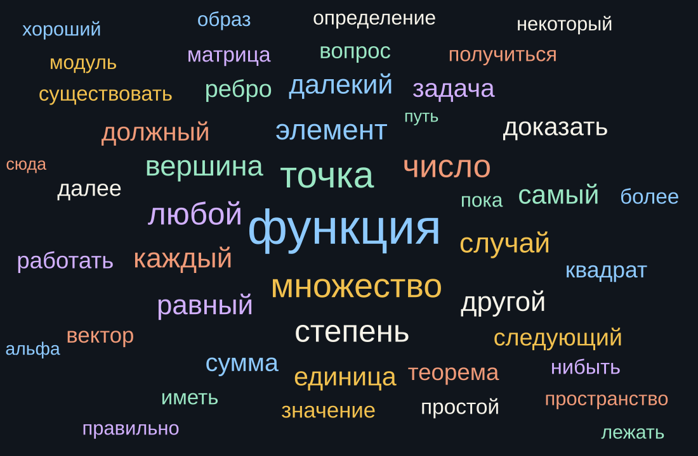

# Облако слов



Картинка собирается по всем файлам `result/`. Служебные слова и слова-паразиты в неё не входят. Отдельно выкинуты слова, которыми вслух читают формулу: «плюс», «минус», «равно», «один», «икс», а также пустые глаголы речи вроде «сказать» и «написать». После этого сверху остаются темы: функция, множество, число, степень, элемент, вершина.

Лемматизатор — pymorphy3. Файл картинки: `assets/wordcloud.svg`. Рядом `data/wordcloud.json`: хэш текстов, имя лемматизатора и частоты верхних слов.

```powershell
python -m whisper_fpmi wordcloud
python -m whisper_fpmi wordcloud --check
```

`--check` завершается с кодом 1, если тексты изменились, сменился лемматизатор или облако собрано старым фильтром.

## Перед коммитом и пушем

Хуки лежат в `.githooks/`. Один раз:

```powershell
git config core.hooksPath .githooks
```

`pre-commit` пересобирает облако, если тексты изменились, и добавляет `assets/wordcloud.svg` и `data/wordcloud.json` в коммит. `pre-push` пускает пуш только когда облако совпадает с текстами. Сам хук коммит не создаёт: иначе в пуш попало бы то, что не смотрели.
